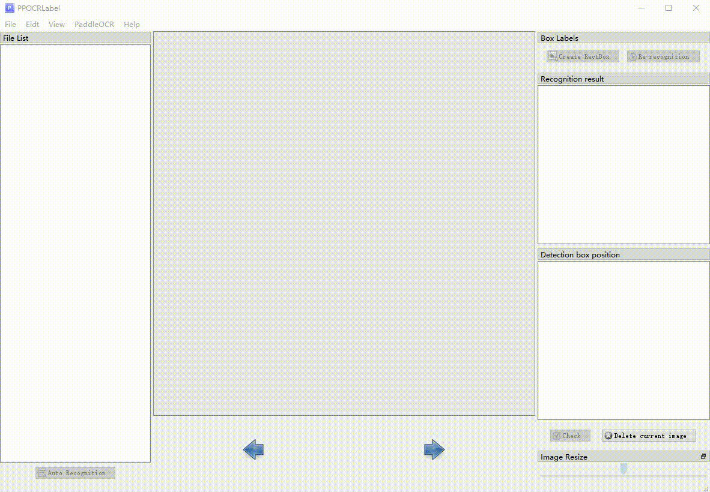

English | [简体中文](README_ch.md)

# PPOCRLabel

PPOCRLabel is a semi-automatic graphic annotation tool suitable for OCR field, with built-in PPOCR model to automatically detect and re-recognize data. It is written in python3 and pyqt5, supporting rectangular box annotation and four-point annotation modes. Annotations can be directly used for the training of PPOCR detection and recognition models.



### Recent Update

- 2021.2.5: New batch processing and undo functions (by [Evezerest](https://github.com/Evezerest)):
  - Batch processing function: Press and hold the Ctrl key to select the box, you can move, copy, and delete in batches.
  - Undo function: In the process of drawing a four-point label box or after editing the box, press Ctrl+Z to undo the previous operation.
  - Fix image rotation and size problems, optimize the process of editing the mark frame (by [ninetailskim](https://github.com/ninetailskim)、 [edencfc](https://github.com/edencfc)).
- 2021.1.11: Optimize the labeling experience (by [edencfc](https://github.com/edencfc)),
  - Users can choose whether to pop up the label input dialog after drawing the detection box in "View - Pop-up Label Input Dialog".
  - The recognition result scrolls synchronously when users click related detection box.
  - Click to modify the recognition result.(If you can't change the result, please switch to the system default input method, or switch back to the original input method again)
- 2020.12.18: Support re-recognition of a single label box (by [ninetailskim](https://github.com/ninetailskim) ), perfect shortcut keys.

### TODO:
- Lock box mode: For the same scene data, the size and position of the locked detection box can be transferred between different pictures.

## Installation

### 1. Install PaddleOCR

PaddleOCR models has been built in PPOCRLabel, please refer to [PaddleOCR installation document](https://github.com/PaddlePaddle/PaddleOCR/blob/develop/doc/doc_ch/installation.md) to prepare PaddleOCR and make sure it works.

### 2. Install PPOCRLabel

#### Windows

```
pip install pyqt5
cd ./PPOCRLabel # Change the directory to the PPOCRLabel folder
python PPOCRLabel.py
```

#### Ubuntu Linux

```
pip3 install pyqt5
pip3 install trash-cli
cd ./PPOCRLabel # Change the directory to the PPOCRLabel folder
python3 PPOCRLabel.py
```

#### macOS
```
pip3 install pyqt5
pip3 uninstall opencv-python # Uninstall opencv manually as it conflicts with pyqt
pip3 install opencv-contrib-python-headless==4.2.0.32 # Install the headless version of opencv
cd ./PPOCRLabel # Change the directory to the PPOCRLabel folder
python3 PPOCRLabel.py
```

## Usage

### Steps

1. Build and launch using the instructions above.

2. Click 'Open Dir' in Menu/File to select the folder of the picture.<sup>[1]</sup>

3. Click 'Auto recognition', use PPOCR model to automatically annotate images which marked with 'X' <sup>[2]</sup>before the file name.

4. Create Box:

   4.1 Click 'Create RectBox' or press 'W' in English keyboard mode to draw a new rectangle detection box. Click and release left mouse to select a region to annotate the text area.

   4.2 Press 'Q' to enter four-point labeling mode which enables you to create any four-point shape by clicking four points with the left mouse button in succession and DOUBLE CLICK the left mouse as the signal of labeling completion.

5. After the marking frame is drawn, the user clicks "OK", and the detection frame will be pre-assigned a "TEMPORARY" label.

6. Click 're-Recognition', model will rewrite ALL recognition results in ALL detection box<sup>[3]</sup>.

7. Double click the result in 'recognition result' list to manually change inaccurate recognition results.

8. Click "Check", the image status will switch to "√",then the program automatically jump to the next.

9. Click "Delete Image" and the image will be deleted to the recycle bin.

10. Labeling result: the user can save manually through the menu "File - Save Label", while the program will also save automatically if "File - Auto Save Label Mode" is selected. The manually checked label will be stored in *Label.txt* under the opened picture folder. Click "PaddleOCR"-"Save Recognition Results" in the menu bar, the recognition training data of such pictures will be saved in the *crop_img* folder, and the recognition label will be saved in *rec_gt.txt*<sup>[4]</sup>.

### Note

[1] PPOCRLabel uses the opened folder as the project. After opening the image folder, the picture will not be displayed in the dialog. Instead, the pictures under the folder will be directly imported into the program after clicking "Open Dir".

[2] The image status indicates whether the user has saved the image manually. If it has not been saved manually it is "X", otherwise it is "√", PPOCRLabel will not relabel pictures with a status of "√".

[3] After clicking "Re-recognize", the model will overwrite ALL recognition results in the picture. Therefore, if the recognition result has been manually changed before, it may change after re-recognition.

[4] The files produced by PPOCRLabel can be found under the opened picture folder including the following, please do not manually change the contents, otherwise it will cause the program to be abnormal.

|   File name   |                         Description                          |
| :-----------: | :----------------------------------------------------------: |
|   Label.txt   | The detection label file can be directly used for PPOCR detection model training. After the user saves 5 label results, the file will be automatically saved. It will also be written when the user closes the application or changes the file folder. |
| fileState.txt | The picture status file save the image in the current folder that has been manually confirmed by the user. |
|  Cache.cach   |    Cache files to save the results of model recognition.     |
|  rec_gt.txt   | The recognition label file, which can be directly used for PPOCR identification model training, is generated after the user clicks on the menu bar "File"-"Save recognition result". |
|   crop_img    | The recognition data, generated at the same time with *rec_gt.txt* |

## Explanation

### Shortcut keys

| Shortcut keys            | Description                                      |
| ------------------------ | ------------------------------------------------ |
| Ctrl + Shift + R         | Re-recognize all the labels of the current image |
| W                        | Create a rect box                                |
| Q                        | Create a four-points box                         |
| Ctrl + E                 | Edit label of the selected box                   |
| Ctrl + R                 | Re-recognize the selected box                    |
| Ctrl + C                 | Copy and paste the selected box                  |
| Ctrl + Left Mouse Button | Multi select the label box                       |
| Backspace                | Delete the selected box                          |
| Ctrl + V                 | Check image                                      |
| Ctrl + Shift + d         | Delete image                                     |
| D                        | Next image                                       |
| A                        | Previous image                                   |
| Ctrl++                   | Zoom in                                          |
| Ctrl--                   | Zoom out                                         |
| ↑→↓←                     | Move selected box                                |

### Built-in Model

- Default model: PPOCRLabel uses the Chinese and English ultra-lightweight OCR model in PaddleOCR by default, supports Chinese, English and number recognition, and multiple language detection.

- Model language switching: Changing the built-in model language is supportable by clicking "PaddleOCR"-"Choose OCR Model" in the menu bar. Currently supported languages​include French, German, Korean, and Japanese.
  For specific model download links, please refer to [PaddleOCR Model List](https://github.com/PaddlePaddle/PaddleOCR/blob/develop/doc/doc_en/models_list_en.md#multilingual-recognition-modelupdating)

- Custom model: The model trained by users can be replaced by modifying PPOCRLabel.py in [PaddleOCR class instantiation](https://github.com/PaddlePaddle/PaddleOCR/blob/develop/PPOCRLabel/PPOCRLabel.py#L110) referring [Custom Model Code](https://github.com/PaddlePaddle/PaddleOCR/blob/develop/doc/doc_en/whl_en.md#use-custom-model)

### Save

PPOCRLabel supports three ways to save Label.txt

- Automatically save: After selecting "File - Auto Save Label Mode", the program will automatically write the annotations into Label.txt every time the user confirms an image. If this option is not turned on, it will be automatically saved after detecting that the user has manually checked 5 images.
- Manual save: Click "File-Save Marking Results" to manually save the label.
- Close application save


### Export partial recognition results

For some data that are difficult to recognize, the recognition results will not be exported by **unchecking** the corresponding tags in the recognition results checkbox.

*Note: The status of the checkboxes in the recognition results still needs to be saved manually by clicking Save Button.*

### Error message

- If paddleocr is installed with whl, it has a higher priority than calling PaddleOCR class with paddleocr.py, which may cause an exception if whl package is not updated.

- For Linux users, if you get an error starting with **objc[XXXXX]** when opening the software, it proves that your opencv version is too high. It is recommended to install version 4.2:

    ```
    pip install opencv-python==4.2.0.32
    ```
- If you get an error starting with **Missing string id **,you need to recompile resources:
    ```
    pyrcc5 -o libs/resources.py resources.qrc
    ```
- If you get an error ``` module 'cv2' has no attribute 'INTER_NEAREST'```, you need to delete all opencv related packages first, and then reinstall the 4.2.0.32  version of headless opencv
    ```
    pip install opencv-contrib-python-headless==4.2.0.32
    ```

### Related

1.[Tzutalin. LabelImg. Git code (2015)](https://github.com/tzutalin/labelImg)
