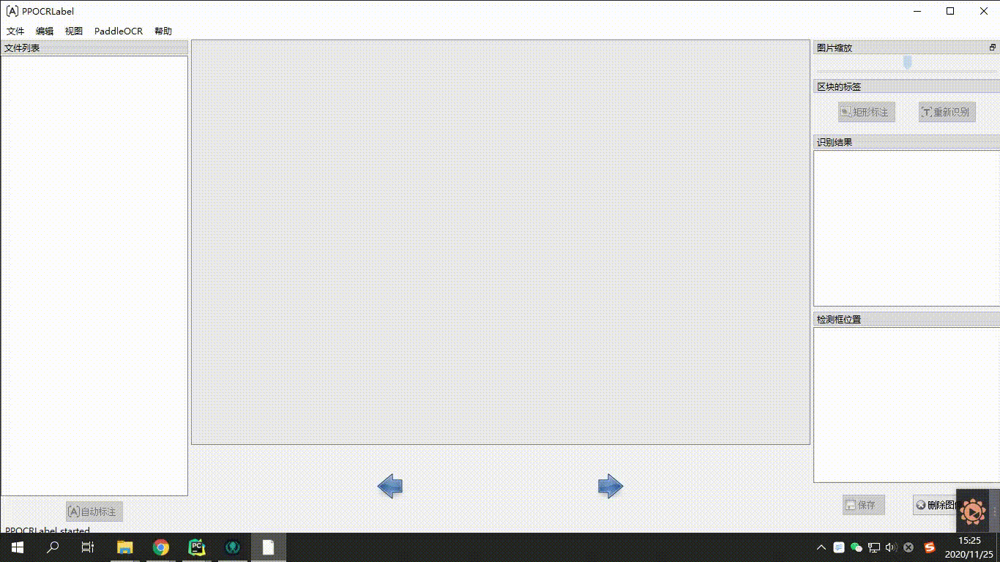

[English](README.md) | 简体中文

# PPOCRLabel

PPOCRLabel是一款适用于OCR领域的半自动化图形标注工具，使用python3和pyqt5编写，支持矩形框标注和四点标注模式，导出格式可直接用于PPOCR检测和识别模型的训练。



#### 近期更新

- 2020.12.18: 支持对单个标记框进行重新识别（by [ninetailskim](https://github.com/ninetailskim) ），完善快捷键。

## 安装

### 1. 安装PaddleOCR
参考[PaddleOCR安装文档](https://github.com/PaddlePaddle/PaddleOCR/blob/develop/doc/doc_ch/installation.md)准备好PaddleOCR

### 2. 安装PPOCRLabel
#### Windows + Anaconda

```
pip install pyqt5
cd ./PPOCRLabel # 将目录切换到PPOCRLabel文件夹下
python PPOCRLabel.py --lang ch
```

#### Ubuntu Linux

```
pip3 install pyqt5
pip3 install trash-cli
cd ./PPOCRLabel # 将目录切换到PPOCRLabel文件夹下
python3 PPOCRLabel.py --lang ch
```

#### macOS
```
pip3 install pyqt5
pip3 uninstall opencv-python # 由于mac版本的opencv与pyqt有冲突，需先手动卸载opencv
pip3 install opencv-contrib-python-headless # 安装headless版本的open-cv
cd ./PPOCRLabel # 将目录切换到PPOCRLabel文件夹下
python3 PPOCRLabel.py --lang ch
```

## 使用

### 操作步骤

1. 安装与运行：使用上述命令安装与运行程序。
2. 打开文件夹：在菜单栏点击 “文件” - "打开目录" 选择待标记图片的文件夹<sup>[1]</sup>.
3. 自动标注：点击 ”自动标注“，使用PPOCR超轻量模型对图片文件名前图片状态<sup>[2]</sup>为 “X” 的图片进行自动标注。
4. 手动标注：点击 “矩形标注”（推荐直接在英文模式下点击键盘中的 “W”)，用户可对当前图片中模型未检出的部分进行手动绘制标记框。点击键盘P，则使用四点标注模式（或点击“编辑” - “四点标注”），用户依次点击4个点后，双击左键表示标注完成。
5. 标记框绘制完成后，用户点击 “确认”，检测框会先被预分配一个 “待识别” 标签。
6. 重新识别：将图片中的所有检测画绘制/调整完成后，点击 “重新识别”，PPOCR模型会对当前图片中的**所有检测框**重新识别<sup>[3]</sup>。
7. 内容更改：双击识别结果，对不准确的识别结果进行手动更改。
8. 确认标记：点击 “确认”，图片状态切换为 “√”，跳转至下一张（此时不会直接将结果写入文件）。
9. 删除：点击 “删除图像”，图片将会被删除至回收站。
10. 保存结果：用户可以通过菜单中“文件-保存标记结果”手动保存，同时程序也会在用户每确认10张图片后自动保存一次。手动确认过的标记将会被存放在所打开图片文件夹下的*Label.txt*中。在菜单栏点击 “文件” - "保存识别结果"后，会将此类图片的识别训练数据保存在*crop_img*文件夹下，识别标签保存在*rec_gt.txt*中<sup>[4]</sup>。

### 注意

[1] PPOCRLabel以文件夹为基本标记单位，打开待标记的图片文件夹后，不会在窗口栏中显示图片，而是在点击 "选择文件夹" 之后直接将文件夹下的图片导入到程序中。

[2] 图片状态表示本张图片用户是否手动保存过，未手动保存过即为 “X”，手动保存过为 “√”。点击 “自动标注”按钮后，PPOCRLabel不会对状态为 “√” 的图片重新标注。

[3] 点击“重新识别”后，模型会对图片中的识别结果进行覆盖。因此如果在此之前手动更改过识别结果，有可能在重新识别后产生变动。

[4] PPOCRLabel产生的文件放置于标记图片文件夹下，包括一下几种，请勿手动更改其中内容，否则会引起程序出现异常。

|    文件名     |                             说明                             |
| :-----------: | :----------------------------------------------------------: |
|   Label.txt   | 检测标签，可直接用于PPOCR检测模型训练。用户每保存10张检测结果后，程序会进行自动写入。当用户关闭应用程序或切换文件路径后同样会进行写入。 |
| fileState.txt | 图片状态标记文件，保存当前文件夹下已经被用户手动确认过的图片名称。 |
|  Cache.cach   |              缓存文件，保存模型自动识别的结果。              |
|  rec_gt.txt   | 识别标签。可直接用于PPOCR识别模型训练。需用户手动点击菜单栏“文件” - "保存识别结果"后产生。 |
|   crop_img    |   识别数据。按照检测框切割后的图片。与rec_gt.txt同时产生。   |

## 说明

### 快捷键

| 快捷键           | 说明                         |
| ---------------- | ---------------------------- |
| Ctrl + shift + A | 自动标注所有未确认过的图片   |
| Ctrl + shift + R | 对当前图片的所有标记重新识别 |
| W                | 新建矩形框                   |
| Q                | 新建四点框                   |
| Ctrl + E         | 编辑所选框标签               |
| Ctrl + R         | 重新识别所选标记             |
| Backspace        | 删除所选框                   |
| Ctrl + V         | 确认本张图片标记             |
| Ctrl + Shift + d | 删除本张图片                 |
| D                | 下一张图片                   |
| A                | 上一张图片                   |
| Ctrl++           | 缩小                         |
| Ctrl--           | 放大                         |
| ↑→↓←             | 移动标记框                   |

### 内置模型

 - 默认模型：PPOCRLabel默认使用PaddleOCR中的中英文超轻量OCR模型，支持中英文与数字识别，多种语言检测。

 - 模型语言切换：用户可通过菜单栏中 "PaddleOCR" - "选择模型" 切换内置模型语言，目前支持的语言包括法文、德文、韩文、日文。具体模型下载链接可参考[PaddleOCR模型列表](https://github.com/PaddlePaddle/PaddleOCR/blob/develop/doc/doc_ch/models_list.md).

 - 自定义模型：用户可根据[自定义模型代码使用](https://github.com/PaddlePaddle/PaddleOCR/blob/develop/doc/doc_ch/whl.md#%E8%87%AA%E5%AE%9A%E4%B9%89%E6%A8%A1%E5%9E%8B)，通过修改PPOCRLabel.py中针对[PaddleOCR类的实例化](https://github.com/PaddlePaddle/PaddleOCR/blob/develop/PPOCRLabel/PPOCRLabel.py#L110)替换成自己训练的模型。

### 导出部分识别结果

针对部分难以识别的数据，通过在识别结果的复选框中**取消勾选**相应的标记，其识别结果不会被导出。

*注意：识别结果中的复选框状态仍需用户手动点击保存后才能保留*

### 错误提示
- 如果同时使用whl包安装了paddleocr，其优先级大于通过paddleocr.py调用PaddleOCR类，whl包未更新时会导致程序异常。
  
- PPOCRLabel**不支持对中文文件名**的图片进行自动标注。

- 针对Linux用户：：如果您在打开软件过程中出现**objc[XXXXX]**开头的错误，证明您的opencv版本太高，建议安装4.2版本：
    ```
    pip install opencv-python==4.2.0.32
    ```
    
- 如果出现 ```Missing string id``` 开头的错误，需要重新编译资源：
    ```
    pyrcc5 -o libs/resources.py resources.qrc
    ```
    
- 如果出现``` module 'cv2' has no attribute 'INTER_NEAREST'```错误，需要首先删除所有opencv相关包，然后重新安装headless版本的opencv
    ```
    pip install opencv-contrib-python-headless
    ```
### 参考资料

1.[Tzutalin. LabelImg. Git code (2015)](https://github.com/tzutalin/labelImg)
