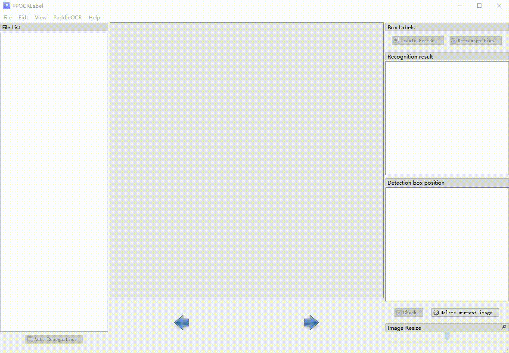
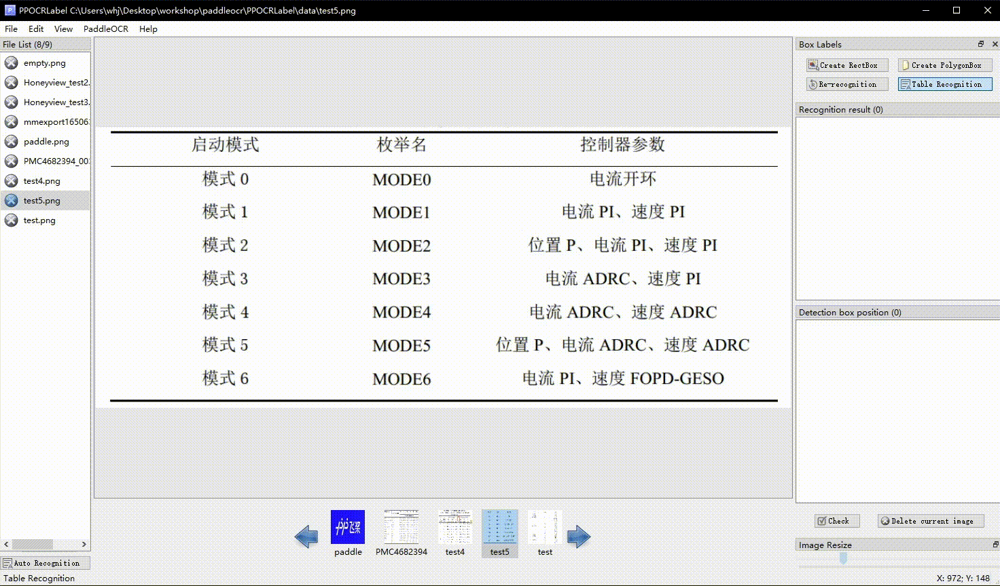
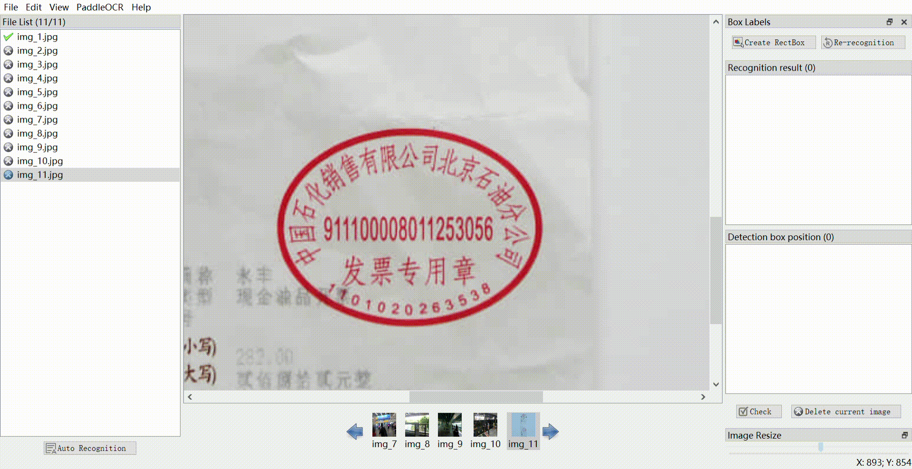

[English](README.md) | 简体中文

# PPOCRLabelv2

PPOCRLabel是一款适用于OCR领域的半自动化图形标注工具，内置PP-OCR模型对数据自动标注和重新识别。使用Python3和PyQT5编写，支持矩形框标注、表格标注、不规则文本标注、关键信息标注模式，导出格式可直接用于PaddleOCR检测和识别模型的训练。

| 常规标注                              | 表格标注                                      |
| :---------------------------------------------------: | :----------------------------------------------: |
|     |  |
| **不规则文本标注**                        | **关键信息标注**                               |
|  |    |


#### 近期更新
- 2022.05：新增表格标注，使用方法见下方`2.2 表格标注`（by [whjdark](https://github.com/peterh0323); [Evezerest](https://github.com/Evezerest))
- 2022.02：新增关键信息标注、优化标注体验（by [PeterH0323](https://github.com/peterh0323) ）
  - 新增：使用 `--kie` 进入 KIE 功能，用于打【检测+识别+关键字提取】的标签
  - 提升用户体验：新增文件与标记数目提示、优化交互、修复gpu使用等问题。
  - 新增功能：使用 `C` 和 `X` 对标记框进行旋转。
- 2021.11.17：
  - 新增支持通过whl包安装和启动PPOCRLabel（by [d2623587501](https://github.com/d2623587501)）
  - 标注数据集切分：对标注数据进行训练、验证与测试集划分（参考下方3.5节，by [MrCuiHao](https://github.com/MrCuiHao)）
- 2021.8.11：
  - 新增功能：打开数据所在文件夹、右键图像旋转90度（注意：旋转前的图片上不能存在标记框，by [Wei-JL](https://github.com/Wei-JL)）
  - 新增快捷键说明（帮助-快捷键）、修复批处理下的方向快捷键移动功能（by [d2623587501](https://github.com/d2623587501)）
- 2021.2.5：新增批处理与撤销功能（by [Evezerest](https://github.com/Evezerest))
  - **批处理功能**：按住Ctrl键选择标记框后可批量移动、复制、删除、重新识别。
  - **撤销功能**：在绘制四点标注框过程中或对框进行编辑操作后，按下Ctrl+Z可撤销上一部操作。
  - 修复图像旋转和尺寸问题、优化编辑标记框过程（by [ninetailskim](https://github.com/ninetailskim)、 [edencfc](https://github.com/edencfc)）
- 2021.1.11：优化标注体验（by [edencfc](https://github.com/edencfc)）：
  - 用户可在“视图 - 弹出标记输入框”选择在画完检测框后标记输入框是否弹出。
  - 识别结果与检测框同步滚动。
  - 识别结果更改为单击修改。（如果无法修改，请切换为系统自带输入法，或再次切回原输入法）
- 2020.12.18： 支持对单个标记框进行重新识别（by [ninetailskim](https://github.com/ninetailskim)），完善快捷键。

如果您对完善工具有不一样的想法，欢迎通过[社区常规赛](https://github.com/PaddlePaddle/PaddleOCR/issues/4982)报名相关更改，获得积分兑换奖励。


## 1. 安装与运行

### 1.1 安装PaddlePaddle
```bash
pip3 install --upgrade pip

# 如果您的机器安装的是CUDA9或CUDA10，请运行以下命令安装
python3 -m pip install paddlepaddle-gpu -i https://mirror.baidu.com/pypi/simple

# 如果您的机器是CPU，请运行以下命令安装
python3 -m pip install paddlepaddle -i https://mirror.baidu.com/pypi/simple
```

更多的版本需求，请参照[安装文档](https://www.paddlepaddle.org.cn/install/quick)中的说明进行操作。

### 1.2 安装与运行PPOCRLabel

PPOCRLabel可通过whl包与Python脚本两种方式启动，whl包形式启动更加方便，python脚本启动便于二次开发

#### 1.2.1 通过whl包安装与运行

##### Windows

```bash
pip install PPOCRLabel  # 安装

# 选择标签模式来启动
PPOCRLabel --lang ch  # 启动【普通模式】，用于打【检测+识别】场景的标签
PPOCRLabel --lang ch --kie True  # 启动 【KIE 模式】，用于打【检测+识别+关键字提取】场景的标签
```
> 注意：通过whl包安装PPOCRLabel会自动下载 `paddleocr` whl包，其中shapely依赖可能会出现 `[winRrror 126] 找不到指定模块的问题。` 的错误，建议从[这里](https://www.lfd.uci.edu/~gohlke/pythonlibs/#shapely)下载并安装
##### Ubuntu Linux

```bash
pip3 install PPOCRLabel
pip3 install trash-cli

# 选择标签模式来启动
PPOCRLabel --lang ch  # 启动【普通模式】，用于打【检测+识别】场景的标签
PPOCRLabel --lang ch --kie True  # 启动 【KIE 模式】，用于打【检测+识别+关键字提取】场景的标签
```

##### MacOS
```bash
pip3 install PPOCRLabel
pip3 install opencv-contrib-python-headless==4.2.0.32 # 如果下载过慢请添加"-i https://mirror.baidu.com/pypi/simple"

# 选择标签模式来启动
PPOCRLabel --lang ch  # 启动【普通模式】，用于打【检测+识别】场景的标签
PPOCRLabel --lang ch --kie True  # 启动 【KIE 模式】，用于打【检测+识别+关键字提取】场景的标签
```

> 如果上述安装出现问题，可以参考3.6节 错误提示

#### 1.2.2 通过Python脚本运行PPOCRLabel

如果您对PPOCRLabel文件有所更改（例如指定新的内置模型），通过Python脚本运行会更加方便的看到更改的结果。如果仍然需要通过whl包启动，则需要先卸载当前环境中的whl包，然后参考下节重新编译whl包。

```bash
cd ./PPOCRLabel  # 切换到PPOCRLabel目录
python PPOCRLabel.py --lang ch
```

#### 1.2.3 本地构建whl包并安装

编译与安装新的whl包，其中1.0.2为版本号，可在 `setup.py` 中指定新版本。

```bash
cd PaddleOCR/PPOCRLabel
python3 setup.py bdist_wheel 
pip3 install dist/PPOCRLabel-1.0.2-py2.py3-none-any.whl -i https://mirror.baidu.com/pypi/simple
```


## 2. 使用

### 2.1 操作步骤
> 如果您只需要标注文字信息和位置，推荐按照以下步骤展开：

1. 安装与运行：使用上述命令安装与运行程序。
2. 打开文件夹：在菜单栏点击 “文件” - "打开目录" 选择待标记图片的文件夹<sup>[1]</sup>.
3. 自动标注：点击 ”自动标注“，使用PPOCR超轻量模型对图片文件名前图片状态<sup>[2]</sup>为 “X” 的图片进行自动标注。
4. 手动标注：点击 “矩形标注”（推荐直接在英文模式下点击键盘中的 “W”)，用户可对当前图片中模型未检出的部分进行手动绘制标记框。点击键盘Q，则使用四点标注模式（或点击“编辑” - “四点标注”），用户依次点击4个点后，双击左键表示标注完成。
5. 标记框绘制完成后，用户点击 “确认”，检测框会先被预分配一个 “待识别” 标签。
6. 重新识别：将图片中的所有检测画绘制/调整完成后，点击 “重新识别”，PPOCR模型会对当前图片中的**所有检测框**重新识别<sup>[3]</sup>。
7. 内容更改：单击识别结果，对不准确的识别结果进行手动更改。
8. **确认标记：点击 “确认”，图片状态切换为 “√”，跳转至下一张。**
9. 删除：点击 “删除图像”，图片将会被删除至回收站。
10. 导出结果：用户可以通过菜单中“文件-导出标记结果”手动导出，同时也可以点击“文件 - 自动导出标记结果”开启自动导出。手动确认过的标记将会被存放在所打开图片文件夹下的*Label.txt*中。在菜单栏点击 “文件” - "导出识别结果"后，会将此类图片的识别训练数据保存在*crop_img*文件夹下，识别标签保存在*rec_gt.txt*中<sup>[4]</sup>。

### 2.2 表格标注
表格标注针对表格的结构化提取，将图片中的表格转换为Excel格式，因此标注时需要配合外部软件打开Excel同时完成。
在PPOCRLabel软件中完成表格中的文字信息标注（文字与位置）、在Excel文件中完成表格结构信息标注，推荐的步骤为：
1. 表格识别：打开表格图片后，点击软件右上角 `表格识别` 按钮，软件调用PP-Structure中的表格识别模型，自动为表格打标签，同时弹出Excel
2. 更改识别结果：**以表格中的单元格为单位增加标注框**（即一个单元格内的文字都标记为一个框）。标注框上鼠标右键后点击 `单元格重识别` 
   可利用模型自动识别单元格内的文字。
3. 标注表格结构：将表格图像中有文字的单元格，**在Excel中标记为任意标识符（如`1`）**，保证Excel中的单元格合并情况与原图相同即可。
4. 导出JSON格式：关闭所有表格图像对应的Excel，点击 `文件`-`导出表格JSON标注` 获得JSON标注结果。

### 2.3 注意

[1] PPOCRLabel以**文件夹**为基本标记单位，打开待标记的图片文件夹后，不会在窗口栏中显示图片，而是在点击 "选择文件夹" 之后直接将文件夹下的图片导入到程序中。

[2] 图片状态表示本张图片用户是否手动保存过，未手动保存过即为 “X”，手动保存过为 “√”。点击 “自动标注”按钮后，PPOCRLabel不会对状态为 “√” 的图片重新标注。

[3] 点击“重新识别”后，模型会对图片中的识别结果进行覆盖。因此如果在此之前手动更改过识别结果，有可能在重新识别后产生变动。

[4] PPOCRLabel产生的文件放置于标记图片文件夹下，包括一下几种，请勿手动更改其中内容，否则会引起程序出现异常。

|    文件名     |                             说明                             |
| :-----------: | :----------------------------------------------------------: |
|   Label.txt   | 检测标签，可直接用于PPOCR检测模型训练。用户每确认5张检测结果后，程序会进行自动写入。当用户关闭应用程序或切换文件路径后同样会进行写入。 |
| fileState.txt | 图片状态标记文件，保存当前文件夹下已经被用户手动确认过的图片名称。 |
|  Cache.cach   |              缓存文件，保存模型自动识别的结果。              |
|  rec_gt.txt   | 识别标签。可直接用于PPOCR识别模型训练。需用户手动点击菜单栏“文件” - "导出识别结果"后产生。 |
|   crop_img    |   识别数据。按照检测框切割后的图片。与rec_gt.txt同时产生。   |


## 3. 说明

### 3.1 快捷键

| 快捷键              | 说明                              |
|------------------|---------------------------------|
| Ctrl + shift + R | 对当前图片的所有标记重新识别                  |
| W                | 新建矩形框                           |
| Q                | 新建多点框                           |
| X                | 框逆时针旋转                          |
| C                | 框顺时针旋转                          |
| Ctrl + E         | 编辑所选框标签                         |
| Ctrl + X         |  `--kie` 模式下，修改 Box 的关键字种类 |
| Ctrl + R         | 重新识别所选标记                        |
| Ctrl + C         | 【复制并粘贴】选中的标记框                     |
| Ctrl + 鼠标左键    | 多选标记框                           |
| Backspace         | 删除所选框                           |
| Ctrl + V         | 确认本张图片标记                        |
| Ctrl + Shift + d | 删除本张图片                          |
| D                | 下一张图片                           |
| A                | 上一张图片                           |
| Ctrl++           | 缩小                              |
| Ctrl--           | 放大                              |
| ↑→↓←             | 移动标记框                           |


### 3.2 内置模型

 - 默认模型：PPOCRLabel默认使用PaddleOCR中的中英文超轻量OCR模型，支持中英文与数字识别，多种语言检测。

 - 模型语言切换：用户可通过菜单栏中 "PaddleOCR" - "选择模型" 切换内置模型语言，目前支持的语言包括法文、德文、韩文、日文。具体模型下载链接可参考[PaddleOCR模型列表](https://github.com/PaddlePaddle/PaddleOCR/blob/develop/doc/doc_ch/models_list.md).

 - **自定义模型**：如果用户想将内置模型更换为自己的推理模型，可根据[自定义模型代码使用](https://github.com/PaddlePaddle/PaddleOCR/blob/develop/doc/doc_ch/whl.md#%E8%87%AA%E5%AE%9A%E4%B9%89%E6%A8%A1%E5%9E%8B)，通过修改PPOCRLabel.py中针对[PaddleOCR类的实例化](https://github.com/PaddlePaddle/PaddleOCR/blob/release/2.3/PPOCRLabel/PPOCRLabel.py#L116) 实现，例如指定检测模型：`self.ocr = PaddleOCR(det=True, cls=True, use_gpu=gpu, lang=lang) `，在 `det_model_dir` 中传入  自己的模型即可。 

### 3.3 导出标记结果

PPOCRLabel支持三种导出方式：

- 自动导出：点击“文件 - 自动导出标记结果”后，用户每确认过一张图片，程序自动将标记结果写入Label.txt中。若未开启此选项，则检测到用户手动确认过5张图片后进行自动导出。

  > 默认情况下自动导出功能为关闭状态

- 手动导出：点击“文件 - 导出标记结果”手动导出标记。

- 关闭应用程序导出

### 3.4 导出部分识别结果

针对部分难以识别的数据，通过在识别结果的复选框中**取消勾选**相应的标记，其识别结果不会被导出。被取消勾选的识别结果在标记文件 `label.txt` 中的 `difficult` 变量保存为 `True` 。

> *注意：识别结果中的复选框状态仍需用户手动点击确认后才能保留*

### 3.5 数据集划分

在终端中输入以下命令执行数据集划分脚本：

```
cd ./PPOCRLabel # 将目录切换到PPOCRLabel文件夹下
python gen_ocr_train_val_test.py --trainValTestRatio 6:2:2 --datasetRootPath ../train_data 
```

参数说明：

- `trainValTestRatio` 是训练集、验证集、测试集的图像数量划分比例，根据实际情况设定，默认是`6:2:2`

- `datasetRootPath` 是PPOCRLabel标注的完整数据集存放路径。默认路径是 `PaddleOCR/train_data` 分割数据集前应有如下结构：
  ```
  |-train_data
    |-crop_img
      |- word_001_crop_0.png
      |- word_002_crop_0.jpg
      |- word_003_crop_0.jpg
      | ...
    | Label.txt
    | rec_gt.txt
    |- word_001.png
    |- word_002.jpg
    |- word_003.jpg
    | ...
  ```
  
### 3.6 错误提示

- 如果同时使用whl包安装了paddleocr，其优先级大于通过paddleocr.py调用PaddleOCR类，whl包未更新时会导致程序异常。

- PPOCRLabel**不支持对中文文件名**的图片进行自动标注。

- 针对Linux用户：如果您在打开软件过程中出现**objc[XXXXX]**开头的错误，证明您的opencv版本太高，建议安装4.2版本：
    ```
    pip install opencv-python==4.2.0.32
    ```

- 如果出现 ```Missing string id``` 开头的错误，需要重新编译资源：
    ```
    pyrcc5 -o libs/resources.py resources.qrc
    ```

- 如果出现``` module 'cv2' has no attribute 'INTER_NEAREST'```错误，需要首先删除所有opencv相关包，然后重新安装4.2.0.32版本的headless opencv
    ```
    pip install opencv-contrib-python-headless==4.2.0.32
    ```


### 4. 参考资料

1.[Tzutalin. LabelImg. Git code (2015)](https://github.com/tzutalin/labelImg)
