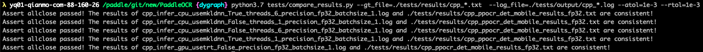

# C++预测功能测试

C++预测功能测试的主程序为`test_inference_cpp.sh`，可以测试基于C++预测库的模型推理功能。

## 1. 测试结论汇总

基于训练是否使用量化，进行本测试的模型可以分为`正常模型`和`量化模型`，这两类模型对应的C++预测功能汇总如下：

| 模型类型 |device | batchsize | tensorrt | mkldnn | cpu多线程 |
|  ----   |  ---- |   ----   |  :----:  |   :----:   |  :----:  |
| 正常模型 | GPU | 1/6 | fp32/fp16 | - | - |
| 正常模型 | CPU | 1/6 | - | fp32 | 支持 |
| 量化模型 | GPU | 1/6 | int8 | - | - |
| 量化模型 | CPU | 1/6 | - | int8 | 支持 |

## 2. 测试流程
### 2.1 功能测试
先运行`prepare.sh`准备数据和模型，然后运行`test_inference_cpp.sh`进行测试，最终在```PTDN/output```目录下生成`cpp_infer_*.log`后缀的日志文件。

```shell
bash PTDN/prepare.sh ./PTDN/configs/ppocr_det_mobile_params.txt "cpp_infer"

# 用法1:
bash PTDN/test_inference_cpp.sh ./PTDN/configs/ppocr_det_mobile_params.txt
# 用法2: 指定GPU卡预测，第三个传入参数为GPU卡号
bash PTDN/test_inference_cpp.sh ./PTDN/configs/ppocr_det_mobile_params.txt '1'
```  


### 2.2 精度测试

使用compare_results.py脚本比较模型预测的结果是否符合预期，主要步骤包括：
- 提取日志中的预测坐标；
- 从本地文件中提取保存好的坐标结果；
- 比较上述两个结果是否符合精度预期，误差大于设置阈值时会报错。

#### 使用方式
运行命令：
```shell
python3.7 PTDN/compare_results.py --gt_file=./PTDN/results/cpp_*.txt  --log_file=./PTDN/output/cpp_*.log --atol=1e-3 --rtol=1e-3
```

参数介绍：  
- gt_file： 指向事先保存好的预测结果路径，支持*.txt 结尾，会自动索引*.txt格式的文件，文件默认保存在PTDN/result/ 文件夹下
- log_file: 指向运行PTDN/test.sh 脚本的infer模式保存的预测日志，预测日志中打印的有预测结果，比如：文本框，预测文本，类别等等，同样支持infer_*.log格式传入
- atol: 设置的绝对误差
- rtol: 设置的相对误差

#### 运行结果

正常运行效果如下图：


出现不一致结果时的运行输出：


## 3. 更多教程

本文档为功能测试用，更详细的c++预测使用教程请参考：[服务器端C++预测](https://github.com/PaddlePaddle/PaddleOCR/tree/dygraph/deploy/cpp_infer)  
