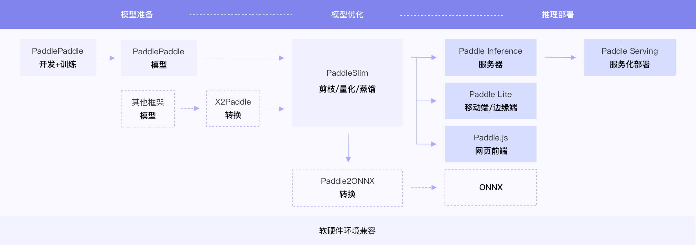
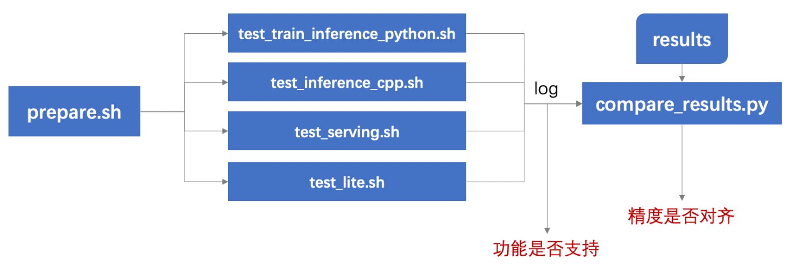

# 推理部署导航

## 1. 简介

飞桨除了基本的模型训练和预测，还提供了支持多端多平台的高性能推理部署工具。本文档提供了PaddleOCR中所有模型的推理部署导航PTDN（Paddle Train Deploy Navigation），方便用户查阅每种模型的推理部署打通情况，并可以进行一键测试。

<div align="center">
    
</div>

## 2. 汇总信息

打通情况汇总如下，已填写的部分表示可以使用本工具进行一键测试，未填写的表示正在支持中。

**字段说明：**
- 基础训练预测：包括模型训练、Paddle Inference Python预测。
- 训练扩展：包括多机多卡、混合精度。
- 模型压缩：包括裁剪、离线/在线量化、蒸馏。
- 其他预测部署：包括Paddle Inference C++预测、Paddle Serving部署、Paddle-Lite部署等。

| 算法论文 | 模型名称 | 模型类型 | 基础训练预测 | 训练扩展 | 模型压缩 |  其他预测部署  |
| :--- | :--- |  :----:  | :--------: |  :----  |   :----  |   :----  |
| DB     |ch_ppocr_mobile_v2.0_det | 检测  | 支持 | 多机多卡 <br> 混合精度 | PACT量化 <br> 离线量化| Paddle Inference: C++ <br> Paddle Serving: Python, C++ <br> Paddle-Lite: <br> (1) ARM CPU(C++) |
| DB     |ch_ppocr_server_v2.0_det | 检测  | 支持 | 多机多卡 <br> 混合精度 | PACT量化 <br> 离线量化| Paddle Inference: C++ <br> Paddle Serving: Python, C++ <br> Paddle-Lite: <br> (1) ARM CPU(C++) |
| DB     |ch_PP-OCRv2_det          | 检测  |
| CRNN   |ch_ppocr_mobile_v2.0_rec | 识别  | 支持 | 多机多卡 <br> 混合精度 | PACT量化 <br> 离线量化| Paddle Inference: C++ <br> Paddle Serving: Python, C++ <br> Paddle-Lite: <br> (1) ARM CPU(C++) |
| CRNN   |ch_ppocr_server_v2.0_rec | 识别  | 支持 | 多机多卡 <br> 混合精度 | PACT量化 <br> 离线量化| Paddle Inference: C++ <br> Paddle Serving: Python, C++ <br> Paddle-Lite: <br> (1) ARM CPU(C++) |
| CRNN   |ch_PP-OCRv2_rec          | 识别  |
| PP-OCR |ch_ppocr_mobile_v2.0 | 检测+识别  | 支持 | 多机多卡 <br> 混合精度 | PACT量化 <br> 离线量化| Paddle Inference: C++ <br> Paddle Serving: Python, C++ <br> Paddle-Lite: <br> (1) ARM CPU(C++) |
| PP-OCR |ch_ppocr_server_v2.0 | 检测+识别  | 支持 | 多机多卡 <br> 混合精度 | PACT量化 <br> 离线量化| Paddle Inference: C++ <br> Paddle Serving: Python, C++ <br> Paddle-Lite: <br> (1) ARM CPU(C++) |
|PP-OCRv2|ch_PP-OCRv2 | 检测+识别  | 支持 | 多机多卡 <br> 混合精度 | PACT量化 <br> 离线量化| Paddle Inference: C++ <br> Paddle Serving: Python, C++ <br> Paddle-Lite: <br> (1) ARM CPU(C++) |
| DB     |det_mv3_db_v2.0                | 检测  |
| DB     |det_r50_vd_db_v2.0             | 检测  |
| EAST   |det_mv3_east_v2.0              | 检测  |
| EAST   |det_r50_vd_east_v2.0           | 检测  |
| PSENet |det_mv3_pse_v2.0               | 检测  |
| PSENet |det_r50_vd_pse_v2.0            | 检测  |
| SAST   |det_r50_vd_sast_totaltext_v2.0 | 检测  |
| Rosetta|rec_mv3_none_none_ctc_v2.0     | 识别  |
| Rosetta|rec_r34_vd_none_none_ctc_v2.0  | 识别  |
| CRNN   |rec_mv3_none_bilstm_ctc_v2.0   | 识别  |
| CRNN   |rec_r34_vd_none_bilstm_ctc_v2.0| 识别  |
| StarNet|rec_mv3_tps_bilstm_ctc_v2.0    | 识别  |
| StarNet|rec_r34_vd_tps_bilstm_ctc_v2.0 | 识别  |
| RARE   |rec_mv3_tps_bilstm_att_v2.0    | 识别  |
| RARE   |rec_r34_vd_tps_bilstm_att_v2.0 | 识别  |
| SRN    |rec_r50fpn_vd_none_srn         | 识别  |
| NRTR   |rec_mtb_nrtr                   | 识别  |
| SAR    |rec_r31_sar                    | 识别  |
| PGNet  |rec_r34_vd_none_none_ctc_v2.0  | 端到端|


## 3. 一键测试工具使用
### 目录介绍

```shell
PTDN/
├── configs/  # 配置文件目录
	├── det_mv3_db.yml               # 测试mobile版ppocr检测模型训练的yml文件
	├── det_r50_vd_db.yml            # 测试server版ppocr检测模型训练的yml文件
	├── rec_icdar15_r34_train.yml    # 测试server版ppocr识别模型训练的yml文件
	├── ppocr_sys_mobile_params.txt     # 测试mobile版ppocr检测+识别模型串联的参数配置文件
	├── ppocr_det_mobile_params.txt     # 测试mobile版ppocr检测模型的参数配置文件
	├── ppocr_rec_mobile_params.txt     # 测试mobile版ppocr识别模型的参数配置文件
	├── ppocr_sys_server_params.txt     # 测试server版ppocr检测+识别模型串联的参数配置文件
	├── ppocr_det_server_params.txt     # 测试server版ppocr检测模型的参数配置文件
	├── ppocr_rec_server_params.txt     # 测试server版ppocr识别模型的参数配置文件
	├── ...                                
├── results/   # 预先保存的预测结果，用于和实际预测结果进行精读比对
	├── python_ppocr_det_mobile_results_fp32.txt           # 预存的mobile版ppocr检测模型python预测fp32精度的结果
	├── python_ppocr_det_mobile_results_fp16.txt           # 预存的mobile版ppocr检测模型python预测fp16精度的结果
	├── cpp_ppocr_det_mobile_results_fp32.txt       # 预存的mobile版ppocr检测模型c++预测的fp32精度的结果
	├── cpp_ppocr_det_mobile_results_fp16.txt       # 预存的mobile版ppocr检测模型c++预测的fp16精度的结果
	├── ...
├── prepare.sh                        # 完成test_*.sh运行所需要的数据和模型下载
├── test_train_inference_python.sh    # 测试python训练预测的主程序
├── test_inference_cpp.sh             # 测试c++预测的主程序
├── test_serving.sh                   # 测试serving部署预测的主程序
├── test_lite.sh                      # 测试lite部署预测的主程序
├── compare_results.py                # 用于对比log中的预测结果与results中的预存结果精度误差是否在限定范围内
└── readme.md                         # 使用文档
```

### 测试流程
使用本工具，可以测试不同功能的支持情况，以及预测结果是否对齐，测试流程如下：
<div align="center">
    
</div>

1. 运行prepare.sh准备测试所需数据和模型；
2. 运行要测试的功能对应的测试脚本`test_*.sh`，产出log，由log可以看到不同配置是否运行成功；
3. 用`compare_results.py`对比log中的预测结果和预存在results目录下的结果，判断预测精度是否符合预期（在误差范围内）。

其中，有4个测试主程序，功能如下：
- `test_train_inference_python.sh`：测试基于Python的模型训练、评估、推理等基本功能，包括裁剪、量化、蒸馏。
- `test_inference_cpp.sh`：测试基于C++的模型推理。
- `test_serving.sh`：测试基于Paddle Serving的服务化部署功能。
- `test_lite.sh`：测试基于Paddle-Lite的端侧预测部署功能。

各功能测试中涉及混合精度、裁剪、量化等训练相关，及mkldnn、Tensorrt等多种预测相关参数配置，请点击下方相应链接了解更多细节和使用教程：  
[test_train_inference_python 使用](docs/test_train_inference_python.md)  
[test_inference_cpp 使用](docs/test_inference_cpp.md)  
[test_serving 使用](docs/test_serving.md)  
[test_lite 使用](docs/test_lite.md)  
