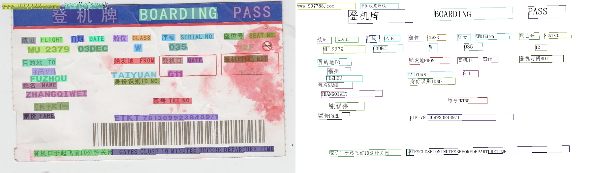

[English](README_en.md) | 简体中文 | [हिन्दी](./doc/doc_i18n/README_हिन्द.md) | [日本語](./doc/doc_i18n/README_日本語.md) | [한국인](./doc/doc_i18n/README_한국어.md) | [Pу́сский язы́к](./doc/doc_i18n/README_Ру́сский_язы́к.md)

 

    
    
    
    
    
    
    

## 简介

PaddleOCR旨在打造一套丰富、领先、且实用的OCR工具库，助力开发者训练出更好的模型，并应用落地。

    

    

## 📣 近期更新
- **🔨2023.11 发布 [PP-ChatOCRv2](https://aistudio.baidu.com/application/detail/10368)**: 一个SDK，覆盖20+高频应用场景，支持5种文本图像智能分析能力和部署，包括通用场景关键信息抽取（快递单、营业执照和机动车行驶证等）、复杂文档场景关键信息抽取（解决生僻字、特殊标点、多页pdf、表格等难点问题）、通用OCR、文档场景专用OCR、通用表格识别。针对垂类业务场景，也支持模型训练、微调和Prompt优化。
- **🔥2023.8.7 发布 PaddleOCR [release/2.7](https://github.com/PaddlePaddle/PaddleOCR/tree/release/2.7)**
    - 发布[PP-OCRv4](./doc/doc_ch/PP-OCRv4_introduction.md)，提供mobile和server两种模型
      - PP-OCRv4-mobile：速度可比情况下，中文场景效果相比于PP-OCRv3再提升4.5%，英文场景提升10%，80语种多语言模型平均识别准确率提升8%以上
      - PP-OCRv4-server：发布了目前精度最高的OCR模型，中英文场景上检测模型精度提升4.9%， 识别模型精度提升2%
        可参考[快速开始](./doc/doc_ch/quickstart.md) 一行命令快速使用，同时也可在飞桨AI套件(PaddleX)中的[通用OCR产业方案](https://aistudio.baidu.com/aistudio/modelsdetail?modelId=286)中低代码完成模型训练、推理、高性能部署全流程
    - 发布[PP-ChatOCR](https://aistudio.baidu.com/aistudio/modelsdetail?modelId=332) ,使用融合PP-OCR模型和文心大模型的通用场景关键信息抽取全新方案
- 🔨**2022.11 新增实现[4种前沿算法](doc/doc_ch/algorithm_overview.md)**：文本检测 [DRRG](doc/doc_ch/algorithm_det_drrg.md),  文本识别 [RFL](doc/doc_ch/algorithm_rec_rfl.md), 文本超分[Text Telescope](doc/doc_ch/algorithm_sr_telescope.md)，公式识别[CAN](doc/doc_ch/algorithm_rec_can.md)
- **2022.10 优化[JS版PP-OCRv3模型](./deploy/paddlejs/README_ch.md)**：模型大小仅4.3M，预测速度提升8倍，配套web demo开箱即用
- **💥 直播回放：PaddleOCR研发团队详解PP-StructureV2优化策略**。微信扫描[下方二维码](#开源社区)，关注公众号并填写问卷后进入官方交流群，获取直播回放链接与20G重磅OCR学习大礼包（内含PDF转Word应用程序、10种垂类模型、《动手学OCR》电子书等）
- **🔥2022.8.24 发布 PaddleOCR [release/2.6](https://github.com/PaddlePaddle/PaddleOCR/tree/release/2.6)**
  - 发布[PP-StructureV2](./ppstructure/README_ch.md)，系统功能性能全面升级，适配中文场景，新增支持[版面复原](./ppstructure/recovery/README_ch.md)，支持**一行命令完成PDF转Word**；
  - [版面分析](./ppstructure/layout/README_ch.md)模型优化：模型存储减少95%，速度提升11倍，平均CPU耗时仅需41ms；
  - [表格识别](./ppstructure/table/README_ch.md)模型优化：设计3大优化策略，预测耗时不变情况下，模型精度提升6%；
  - [关键信息抽取](./ppstructure/kie/README_ch.md)模型优化：设计视觉无关模型结构，语义实体识别精度提升2.8%，关系抽取精度提升9.1%。
- 🔥**2022.8 发布 [OCR场景应用集合](./applications)**：包含数码管、液晶屏、车牌、高精度SVTR模型、手写体识别等**9个垂类模型**，覆盖通用，制造、金融、交通行业的主要OCR垂类应用。

> [更多](./doc/doc_ch/update.md)

## 🌟 特性

支持多种OCR相关前沿算法，在此基础上打造产业级特色模型[PP-OCR](./doc/doc_ch/ppocr_introduction.md)、[PP-Structure](./ppstructure/README_ch.md)和[PP-ChatOCRv2](https://aistudio.baidu.com/projectdetail/paddlex/7050167)，并打通数据生产、模型训练、压缩、预测部署全流程。

    

> 上述内容的使用方法建议从文档教程中的快速开始体验

## ⚡ 快速开始

- 在线免费体验：
    - PP-OCRv4 在线体验地址：https://aistudio.baidu.com/application/detail/7658
    - PP-ChatOCRv2 在线体验地址：https://aistudio.baidu.com/application/detail/10368
  
- 一行命令快速使用：[快速开始（中英文/多语言/文档分析）](./doc/doc_ch/quickstart.md)
- 移动端demo体验：[安装包DEMO下载地址](https://ai.baidu.com/easyedge/app/openSource?from=paddlelite)(基于EasyEdge和Paddle-Lite, 支持iOS和Android系统)

## 📖 技术交流合作

飞桨AI套件（PaddleX）—— 精选产业实用模型的一站式开发平台。包含如下特点：

* 【产业高精度模型库】精选算法和预训练模型，覆盖10+主流AI任务下的40+精选模型，如图像分类、目标检测、图像分割、3D、OCR、PDF转word等，并提供权威模型Benchmark表单，助力模型选型。
* 【持续上新的特色工具】「PP-ChatOCRv2」文心一言与PP-OCR强强结合的通用文本图像智能分析系统；「大模型半监督学习工具」10%标注数据，比肩全量标注的模型效果；「PP-TSv2工具」支持时序预测和时序异常检测任务，达到业界SOTA效果。其他特色工具持续更新中。
* 【低代码全流程开发】10+主流AI任务一套开发范式，基于图形界面(低代码)，只需四个简单步骤，即可实现数据准备、模型训练、模型评估、部署SDK下载等全流程AI开发。
* 【轻量级私有化本地端】PaddleX支持纯离线使用，满足企业安全保密需要。产品兼容性程度高，标准化程度高，支持AI Studio云端、Windows本地端，即将发布Linux本地端、昆仑芯本地端、昇腾本地端、寒武纪本地端等。

作为一款高效的开发神器，PaddleX值得每一位开发者拥有。

PaddleX官网地址：[https://www.paddlepaddle.org.cn/paddle/paddleX](https://aistudio.baidu.com/intro/paddlex)

欢迎微信扫描下方二维码或者点击[链接](https://aistudio.baidu.com/community/channel/610) 进入AI Studio【PaddleX社区频道】获得更高效的技术答疑～

飞桨AI套件【PaddleX】社区频道二维码

## 📚《动手学OCR》电子书
- [《动手学OCR》电子书](./doc/doc_ch/ocr_book.md)

## 🚀 开源共建
- **👫 加入社区**：感谢大家长久以来对 PaddleOCR 的支持和关注，与广大开发者共同构建一个专业、和谐、相互帮助的开源社区是 PaddleOCR 的目标。我们非常欢迎各位开发者参与到飞桨社区的开源建设中，加入开源、共建飞桨。**为感谢社区开发者在 PaddleOCR release2.7 中做出的代码贡献，我们将为贡献者制作与邮寄[开源贡献证书](https://github.com/PaddlePaddle/community/blob/master/contributors/certificate-inspection.md)，烦请[填写问卷](https://paddle.wjx.cn/vm/wFNr6w7.aspx)提供必要的邮寄信息。**
- **🤩 社区活动**：飞桨开源社区长期运营与发布各类丰富的活动与开发任务，在 PaddleOCR 社区，你可以关注以下社区活动，并选择自己感兴趣的内容参与开源共建：
  - **🎁 飞桨套件快乐开源常规赛 | [传送门](https://github.com/PaddlePaddle/PaddleOCR/issues/10223)**：OCR 社区常规赛升级版，以建设更好用的 OCR 套件为目标，包括但不限于学术前沿模型训练与推理、打磨优化 OCR 工具与应用项目开发等，任何有利于社区意见流动和问题解决的行为都热切希望大家的参与。让我们共同成长为飞桨套件的重要 Contributor 🎉🎉🎉。
  - **💡 新需求征集 | [传送门](https://github.com/PaddlePaddle/PaddleOCR/issues/10334)**：你在日常研究和实践深度学习过程中，有哪些你期望的 feature 亟待实现？请按照格式描述你想实现的 feature 和你提出的初步实现思路，我们会定期沟通与讨论这些需求，并将其纳入未来的版本规划中。
  - **💬 PP-SIG 技术研讨会 | [传送门](https://github.com/PaddlePaddle/community/tree/master/ppsigs)**：PP-SIG 是飞桨社区开发者由于相同的兴趣汇聚在一起形成的虚拟组织，通过定期召开技术研讨会的方式，分享行业前沿动态、探讨社区需求与技术开发细节、发起社区联合贡献任务。PaddleOCR 希望可以通过 AI 的力量助力任何一位有梦想的开发者实现自己的想法，享受创造价值带来的愉悦。
- **📑 项目合作**：如果你有企业中明确的 OCR 垂类应用需求，我们推荐你使用训压推一站式全流程高效率开发平台 PaddleX，助力 AI 技术快速落地。PaddleX 还支持联创开发，利润分成！欢迎广大的个人开发者和企业开发者参与进来，共创繁荣的 AI 技术生态！

## 🛠️ PP-OCR系列模型列表（更新中）

| 模型简介                              | 模型名称                | 推荐场景        | 检测模型                                                     | 方向分类器                                                   | 识别模型                                                     |
| ------------------------------------- | ----------------------- | --------------- | ------------------------------------------------------------ | ------------------------------------------------------------ | ------------------------------------------------------------ |
| 中英文超轻量PP-OCRv4模型（15.8M）     | ch_PP-OCRv4_xx          | 移动端&服务器端 | [推理模型](https://paddleocr.bj.bcebos.com/PP-OCRv4/chinese/ch_PP-OCRv4_det_infer.tar) / [训练模型](https://paddleocr.bj.bcebos.com/PP-OCRv4/chinese/ch_PP-OCRv4_det_train.tar) | [推理模型](https://paddleocr.bj.bcebos.com/dygraph_v2.0/ch/ch_ppocr_mobile_v2.0_cls_infer.tar) / [训练模型](https://paddleocr.bj.bcebos.com/dygraph_v2.0/ch/ch_ppocr_mobile_v2.0_cls_train.tar) | [推理模型](https://paddleocr.bj.bcebos.com/PP-OCRv4/chinese/ch_PP-OCRv4_rec_infer.tar) / [训练模型](https://paddleocr.bj.bcebos.com/PP-OCRv4/chinese/ch_PP-OCRv4_rec_train.tar) |
| 中英文超轻量PP-OCRv3模型（16.2M）     | ch_PP-OCRv3_xx          | 移动端&服务器端 | [推理模型](https://paddleocr.bj.bcebos.com/PP-OCRv3/chinese/ch_PP-OCRv3_det_infer.tar) / [训练模型](https://paddleocr.bj.bcebos.com/PP-OCRv3/chinese/ch_PP-OCRv3_det_distill_train.tar) | [推理模型](https://paddleocr.bj.bcebos.com/dygraph_v2.0/ch/ch_ppocr_mobile_v2.0_cls_infer.tar) / [训练模型](https://paddleocr.bj.bcebos.com/dygraph_v2.0/ch/ch_ppocr_mobile_v2.0_cls_train.tar) | [推理模型](https://paddleocr.bj.bcebos.com/PP-OCRv3/chinese/ch_PP-OCRv3_rec_infer.tar) / [训练模型](https://paddleocr.bj.bcebos.com/PP-OCRv3/chinese/ch_PP-OCRv3_rec_train.tar) |
| 英文超轻量PP-OCRv3模型（13.4M）     | en_PP-OCRv3_xx          | 移动端&服务器端 | [推理模型](https://paddleocr.bj.bcebos.com/PP-OCRv3/english/en_PP-OCRv3_det_infer.tar) / [训练模型](https://paddleocr.bj.bcebos.com/PP-OCRv3/english/en_PP-OCRv3_det_distill_train.tar) | [推理模型](https://paddleocr.bj.bcebos.com/dygraph_v2.0/ch/ch_ppocr_mobile_v2.0_cls_infer.tar) / [训练模型](https://paddleocr.bj.bcebos.com/dygraph_v2.0/ch/ch_ppocr_mobile_v2.0_cls_train.tar) | [推理模型](https://paddleocr.bj.bcebos.com/PP-OCRv3/english/en_PP-OCRv3_rec_infer.tar) / [训练模型](https://paddleocr.bj.bcebos.com/PP-OCRv3/english/en_PP-OCRv3_rec_train.tar) |

- 超轻量OCR系列更多模型下载（包括多语言），可以参考[PP-OCR系列模型下载](./doc/doc_ch/models_list.md)，文档分析相关模型参考[PP-Structure系列模型下载](./ppstructure/docs/models_list.md)

### PaddleOCR场景应用模型

| 行业 | 类别         | 亮点                               | 文档说明                                                     | 模型下载                                      |
| ---- | ------------ | ---------------------------------- | ------------------------------------------------------------ | --------------------------------------------- |
| 制造 | 数码管识别   | 数码管数据合成、漏识别调优         | [光功率计数码管字符识别](./applications/光功率计数码管字符识别/光功率计数码管字符识别.md) | [下载链接](./applications/README.md#模型下载) |
| 金融 | 通用表单识别 | 多模态通用表单结构化提取           | [多模态表单识别](./applications/多模态表单识别.md)           | [下载链接](./applications/README.md#模型下载) |
| 交通 | 车牌识别     | 多角度图像处理、轻量模型、端侧部署 | [轻量级车牌识别](./applications/轻量级车牌识别.md)           | [下载链接](./applications/README.md#模型下载) |

- 更多制造、金融、交通行业的主要OCR垂类应用模型（如电表、液晶屏、高精度SVTR模型等），可参考[场景应用模型下载](./applications)

## 📖 文档教程

- [运行环境准备](./doc/doc_ch/environment.md)
- [PP-OCR文本检测识别🔥](./doc/doc_ch/ppocr_introduction.md)
    - [快速开始](./doc/doc_ch/quickstart.md)
    - [模型库](./doc/doc_ch/models_list.md)
    - [模型训练](./doc/doc_ch/training.md)
        - [文本检测](./doc/doc_ch/detection.md)
        - [文本识别](./doc/doc_ch/recognition.md)
        - [文本方向分类器](./doc/doc_ch/angle_class.md)
    - 模型压缩
        - [模型量化](./deploy/slim/quantization/README.md)
        - [模型裁剪](./deploy/slim/prune/README.md)
        - [知识蒸馏](./doc/doc_ch/knowledge_distillation.md)
    - [推理部署](./deploy/README_ch.md)
        - [基于Python预测引擎推理](./doc/doc_ch/inference_ppocr.md)
        - [基于C++预测引擎推理](./deploy/cpp_infer/readme_ch.md)
        - [服务化部署](./deploy/pdserving/README_CN.md)
        - [端侧部署](./deploy/lite/readme.md)
        - [Paddle2ONNX模型转化与预测](./deploy/paddle2onnx/readme.md)
        - [云上飞桨部署工具](./deploy/paddlecloud/README.md)
        - [Benchmark](./doc/doc_ch/benchmark.md)
- [PP-Structure文档分析🔥](./ppstructure/README_ch.md)
    - [快速开始](./ppstructure/docs/quickstart.md)
    - [模型库](./ppstructure/docs/models_list.md)
    - [模型训练](./doc/doc_ch/training.md)
        - [版面分析](./ppstructure/layout/README_ch.md)
        - [表格识别](./ppstructure/table/README_ch.md)
        - [关键信息提取](./ppstructure/kie/README_ch.md)
    - [推理部署](./deploy/README_ch.md)
        - [基于Python预测引擎推理](./ppstructure/docs/inference.md)
        - [基于C++预测引擎推理](./deploy/cpp_infer/readme_ch.md)
        - [服务化部署](./deploy/hubserving/readme.md)
- [前沿算法与模型🚀](./doc/doc_ch/algorithm_overview.md)
    - [文本检测算法](./doc/doc_ch/algorithm_overview.md)
    - [文本识别算法](./doc/doc_ch/algorithm_overview.md)
    - [端到端OCR算法](./doc/doc_ch/algorithm_overview.md)
    - [表格识别算法](./doc/doc_ch/algorithm_overview.md)
    - [关键信息抽取算法](./doc/doc_ch/algorithm_overview.md)
    - [使用PaddleOCR架构添加新算法](./doc/doc_ch/add_new_algorithm.md)
- [场景应用](./applications)
- 数据标注与合成
    - [半自动标注工具PPOCRLabel](./PPOCRLabel/README_ch.md)
    - [数据合成工具Style-Text](./StyleText/README_ch.md)
    - [其它数据标注工具](./doc/doc_ch/data_annotation.md)
    - [其它数据合成工具](./doc/doc_ch/data_synthesis.md)
- 数据集
    - [通用中英文OCR数据集](doc/doc_ch/dataset/datasets.md)
    - [手写中文OCR数据集](doc/doc_ch/dataset/handwritten_datasets.md)
    - [垂类多语言OCR数据集](doc/doc_ch/dataset/vertical_and_multilingual_datasets.md)
    - [版面分析数据集](doc/doc_ch/dataset/layout_datasets.md)
    - [表格识别数据集](doc/doc_ch/dataset/table_datasets.md)
    - [关键信息提取数据集](doc/doc_ch/dataset/kie_datasets.md)
- [代码组织结构](./doc/doc_ch/tree.md)
- [效果展示](#效果展示)
- [《动手学OCR》电子书📚](./doc/doc_ch/ocr_book.md)
- [开源社区](#开源社区)
- FAQ
    - [通用问题](./doc/doc_ch/FAQ.md)
    - [PaddleOCR实战问题](./doc/doc_ch/FAQ.md)
- [参考文献](./doc/doc_ch/reference.md)
- [许可证书](#许可证书)

## 👀 效果展示 [more](./doc/doc_ch/visualization.md)

PP-OCRv3 中文模型

    
    
    

PP-OCRv3 英文模型

    
    

PP-OCRv3 多语言模型

    
    

PP-Structure 文档分析

- 版面分析+表格识别  

    

- SER（语义实体识别）  

    

    

    

- RE（关系提取）

    

    

    

## 许可证书
本项目的发布受<a href="https://github.com/PaddlePaddle/PaddleOCR/blob/master/LICENSE">Apache 2.0 license</a>许可认证。
