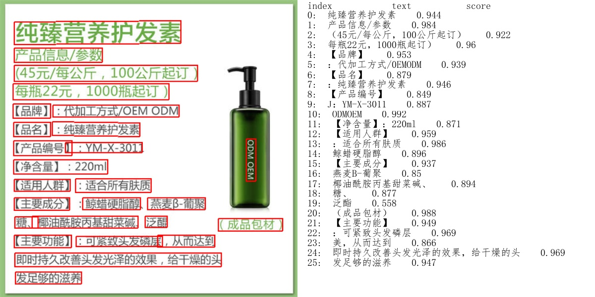
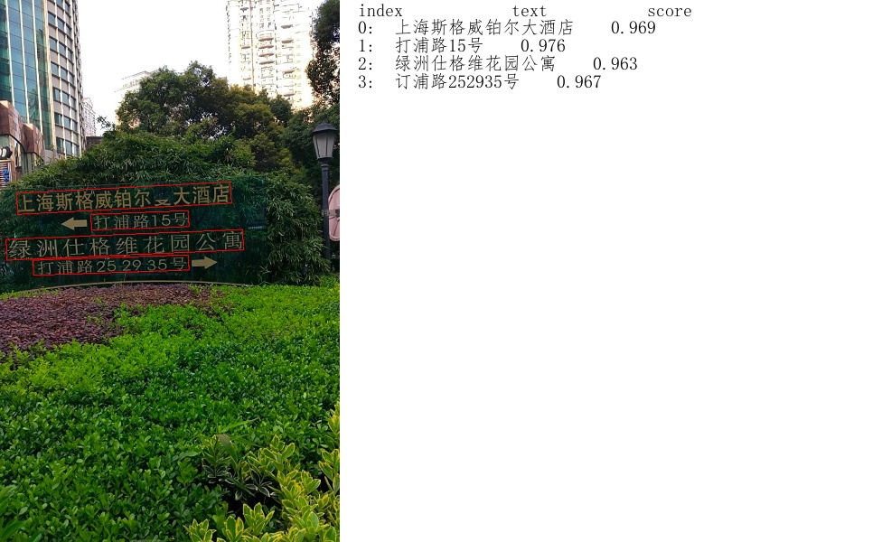
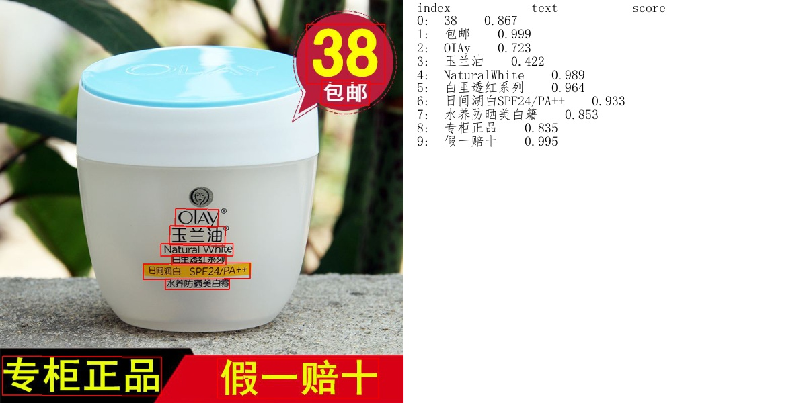

## 简介
PaddleOCR旨在打造一套丰富、领先、且实用的OCR工具库，助力使用者训练出更好的模型，并应用落地。

## 特性
- 超轻量级中文OCR，总模型仅8.6M
    - 单模型支持中英文数字组合识别、竖排文本识别、长文本识别
    - 检测模型DB（4.1M）+识别模型CRNN（4.5M）
- 多种文本检测训练算法，EAST、DB
- 多种文本识别训练算法，Rosetta、CRNN、STAR-Net、RARE

## **超轻量级中文OCR体验**



上图是超轻量级中文OCR模型效果展示，更多效果图请见文末[效果展示](#效果展示)。

#### 1.环境配置

请先参考[快速安装](./doc/installation.md)配置PaddleOCR运行环境。

#### 2.模型下载

```
# 下载inference模型文件包
wget https://paddleocr.bj.bcebos.com/inference.tar
# inference模型文件包解压
tar -xf inference.tar
```

#### 3.单张图像或者图像集合预测

以下代码实现了文本检测、识别串联推理，在执行预测时，需要通过参数image_dir指定单张图像或者图像集合的路径、参数det_model_dir指定检测inference模型的路径和参数rec_model_dir指定识别inference模型的路径。

```
# 设置PYTHONPATH环境变量
export PYTHONPATH=.

# 预测image_dir指定的单张图像
python tools/infer/predict_system.py --image_dir="/Demo.jpg" --det_model_dir="./inference/det/"  --rec_model_dir="./inference/rec/"

# 预测image_dir指定的图像集合
python tools/infer/predict_system.py --image_dir="/test_imgs/" --det_model_dir="./inference/det/"  --rec_model_dir="./inference/rec/"
```
更多的文本检测、识别串联推理使用方式请参考文档教程中[基于推理引擎预测](./doc/inference.md)。

## 文档教程
- [快速安装](./doc/installation.md)
- [文本检测模型训练/评估/预测](./doc/detection.md)
- [文本识别模型训练/评估/预测](./doc/recognition.md)
- [基于推理引擎预测](./doc/inference.md)

## 文本检测算法

PaddleOCR开源的文本检测算法列表：
- [x]  [EAST](https://arxiv.org/abs/1704.03155)
- [x]  [DB](https://arxiv.org/abs/1911.08947)
- [ ]  [SAST](https://arxiv.org/abs/1908.05498)(百度自研, comming soon)

在ICDAR2015文本检测公开数据集上，算法效果如下：

|模型|骨干网络|Hmean|
|-|-|-|
|[EAST](https://paddleocr.bj.bcebos.com/det_r50_vd_east.tar)|ResNet50_vd|85.85%|
|[EAST](https://paddleocr.bj.bcebos.com/det_mv3_east.tar)|MobileNetV3|79.08%|
|[DB](https://paddleocr.bj.bcebos.com/det_r50_vd_db.tar)|ResNet50_vd|83.30%|
|[DB](https://paddleocr.bj.bcebos.com/det_mv3_db.tar)|MobileNetV3|73.00%|

PaddleOCR文本检测算法的训练和使用请参考文档教程中[文本检测模型训练/评估/预测](./doc/detection.md)。

## 文本识别算法

PaddleOCR开源的文本识别算法列表：
- [x]  [CRNN](https://arxiv.org/abs/1507.05717)
- [x]  [Rosetta](https://arxiv.org/abs/1910.05085)
- [x]  [STAR-Net](http://www.bmva.org/bmvc/2016/papers/paper043/index.html)
- [x]  [RARE](https://arxiv.org/abs/1603.03915v1)
- [ ]  [SRN](https://arxiv.org/abs/2003.12294)(百度自研, comming soon)

参考[DTRB](https://arxiv.org/abs/1904.01906)文字识别训练和评估流程，使用MJSynth和SynthText两个文字识别数据集训练，在IIIT, SVT, IC03, IC13, IC15, SVTP, CUTE数据集上进行评估，算法效果如下：

|模型|骨干网络|Avg Accuracy|
|-|-|-|
|[Rosetta](https://paddleocr.bj.bcebos.com/rec_r34_vd_none_none_ctc.tar)|Resnet34_vd|80.24%|
|[Rosetta](https://paddleocr.bj.bcebos.com/rec_mv3_none_none_ctc.tar)|MobileNetV3|78.16%|
|[CRNN](https://paddleocr.bj.bcebos.com/rec_r34_vd_none_bilstm_ctc.tar)|Resnet34_vd|82.20%|
|[CRNN](https://paddleocr.bj.bcebos.com/rec_mv3_none_bilstm_ctc.tar)|MobileNetV3|79.37%|
|[STAR-Net](https://paddleocr.bj.bcebos.com/rec_r34_vd_tps_bilstm_ctc.tar)|Resnet34_vd|83.93%|
|[STAR-Net](https://paddleocr.bj.bcebos.com/rec_mv3_tps_bilstm_ctc.tar)|MobileNetV3|81.56%|
|[RARE](https://paddleocr.bj.bcebos.com/rec_r34_vd_tps_bilstm_attn.tar)|Resnet34_vd|84.90%|
|[RARE](https://paddleocr.bj.bcebos.com/rec_mv3_tps_bilstm_attn.tar)|MobileNetV3|83.32%|

PaddleOCR文本识别算法的训练和使用请参考文档教程中[文本识别模型训练/评估/预测](./doc/recognition.md)。

## 端到端OCR算法
- [ ]  [End2End-PSL](https://arxiv.org/abs/1909.07808)(百度自研, comming soon)

<a name="效果展示"></a>
## 效果展示







## 参考文献
```
1. EAST:
@inproceedings{zhou2017east,
  title={EAST: an efficient and accurate scene text detector},
  author={Zhou, Xinyu and Yao, Cong and Wen, He and Wang, Yuzhi and Zhou, Shuchang and He, Weiran and Liang, Jiajun},
  booktitle={Proceedings of the IEEE conference on Computer Vision and Pattern Recognition},
  pages={5551--5560},
  year={2017}
}

2. DB:
@article{liao2019real,
  title={Real-time Scene Text Detection with Differentiable Binarization},
  author={Liao, Minghui and Wan, Zhaoyi and Yao, Cong and Chen, Kai and Bai, Xiang},
  journal={arXiv preprint arXiv:1911.08947},
  year={2019}
}

3. DTRB:
@inproceedings{baek2019wrong,
  title={What is wrong with scene text recognition model comparisons? dataset and model analysis},
  author={Baek, Jeonghun and Kim, Geewook and Lee, Junyeop and Park, Sungrae and Han, Dongyoon and Yun, Sangdoo and Oh, Seong Joon and Lee, Hwalsuk},
  booktitle={Proceedings of the IEEE International Conference on Computer Vision},
  pages={4715--4723},
  year={2019}
}

4. SAST:
@inproceedings{wang2019single,
  title={A Single-Shot Arbitrarily-Shaped Text Detector based on Context Attended Multi-Task Learning},
  author={Wang, Pengfei and Zhang, Chengquan and Qi, Fei and Huang, Zuming and En, Mengyi and Han, Junyu and Liu, Jingtuo and Ding, Errui and Shi, Guangming},
  booktitle={Proceedings of the 27th ACM International Conference on Multimedia},
  pages={1277--1285},
  year={2019}
}

5. SRN:
@article{yu2020towards,
  title={Towards Accurate Scene Text Recognition with Semantic Reasoning Networks},
  author={Yu, Deli and Li, Xuan and Zhang, Chengquan and Han, Junyu and Liu, Jingtuo and Ding, Errui},
  journal={arXiv preprint arXiv:2003.12294},
  year={2020}
}

6. end2end-psl:
@inproceedings{sun2019chinese,
  title={Chinese Street View Text: Large-scale Chinese Text Reading with Partially Supervised Learning},
  author={Sun, Yipeng and Liu, Jiaming and Liu, Wei and Han, Junyu and Ding, Errui and Liu, Jingtuo},
  booktitle={Proceedings of the IEEE International Conference on Computer Vision},
  pages={9086--9095},
  year={2019}
}
```

## 许可证书
本项目的发布受<a href="https://github.com/PaddlePaddle/PaddleOCR/blob/master/LICENSE">Apache 2.0 license</a>许可认证。

## 版本更新

## 如何贡献代码
我们非常欢迎你为PaddleOCR贡献代码，也十分感谢你的反馈。
