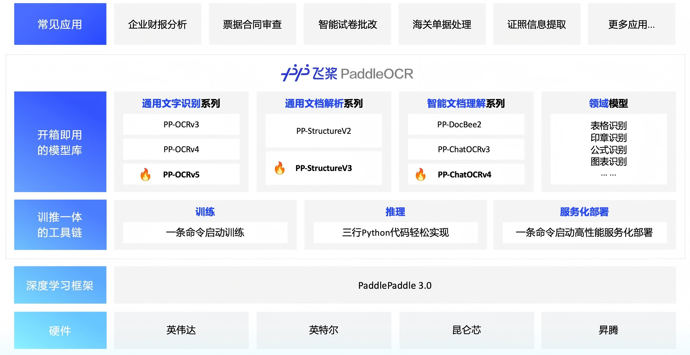

<div align="center">
  <p>
      </a>
  </p>

<!-- language -->
中文 | [English](./README_en.md)

<!-- icon -->

[](https://github.com/PaddlePaddle/PaddleOCR)
[](https://pypi.org/project/PaddleOCR/)


[](https://www.paddleocr.ai/)
[](https://aistudio.baidu.com/community/app/91660/webUI)
[](https://aistudio.baidu.com/community/app/518494/webUI)
[](https://aistudio.baidu.com/community/app/518493/webUI)

</div>

## 🚀 简介
PaddleOCR自发布以来凭借学术前沿算法和产业落地实践，受到了产学研各方的喜爱，并被广泛应用于众多知名开源项目，例如：Umi-OCR、OmniParser、MinerU、RAGFlow等，已成为广大开发者心中的开源OCR领域的首选工具。2025年5月20日，飞桨团队发布**PaddleOCR 3.0**，全面适配**飞桨框架3.0正式版**，进一步**提升文字识别精度**，支持**多文字类型识别**和**手写体识别**，满足大模型应用对**复杂文档高精度解析**的旺盛需求，结合**文心大模型4.5 Turbo**显著提升关键信息抽取精度，并新增**对昆仑芯、昇腾等国产硬件**的支持。

PaddleOCR 3.0**新增**三大特色能力：
- 全场景文字识别模型[PP-OCRv5](docs/version3.x/algorithm/PP-OCRv5/PP-OCRv5.md)：单模型支持五种文字类型和复杂手写体识别；整体识别精度相比上一代**提升13个百分点**。[在线体验](https://aistudio.baidu.com/community/app/91660/webUI)
- 通用文档解析方案[PP-StructureV3](docs/version3.x/algorithm/PP-StructureV3/PP-StructureV3.md)：支持多场景、多版式 PDF 高精度解析，在公开评测集中**领先众多开源和闭源方案**。[在线体验](https://aistudio.baidu.com/community/app/518494/webUI)
- 智能文档理解方案[PP-ChatOCRv4](docs/version3.x/algorithm/PP-ChatOCRv4/PP-ChatOCRv4.md)：原生支持文心大模型4.5 Turbo，精度相比上一代**提升15个百分点**。[在线体验](https://aistudio.baidu.com/community/app/518493/webUI)

PaddleOCR 3.0除了提供优秀的模型库外，还提供好学易用的工具，覆盖模型训练、推理和服务化部署，方便开发者快速落地AI应用。
<div align="center">
  <p>
      </a>
  </p>
</div>


## 📣 最新动态
🔥🔥2025.05.20: **PaddleOCR 3.0** 正式发布，包含：
- **PP-OCRv5**: 全场景高精度文字识别

   1. 🌐 单模型支持**五种**文字类型(**简体中文**、**繁体中文**、**中文拼音**、**英文**和**日文**)。
   2. ✍️ 支持复杂**手写体**识别：复杂连笔、非规范字迹识别性能显著提升。
   3. 🎯 整体识别精度提升 - 多种应用场景达到 SOTA 精度, 相比上一版本PP-OCRv4，识别精度**提升13个百分点**！

- **PP-StructureV3**: 通用文档解析方案

   1. 🧮 支持多场景 PDF 高精度解析，在 OmniDocBench 基准测试中**领先众多开源和闭源方案**。
   2. 🧠 多项专精能力: **印章识别**、**图表转表格**、**嵌套公式/图片的表格识别**、**竖排文本解析**及**复杂表格结构分析**等。


- **PP-ChatOCRv4**: 智能文档理解方案
   1. 🔥 文档图像（PDF/PNG/JPG）关键信息提取精度相比上一代**提升15个百分点**！
   2. 💻 原生支持**文心大模型4.5 Turbo**，还兼容 PaddleNLP、Ollama、vLLM 等工具部署的大模型。
   3. 🤝 集成 [PP-DocBee2](https://github.com/PaddlePaddle/PaddleMIX/tree/develop/paddlemix/examples/ppdocbee2)，支持印刷文字、手写体文字、印章信息、表格、图表等常见的复杂文档信息抽取和理解的能力。


## ⚡ 快速开始
### 1. 在线体验
[](https://aistudio.baidu.com/community/app/91660/webUI)
[](https://aistudio.baidu.com/community/app/518494/webUI)
[](https://aistudio.baidu.com/community/app/518493/webUI)

### 2. 本地安装

请参考[安装指南](https://www.paddlepaddle.org.cn/install/quick?docurl=/documentation/docs/zh/develop/install/pip/linux-pip.html)完成**PaddlePaddle 3.0**的安装，然后安装paddleocr。

```bash
# 安装 paddleocr
pip install paddleocr==3.0.0
```

### 3. 命令行方式推理
```bash
# 运行 PP-OCRv5 推理
paddleocr ocr -i https://paddle-model-ecology.bj.bcebos.com/paddlex/imgs/demo_image/general_ocr_002.png --use_doc_orientation_classify False --use_doc_unwarping False --use_textline_orientation False 

# 运行 PP-StructureV3 推理
paddleocr pp_structurev3 -i https://paddle-model-ecology.bj.bcebos.com/paddlex/imgs/demo_image/pp_structure_v3_demo.png --use_doc_orientation_classify False --use_doc_unwarping False

# 运行 PP-ChatOCRv4 推理前，需要先获得千帆API Key
paddleocr pp_chatocrv4_doc -i https://paddle-model-ecology.bj.bcebos.com/paddlex/imgs/demo_image/vehicle_certificate-1.png -k 驾驶室准乘人数 --qianfan_api_key your_api_key --use_doc_orientation_classify False --use_doc_unwarping False 

# 查看 "paddleocr ocr" 详细参数
paddleocr ocr --help
```
### 4. API方式推理

**4.1 PP-OCRv5 示例**
```python
from paddleocr import PaddleOCR
# 初始化 PaddleOCR 实例
ocr = PaddleOCR(
    use_doc_orientation_classify=False,
    use_doc_unwarping=False,
    use_textline_orientation=False)
# 对示例图像执行 OCR 推理 
result = ocr.predict(
    input="https://paddle-model-ecology.bj.bcebos.com/paddlex/imgs/demo_image/general_ocr_002.png")
# 可视化结果并保存 json 结果
for res in result:
    res.print()
    res.save_to_img("output")
    res.save_to_json("output")
```

<details>
    <summary><strong>4.2 PP-StructureV3 示例</strong></summary>

```python
from pathlib import Path
from paddleocr import PPStructureV3

pipeline = PPStructureV3(
    use_doc_orientation_classify=False,
    use_doc_unwarping=False
)

# For Image
output = pipeline.predict(
    input="https://paddle-model-ecology.bj.bcebos.com/paddlex/imgs/demo_image/pp_structure_v3_demo.png",
    )

# 可视化结果并保存 json 结果
for res in output:
    res.print() 
    res.save_to_json(save_path="output") 
    res.save_to_markdown(save_path="output") 
```

</details>


<details>
   <summary><strong>4.3 PP-ChatOCRv4 示例</strong></summary>

```python
from paddleocr import PPChatOCRv4Doc

chat_bot_config = {
    "module_name": "chat_bot",
    "model_name": "ernie-3.5-8k",
    "base_url": "https://qianfan.baidubce.com/v2",
    "api_type": "openai",
    "api_key": "api_key",  # your api_key
}

retriever_config = {
    "module_name": "retriever",
    "model_name": "embedding-v1",
    "base_url": "https://qianfan.baidubce.com/v2",
    "api_type": "qianfan",
    "api_key": "api_key",  # your api_key
}

pipeline = PPChatOCRv4Doc(
    use_doc_orientation_classify=False,
    use_doc_unwarping=False
)

visual_predict_res = pipeline.visual_predict(
    input="https://paddle-model-ecology.bj.bcebos.com/paddlex/imgs/demo_image/vehicle_certificate-1.png",
    use_common_ocr=True,
    use_seal_recognition=True,
    use_table_recognition=True,
)

mllm_predict_info = None
use_mllm = False
# 如果使用多模态大模型，需要启动本地 mllm 服务，可以参考文档：https://github.com/PaddlePaddle/PaddleX/blob/release/3.0/docs/pipeline_usage/tutorials/vlm_pipelines/doc_understanding.md 进行部署，并更新 mllm_chat_bot_config 配置。
if use_mllm:
    mllm_chat_bot_config = {
        "module_name": "chat_bot",
        "model_name": "PP-DocBee",
        "base_url": "http://127.0.0.1:8080/",  # your local mllm service url
        "api_type": "openai",
        "api_key": "api_key",  # your api_key
    }

    mllm_predict_res = pipeline.mllm_pred(
        input="https://paddle-model-ecology.bj.bcebos.com/paddlex/imgs/demo_image/vehicle_certificate-1.png",
        key_list=["驾驶室准乘人数"],
        mllm_chat_bot_config=mllm_chat_bot_config,
    )
    mllm_predict_info = mllm_predict_res["mllm_res"]

visual_info_list = []
for res in visual_predict_res:
    visual_info_list.append(res["visual_info"])
    layout_parsing_result = res["layout_parsing_result"]

vector_info = pipeline.build_vector(
    visual_info_list, flag_save_bytes_vector=True, retriever_config=retriever_config
)
chat_result = pipeline.chat(
    key_list=["驾驶室准乘人数"],
    visual_info=visual_info_list,
    vector_info=vector_info,
    mllm_predict_info=mllm_predict_info,
    chat_bot_config=chat_bot_config,
    retriever_config=retriever_config,
)
print(chat_result)
```

</details>


### 5. **国产化硬件使用**
- [昆仑芯安装指南](https://paddlepaddle.github.io/PaddleOCR/latest/version3.x/other_devices_support/paddlepaddle_install_XPU.html)
- [昇腾安装指南](https://paddlepaddle.github.io/PaddleOCR/latest/version3.x/other_devices_support/paddlepaddle_install_NPU.html)
  
## ⛰️ 进阶指南
- [PP-OCRv5 使用教程](https://paddlepaddle.github.io/PaddleOCR/latest/version3.x/pipeline_usage/OCR.html)
- [PP-StructureV3 使用教程](https://paddlepaddle.github.io/PaddleOCR/latest/version3.x/pipeline_usage/PP-StructureV3.html)
- [PP-ChatOCRv4 使用教程](https://paddlepaddle.github.io/PaddleOCR/latest/version3.x/pipeline_usage/PP-ChatOCRv4.html)

## 🔄 效果展示

<div align="center">
  <p>
       </a>
  </p>
</div>

<div align="center">
  <p>
      </a>
  </p>
</div>

## 👩‍👩‍👧‍👦 开发者社区

| 扫码关注飞桨公众号 | 扫码加入技术交流群 |
| :---: | :---: |
|  |  |

## 🏆 使用 PaddleOCR 的优秀项目
PaddleOCR 的发展离不开社区贡献！💗衷心感谢所有开发者、合作伙伴与贡献者！
| 项目名称 | 简介 |
| ------------ | ----------- |
| [RAGFlow](https://github.com/infiniflow/ragflow) <a href="https://github.com/infiniflow/ragflow"></a>|基于RAG的AI工作流引擎|
| [MinerU](https://github.com/opendatalab/MinerU) <a href="https://github.com/opendatalab/MinerU"></a>|多类型文档转换Markdown工具|
| [Umi-OCR](https://github.com/hiroi-sora/Umi-OCR) <a href="https://github.com/hiroi-sora/Umi-OCR"></a>|开源批量离线OCR软件|
| [OmniParser](https://github.com/microsoft/OmniParser)<a href="https://github.com/microsoft/OmniParser"></a> |基于纯视觉的GUI智能体屏幕解析工具|
| [QAnything](https://github.com/netease-youdao/QAnything)<a href="https://github.com/netease-youdao/QAnything"></a> |基于任意内容的问答系统|
| [PDF-Extract-Kit](https://github.com/opendatalab/PDF-Extract-Kit) <a href="https://github.com/opendatalab/PDF-Extract-Kit"></a>|高效复杂PDF文档提取工具包|
| [Dango-Translator](https://github.com/PantsuDango/Dango-Translator)<a href="https://github.com/PantsuDango/Dango-Translator"></a> |屏幕实时翻译工具|
| [更多项目](./awesome_projects.md) | |

## 👩‍👩‍👧‍👦 贡献者

<a href="https://github.com/PaddlePaddle/PaddleOCR/graphs/contributors">
  
</a>


## 🌟 Star

[](https://star-history.com/#PaddlePaddle/PaddleOCR&Date)


## 📄 许可协议
本项目的发布受[Apache 2.0 license](LICENSE)许可认证。

## 🎓 学术引用

```
@misc{paddleocr2020,
title={PaddleOCR, Awesome multilingual OCR toolkits based on PaddlePaddle.},
author={PaddlePaddle Authors},
howpublished = {\url{https://github.com/PaddlePaddle/PaddleOCR}},
year={2020}
}
```
