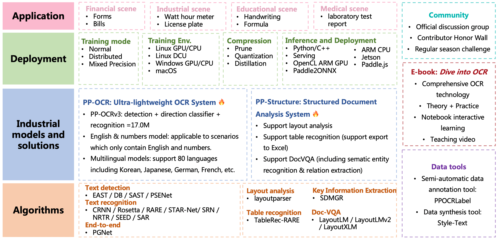
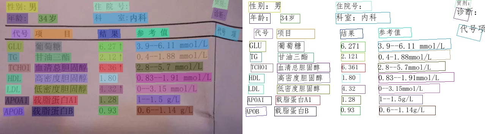
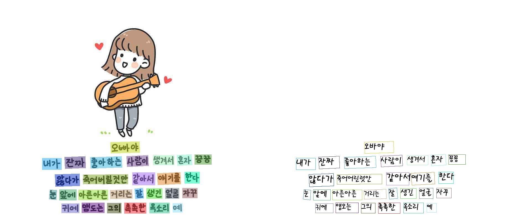
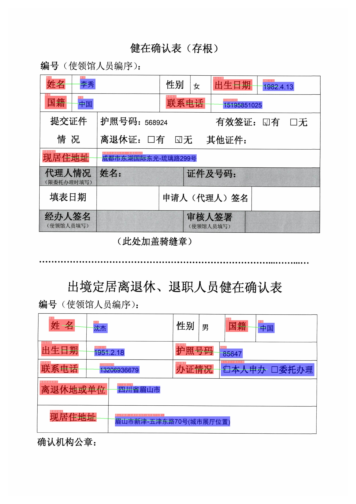

English | [简体中文](README_ch.md)

 

    
    
    
    
    
    
    

## Introduction

PaddleOCR aims to create multilingual, awesome, leading, and practical OCR tools that help users train better models and apply them into practice.

    

    

## Recent updates
- **🔥2022.5.9 Release PaddleOCR [release/2.5](https://github.com/PaddlePaddle/PaddleOCR/tree/release/2.5)**
    - Release [PP-OCRv3](./doc/doc_en/ppocr_introduction_en.md#pp-ocrv3): With comparable speed, the effect of Chinese scene is further improved by 5% compared with PP-OCRv2, the effect of English scene is improved by 11%, and the average recognition accuracy of 80 language multilingual models is improved by more than 5%.
    - Release [PPOCRLabelv2](./PPOCRLabel): Add the annotation function for table recognition task, key information extraction task and irregular text image.
    - Release interactive e-book [*"Dive into OCR"*](./doc/doc_en/ocr_book_en.md), covers the cutting-edge theory and code practice of OCR full stack technology.
- 2021.12.21 Release PaddleOCR [release/2.4](https://github.com/PaddlePaddle/PaddleOCR/tree/release/2.4)
    - Release 1 text detection algorithm ([PSENet](./doc/doc_en/algorithm_det_psenet_en.md)), 3 text recognition algorithms ([NRTR](./doc/doc_en/algorithm_rec_nrtr_en.md)、[SEED](./doc/doc_en/algorithm_rec_seed_en.md)、[SAR](./doc/doc_en/algorithm_rec_nrtr_en.md)).
    - Release 1 key information extraction algorithm [SDMGR](./ppstructure/docs/kie_en.md) and 3 [DocVQA](./ppstructure/vqa) algorithms (LayoutLM, LayoutLMv2, LayoutXLM).
- 2021.9.7 Release PaddleOCR [release/2.3](https://github.com/PaddlePaddle/PaddleOCR/tree/release/2.3)
    - Release [PP-OCRv2](./doc/doc_en/ppocr_introduction_en.md#pp-ocrv2). The inference speed of PP-OCRv2 is 220% higher than that of PP-OCR server in CPU device. The F-score of PP-OCRv2 is 7% higher than that of PP-OCR mobile.
- 2021.8.3 Release PaddleOCR [release/2.2](https://github.com/PaddlePaddle/PaddleOCR/tree/release/2.2)
    - Release a new structured documents analysis toolkit, i.e., [PP-Structure](./ppstructure/README.md), support layout analysis and table recognition (One-key to export chart images to Excel files).

- [more](./doc/doc_en/update_en.md)

## Features

PaddleOCR support a variety of cutting-edge algorithms related to OCR, and developed industrial featured models/solution [PP-OCR](./doc/doc_en/ppocr_introduction_en.md) and [PP-Structure](./ppstructure/README.md) on this basis, and get through the whole process of data production, model training, compression, inference and deployment.

> It is recommended to start with the “quick experience” in the document tutorial

## Quick Experience

- Web online experience for the ultra-lightweight OCR: [Online Experience](https://www.paddlepaddle.org.cn/hub/scene/ocr)
- Mobile DEMO experience (based on EasyEdge and Paddle-Lite, supports iOS and Android systems): [Sign in to the website to obtain the QR code for  installing the App](https://ai.baidu.com/easyedge/app/openSource?from=paddlelite)
- One line of code quick use: [Quick Start](./doc/doc_en/quickstart_en.md)

## E-book: *Dive Into OCR*
- [Dive Into OCR 📚](./doc/doc_en/ocr_book_en.md)

## Community

- **Join us**👬: Scan the QR code below with your Wechat, you can join the official technical discussion group. Looking forward to your participation.

## PP-OCR Series Model List（Update on September 8th）

| Model introduction                                           | Model name                   | Recommended scene | Detection model                                              | Direction classifier                                         | Recognition model                                            |
| ------------------------------------------------------------ | ---------------------------- | ----------------- | ------------------------------------------------------------ | ------------------------------------------------------------ | ------------------------------------------------------------ |
| Chinese and English ultra-lightweight PP-OCRv3 model（16.2M）     | ch_PP-OCRv3_xx          | Mobile & Server | [inference model](https://paddleocr.bj.bcebos.com/PP-OCRv3/chinese/ch_PP-OCRv3_det_infer.tar) / [trained model](https://paddleocr.bj.bcebos.com/PP-OCRv3/chinese/ch_PP-OCRv3_det_distill_train.tar) | [inference model](https://paddleocr.bj.bcebos.com/dygraph_v2.0/ch/ch_ppocr_mobile_v2.0_cls_infer.tar) / [trained model](https://paddleocr.bj.bcebos.com/dygraph_v2.0/ch/ch_ppocr_mobile_v2.0_cls_train.tar) | [inference model](https://paddleocr.bj.bcebos.com/PP-OCRv3/chinese/ch_PP-OCRv3_rec_infer.tar) / [trained model](https://paddleocr.bj.bcebos.com/PP-OCRv3/chinese/ch_PP-OCRv3_rec_train.tar) |
| English ultra-lightweight PP-OCRv3 model（13.4M）     | en_PP-OCRv3_xx          | Mobile & Server | [inference model](https://paddleocr.bj.bcebos.com/PP-OCRv3/english/en_PP-OCRv3_det_infer.tar) / [trained model](https://paddleocr.bj.bcebos.com/PP-OCRv3/english/en_PP-OCRv3_det_distill_train.tar) | [inference model](https://paddleocr.bj.bcebos.com/dygraph_v2.0/ch/ch_ppocr_mobile_v2.0_cls_infer.tar) / [trained model](https://paddleocr.bj.bcebos.com/dygraph_v2.0/ch/ch_ppocr_mobile_v2.0_cls_train.tar) | [inference model](https://paddleocr.bj.bcebos.com/PP-OCRv3/english/en_PP-OCRv3_rec_infer.tar) / [trained model](https://paddleocr.bj.bcebos.com/PP-OCRv3/english/en_PP-OCRv3_rec_train.tar) |
| Chinese and English ultra-lightweight PP-OCRv2 model（11.6M） |  ch_PP-OCRv2_xx |Mobile & Server|[inference model](https://paddleocr.bj.bcebos.com/PP-OCRv2/chinese/ch_PP-OCRv2_det_infer.tar) / [trained model](https://paddleocr.bj.bcebos.com/PP-OCRv2/chinese/ch_PP-OCRv2_det_distill_train.tar)| [inference model](https://paddleocr.bj.bcebos.com/dygraph_v2.0/ch/ch_ppocr_mobile_v2.0_cls_infer.tar) / [trained model](https://paddleocr.bj.bcebos.com/dygraph_v2.0/ch/ch_ppocr_mobile_v2.0_cls_train.tar) |[inference model](https://paddleocr.bj.bcebos.com/PP-OCRv2/chinese/ch_PP-OCRv2_rec_infer.tar) / [trained model](https://paddleocr.bj.bcebos.com/PP-OCRv2/chinese/ch_PP-OCRv2_rec_train.tar)|
| Chinese and English ultra-lightweight PP-OCR model (9.4M)       | ch_ppocr_mobile_v2.0_xx      | Mobile & server   |[inference model](https://paddleocr.bj.bcebos.com/dygraph_v2.0/ch/ch_ppocr_mobile_v2.0_det_infer.tar) / [trained model](https://paddleocr.bj.bcebos.com/dygraph_v2.0/ch/ch_ppocr_mobile_v2.0_det_train.tar)|[inference model](https://paddleocr.bj.bcebos.com/dygraph_v2.0/ch/ch_ppocr_mobile_v2.0_cls_infer.tar) / [trained model](https://paddleocr.bj.bcebos.com/dygraph_v2.0/ch/ch_ppocr_mobile_v2.0_cls_train.tar) |[inference model](https://paddleocr.bj.bcebos.com/dygraph_v2.0/ch/ch_ppocr_mobile_v2.0_rec_infer.tar) / [trained model](https://paddleocr.bj.bcebos.com/dygraph_v2.0/ch/ch_ppocr_mobile_v2.0_rec_train.tar)      |
| Chinese and English general PP-OCR model (143.4M)               | ch_ppocr_server_v2.0_xx      | Server            |[inference model](https://paddleocr.bj.bcebos.com/dygraph_v2.0/ch/ch_ppocr_server_v2.0_det_infer.tar) / [trained model](https://paddleocr.bj.bcebos.com/dygraph_v2.0/ch/ch_ppocr_server_v2.0_det_train.tar)    |[inference model](https://paddleocr.bj.bcebos.com/dygraph_v2.0/ch/ch_ppocr_mobile_v2.0_cls_infer.tar) / [trained model](https://paddleocr.bj.bcebos.com/dygraph_v2.0/ch/ch_ppocr_mobile_v2.0_cls_train.tar)    |[inference model](https://paddleocr.bj.bcebos.com/dygraph_v2.0/ch/ch_ppocr_server_v2.0_rec_infer.tar) / [trained model](https://paddleocr.bj.bcebos.com/dygraph_v2.0/ch/ch_ppocr_server_v2.0_rec_train.tar)  |

- For more model downloads (including multiple languages), please refer to [PP-OCR series model downloads](./doc/doc_en/models_list_en.md).
- For a new language request, please refer to [Guideline for new language_requests](#language_requests).
- For structural document analysis models, please refer to [PP-Structure models](./ppstructure/docs/models_list_en.md).

## Tutorials
- [Environment Preparation](./doc/doc_en/environment_en.md)
- [PP-OCR 🔥](./doc/doc_en/ppocr_introduction_en.md)
    - [Quick Start](./doc/doc_en/quickstart_en.md)
    - [Model Zoo](./doc/doc_en/models_en.md)
    - [Model training](./doc/doc_en/training_en.md)
        - [Text Detection](./doc/doc_en/detection_en.md)
        - [Text Recognition](./doc/doc_en/recognition_en.md)
        - [Text Direction Classification](./doc/doc_en/angle_class_en.md)
    - Model Compression
        - [Model Quantization](./deploy/slim/quantization/README_en.md)
        - [Model Pruning](./deploy/slim/prune/README_en.md)
        - [Knowledge Distillation](./doc/doc_en/knowledge_distillation_en.md)
    - [Inference and Deployment](./deploy/README.md)
        - [Python Inference](./doc/doc_en/inference_ppocr_en.md)
        - [C++ Inference](./deploy/cpp_infer/readme.md)
        - [Serving](./deploy/pdserving/README.md)
        - [Mobile](./deploy/lite/readme.md)
        - [Paddle2ONNX](./deploy/paddle2onnx/readme.md)
        - [Benchmark](./doc/doc_en/benchmark_en.md)  
- [PP-Structure 🔥](./ppstructure/README.md)
    - [Quick Start](./ppstructure/docs/quickstart_en.md)
    - [Model Zoo](./ppstructure/docs/models_list_en.md)
    - [Model training](./doc/doc_en/training_en.md)  
        - [Layout Parser](./ppstructure/layout/README.md)
        - [Table Recognition](./ppstructure/table/README.md)
        - [DocVQA](./ppstructure/vqa/README.md)
        - [Key Information Extraction](./ppstructure/docs/kie_en.md)
    - [Inference and Deployment](./deploy/README.md)
        - [Python Inference](./ppstructure/docs/inference_en.md)
        - [C++ Inference]()
        - [Serving](./deploy/pdserving/README.md)
- [Academic algorithms](./doc/doc_en/algorithms_en.md)
    - [Text detection](./doc/doc_en/algorithm_overview_en.md)
    - [Text recognition](./doc/doc_en/algorithm_overview_en.md)
    - [End-to-end](./doc/doc_en/algorithm_overview_en.md)
    - [Add New Algorithms to PaddleOCR](./doc/doc_en/add_new_algorithm_en.md)
- Data Annotation and Synthesis
    - [Semi-automatic Annotation Tool: PPOCRLabel](./PPOCRLabel/README.md)
    - [Data Synthesis Tool: Style-Text](./StyleText/README.md)
    - [Other Data Annotation Tools](./doc/doc_en/data_annotation_en.md)
    - [Other Data Synthesis Tools](./doc/doc_en/data_synthesis_en.md)
- Datasets
    - [General OCR Datasets(Chinese/English)](doc/doc_en/dataset/datasets_en.md)
    - [HandWritten_OCR_Datasets(Chinese)](doc/doc_en/dataset/handwritten_datasets_en.md)
    - [Various OCR Datasets(multilingual)](doc/doc_en/dataset/vertical_and_multilingual_datasets_en.md)
    - [layout analysis](doc/doc_en/dataset/layout_datasets_en.md)
    - [table recognition](doc/doc_en/dataset/table_datasets_en.md)
    - [DocVQA](doc/doc_en/dataset/docvqa_datasets_en.md)
- [Code Structure](./doc/doc_en/tree_en.md)
- [Visualization](#Visualization)
- [Community](#Community)
- [New language requests](#language_requests)
- [FAQ](./doc/doc_en/FAQ_en.md)
- [References](./doc/doc_en/reference_en.md)
- [License](#LICENSE)

## Visualization [more](./doc/doc_en/visualization_en.md)

PP-OCRv3 Chinese model

    
    
    

PP-OCRv3 English model

    
    

PP-OCRv3 Multilingual model

    
    

PP-Structure

- layout analysis + table recognition  

    

- SER (Semantic entity recognition)

    

- RE (Relation Extraction)

    

## Guideline for New Language Requests

If you want to request a new language support, a PR with 1 following files are needed：

1. In folder [ppocr/utils/dict](./ppocr/utils/dict),
it is necessary to submit the dict text to this path and name it with `{language}_dict.txt` that contains a list of all characters. Please see the format example from other files in that folder.

If your language has unique elements, please tell me in advance within any way, such as useful links, wikipedia and so on.

More details, please refer to [Multilingual OCR Development Plan](https://github.com/PaddlePaddle/PaddleOCR/issues/1048).

## License
This project is released under <a href="https://github.com/PaddlePaddle/PaddleOCR/blob/master/LICENSE">Apache 2.0 license</a>
