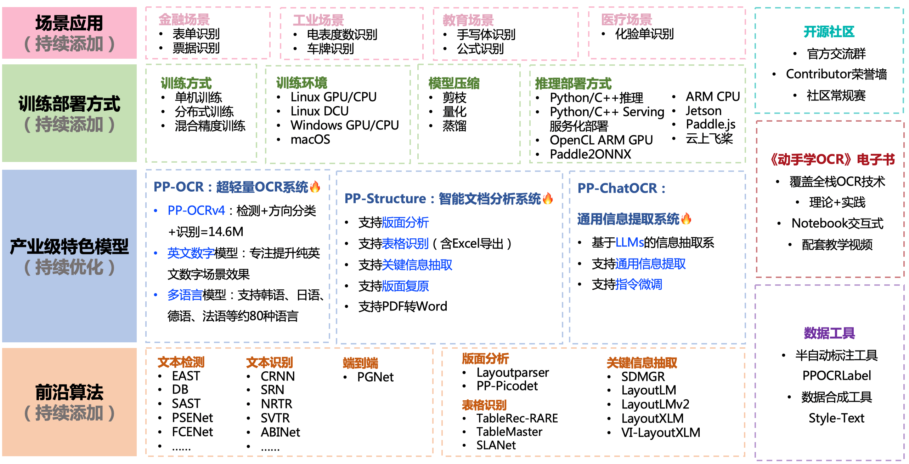

[English](README_en.md) | 简体中文

 

    
    
    
    
    
    
    

## 简介

PaddleOCR 旨在打造一套丰富、领先、且实用的 OCR 工具库，助力开发者训练出更好的模型，并应用落地。

    

## 🚀 社区

PaddleOCR 由 [PMC](https://github.com/PaddlePaddle/PaddleOCR/issues/12122) 监督。Issues 和 PRs 将在尽力的基础上进行审查。欲了解 PaddlePaddle 社区的完整概况，请访问 [community](https://github.com/PaddlePaddle/community)。

⚠️注意：[Issues](https://github.com/PaddlePaddle/PaddleOCR/issues)模块仅用来报告程序🐞Bug，其余提问请移步[Discussions](https://github.com/PaddlePaddle/PaddleOCR/discussions)模块提问。如所提Issue不是Bug，会被移到Discussions模块，敬请谅解。

## 📣 近期更新([more](https://paddlepaddle.github.io/PaddleOCR/update.html))

- **🔥2024.9.30 发布PaddleOCR release/2.9**:
  
  * 发布文档图像智能分析[PP-ChatOCRv3](/docs/paddlex/pipeline_usage/document_scene_information_extraction.md)
  * 发布PaddleOCR 训练推理[全流程低代码开发方案](/docs/paddlex/quick_start.md)
    * 🎨 模型丰富一键调用：将**通用OCR、通用表格识别和文档场景信息抽取**的XXX模型整合为3条模型产线，通过极简的**Python API一键调用**，快速体验模型效果。同时覆盖目标检测、语义分割、时序预测等多个热门AI领域**20+单功能模块**，方便开发者进行模型组合使用。
    * 🚀提高效率降低门槛：实现基于图形界面和统一命令的模型**全流程开发**，支持**高性能部署、服务化部署和端侧部署**等多种部署方式，同时支持英伟达GPU、昆仑芯、昇腾、寒武纪和海光等**多种主流硬件的无缝切换**。
  * 新增4个高精度[版面分析模型](/docs/paddlex/module_usage/layout_detection.md)
  * 新增高精度表格结构识别模型[SLANet_Plus](/docs/paddlex/module_usage/table_structure_recognition.md)
  * 新增版面矫正预测模型[UVDoc](/docs/paddlex/module_usage/image_warping.md)
  * 新增公式识别模型[LatexOCR](/docs/paddlex/module_usage/formula_recognition.md)
  
- **🔥2024.7 添加 PaddleOCR 算法模型挑战赛冠军方案**：
    - 赛题一：OCR 端到端识别任务冠军方案——[场景文本识别算法-SVTRv2](https://paddlepaddle.github.io/PaddleOCR/algorithm/text_recognition/algorithm_rec_svtrv2.html)；
    - 赛题二：通用表格识别任务冠军方案——[表格识别算法-SLANet-LCNetV2](https://paddlepaddle.github.io/PaddleOCR/algorithm/table_recognition/algorithm_table_slanet.html)。

- **💥2024.6.27 飞桨低代码开发工具 [PaddleX 3.0](https://github.com/paddlepaddle/paddlex) 重磅更新,低门槛轻松玩转OCR 模型开发！**
    - 🎨 **模型丰富一键调用**：将**文本检测、表格识别、文档场景信息抽取**等OCR领域关键任务整合为3条模型产线，通过极简的Python API**一键调用**，快速体验模型效果。同时覆盖目标检测、语义分割、时序预测等多个热门AI领域的**10条模型产线**和**20+单功能模块**，方便开发者进行模型组合使用。
    - 🚀 **提高效率降低门槛**：实现基于图形界面和统一命令的模型**全流程开发**，打造大小模型结合、大模型半监督学习和多模型融合的8条特色模型产线，大幅度降低迭代模型的成本。
    - 🌐 **多种场景灵活部署**：支持**高性能部署**、**服务化部署**和**端侧部署**等多种部署方式，确保不同应用场景下模型的高效运行和快速响应。
    - 🔧 **主流硬件高效支持**：支持英伟达 GPU、昆仑芯、昇腾和寒武纪等**多种主流硬件**的无缝切换，确保高效运行。

## 📚文档

完整文档请移步：[docs](https://AmberC0209.github.io/PaddleOCR/)

## 🌟 特性

支持多种 OCR 相关前沿算法，在此基础上打造产业级特色模型[PP-OCR](https://paddlepaddle.github.io/PaddleOCR/ppocr/overview.html)、[PP-Structure](https://paddlepaddle.github.io/PaddleOCR/ppstructure/overview.html)和[PP-ChatOCRv2](https://aistudio.baidu.com/community/app/70303)，并打通数据生产、模型训练、压缩、预测部署全流程。

    

## ⚡ [快速开始](https://paddlepaddle.github.io/PaddleOCR/quick_start.html)

## 📚《动手学 OCR》电子书

- [《动手学 OCR》电子书](https://paddlepaddle.github.io/PaddleOCR/ppocr/blog/ocr_book.html)

## 🎖 贡献者

## ⭐️ Star

## 许可证书

本项目的发布受 [Apache License Version 2.0](./LICENSE) 许可认证。
