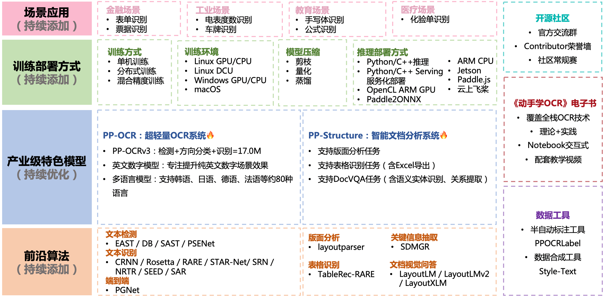
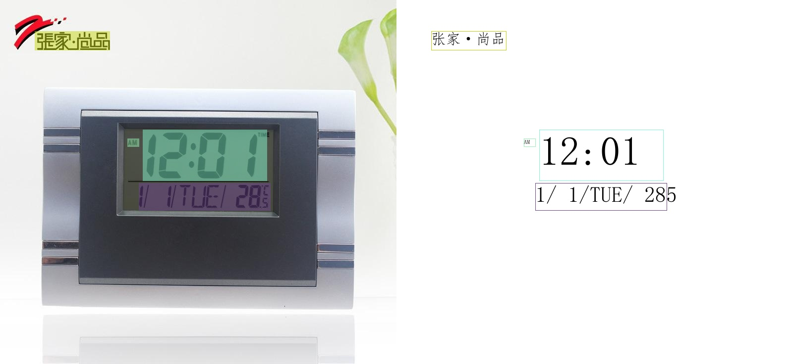
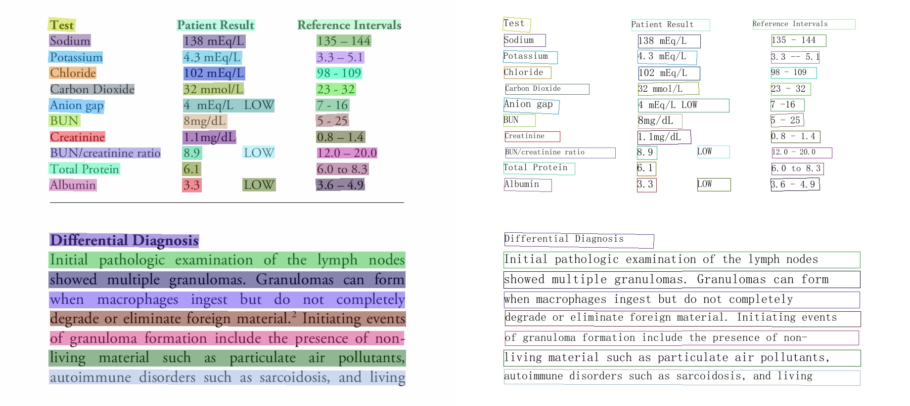
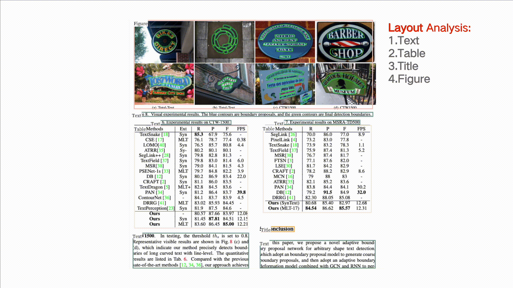
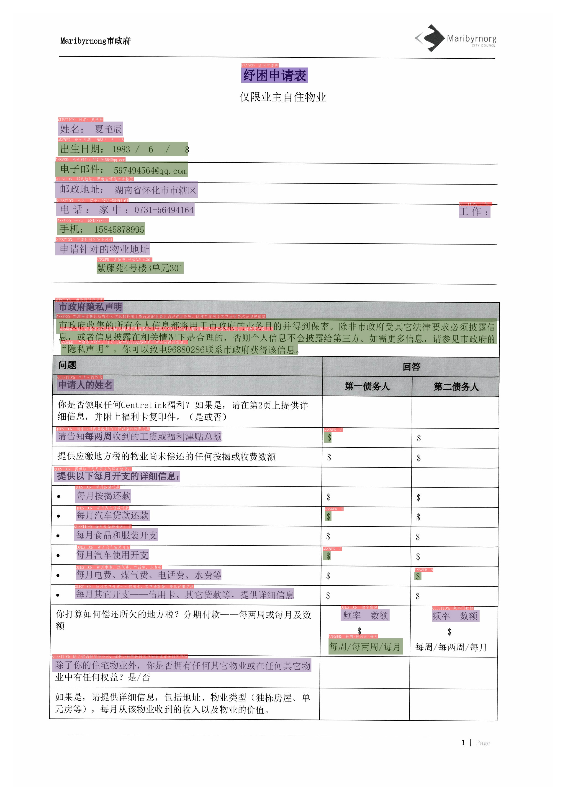

[English](README.md) | 简体中文

 

    
    
    
    
    
    
    

## 简介

PaddleOCR旨在打造一套丰富、领先、且实用的OCR工具库，助力开发者训练出更好的模型，并应用落地。

    

    

## 近期更新

- 2022.5.9 发布PaddleOCR v2.5。发布内容包括：
    - [PP-OCRv3](./doc/doc_ch/ppocr_introduction.md#pp-ocrv3)，速度可比情况下，中文场景效果相比于PP-OCRv2再提升5%，英文场景提升11%，80语种多语言模型平均识别准确率提升5%以上；
    - 半自动标注工具[PPOCRLabelv2](./PPOCRLabel)：新增表格文字图像、图像关键信息抽取任务和不规则文字图像的标注功能；
    - OCR产业落地工具集：打通22种训练部署软硬件环境与方式，覆盖企业90%的训练部署环境需求
    - 交互式OCR开源电子书[《动手学OCR》](./doc/doc_ch/ocr_book.md)，覆盖OCR全栈技术的前沿理论与代码实践，并配套教学视频。
- 2021.12.21 发布PaddleOCR v2.4。OCR算法新增1种文本检测算法（PSENet），3种文本识别算法（NRTR、SEED、SAR）；文档结构化算法新增1种关键信息提取算法（SDMGR，[文档](./ppstructure/docs/kie.md)），3种DocVQA算法（LayoutLM、LayoutLMv2，LayoutXLM，[文档](./ppstructure/vqa)）。
- 2021.9.7 发布PaddleOCR v2.3与[PP-OCRv2](./doc/doc_ch/ppocr_introduction.md#pp-ocrv2)，CPU推理速度相比于PP-OCR server提升220%；效果相比于PP-OCR mobile 提升7%。
- 2021.8.3 发布PaddleOCR v2.2，新增文档结构分析[PP-Structure](./ppstructure/README_ch.md)工具包，支持版面分析与表格识别（含Excel导出）。

> [更多](./doc/doc_ch/update.md)

## 特性

支持多种OCR相关前沿算法，在此基础上打造产业级特色模型[PP-OCR](./doc/doc_ch/ppocr_introduction.md)和[PP-Structure](./ppstructure/README_ch.md)，并打通数据生产、模型训练、压缩、预测部署全流程。

> 上述内容的使用方法建议从文档教程中的快速开始体验

## 快速开始

- 在线网站体验：超轻量PP-OCR mobile模型体验地址：https://www.paddlepaddle.org.cn/hub/scene/ocr
- 移动端demo体验：[安装包DEMO下载地址](https://ai.baidu.com/easyedge/app/openSource?from=paddlelite)(基于EasyEdge和Paddle-Lite, 支持iOS和Android系统)
- 一行命令快速使用：[快速开始（中英文/多语言/文档分析）](./doc/doc_ch/quickstart.md)

## 《动手学OCR》电子书
- [《动手学OCR》电子书📚](./doc/doc_ch/ocr_book.md)

## 开源社区

- **加入社区**👬：微信扫描下方二维码加入官方交流群，与各行各业开发者充分交流，期待您的加入。
- **社区贡献**🏅️：[社区贡献](./doc/doc_ch/thirdparty.md)文档中包含了社区用户**使用PaddleOCR开发的各种工具、应用**以及**为PaddleOCR贡献的功能、优化的文档与代码**等，是官方为社区开发者打造的荣誉墙，也是帮助优质项目宣传的广播站。
- **社区常规赛**🎁：社区常规赛是面向OCR开发者的积分赛事，覆盖文档、代码、模型和应用四大类型，以季度为单位评选并发放奖励，赛题详情与报名方法可参考[链接](https://github.com/PaddlePaddle/PaddleOCR/issues/4982)。

## PP-OCR系列模型列表（更新中）

| 模型简介                              | 模型名称                | 推荐场景        | 检测模型                                                     | 方向分类器                                                   | 识别模型                                                     |
| ------------------------------------- | ----------------------- | --------------- | ------------------------------------------------------------ | ------------------------------------------------------------ | ------------------------------------------------------------ |
| 中英文超轻量PP-OCRv3模型（16.2M）     | ch_PP-OCRv3_xx          | 移动端&服务器端 | [推理模型](https://paddleocr.bj.bcebos.com/PP-OCRv3/chinese/ch_PP-OCRv3_det_infer.tar) / [训练模型](https://paddleocr.bj.bcebos.com/PP-OCRv3/chinese/ch_PP-OCRv3_det_distill_train.tar) | [推理模型](https://paddleocr.bj.bcebos.com/dygraph_v2.0/ch/ch_ppocr_mobile_v2.0_cls_infer.tar) / [训练模型](https://paddleocr.bj.bcebos.com/dygraph_v2.0/ch/ch_ppocr_mobile_v2.0_cls_train.tar) | [推理模型](https://paddleocr.bj.bcebos.com/PP-OCRv3/chinese/ch_PP-OCRv3_rec_infer.tar) / [训练模型](https://paddleocr.bj.bcebos.com/PP-OCRv3/chinese/ch_PP-OCRv3_rec_train.tar) |
| 英文超轻量PP-OCRv3模型（13.4M）     | en_PP-OCRv3_xx          | 移动端&服务器端 | [推理模型](https://paddleocr.bj.bcebos.com/PP-OCRv3/english/en_PP-OCRv3_det_infer.tar) / [训练模型](https://paddleocr.bj.bcebos.com/PP-OCRv3/english/en_PP-OCRv3_det_distill_train.tar) | [推理模型](https://paddleocr.bj.bcebos.com/dygraph_v2.0/ch/ch_ppocr_mobile_v2.0_cls_infer.tar) / [训练模型](https://paddleocr.bj.bcebos.com/dygraph_v2.0/ch/ch_ppocr_mobile_v2.0_cls_train.tar) | [推理模型](https://paddleocr.bj.bcebos.com/PP-OCRv3/english/en_PP-OCRv3_rec_infer.tar) / [训练模型](https://paddleocr.bj.bcebos.com/PP-OCRv3/english/en_PP-OCRv3_rec_train.tar) |
| 中英文超轻量PP-OCRv2模型（13.0M）     | ch_PP-OCRv2_xx          | 移动端&服务器端 | [推理模型](https://paddleocr.bj.bcebos.com/PP-OCRv2/chinese/ch_PP-OCRv2_det_infer.tar) / [训练模型](https://paddleocr.bj.bcebos.com/PP-OCRv2/chinese/ch_PP-OCRv2_det_distill_train.tar) | [推理模型](https://paddleocr.bj.bcebos.com/dygraph_v2.0/ch/ch_ppocr_mobile_v2.0_cls_infer.tar) / [预训练模型](https://paddleocr.bj.bcebos.com/dygraph_v2.0/ch/ch_ppocr_mobile_v2.0_cls_train.tar) | [推理模型](https://paddleocr.bj.bcebos.com/PP-OCRv2/chinese/ch_PP-OCRv2_rec_infer.tar) / [训练模型](https://paddleocr.bj.bcebos.com/PP-OCRv2/chinese/ch_PP-OCRv2_rec_train.tar) |
| 中英文超轻量PP-OCR mobile模型（9.4M） | ch_ppocr_mobile_v2.0_xx | 移动端&服务器端 | [推理模型](https://paddleocr.bj.bcebos.com/dygraph_v2.0/ch/ch_ppocr_mobile_v2.0_det_infer.tar) / [预训练模型](https://paddleocr.bj.bcebos.com/dygraph_v2.0/ch/ch_ppocr_mobile_v2.0_det_train.tar) | [推理模型](https://paddleocr.bj.bcebos.com/dygraph_v2.0/ch/ch_ppocr_mobile_v2.0_cls_infer.tar) / [预训练模型](https://paddleocr.bj.bcebos.com/dygraph_v2.0/ch/ch_ppocr_mobile_v2.0_cls_train.tar) | [推理模型](https://paddleocr.bj.bcebos.com/dygraph_v2.0/ch/ch_ppocr_mobile_v2.0_rec_infer.tar) / [预训练模型](https://paddleocr.bj.bcebos.com/dygraph_v2.0/ch/ch_ppocr_mobile_v2.0_rec_pre.tar) |
| 中英文通用PP-OCR server模型（143.4M） | ch_ppocr_server_v2.0_xx | 服务器端        | [推理模型](https://paddleocr.bj.bcebos.com/dygraph_v2.0/ch/ch_ppocr_server_v2.0_det_infer.tar) / [预训练模型](https://paddleocr.bj.bcebos.com/dygraph_v2.0/ch/ch_ppocr_server_v2.0_det_train.tar) | [推理模型](https://paddleocr.bj.bcebos.com/dygraph_v2.0/ch/ch_ppocr_mobile_v2.0_cls_infer.tar) / [预训练模型](https://paddleocr.bj.bcebos.com/dygraph_v2.0/ch/ch_ppocr_mobile_v2.0_cls_train.tar) | [推理模型](https://paddleocr.bj.bcebos.com/dygraph_v2.0/ch/ch_ppocr_server_v2.0_rec_infer.tar) / [预训练模型](https://paddleocr.bj.bcebos.com/dygraph_v2.0/ch/ch_ppocr_server_v2.0_rec_pre.tar) |

更多模型下载（包括多语言），可以参考[PP-OCR 系列模型下载](./doc/doc_ch/models_list.md)，文档分析相关模型参考[PP-Structure 系列模型下载](./ppstructure/docs/models_list.md)

## 文档教程

- [运行环境准备](./doc/doc_ch/environment.md)
- [PP-OCR文本检测识别🔥](./doc/doc_ch/ppocr_introduction.md)
    - [快速开始](./doc/doc_ch/quickstart.md)
    - [模型库](./doc/doc_ch/models_list.md)
    - [模型训练](./doc/doc_ch/training.md)
        - [文本检测](./doc/doc_ch/detection.md)
        - [文本识别](./doc/doc_ch/recognition.md)
        - [文本方向分类器](./doc/doc_ch/angle_class.md)
    - 模型压缩
        - [模型量化](./deploy/slim/quantization/README.md)
        - [模型裁剪](./deploy/slim/prune/README.md)
        - [知识蒸馏](./doc/doc_ch/knowledge_distillation.md)
    - [推理部署](./deploy/README_ch.md)
        - [基于Python预测引擎推理](./doc/doc_ch/inference_ppocr.md)
        - [基于C++预测引擎推理](./deploy/cpp_infer/readme.md)
        - [服务化部署](./deploy/pdserving/README_CN.md)
        - [端侧部署](./deploy/lite/readme.md)
        - [Paddle2ONNX模型转化与预测](./deploy/paddle2onnx/readme.md)
        - [Benchmark](./doc/doc_ch/benchmark.md)
- [PP-Structure文档分析🔥](./ppstructure/README_ch.md)
    - [快速开始](./ppstructure/docs/quickstart.md)
    - [模型库](./ppstructure/docs/models_list.md)
    - [模型训练](./doc/doc_ch/training.md)
        - [版面分析](./ppstructure/layout/README_ch.md)
        - [表格识别](./ppstructure/table/README_ch.md)
        - [关键信息提取](./ppstructure/docs/kie.md)
        - [DocVQA](./ppstructure/vqa/README_ch.md)
    - [推理部署](./deploy/README_ch.md)
        - [基于Python预测引擎推理](./ppstructure/docs/inference.md)
        - [基于C++预测引擎推理]()
        - [服务化部署](./deploy/pdserving/README_CN.md)
- [前沿算法与模型🚀](./doc/doc_ch/algorithm.md)
    - [文本检测算法](./doc/doc_ch/algorithm_overview.md#11-%E6%96%87%E6%9C%AC%E6%A3%80%E6%B5%8B%E7%AE%97%E6%B3%95)
    - [文本识别算法](./doc/doc_ch/algorithm_overview.md#12-%E6%96%87%E6%9C%AC%E8%AF%86%E5%88%AB%E7%AE%97%E6%B3%95)
    - [端到端算法](./doc/doc_ch/algorithm_overview.md#2-%E6%96%87%E6%9C%AC%E8%AF%86%E5%88%AB%E7%AE%97%E6%B3%95)
    - [使用PaddleOCR架构添加新算法](./doc/doc_ch/add_new_algorithm.md)
- [场景应用](./doc/doc_ch/application.md)
    - [金融场景（表单/票据等）]()
    - [工业场景（电表度数/车牌等）]()
    - [教育场景（手写体/公式等）]()
    - [医疗场景（化验单等）]()
- 数据标注与合成
    - [半自动标注工具PPOCRLabel](./PPOCRLabel/README_ch.md)
    - [数据合成工具Style-Text](./StyleText/README_ch.md)
    - [其它数据标注工具](./doc/doc_ch/data_annotation.md)
    - [其它数据合成工具](./doc/doc_ch/data_synthesis.md)
- 数据集
    - [通用中英文OCR数据集](doc/doc_ch/dataset/datasets.md)
    - [手写中文OCR数据集](doc/doc_ch/dataset/handwritten_datasets.md)
    - [垂类多语言OCR数据集](doc/doc_ch/dataset/vertical_and_multilingual_datasets.md)
    - [版面分析数据集](doc/doc_ch/dataset/layout_datasets.md)
    - [表格识别数据集](doc/doc_ch/dataset/table_datasets.md)
    - [DocVQA数据集](doc/doc_ch/dataset/docvqa_datasets.md)
- [代码组织结构](./doc/doc_ch/tree.md)
- [效果展示](#效果展示)
- [《动手学OCR》电子书📚](./doc/doc_ch/ocr_book.md)
- [开源社区](#开源社区)
- FAQ
    - [通用问题](./doc/doc_ch/FAQ.md)
    - [PaddleOCR实战问题](./doc/doc_ch/FAQ.md)
- [参考文献](./doc/doc_ch/reference.md)
- [许可证书](#许可证书)

## 效果展示 [more](./doc/doc_ch/visualization.md)

PP-OCRv3 中文模型

    
    
    

PP-OCRv3 英文模型

    
    

PP-OCRv3 多语言模型

    
    

PP-Structure 文档分析

- 版面分析+表格识别  

    

- SER（语义实体识别）  

    

- RE（关系提取）

    

## 许可证书
本项目的发布受<a href="https://github.com/PaddlePaddle/PaddleOCR/blob/master/LICENSE">Apache 2.0 license</a>许可认证。
