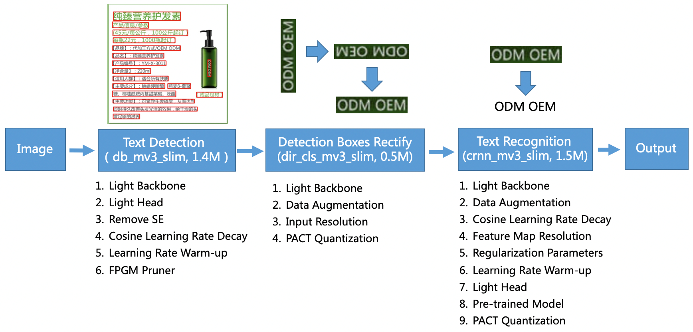

[English](README.md) | 简体中文

## 简介
PaddleOCR旨在打造一套丰富、领先、且实用的OCR工具库，助力使用者训练出更好的模型，并应用落地。

**近期更新**
- 2020.12.07 [FAQ](./doc/doc_ch/FAQ.md)新增5个高频问题，总数124个，并且计划以后每周一都会更新，欢迎大家持续关注。
- 2020.11.25 更新半自动标注工具[PPOCRLabel](./PPOCRLabel/README.md)，辅助开发者高效完成标注任务，输出格式与PP-OCR训练任务完美衔接。
- 2020.9.22 更新PP-OCR技术文章，https://arxiv.org/abs/2009.09941
- 2020.9.19 更新超轻量压缩ppocr_mobile_slim系列模型，整体模型3.5M(详见[PP-OCR Pipeline](#PP-OCR))，适合在移动端部署使用。[模型下载](#模型下载)
- 2020.9.17 更新超轻量ppocr_mobile系列和通用ppocr_server系列中英文ocr模型，媲美商业效果。[模型下载](#模型下载)
- 2020.9.17 更新[英文识别模型](./doc/doc_ch/models_list.md#英文识别模型)和[多语言识别模型](doc/doc_ch/models_list.md#多语言识别模型)，已支持`德语、法语、日语、韩语`，更多语种识别模型将持续更新。
- 2020.8.24 支持通过whl包安装使用PaddleOCR，具体参考[Paddleocr Package使用说明](./doc/doc_ch/whl.md)
- 2020.8.21 更新8月18日B站直播课回放和PPT，课节2，易学易用的OCR工具大礼包，[获取地址](https://aistudio.baidu.com/aistudio/education/group/info/1519)
- [More](./doc/doc_ch/update.md)

## 特性

- PPOCR系列高质量预训练模型，准确的识别效果
    - 超轻量ppocr_mobile移动端系列：检测（2.6M）+方向分类器（0.9M）+ 识别（4.6M）= 8.1M
    - 通用ppocr_server系列：检测（47.2M）+方向分类器（0.9M）+ 识别（107M）= 155.1M
    - 超轻量压缩ppocr_mobile_slim系列：检测（1.4M）+方向分类器（0.5M）+ 识别（1.6M）= 3.5M  
- 支持中英文数字组合识别、竖排文本识别、长文本识别
- 支持多语言识别：韩语、日语、德语、法语
- 支持用户自定义训练，提供丰富的预测推理部署方案
- 支持PIP快速安装使用
- 可运行于Linux、Windows、MacOS等多种系统

## 效果展示

    
    

上图是通用ppocr_server模型效果展示，更多效果图请见[效果展示页面](./doc/doc_ch/visualization.md)。

## 快速体验
- PC端：超轻量级中文OCR在线体验地址：https://www.paddlepaddle.org.cn/hub/scene/ocr

- 移动端：[安装包DEMO下载地址](https://ai.baidu.com/easyedge/app/openSource?from=paddlelite)(基于EasyEdge和Paddle-Lite, 支持iOS和Android系统)，Android手机也可以直接扫描下面二维码安装体验。

- 代码体验：从[快速安装](./doc/doc_ch/installation.md) 开始

## PP-OCR 2.0系列模型列表（更新中）

| 模型简介     | 模型名称     |推荐场景          | 检测模型 | 方向分类器 | 识别模型 |
| ------------ | --------------- | ----------------|---- | ---------- | -------- |
| 中英文超轻量OCR模型（8.1M） | ch_ppocr_mobile_v2.0_xx |移动端&服务器端|[推理模型](https://paddleocr.bj.bcebos.com/dygraph_v2.0/ch/ch_ppocr_mobile_v2.0_det_infer.tar) / [预训练模型](https://paddleocr.bj.bcebos.com/dygraph_v2.0/ch/ch_ppocr_mobile_v2.0_det_train.tar)|[推理模型](https://paddleocr.bj.bcebos.com/dygraph_v2.0/ch/ch_ppocr_mobile_v2.0_cls_infer.tar) / [预训练模型](https://paddleocr.bj.bcebos.com/dygraph_v2.0/ch/ch_ppocr_mobile_v2.0_cls_train.tar) |[推理模型](https://paddleocr.bj.bcebos.com/dygraph_v2.0/ch/ch_ppocr_mobile_v2.0_rec_infer.tar) / [预训练模型](https://paddleocr.bj.bcebos.com/dygraph_v2.0/ch/ch_ppocr_mobile_v2.0_rec_pre.tar)      |
| 中英文通用OCR模型（143M）   |ch_ppocr_server_v2.0_xx|服务器端 |[推理模型](https://paddleocr.bj.bcebos.com/dygraph_v2.0/ch/ch_ppocr_server_v2.0_det_infer.tar) / [预训练模型](https://paddleocr.bj.bcebos.com/dygraph_v2.0/ch/ch_ppocr_server_v2.0_det_train.tar)    |[推理模型](https://paddleocr.bj.bcebos.com/dygraph_v2.0/ch/ch_ppocr_mobile_v2.0_cls_infer.tar) / [预训练模型](https://paddleocr.bj.bcebos.com/dygraph_v2.0/ch/ch_ppocr_mobile_v2.0_cls_train.tar)    |[推理模型](https://paddleocr.bj.bcebos.com/dygraph_v2.0/ch/ch_ppocr_server_v2.0_rec_infer.tar) / [预训练模型](https://paddleocr.bj.bcebos.com/dygraph_v2.0/ch/ch_ppocr_server_v2.0_rec_pre.tar)  |  

更多模型下载（包括多语言），可以参考[PP-OCR v2.0 系列模型下载](./doc/doc_ch/models_list.md)

## 文档教程
- [快速安装](./doc/doc_ch/installation.md)
- [中文OCR模型快速使用](./doc/doc_ch/quickstart.md)
- [代码组织结构](./doc/doc_ch/tree.md)
- 算法介绍
    - [文本检测](./doc/doc_ch/algorithm_overview.md)
    - [文本识别](./doc/doc_ch/algorithm_overview.md)
    - [PP-OCR Pipline](#PP-OCR)
- 模型训练/评估
    - [文本检测](./doc/doc_ch/detection.md)
    - [文本识别](./doc/doc_ch/recognition.md)
    - [方向分类器](./doc/doc_ch/angle_class.md)
    - [yml参数配置文件介绍](./doc/doc_ch/config.md)
- 预测部署
    - [基于pip安装whl包快速推理](./doc/doc_ch/whl.md)
    - [基于Python脚本预测引擎推理](./doc/doc_ch/inference.md)
    - [基于C++预测引擎推理](./deploy/cpp_infer/readme.md)
    - [服务化部署](./deploy/hubserving/readme.md)
    - [端侧部署](https://github.com/PaddlePaddle/PaddleOCR/blob/develop/deploy/lite/readme.md)
    - [模型量化](https://github.com/PaddlePaddle/PaddleOCR/blob/develop/deploy/slim/quantization/README.md)
    - [模型裁剪](https://github.com/PaddlePaddle/PaddleOCR/blob/develop/deploy/slim/prune/README.md)
    - [Benchmark](./doc/doc_ch/benchmark.md)
- 数据集
    - [通用中英文OCR数据集](./doc/doc_ch/datasets.md)
    - [手写中文OCR数据集](./doc/doc_ch/handwritten_datasets.md)
    - [垂类多语言OCR数据集](./doc/doc_ch/vertical_and_multilingual_datasets.md)
    - [常用数据标注工具](./doc/doc_ch/data_annotation.md)
    - [常用数据合成工具](./doc/doc_ch/data_synthesis.md)
- [效果展示](#效果展示)
- FAQ
    - [【精选】OCR精选10个问题](./doc/doc_ch/FAQ.md)
    - [【理论篇】OCR通用21个问题](./doc/doc_ch/FAQ.md)
    - [【实战篇】PaddleOCR实战53个问题](./doc/doc_ch/FAQ.md)
- [技术交流群](#欢迎加入PaddleOCR技术交流群)
- [参考文献](./doc/doc_ch/reference.md)
- [许可证书](#许可证书)
- [贡献代码](#贡献代码)

***注意：动态图端侧部署仍在开发中，目前仅支持动态图训练、python端预测，C++预测，
如果您有需要移动端部署案例或者量化裁剪，请切换到静态图分支；***

## PP-OCR Pipline

    

PP-OCR是一个实用的超轻量OCR系统。主要由DB文本检测、检测框矫正和CRNN文本识别三部分组成。该系统从骨干网络选择和调整、预测头部的设计、数据增强、学习率变换策略、正则化参数选择、预训练模型使用以及模型自动裁剪量化8个方面，采用19个有效策略，对各个模块的模型进行效果调优和瘦身，最终得到整体大小为3.5M的超轻量中英文OCR和2.8M的英文数字OCR。更多细节请参考PP-OCR技术方案 https://arxiv.org/abs/2009.09941 。其中FPGM裁剪器和PACT量化的实现可以参考[PaddleSlim](https://github.com/PaddlePaddle/PaddleSlim)。

## 效果展示 [more](./doc/doc_ch/visualization.md)
- 中文模型

    
    
    
    

- 英文模型

    

- 其他语言模型

    
    

## 欢迎加入PaddleOCR技术交流群
请扫描下面二维码，完成问卷填写，获取加群二维码和OCR方向的炼丹秘籍

## 许可证书
本项目的发布受<a href="https://github.com/PaddlePaddle/PaddleOCR/blob/master/LICENSE">Apache 2.0 license</a>许可认证。

## 贡献代码
我们非常欢迎你为PaddleOCR贡献代码，也十分感谢你的反馈。

- 非常感谢 [Khanh Tran](https://github.com/xxxpsyduck) 和 [Karl Horky](https://github.com/karlhorky) 贡献修改英文文档
- 非常感谢 [zhangxin](https://github.com/ZhangXinNan)([Blog](https://blog.csdn.net/sdlypyzq)) 贡献新的可视化方式、添加.gitgnore、处理手动设置PYTHONPATH环境变量的问题
- 非常感谢 [lyl120117](https://github.com/lyl120117) 贡献打印网络结构的代码
- 非常感谢 [xiangyubo](https://github.com/xiangyubo) 贡献手写中文OCR数据集
- 非常感谢 [authorfu](https://github.com/authorfu) 贡献Android和[xiadeye](https://github.com/xiadeye) 贡献IOS的demo代码
- 非常感谢 [BeyondYourself](https://github.com/BeyondYourself) 给PaddleOCR提了很多非常棒的建议，并简化了PaddleOCR的部分代码风格。
- 非常感谢 [tangmq](https://gitee.com/tangmq) 给PaddleOCR增加Docker化部署服务，支持快速发布可调用的Restful API服务。
- 非常感谢 [lijinhan](https://github.com/lijinhan) 给PaddleOCR增加java SpringBoot 调用OCR Hubserving接口完成对OCR服务化部署的使用。
- 非常感谢 [Mejans](https://github.com/Mejans) 给PaddleOCR增加新语言奥克西坦语Occitan的字典和语料。
- 非常感谢 [Evezerest](https://github.com/Evezerest)， [ninetailskim](https://github.com/ninetailskim)， [edencfc](https://github.com/edencfc)， [BeyondYourself](https://github.com/BeyondYourself)， [1084667371](https://github.com/1084667371) 贡献了PPOCRLabel的完整代码。
