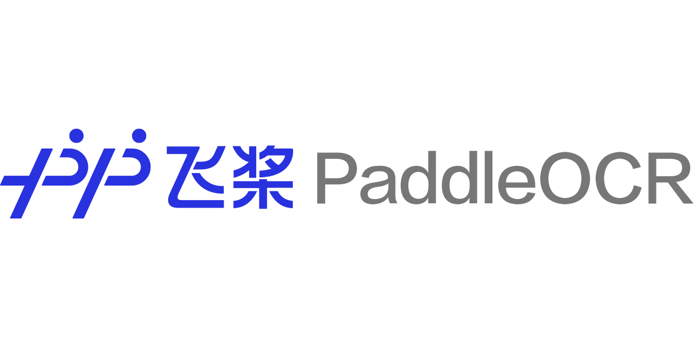

[English](README.md) | 简体中文

 

------------------------------------------------------------------------------------------

    
    
    
    
    
    
    
    

## 简介

PaddleOCR旨在打造一套丰富、领先、且实用的OCR工具库，助力使用者训练出更好的模型，并应用落地。

**近期更新**

- PaddleOCR研发团队对最新发版内容技术深入解读，9月8日晚上20:15，[课程回放](https://aistudio.baidu.com/aistudio/education/group/info/6758)。
- 2021.9.7 发布PaddleOCR v2.3，发布[PP-OCRv2](#PP-OCRv2)，CPU推理速度相比于PP-OCR server提升220%；效果相比于PP-OCR mobile 提升7%。
- 2021.8.3 发布PaddleOCR v2.2，新增文档结构分析[PP-Structure](https://github.com/PaddlePaddle/PaddleOCR/blob/release/2.2/ppstructure/README_ch.md)工具包，支持版面分析与表格识别（含Excel导出）。
- 2021.6.29 [FAQ](https://github.com/PaddlePaddle/PaddleOCR/blob/release/2.2/doc/doc_ch/FAQ.md)新增5个高频问题，总数248个，每周一都会更新，欢迎大家持续关注。
- 2021.4.8 release 2.1版本，新增AAAI 2021论文[端到端识别算法PGNet](https://github.com/PaddlePaddle/PaddleOCR/blob/release/2.2/doc/doc_ch/pgnet.md)开源，[多语言模型](https://github.com/PaddlePaddle/PaddleOCR/blob/release/2.2/doc/doc_ch/multi_languages.md)支持种类增加到80+。
- [More](https://github.com/PaddlePaddle/PaddleOCR/blob/release/2.2/doc/doc_ch/update.md)

## 特性

- PP-OCR系列高质量预训练模型，准确的识别效果
    - 超轻量PP-OCRv2系列：检测（3.1M）+ 方向分类器（1.4M）+ 识别（8.5M）= 13.0M
    - 超轻量PP-OCR mobile移动端系列：检测（3.0M）+方向分类器（1.4M）+ 识别（5.0M）= 9.4M
    - 通用PPOCR server系列：检测（47.1M）+方向分类器（1.4M）+ 识别（94.9M）= 143.4M
    - 支持中英文数字组合识别、竖排文本识别、长文本识别
    - 支持多语言识别：韩语、日语、德语、法语
- 丰富易用的OCR相关工具组件
    - 半自动数据标注工具PPOCRLabel：支持快速高效的数据标注
    - 数据合成工具Style-Text：批量合成大量与目标场景类似的图像
    - 文档分析能力PP-Structure：版面分析与表格识别
- 支持用户自定义训练，提供丰富的预测推理部署方案
- 支持PIP快速安装使用
- 可运行于Linux、Windows、MacOS等多种系统

## 效果展示

    
    

上图是通用PP-OCR server模型效果展示，更多效果图请见[效果展示页面](./doc/doc_ch/visualization.md)。

## 欢迎加入PaddleOCR技术交流群
- 微信扫描二维码加入官方交流群，获得更高效的问题答疑，与各行各业开发者充分交流，期待您的加入。

## 快速体验
- PC端：超轻量级中文OCR在线体验地址：https://www.paddlepaddle.org.cn/hub/scene/ocr

- 移动端：[安装包DEMO下载地址](https://ai.baidu.com/easyedge/app/openSource?from=paddlelite)(基于EasyEdge和Paddle-Lite, 支持iOS和Android系统)，Android手机也可以直接扫描下面二维码安装体验。

- 代码体验：从[快速安装](./doc/doc_ch/quickstart.md) 开始

## PP-OCR系列模型列表（更新中）

| 模型简介     | 模型名称     |推荐场景          | 检测模型 | 方向分类器 | 识别模型 |
| ------------ | --------------- | ----------------|---- | ---------- | -------- |
| 中英文超轻量PP-OCRv2模型（13.0M） |  ch_PP-OCRv2_xx |移动端&服务器端|[推理模型](https://paddleocr.bj.bcebos.com/PP-OCRv2/chinese/ch_PP-OCRv2_det_infer.tar) / [训练模型](https://paddleocr.bj.bcebos.com/PP-OCRv2/chinese/ch_PP-OCRv2_det_distill_train.tar)| [推理模型](https://paddleocr.bj.bcebos.com/dygraph_v2.0/ch/ch_ppocr_mobile_v2.0_cls_infer.tar) / [训练模型](https://paddleocr.bj.bcebos.com/dygraph_v2.0/ch/ch_ppocr_mobile_v2.0_cls_train.tar) |[推理模型](https://paddleocr.bj.bcebos.com/PP-OCRv2/chinese/ch_PP-OCRv2_rec_infer.tar) / [训练模型](https://paddleocr.bj.bcebos.com/PP-OCRv2/chinese/ch_PP-OCRv2_rec_train.tar)|
| 中英文超轻量PP-OCR mobile模型（9.4M） | ch_ppocr_mobile_v2.0_xx |移动端&服务器端|[推理模型](https://paddleocr.bj.bcebos.com/dygraph_v2.0/ch/ch_ppocr_mobile_v2.0_det_infer.tar) / [训练模型](https://paddleocr.bj.bcebos.com/dygraph_v2.0/ch/ch_ppocr_mobile_v2.0_det_train.tar)|[推理模型](https://paddleocr.bj.bcebos.com/dygraph_v2.0/ch/ch_ppocr_mobile_v2.0_cls_infer.tar) / [训练模型](https://paddleocr.bj.bcebos.com/dygraph_v2.0/ch/ch_ppocr_mobile_v2.0_cls_train.tar) |[推理模型](https://paddleocr.bj.bcebos.com/dygraph_v2.0/ch/ch_ppocr_mobile_v2.0_rec_infer.tar) / [训练模型](https://paddleocr.bj.bcebos.com/dygraph_v2.0/ch/ch_ppocr_mobile_v2.0_rec_train.tar)      |
| 中英文通用PP-OCR server模型（143.4M）   |ch_ppocr_server_v2.0_xx|服务器端 |[推理模型](https://paddleocr.bj.bcebos.com/dygraph_v2.0/ch/ch_ppocr_server_v2.0_det_infer.tar) / [训练模型](https://paddleocr.bj.bcebos.com/dygraph_v2.0/ch/ch_ppocr_server_v2.0_det_train.tar)    |[推理模型](https://paddleocr.bj.bcebos.com/dygraph_v2.0/ch/ch_ppocr_mobile_v2.0_cls_infer.tar) / [训练模型](https://paddleocr.bj.bcebos.com/dygraph_v2.0/ch/ch_ppocr_mobile_v2.0_cls_train.tar)    |[推理模型](https://paddleocr.bj.bcebos.com/dygraph_v2.0/ch/ch_ppocr_server_v2.0_rec_infer.tar) / [训练模型](https://paddleocr.bj.bcebos.com/dygraph_v2.0/ch/ch_ppocr_server_v2.0_rec_train.tar)  |

更多模型下载（包括多语言），可以参考[PP-OCR 系列模型下载](./doc/doc_ch/models_list.md)

## 文档教程
- [运行环境准备](./doc/doc_ch/environment.md)
- [快速开始（中英文/多语言/文档分析）](./doc/doc_ch/quickstart.md)
- [PaddleOCR全景图与项目克隆](./doc/doc_ch/paddleOCR_overview.md)
- PP-OCR产业落地：从训练到部署
    - [PP-OCR模型与配置文件](./doc/doc_ch/models_and_config.md)
        - [PP-OCR模型下载](./doc/doc_ch/models_list.md)
        - [PP-OCR模型库快速推理](./doc/doc_ch/inference_ppocr.md)
    - [PP-OCR模型训练](./doc/doc_ch/training.md)
        - [文本检测](./doc/doc_ch/detection.md)
        - [文本识别](./doc/doc_ch/recognition.md)
        - [文本方向分类器](./doc/doc_ch/angle_class.md)
        - [配置文件内容与生成](./doc/doc_ch/config.md)
    - PP-OCR模型压缩
        - [模型蒸馏](./doc/doc_ch/knowledge_distillation.md)
        - [模型量化](./deploy/slim/quantization/README.md)
        - [模型裁剪](./deploy/slim/prune/README.md)
    - PP-OCR模型推理部署
        - [基于C++预测引擎推理](./deploy/cpp_infer/readme.md)
        - [服务化部署](./deploy/pdserving/README_CN.md)
        - [端侧部署](./deploy/lite/readme.md)
        - [Benchmark](./doc/doc_ch/benchmark.md)
- [PP-Structure信息提取](./ppstructure/README_ch.md)
    - [版面分析](./ppstructure/layout/README_ch.md)
    - [表格识别](./ppstructure/table/README_ch.md)
- OCR学术圈
    - [两阶段模型介绍与下载](./doc/doc_ch/algorithm_overview.md)
    - [端到端PGNet算法](./doc/doc_ch/pgnet.md)
    - [基于Python脚本预测引擎推理](./doc/doc_ch/inference.md)
    - [使用PaddleOCR架构添加新算法](./doc/doc_ch/add_new_algorithm.md)
- 数据标注与合成
    - [半自动标注工具PPOCRLabel](./PPOCRLabel/README_ch.md)
    - [数据合成工具Style-Text](./StyleText/README_ch.md)
    - [其它数据标注工具](./doc/doc_ch/data_annotation.md)
    - [其它数据合成工具](./doc/doc_ch/data_synthesis.md)
- 数据集
    - [通用中英文OCR数据集](./doc/doc_ch/datasets.md)
    - [手写中文OCR数据集](./doc/doc_ch/handwritten_datasets.md)
    - [垂类多语言OCR数据集](./doc/doc_ch/vertical_and_multilingual_datasets.md)
- [效果展示](#效果展示)
- FAQ
    - [【精选】OCR精选10个问题](./doc/doc_ch/FAQ.md)
    - [【理论篇】OCR通用50个问题](./doc/doc_ch/FAQ.md)
    - [【实战篇】PaddleOCR实战183个问题](./doc/doc_ch/FAQ.md)
- [技术交流群](#欢迎加入PaddleOCR技术交流群)
- [参考文献](./doc/doc_ch/reference.md)
- [许可证书](#许可证书)
- [贡献代码](#贡献代码)
- [代码组织结构](./doc/doc_ch/tree.md)

## PP-OCRv2 Pipeline

    

[1] PP-OCR是一个实用的超轻量OCR系统。主要由DB文本检测、检测框矫正和CRNN文本识别三部分组成。该系统从骨干网络选择和调整、预测头部的设计、数据增强、学习率变换策略、正则化参数选择、预训练模型使用以及模型自动裁剪量化8个方面，采用19个有效策略，对各个模块的模型进行效果调优和瘦身(如绿框所示)，最终得到整体大小为3.5M的超轻量中英文OCR和2.8M的英文数字OCR。更多细节请参考PP-OCR技术方案 https://arxiv.org/abs/2009.09941

[2] PP-OCRv2在PP-OCR的基础上，进一步在5个方面重点优化，检测模型采用CML协同互学习知识蒸馏策略和CopyPaste数据增广策略；识别模型采用LCNet轻量级骨干网络、UDML 改进知识蒸馏策略和Enhanced CTC loss损失函数改进（如上图红框所示），进一步在推理速度和预测效果上取得明显提升。更多细节请参考PP-OCR技术方案（arxiv链接生成中）。

## 效果展示 [more](./doc/doc_ch/visualization.md)
- 中文模型

    
    

- 英文模型

    

- 其他语言模型

    
    

## 许可证书
本项目的发布受<a href="https://github.com/PaddlePaddle/PaddleOCR/blob/master/LICENSE">Apache 2.0 license</a>许可认证。

## 贡献代码
我们非常欢迎你为PaddleOCR贡献代码，也十分感谢你的反馈。

- 非常感谢 [Khanh Tran](https://github.com/xxxpsyduck) 和 [Karl Horky](https://github.com/karlhorky) 贡献修改英文文档
- 非常感谢 [zhangxin](https://github.com/ZhangXinNan)([Blog](https://blog.csdn.net/sdlypyzq)) 贡献新的可视化方式、添加.gitignore、处理手动设置PYTHONPATH环境变量的问题
- 非常感谢 [lyl120117](https://github.com/lyl120117) 贡献打印网络结构的代码
- 非常感谢 [xiangyubo](https://github.com/xiangyubo) 贡献手写中文OCR数据集
- 非常感谢 [authorfu](https://github.com/authorfu) 贡献Android和[xiadeye](https://github.com/xiadeye) 贡献IOS的demo代码
- 非常感谢 [BeyondYourself](https://github.com/BeyondYourself) 给PaddleOCR提了很多非常棒的建议，并简化了PaddleOCR的部分代码风格。
- 非常感谢 [tangmq](https://gitee.com/tangmq) 给PaddleOCR增加Docker化部署服务，支持快速发布可调用的Restful API服务。
- 非常感谢 [lijinhan](https://github.com/lijinhan) 给PaddleOCR增加java SpringBoot 调用OCR Hubserving接口完成对OCR服务化部署的使用。
- 非常感谢 [Mejans](https://github.com/Mejans) 给PaddleOCR增加新语言奥克西坦语Occitan的字典和语料。
- 非常感谢 [Evezerest](https://github.com/Evezerest)， [ninetailskim](https://github.com/ninetailskim)， [edencfc](https://github.com/edencfc)， [BeyondYourself](https://github.com/BeyondYourself)， [1084667371](https://github.com/1084667371) 贡献了PPOCRLabel的完整代码。
