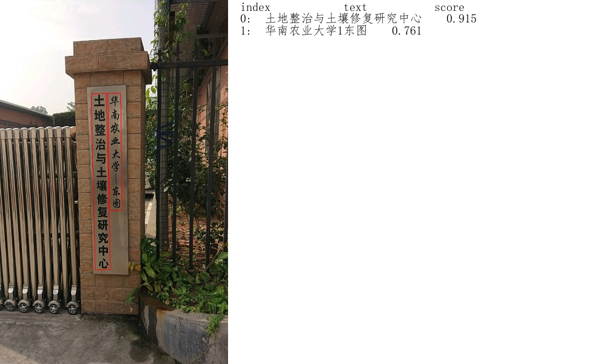
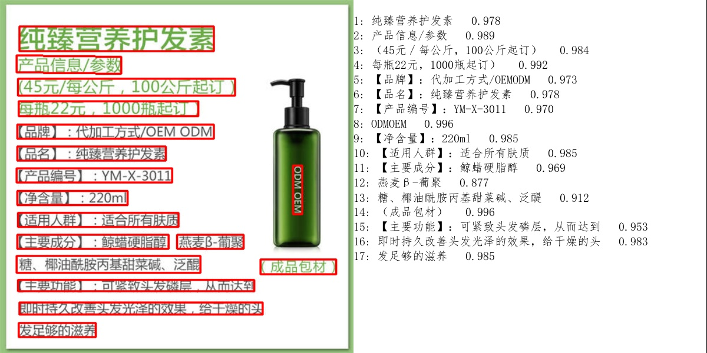
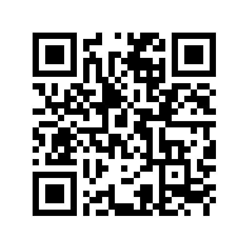

[English](README.md) | 简体中文

## 简介
PaddleOCR旨在打造一套丰富、领先、且实用的OCR工具库，助力使用者训练出更好的模型，并应用落地。

**直播预告：2020年7月21日晚8点B站直播，PaddleOCR开源大礼包全面解读**

直播地址：https://live.bilibili.com/21689802

**近期更新**
- 2020.7.15 添加基于EasyEdge和Paddle-Lite的移动端DEMO，支持iOS和Android系统
- 2020.7.15 完善预测部署，添加基于C++预测引擎推理、服务化部署和端侧部署方案，以及超轻量级中文OCR模型预测耗时Benchmark
- 2020.7.15 整理OCR相关数据集、常用数据标注以及合成工具
- 2020.7.9 添加支持空格的识别模型，识别效果，预测及训练方式请参考快速开始和文本识别训练相关文档
- 2020.7.9 添加数据增强、学习率衰减策略,具体参考[配置文件](./doc/doc_ch/config.md)
- [more](./doc/doc_ch/update.md)

## 特性
- 超轻量级中文OCR模型，总模型仅8.6M
    - 单模型支持中英文数字组合识别、竖排文本识别、长文本识别
    - 检测模型DB（4.1M）+识别模型CRNN（4.5M）
- 实用通用中文OCR模型
- 多种预测推理部署方案，包括服务部署和端侧部署
- 多种文本检测训练算法，EAST、DB
- 多种文本识别训练算法，Rosetta、CRNN、STAR-Net、RARE
- 可运行于Linux、Windows、MacOS等多种系统

## 快速体验

    

上图是超轻量级中文OCR模型效果展示，更多效果图请见[效果展示页面](./doc/doc_ch/visualization.md)。

- 超轻量级中文OCR在线体验地址：https://www.paddlepaddle.org.cn/hub/scene/ocr
- 移动端DEMO体验(基于EasyEdge和Paddle-Lite, 支持iOS和Android系统)：[安装包二维码获取地址](https://ai.baidu.com/easyedge/app/openSource?from=paddlelite) 

   Android手机也可以扫描下面二维码安装体验。

- [**中文OCR模型快速使用**](./doc/doc_ch/quickstart.md)

## 中文OCR模型列表

|模型名称|模型简介|检测模型地址|识别模型地址|支持空格的识别模型地址|
|-|-|-|-|-|
|chinese_db_crnn_mobile|超轻量级中文OCR模型|[inference模型](https://paddleocr.bj.bcebos.com/ch_models/ch_det_mv3_db_infer.tar) / [预训练模型](https://paddleocr.bj.bcebos.com/ch_models/ch_det_mv3_db.tar)|[inference模型](https://paddleocr.bj.bcebos.com/ch_models/ch_rec_mv3_crnn_infer.tar) / [预训练模型](https://paddleocr.bj.bcebos.com/ch_models/ch_rec_mv3_crnn.tar)|[inference模型](https://paddleocr.bj.bcebos.com/ch_models/ch_rec_mv3_crnn_enhance_infer.tar) / [预训练模型](https://paddleocr.bj.bcebos.com/ch_models/ch_rec_mv3_crnn_enhance.tar)
|chinese_db_crnn_server|通用中文OCR模型|[inference模型](https://paddleocr.bj.bcebos.com/ch_models/ch_det_r50_vd_db_infer.tar) / [预训练模型](https://paddleocr.bj.bcebos.com/ch_models/ch_det_r50_vd_db.tar)|[inference模型](https://paddleocr.bj.bcebos.com/ch_models/ch_rec_r34_vd_crnn_infer.tar) / [预训练模型](https://paddleocr.bj.bcebos.com/ch_models/ch_rec_r34_vd_crnn.tar)|[inference模型](https://paddleocr.bj.bcebos.com/ch_models/ch_rec_r34_vd_crnn_enhance_infer.tar) / [预训练模型](https://paddleocr.bj.bcebos.com/ch_models/ch_rec_r34_vd_crnn_enhance.tar)

## 文档教程
- [快速安装](./doc/doc_ch/installation.md)
- [中文OCR模型快速使用](./doc/doc_ch/quickstart.md)
- 算法介绍
    - [文本检测](#文本检测算法)
    - [文本识别](#文本识别算法)
    - [端到端OCR](#端到端OCR算法)
- 模型训练/评估
    - [文本检测](./doc/doc_ch/detection.md)
    - [文本识别](./doc/doc_ch/recognition.md)
    - [yml参数配置文件介绍](./doc/doc_ch/config.md)
    - [中文OCR训练预测技巧](./doc/doc_ch/tricks.md)
- 预测部署
    - [基于Python预测引擎推理](./doc/doc_ch/inference.md)
    - [基于C++预测引擎推理](./deploy/cpp_infer/readme.md)
    - [服务化部署](./doc/doc_ch/serving.md)
    - [端侧部署](./deploy/lite/readme.md)
    - 模型量化压缩（coming soon）
    - [Benchmark](./doc/doc_ch/benchmark.md)
- 数据集
    - [通用中英文OCR数据集](./doc/doc_ch/datasets.md)
    - [手写中文OCR数据集](./doc/doc_ch/handwritten_datasets.md)
    - [垂类多语言OCR数据集](./doc/doc_ch/vertical_and_multilingual_datasets.md)
    - [常用数据标注工具](./doc/doc_ch/data_annotation.md)
    - [常用数据合成工具](./doc/doc_ch/data_synthesis.md)
- [FAQ](#FAQ)
- 效果展示
    - [超轻量级中文OCR效果展示](#超轻量级中文OCR效果展示)
    - [通用中文OCR效果展示](#通用中文OCR效果展示)
    - [支持空格的中文OCR效果展示](#支持空格的中文OCR效果展示)
- [技术交流群](#欢迎加入PaddleOCR技术交流群)
- [参考文献](./doc/doc_ch/reference.md)
- [许可证书](#许可证书)
- [贡献代码](#贡献代码)

## 算法介绍

### 1.文本检测算法

PaddleOCR开源的文本检测算法列表：
- [x]  EAST([paper](https://arxiv.org/abs/1704.03155))
- [x]  DB([paper](https://arxiv.org/abs/1911.08947))
- [ ]  SAST([paper](https://arxiv.org/abs/1908.05498))(百度自研, coming soon)

在ICDAR2015文本检测公开数据集上，算法效果如下：

|模型|骨干网络|precision|recall|Hmean|下载链接|
|-|-|-|-|-|-|
|EAST|ResNet50_vd|88.18%|85.51%|86.82%|[下载链接](https://paddleocr.bj.bcebos.com/det_r50_vd_east.tar)|
|EAST|MobileNetV3|81.67%|79.83%|80.74%|[下载链接](https://paddleocr.bj.bcebos.com/det_mv3_east.tar)|
|DB|ResNet50_vd|83.79%|80.65%|82.19%|[下载链接](https://paddleocr.bj.bcebos.com/det_r50_vd_db.tar)|
|DB|MobileNetV3|75.92%|73.18%|74.53%|[下载链接](https://paddleocr.bj.bcebos.com/det_mv3_db.tar)|

使用[LSVT](https://github.com/PaddlePaddle/PaddleOCR/blob/develop/doc/doc_ch/datasets.md#1icdar2019-lsvt)街景数据集共3w张数据，训练中文检测模型的相关配置和预训练文件如下：
|模型|骨干网络|配置文件|预训练模型|
|-|-|-|-|
|超轻量中文模型|MobileNetV3|det_mv3_db.yml|[下载链接](https://paddleocr.bj.bcebos.com/ch_models/ch_det_mv3_db.tar)|
|通用中文OCR模型|ResNet50_vd|det_r50_vd_db.yml|[下载链接](https://paddleocr.bj.bcebos.com/ch_models/ch_det_r50_vd_db.tar)|

* 注： 上述DB模型的训练和评估，需设置后处理参数box_thresh=0.6，unclip_ratio=1.5，使用不同数据集、不同模型训练，可调整这两个参数进行优化

PaddleOCR文本检测算法的训练和使用请参考文档教程中[模型训练/评估中的文本检测部分](./doc/doc_ch/detection.md)。

### 2.文本识别算法

PaddleOCR开源的文本识别算法列表：
- [x]  CRNN([paper](https://arxiv.org/abs/1507.05717))
- [x]  Rosetta([paper](https://arxiv.org/abs/1910.05085))
- [x]  STAR-Net([paper](http://www.bmva.org/bmvc/2016/papers/paper043/index.html))
- [x]  RARE([paper](https://arxiv.org/abs/1603.03915v1))
- [ ]  SRN([paper](https://arxiv.org/abs/2003.12294))(百度自研, coming soon)

参考[DTRB](https://arxiv.org/abs/1904.01906)文字识别训练和评估流程，使用MJSynth和SynthText两个文字识别数据集训练，在IIIT, SVT, IC03, IC13, IC15, SVTP, CUTE数据集上进行评估，算法效果如下：

|模型|骨干网络|Avg Accuracy|模型存储命名|下载链接|
|-|-|-|-|-|
|Rosetta|Resnet34_vd|80.24%|rec_r34_vd_none_none_ctc|[下载链接](https://paddleocr.bj.bcebos.com/rec_r34_vd_none_none_ctc.tar)|
|Rosetta|MobileNetV3|78.16%|rec_mv3_none_none_ctc|[下载链接](https://paddleocr.bj.bcebos.com/rec_mv3_none_none_ctc.tar)|
|CRNN|Resnet34_vd|82.20%|rec_r34_vd_none_bilstm_ctc|[下载链接](https://paddleocr.bj.bcebos.com/rec_r34_vd_none_bilstm_ctc.tar)|
|CRNN|MobileNetV3|79.37%|rec_mv3_none_bilstm_ctc|[下载链接](https://paddleocr.bj.bcebos.com/rec_mv3_none_bilstm_ctc.tar)|
|STAR-Net|Resnet34_vd|83.93%|rec_r34_vd_tps_bilstm_ctc|[下载链接](https://paddleocr.bj.bcebos.com/rec_r34_vd_tps_bilstm_ctc.tar)|
|STAR-Net|MobileNetV3|81.56%|rec_mv3_tps_bilstm_ctc|[下载链接](https://paddleocr.bj.bcebos.com/rec_mv3_tps_bilstm_ctc.tar)|
|RARE|Resnet34_vd|84.90%|rec_r34_vd_tps_bilstm_attn|[下载链接](https://paddleocr.bj.bcebos.com/rec_r34_vd_tps_bilstm_attn.tar)|
|RARE|MobileNetV3|83.32%|rec_mv3_tps_bilstm_attn|[下载链接](https://paddleocr.bj.bcebos.com/rec_mv3_tps_bilstm_attn.tar)|

使用[LSVT](https://github.com/PaddlePaddle/PaddleOCR/blob/develop/doc/doc_ch/datasets.md#1icdar2019-lsvt)街景数据集根据真值将图crop出来30w数据，进行位置校准。此外基于LSVT语料生成500w合成数据训练中文模型，相关配置和预训练文件如下：  

|模型|骨干网络|配置文件|预训练模型|
|-|-|-|-|
|超轻量中文模型|MobileNetV3|rec_chinese_lite_train.yml|[下载链接](https://paddleocr.bj.bcebos.com/ch_models/ch_rec_mv3_crnn.tar)|
|通用中文OCR模型|Resnet34_vd|rec_chinese_common_train.yml|[下载链接](https://paddleocr.bj.bcebos.com/ch_models/ch_rec_r34_vd_crnn.tar)|

PaddleOCR文本识别算法的训练和使用请参考文档教程中[模型训练/评估中的文本识别部分](./doc/doc_ch/recognition.md)。

### 3.端到端OCR算法
- [ ]  [End2End-PSL](https://arxiv.org/abs/1909.07808)(百度自研, coming soon)

## 效果展示

### 1.超轻量级中文OCR效果展示  [more](./doc/doc_ch/visualization.md)

    

### 2.通用中文OCR效果展示  [more](./doc/doc_ch/visualization.md)

    

### 3.支持空格的中文OCR效果展示  [more](./doc/doc_ch/visualization.md)

    

## FAQ
1. **转换attention识别模型时报错：KeyError: 'predict'**  
问题已解，请更新到最新代码。  

2. **关于推理速度**  
图片中的文字较多时，预测时间会增，可以使用--rec_batch_num设置更小预测batch num，默认值为30，可以改为10或其他数值。  

3. **服务部署与移动端部署**  
预计6月中下旬会先后发布基于Serving的服务部署方案和基于Paddle Lite的移动端部署方案，欢迎持续关注。  

4. **自研算法发布时间**  
自研算法SAST、SRN、End2End-PSL都将在7-8月陆续发布，敬请期待。  

[more](./doc/doc_ch/FAQ.md)

## 欢迎加入PaddleOCR技术交流群
请扫描下面二维码，完成问卷填写，获取加群二维码和OCR方向的炼丹秘籍

## 许可证书
本项目的发布受<a href="https://github.com/PaddlePaddle/PaddleOCR/blob/master/LICENSE">Apache 2.0 license</a>许可认证。

## 贡献代码
我们非常欢迎你为PaddleOCR贡献代码，也十分感谢你的反馈。

- 非常感谢 [Khanh Tran](https://github.com/xxxpsyduck) 贡献了英文文档。
- 非常感谢 [zhangxin](https://github.com/ZhangXinNan)([Blog](https://blog.csdn.net/sdlypyzq)) 贡献新的可视化方式、添加.gitgnore、处理手动设置PYTHONPATH环境变量的问题
- 非常感谢 [lyl120117](https://github.com/lyl120117) 贡献打印网络结构的代码
- 非常感谢 [xiangyubo](https://github.com/xiangyubo) 贡献手写中文OCR数据集
- 非常感谢 [authorfu](https://github.com/authorfu) 贡献Android和[xiadeye](https://github.com/xiadeye) 贡献IOS的demo代码
