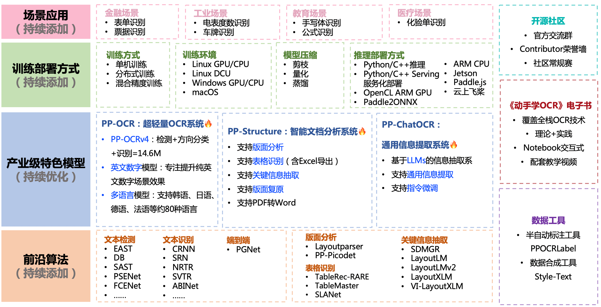

English | [简体中文](README.md)

 

    
    
    
    
    
    
    

## Introduction

PaddleOCR aims to create multilingual, awesome, leading, and practical OCR tools that help users train better models and apply them into practice.

    

## 🚀 Community

PaddleOCR is being oversight by a [PMC](https://github.com/PaddlePaddle/PaddleOCR/issues/12122). Issues and PRs will be reviewed on a best-effort basis. For a complete overview of PaddlePaddle community, please visit [community](https://github.com/PaddlePaddle/community).

⚠️ Note: The [Issues](https://github.com/PaddlePaddle/PaddleOCR/issues) module is only for reporting program 🐞 bugs, for the rest of the questions, please move to the [Discussions](https://github.com/PaddlePaddle/PaddleOCR/discussions). Please note that if the Issue mentioned is not a bug, it will be moved to the Discussions module.

## 📣 Recent updates ([more](https://paddlepaddle.github.io/PaddleOCR/latest/en/update.html))

- **🔥 2024.10.18 release PaddleOCR v2.9, including**:
  * PaddleX, an All-in-One development tool based on PaddleOCR's advanced technology, supports low-code full-process development capabilities in the OCR field:
     * 🎨 [**Rich Model One-Click Call**](https://paddlepaddle.github.io/PaddleOCR/latest/en/paddlex/quick_start.html): Integrates **17 models** related to text image intelligent analysis, general OCR, general layout parsing, table recognition, formula recognition, and seal recognition into 6 pipelines, which can be quickly experienced through a simple **Python API one-click call**. In addition, the same set of APIs also supports a total of **200+ models** in image classification, object detection, image segmentation, and time series forcasting, forming 20+ single-function modules, making it convenient for developers to use **model combinations**.

     * 🚀 [**High Efficiency and Low barrier of entry**](https://paddlepaddle.github.io/PaddleOCR/latest/en/paddlex/overview.html): Provides two methods based on **unified commands** and **GUI** to achieve simple and efficient use, combination, and customization of models. Supports multiple deployment methods such as **high-performance inference, service-oriented deployment, and edge deployment**. Additionally, for various mainstream hardware such as **NVIDIA GPU, Kunlunxin XPU, Ascend NPU, Cambricon MLU, and Haiguang DCU**, models can be developed with **seamless switching**.

  * Supports [PP-ChatOCRv3-doc](https://github.com/PaddlePaddle/PaddleX/blob/release/3.0-beta1/docs/pipeline_usage/tutorials/information_extration_pipelines/document_scene_information_extraction_en.md), [high-precision layout detection model based on RT-DETR](https://github.com/PaddlePaddle/PaddleX/blob/release/3.0-beta1/docs/module_usage/tutorials/ocr_modules/layout_detection_en.md) and [high-efficiency layout area detection model based on PicoDet](https://github.com/PaddlePaddle/PaddleX/blob/release/3.0-beta1/docs/module_usage/tutorials/ocr_modules/layout_detection_en.md), [high-precision table structure recognition model](https://github.com/PaddlePaddle/PaddleX/blob/release/3.0-beta1/docs/module_usage/tutorials/ocr_modules/table_structure_recognition_en.md), text image unwarping model [UVDoc](https://github.com/PaddlePaddle/PaddleX/blob/release/3.0-beta1/docs/module_usage/tutorials/ocr_modules/text_image_unwarping_en.md), formula recognition model [LatexOCR](https://github.com/PaddlePaddle/PaddleX/blob/release/3.0-beta1/docs/module_usage/tutorials/ocr_modules/formula_recognition_en.md), and [document image orientation classification model based on PP-LCNet](https://github.com/PaddlePaddle/PaddleX/blob/release/3.0-beta1/docs/module_usage/tutorials/ocr_modules/doc_img_orientation_classification_en.md).
  
- **🔥2024.7 Added PaddleOCR Algorithm Model Challenge Champion Solutions**:
    - Challenge One, OCR End-to-End Recognition Task Champion Solution: [Scene Text Recognition Algorithm-SVTRv2](https://paddlepaddle.github.io/PaddleOCR/algorithm/text_recognition/algorithm_rec_svtrv2.html);
    - Challenge Two, General Table Recognition Task Champion Solution: [Table Recognition Algorithm-SLANet-LCNetV2](https://paddlepaddle.github.io/PaddleOCR/algorithm/table_recognition/algorithm_table_slanet.html).

## 📚 Documentation

Full documentation can be found on [docs](https://paddlepaddle.github.io/PaddleOCR/latest/en/index.html).

## 🌟 Features

PaddleOCR support a variety of cutting-edge algorithms related to OCR, and developed industrial featured models/solution [PP-OCR](https://paddlepaddle.github.io/PaddleOCR/latest/en/ppocr/overview.html)、 [PP-Structure](https://paddlepaddle.github.io/PaddleOCR/latest/en/ppstructure/overview.html) and [PP-ChatOCR](https://aistudio.baidu.com/aistudio/projectdetail/6488689) on this basis, and get through the whole process of data production, model training, compression, inference and deployment.

    

> It is recommended to start with the “quick experience” in the document tutorial

## ⚡ [Quick Start](https://paddlepaddle.github.io/PaddleOCR/latest/en/quick_start.html)

## 📖 Technical exchange and cooperation

PaddleX provides a one-stop full-process high-efficiency development platform for flying paddle ecological model training, pressure, and push. Its mission is to help AI technology quickly land, and its vision is to make everyone an AI Developer!

- PaddleX currently covers areas such as image classification, object detection, image segmentation, 3D, OCR, and time series prediction, and has built-in 36 basic single models, such as RP-DETR, PP-YOLOE, PP-HGNet, PP-LCNet, PP- LiteSeg, etc.; integrated 12 practical industrial solutions, such as PP-OCRv4, PP-ChatOCR, PP-ShiTu, PP-TS, vehicle-mounted road waste detection, identification of prohibited wildlife products, etc.
- PaddleX provides two AI development modes: "Toolbox" and "Developer". The toolbox mode can tune key hyperparameters without code, and the developer mode can perform single-model training, push and multi-model serial inference with low code, and supports both cloud and local terminals.
- PaddleX also supports joint innovation and development, profit sharing! At present, PaddleX is rapidly iterating, and welcomes the participation of individual developers and enterprise developers to create a prosperous AI technology ecosystem!

## 📚 E-book: *Dive Into OCR*

- [Dive Into OCR](./doc/doc_en/ocr_book_en.md)

## 🎖 Contributors

## ⭐️ Star

## 🇺🇳 Guideline for New Language Requests

If you want to request a new language support, a PR with 1 following files are needed：

- In folder [ppocr/utils/dict](./ppocr/utils/dict),
it is necessary to submit the dict text to this path and name it with `{language}_dict.txt` that contains a list of all characters. Please see the format example from other files in that folder.

If your language has unique elements, please tell me in advance within any way, such as useful links, wikipedia and so on.

More details, please refer to [Multilingual OCR Development Plan](https://github.com/PaddlePaddle/PaddleOCR/discussions/12734).

## 📄 License

This project is released under [Apache License Version 2.0](./LICENSE).
