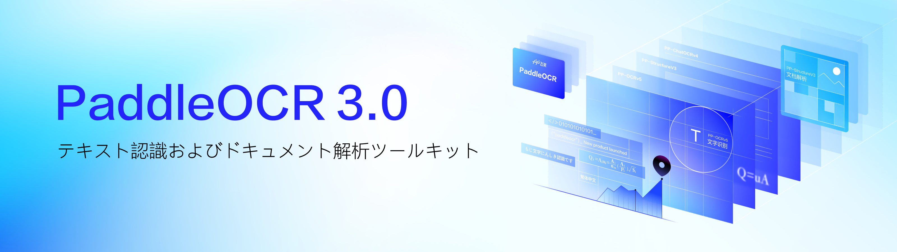

<div align="center">
  <p>
    <a href="https://paddlepaddle.github.io/PaddleOCR/latest/en/index.html" target="_blank">
      </a>
  </p>

<!-- language -->
[English](./README.md) | [简体中文](./readme_c.md)| 日本語

<!-- icon -->

[](https://github.com/PaddlePaddle/PaddleOCR)
[](./LICENSE)
[](https://pypi.org/project/PaddleOCR/)
[](https://discord.gg/z9xaRVjdbD)
[](https://x.com/PaddlePaddle)


[](https://www.paddleocr.ai/)
[](https://aistudio.baidu.com/community/app/91660/webUI)
[![HuggingFace](https://img.shields.io/badge/Demo_on_HuggingFace-yellow.svg?logo=data:image/png;base64,iVBORw0KGgoAAAANSUhEUgAAAF8AAABYCAMAAACkl9t/AAAAk1BMVEVHcEz/nQv/nQv/nQr/nQv/nQr/nQv/nQv/nQr/wRf/txT/pg7/yRr/rBD/zRz/ngv/oAz/zhz/nwv/txT/ngv/0B3+zBz/nQv/0h7/wxn/vRb/thXkuiT/rxH/pxD/ogzcqyf/nQvTlSz/czCxky7/SjifdjT/Mj3+Mj3wMj15aTnDNz+DSD9RTUBsP0FRO0Q6O0WyIxEIAAAAGHRSTlMADB8zSWF3krDDw8TJ1NbX5efv8ff9/fxKDJ9uAAAGKklEQVR42u2Z63qjOAyGC4RwCOfB2JAGqrSb2WnTw/1f3UaWcSGYNKTdf/P+mOkTrE+yJBulvfvLT2A5ruenaVHyIks33npl/6C4s/ZLAM45SOi/1FtZPyFur1OYofBX3w7d54Bxm+E8db+nDr12ttmESZ4zludJEG5S7TO72YPlKZFyE+YCYUJTBZsMiNS5Sd7NlDmKM2Eg2JQg8awbglfqgbhArjxkS7dgp2RH6hc9AMLdZYUtZN5DJr4molC8BfKrEkPKEnEVjLbgW1fLy77ZVOJagoIcLIl+IxaQZGjiX597HopF5CkaXVMDO9Pyix3AFV3kw4lQLCbHuMovz8FallbcQIJ5Ta0vks9RnolbCK84BtjKRS5uA43hYoZcOBGIG2Epbv6CvFVQ8m8loh66WNySsnN7htL58LNp+NXT8/PhXiBXPMjLSxtwp8W9f/1AngRierBkA+kk/IpUSOeKByzn8y3kAAAfh//0oXgV4roHm/kz4E2z//zRc3/lgwBzbM2mJxQEa5pqgX7d1L0htrhx7LKxOZlKbwcAWyEOWqYSI8YPtgDQVjpB5nvaHaSnBaQSD6hweDi8PosxD6/PT09YY3xQA7LTCTKfYX+QHpA0GCcqmEHvr/cyfKQTEuwgbs2kPxJEB0iNjfJcCTPyocx+A0griHSmADiC91oNGVwJ69RudYe65vJmoqfpul0lrqXadW0jFKH5BKwAeCq+Den7s+3zfRJzA61/Uj/9H/VzLKTx9jFPPdXeeP+L7WEvDLAKAIoF8bPTKT0+TM7W8ePj3Rz/Yn3kOAp2f1Kf0Weony7pn/cPydvhQYV+eFOfmOu7VB/ViPe34/EN3RFHY/yRuT8ddCtMPH/McBAT5s+vRde/gf2c/sPsjLK+m5IBQF5tO+h2tTlBGnP6693JdsvofjOPnnEHkh2TnV/X1fBl9S5zrwuwF8NFrAVJVwCAPTe8gaJlomqlp0pv4Pjn98tJ/t/fL++6unpR1YGC2n/KCoa0tTLoKiEeUPDl94nj+5/Tv3/eT5vBQ60X1S0oZr+IWRR8Ldhu7AlLjPISlJcO9vrFotky9SpzDequlwEir5beYAc0R7D9KS1DXva0jhYRDXoExPdc6yw5GShkZXe9QdO/uOvHofxjrV/TNS6iMJS+4TcSTgk9n5agJdBQbB//IfF/HpvPt3Tbi7b6I6K0R72p6ajryEJrENW2bbeVUGjfgoals4L443c7BEE4mJO2SpbRngxQrAKRudRzGQ8jVOL2qDVjjI8K1gc3TIJ5KiFZ1q+gdsARPB4NQS4AjwVSt72DSoXNyOWUrU5mQ9nRYyjp89Xo7oRI6Bga9QNT1mQ/ptaJq5T/7WcgAZywR/XlPGAUDdet3LE+qS0TI+g+aJU8MIqjo0Kx8Ly+maxLjJmjQ18rA0YCkxLQbUZP1WqdmyQGJLUm7VnQFqodmXSqmRrdVpqdzk5LvmvgtEcW8PMGdaS23EOWyDVbACZzUJPaqMbjDxpA3Qrgl0AikimGDbqmyT8P8NOYiqrldF8rX+YN7TopX4UoHuSCYY7cgX4gHwclQKl1zhx0THf+tCAUValzjI7Wg9EhptrkIcfIJjA94evOn8B2eHaVzvBrnl2ig0So6hvPaz0IGcOvTHvUIlE2+prqAxLSQxZlU2stql1NqCCLdIiIN/i1DBEHUoElM9dBravbiAnKqgpi4IBkw+utSPIoBijDXJipSVV7MpOEJUAc5Qmm3BnUN+w3hteEieYKfRZSIUcXKMVf0u5wD4EwsUNVvZOtUT7A2GkffHjByWpHqvRBYrTV72a6j8zZ6W0DTE86Hn04bmyWX3Ri9WH7ZU6Q7h+ZHo0nHUAcsQvVhXRDZHChwiyi/hnPuOsSEF6Exk3o6Y9DT1eZ+6cASXk2Y9k+6EOQMDGm6WBK10wOQJCBwren86cPPWUcRAnTVjGcU1LBgs9FURiX/e6479yZcLwCBmTxiawEwrOcleuu12t3tbLv/N4RLYIBhYexm7Fcn4OJcn0+zc+s8/VfPeddZHAGN6TT8eGczHdR/Gts1/MzDkThr23zqrVfAMFT33Nx1RJsx1k5zuWILLnG/vsH+Fv5D4NTVcp1Gzo8AAAAAElFTkSuQmCC&labelColor=white)](https://huggingface.co/spaces/PaddlePaddle/PaddleOCR)
[![ModelScope](https://img.shields.io/badge/Demo_on_ModelScope-purple?logo=data:image/svg+xml;base64,PHN2ZyB3aWR0aD0iMjIzIiBoZWlnaHQ9IjIwMCIgeG1sbnM9Imh0dHA6Ly93d3cudzMub3JnLzIwMDAvc3ZnIj4KCiA8Zz4KICA8dGl0bGU+TGF5ZXIgMTwvdGl0bGU+CiAgPHBhdGggaWQ9InN2Z18xNCIgZmlsbD0iIzYyNGFmZiIgZD0ibTAsODkuODRsMjUuNjUsMGwwLDI1LjY0OTk5bC0yNS42NSwwbDAsLTI1LjY0OTk5eiIvPgogIDxwYXRoIGlkPSJzdmdfMTUiIGZpbGw9IiM2MjRhZmYiIGQ9Im05OS4xNCwxMTUuNDlsMjUuNjUsMGwwLDI1LjY1bC0yNS42NSwwbDAsLTI1LjY1eiIvPgogIDxwYXRoIGlkPSJzdmdfMTYiIGZpbGw9IiM2MjRhZmYiIGQ9Im0xNzYuMDksMTQxLjE0bC0yNS42NDk5OSwwbDAsMjIuMTlsNDcuODQsMGwwLC00Ny44NGwtMjIuMTksMGwwLDI1LjY1eiIvPgogIDxwYXRoIGlkPSJzdmdfMTciIGZpbGw9IiMzNmNmZDEiIGQ9Im0xMjQuNzksODkuODRsMjUuNjUsMGwwLDI1LjY0OTk5bC0yNS42NSwwbDAsLTI1LjY0OTk5eiIvPgogIDxwYXRoIGlkPSJzdmdfMTgiIGZpbGw9IiMzNmNmZDEiIGQ9Im0wLDY0LjE5bDI1LjY1LDBsMCwyNS42NWwtMjUuNjUsMGwwLC0yNS42NXoiLz4KICA8cGF0aCBpZD0ic3ZnXzE5IiBmaWxsPSIjNjI0YWZmIiBkPSJtMTk4LjI4LDg5Ljg0bDI1LjY0OTk5LDBsMCwyNS42NDk5OWwtMjUuNjQ5OTksMGwwLC0yNS42NDk5OXoiLz4KICA8cGF0aCBpZD0ic3ZnXzIwIiBmaWxsPSIjMzZjZmQxIiBkPSJtMTk4LjI4LDY0LjE5bDI1LjY0OTk5LDBsMCwyNS42NWwtMjUuNjQ5OTksMGwwLC0yNS42NXoiLz4KICA8cGF0aCBpZD0ic3ZnXzIxIiBmaWxsPSIjNjI0YWZmIiBkPSJtMTUwLjQ0LDQybDAsMjIuMTlsMjUuNjQ5OTksMGwwLDI1LjY1bDIyLjE5LDBsMCwtNDcuODRsLTQ3Ljg0LDB6Ii8+CiAgPHBhdGggaWQ9InN2Z18yMiIgZmlsbD0iIzM2Y2ZkMSIgZD0ibTczLjQ5LDg5Ljg0bDI1LjY1LDBsMCwyNS42NDk5OWwtMjUuNjUsMGwwLC0yNS42NDk5OXoiLz4KICA8cGF0aCBpZD0ic3ZnXzIzIiBmaWxsPSIjNjI0YWZmIiBkPSJtNDcuODQsNjQuMTlsMjUuNjUsMGwwLC0yMi4xOWwtNDcuODQsMGwwLDQ3Ljg0bDIyLjE5LDBsMCwtMjUuNjV6Ii8+CiAgPHBhdGggaWQ9InN2Z18yNCIgZmlsbD0iIzYyNGFmZiIgZD0ibTQ3Ljg0LDExNS40OWwtMjIuMTksMGwwLDQ3Ljg0bDQ3Ljg0LDBsMCwtMjIuMTlsLTI1LjY1LDBsMCwtMjUuNjV6Ii8+CiA8L2c+Cjwvc3ZnPg==&labelColor=white)](https://www.modelscope.cn/organization/PaddlePaddle)
[](https://arxiv.org/pdf/2206.03001)
</div>
<br>

## 🚀 イントロダクション
長年にわたる基盤研究と実際の業界での実践に基づき、PaddleOCRは[PP-OCR](https://github.com/PaddlePaddle/PaddleOCR/blob/v2.7.0/doc/doc_ch/ppocr_introduction.md)シリーズのモデル、ドキュメント解析システムである[PP-Structure](https://github.com/PaddlePaddle/PaddleOCR/blob/v2.7.0/ppstructure/README_ch.md)、重要情報抽出ツールの[PP-ChatOCR](https://aistudio.baidu.com/aistudio/projectdetail/6488689)といった最先端のソリューションを提供しており、これらはすべて[PaddlePaddle](https://github.com/PaddlePaddle/Paddle)によって駆動されています。当社のモデルおよびツールは継続的にアップデートされ、**高精度**・**柔軟性**・**使いやすさ**を確保しています。さらに、ユーザーは[PPOCRLabelv2](https://github.com/PFCCLab/PPOCRLabel)を使用して独自の画像にアノテーションを行い、たった1つのコマンドでモデルの[ファインチューニング](https://github.com/PaddlePaddle/PaddleOCR/blob/v2.7.0/doc/doc_ch/finetune.md)を行うことも可能です。
<div align="center">
  <p>
    <a href="https://paddlepaddle.github.io/PaddleOCR/latest/en/index.html" target="_blank">
      </a>
  </p>
</div>

直接[クイックスタート](#-快速开始)を開始するか、[PaddleOCR ドキュメント](https://paddlepaddle.github.io/PaddleOCR/main/index.html)をご覧ください。サポートが必要な場合は[GitHub Issues](https://github.com/PaddlePaddle/PaddleOCR/issues)でご確認いただくか、[AIスタジオの講座プラットフォーム](https://aistudio.baidu.com/course/introduce/25207)でOCRに関する講座もご用意しています。

## 🌐 アーキテクチャ概要
**PaddleOCR** はモジュール式OCRツールキットであり、OCRおよびドキュメント解析のための事前に使用可能なモデルとソリューションを提供します。最新の提供内容は以下の通りです:
- 🖼️[PP-OCRv5](): 次世代超高精度テキスト認識 - あらゆるシナリオで即座に画像/PDFからテキストを抽出
- 🧮[PP-StructureV3](): 次世代高精度ドキュメント解析ソリューション – SOTA画像/PDF解析を現実世界のシナリオで解き放つ!
- 📈[PP-ChatOCRv4](): 次世代インテリジェントな主要情報抽出ソリューション – 画像/PDFから単なるテキストではなく重要な情報を抽出
<div align="center">
  <p>
    <a href="https://paddlepaddle.github.io/PaddleOCR/latest/en/index.html" target="_blank">
      </a>
  </p>
</div>

## 📣 最近のアップデート
🔥🔥2025.05.30: **PaddleOCR v3.0** リリース:
- **PP-OCRv5**: 次世代超高精度テキスト認識（全シナリオ対応）- 画像/PDFから瞬時にテキスト抽出
   1. 🌐 **4言語**同時サポート - 単一モデルで**簡体字中国語、繁体字中国語、英語**および**日本語**をシームレスに処理
   2. 🎯 テキスト認識全体精度向上 - 多様なユースケースで最先端精度（SOTA）を実現
   3. ✍️ 革新的な**手書き文字認識** - 不規則・筆記体・複雑スクリプトで画期的な性能を発揮

- **PP-StructureV3**: 次世代高精度ドキュメント解析ソリューション - 実世界シナリオ向けにSOTA画像/PDF解析を解禁！
   1. 🧮 マルチシナリオ高精度PDF解析を実現し、オープンソースソリューションの中でOmniDocBenchベンチマークでSOTA精度達成
   2. 🧠 先進機能：**判型認識、図表→表変換、ネストされた数式/画像を含む表認識、縦書き文書解析、複雑表組構造分析**

- **PP-ChatOCRv4**: 次世代インテリジェントキーフレーズ抽出ソリューション - ドキュメント内の重要情報を抽出（単なるテキスト抽出にとどまらず）
   1. 🔥 PDF/PNG形式ドキュメントファイルから高精度で重要情報抽出（PP-ChatOCRv3比で精度が**16%**向上）
   2. 🤝 [PP-DocBeeV2](https://github.com/PaddlePaddle/PaddleMIX/tree/develop/paddlemix/examples/ppdocbee)と統合し、ドキュメント内の図表・画像から重要情報抽出をサポート
   3. 💻 LLM/MLLMのローカルオフライン展開をサポートし、[PaddleNLP](https://github.com/PaddlePaddle/PaddleNLP)、Ollama、vLLM等ツール経由での大規模言語モデル統合が可能

<details>
   <summary><strong>更新履歴 </strong></summary>

- 🔥🔥2025.03.07: **PaddleOCR v2.10** リリース:

  - **12種類の新開発モデル追加**:
    - **[レイアウト検出シリーズ](https://paddlepaddle.github.io/PaddleX/latest/en/module_usage/tutorials/ocr_modules/layout_detection.html)** (3モデル): PP-DocLayout-L, M, S - 英文・中国語の論文・報告書・試験・書籍・雑誌・契約書等多様なドキュメントフォーマットにおける23種類の一般的レイアウトタイプ検出に対応。最大**90.4% mAP@0.5**を達成し、軽量設計により1秒あたり100ページ以上処理可能
    - **[数式認識シリーズ](https://paddlepaddle.github.io/PaddleX/latest/en/module_usage/tutorials/ocr_modules/formula_recognition.html)** (2モデル): PP-FormulaNet-L および S - 50,000+のLaTeX式認識に対応し、印刷体・手書きの数式処理をサポート。PP-FormulaNet-Lは同等モデル比で**6%精度向上**、PP-FormulaNet-Sは16倍高速化しつつ同等精度維持
    - **[表組構造認識シリーズ](https://paddlepaddle.github.io/PaddleX/latest/en/module_usage/tutorials/ocr_modules/table_structure_recognition.html)** (2モデル): SLANeXt_wired および SLANeXt_wireless - 複雑表組認識でSLANet_plus比**6%精度向上**を実現した新開発モデル
    - **[表組分類](https://paddlepaddle.github.io/PaddleX/latest/en/module_usage/tutorials/ocr_modules/table_classification.html)** (1モデル): 
PP-LCNet_x1_0_table_cls - 有線/無線テーブル向け超軽量分類器

[詳細はこちら](https://paddlepaddle.github.io/PaddleOCR/latest/en/update.html)

</details>

## ⚡ クイックスタート
### 1. インストール不要のオンラインデモ実行
[](https://www.paddleocr.ai/)
[](https://aistudio.baidu.com/community/app/91660/webUI)
[![HuggingFace](https://img.shields.io/badge/Demo_on_HuggingFace-yellow.svg?logo=data:image/png;base64,iVBORw0KGgoAAAANSUhEUgAAAF8AAABYCAMAAACkl9t/AAAAk1BMVEVHcEz/nQv/nQv/nQr/nQv/nQr/nQv/nQv/nQr/wRf/txT/pg7/yRr/rBD/zRz/ngv/oAz/zhz/nwv/txT/ngv/0B3+zBz/nQv/0h7/wxn/vRb/thXkuiT/rxH/pxD/ogzcqyf/nQvTlSz/czCxky7/SjifdjT/Mj3+Mj3wMj15aTnDNz+DSD9RTUBsP0FRO0Q6O0WyIxEIAAAAGHRSTlMADB8zSWF3krDDw8TJ1NbX5efv8ff9/fxKDJ9uAAAGKklEQVR42u2Z63qjOAyGC4RwCOfB2JAGqrSb2WnTw/1f3UaWcSGYNKTdf/P+mOkTrE+yJBulvfvLT2A5ruenaVHyIks33npl/6C4s/ZLAM45SOi/1FtZPyFur1OYofBX3w7d54Bxm+E8db+nDr12ttmESZ4zludJEG5S7TO72YPlKZFyE+YCYUJTBZsMiNS5Sd7NlDmKM2Eg2JQg8awbglfqgbhArjxkS7dgp2RH6hc9AMLdZYUtZN5DJr4molC8BfKrEkPKEnEVjLbgW1fLy77ZVOJagoIcLIl+IxaQZGjiX597HopF5CkaXVMDO9Pyix3AFV3kw4lQLCbHuMovz8FallbcQIJ5Ta0vks9RnolbCK84BtjKRS5uA43hYoZcOBGIG2Epbv6CvFVQ8m8loh66WNySsnN7htL58LNp+NXT8/PhXiBXPMjLSxtwp8W9f/1AngRierBkA+kk/IpUSOeKByzn8y3kAAAfh//0oXgV4roHm/kz4E2z//zRc3/lgwBzbM2mJxQEa5pqgX7d1L0htrhx7LKxOZlKbwcAWyEOWqYSI8YPtgDQVjpB5nvaHaSnBaQSD6hweDi8PosxD6/PT09YY3xQA7LTCTKfYX+QHpA0GCcqmEHvr/cyfKQTEuwgbs2kPxJEB0iNjfJcCTPyocx+A0griHSmADiC91oNGVwJ69RudYe65vJmoqfpul0lrqXadW0jFKH5BKwAeCq+Den7s+3zfRJzA61/Uj/9H/VzLKTx9jFPPdXeeP+L7WEvDLAKAIoF8bPTKT0+TM7W8ePj3Rz/Yn3kOAp2f1Kf0Weony7pn/cPydvhQYV+eFOfmOu7VB/ViPe34/EN3RFHY/yRuT8ddCtMPH/McBAT5s+vRde/gf2c/sPsjLK+m5IBQF5tO+h2tTlBGnP6693JdsvofjOPnnEHkh2TnV/X1fBl9S5zrwuwF8NFrAVJVwCAPTe8gaJlomqlp0pv4Pjn98tJ/t/fL++6unpR1YGC2n/KCoa0tTLoKiEeUPDl94nj+5/Tv3/eT5vBQ60X1S0oZr+IWRR8Ldhu7AlLjPISlJcO9vrFotky9SpzDequlwEir5beYAc0R7D9KS1DXva0jhYRDXoExPdc6yw5GShkZXe9QdO/uOvHofxjrV/TNS6iMJS+4TcSTgk9n5agJdBQbB//IfF/HpvPt3Tbi7b6I6K0R72p6ajryEJrENW2bbeVUGjfgoals4L443c7BEE4mJO2SpbRngxQrAKRudRzGQ8jVOL2qDVjjI8K1gc3TIJ5KiFZ1q+gdsARPB4NQS4AjwVSt72DSoXNyOWUrU5mQ9nRYyjp89Xo7oRI6Bga9QNT1mQ/ptaJq5T/7WcgAZywR/XlPGAUDdet3LE+qS0TI+g+aJU8MIqjo0Kx8Ly+maxLjJmjQ18rA0YCkxLQbUZP1WqdmyQGJLUm7VnQFqodmXSqmRrdVpqdzk5LvmvgtEcW8PMGdaS23EOWyDVbACZzUJPaqMbjDxpA3Qrgl0AikimGDbqmyT8P8NOYiqrldF8rX+YN7TopX4UoHuSCYY7cgX4gHwclQKl1zhx0THf+tCAUValzjI7Wg9EhptrkIcfIJjA94evOn8B2eHaVzvBrnl2ig0So6hvPaz0IGcOvTHvUIlE2+prqAxLSQxZlU2stql1NqCCLdIiIN/i1DBEHUoElM9dBravbiAnKqgpi4IBkw+utSPIoBijDXJipSVV7MpOEJUAc5Qmm3BnUN+w3hteEieYKfRZSIUcXKMVf0u5wD4EwsUNVvZOtUT7A2GkffHjByWpHqvRBYrTV72a6j8zZ6W0DTE86Hn04bmyWX3Ri9WH7ZU6Q7h+ZHo0nHUAcsQvVhXRDZHChwiyi/hnPuOsSEF6Exk3o6Y9DT1eZ+6cASXk2Y9k+6EOQMDGm6WBK10wOQJCBwren86cPPWUcRAnTVjGcU1LBgs9FURiX/e6479yZcLwCBmTxiawEwrOcleuu12t3tbLv/N4RLYIBhYexm7Fcn4OJcn0+zc+s8/VfPeddZHAGN6TT8eGczHdR/Gts1/MzDkThr23zqrVfAMFT33Nx1RJsx1k5zuWILLnG/vsH+Fv5D4NTVcp1Gzo8AAAAAElFTkSuQmCC&labelColor=white)](https://huggingface.co/spaces/PaddlePaddle/PaddleOCR)
[![ModelScope](https://img.shields.io/badge/Demo_on_ModelScope-purple?logo=data:image/svg+xml;base64,PHN2ZyB3aWR0aD0iMjIzIiBoZWlnaHQ9IjIwMCIgeG1sbnM9Imh0dHA6Ly93d3cudzMub3JnLzIwMDAvc3ZnIj4KCiA8Zz4KICA8dGl0bGU+TGF5ZXIgMTwvdGl0bGU+CiAgPHBhdGggaWQ9InN2Z18xNCIgZmlsbD0iIzYyNGFmZiIgZD0ibTAsODkuODRsMjUuNjUsMGwwLDI1LjY0OTk5bC0yNS42NSwwbDAsLTI1LjY0OTk5eiIvPgogIDxwYXRoIGlkPSJzdmdfMTUiIGZpbGw9IiM2MjRhZmYiIGQ9Im05OS4xNCwxMTUuNDlsMjUuNjUsMGwwLDI1LjY1bC0yNS42NSwwbDAsLTI1LjY1eiIvPgogIDxwYXRoIGlkPSJzdmdfMTYiIGZpbGw9IiM2MjRhZmYiIGQ9Im0xNzYuMDksMTQxLjE0bC0yNS42NDk5OSwwbDAsMjIuMTlsNDcuODQsMGwwLC00Ny44NGwtMjIuMTksMGwwLDI1LjY1eiIvPgogIDxwYXRoIGlkPSJzdmdfMTciIGZpbGw9IiMzNmNmZDEiIGQ9Im0xMjQuNzksODkuODRsMjUuNjUsMGwwLDI1LjY0OTk5bC0yNS42NSwwbDAsLTI1LjY0OTk5eiIvPgogIDxwYXRoIGlkPSJzdmdfMTgiIGZpbGw9IiMzNmNmZDEiIGQ9Im0wLDY0LjE5bDI1LjY1LDBsMCwyNS42NWwtMjUuNjUsMGwwLC0yNS42NXoiLz4KICA8cGF0aCBpZD0ic3ZnXzE5IiBmaWxsPSIjNjI0YWZmIiBkPSJtMTk4LjI4LDg5Ljg0bDI1LjY0OTk5LDBsMCwyNS42NDk5OWwtMjUuNjQ5OTksMGwwLC0yNS42NDk5OXoiLz4KICA8cGF0aCBpZD0ic3ZnXzIwIiBmaWxsPSIjMzZjZmQxIiBkPSJtMTk4LjI4LDY0LjE5bDI1LjY0OTk5LDBsMCwyNS42NWwtMjUuNjQ5OTksMGwwLC0yNS42NXoiLz4KICA8cGF0aCBpZD0ic3ZnXzIxIiBmaWxsPSIjNjI0YWZmIiBkPSJtMTUwLjQ0LDQybDAsMjIuMTlsMjUuNjQ5OTksMGwwLDI1LjY1bDIyLjE5LDBsMCwtNDcuODRsLTQ3Ljg0LDB6Ii8+CiAgPHBhdGggaWQ9InN2Z18yMiIgZmlsbD0iIzM2Y2ZkMSIgZD0ibTczLjQ5LDg5Ljg0bDI1LjY1LDBsMCwyNS42NDk5OWwtMjUuNjUsMGwwLC0yNS42NDk5OXoiLz4KICA8cGF0aCBpZD0ic3ZnXzIzIiBmaWxsPSIjNjI0YWZmIiBkPSJtNDcuODQsNjQuMTlsMjUuNjUsMGwwLC0yMi4xOWwtNDcuODQsMGwwLDQ3Ljg0bDIyLjE5LDBsMCwtMjUuNjV6Ii8+CiAgPHBhdGggaWQ9InN2Z18yNCIgZmlsbD0iIzYyNGFmZiIgZD0ibTQ3Ljg0LDExNS40OWwtMjIuMTksMGwwLDQ3Ljg0bDQ3Ljg0LDBsMCwtMjIuMTlsLTI1LjY1LDBsMCwtMjUuNjV6Ii8+CiA8L2c+Cjwvc3ZnPg==&labelColor=white)](https://www.modelscope.cn/organization/PaddlePaddle) 

### 2. インストール
#### 2.1 x86 CPU 

```bash
# 1. PaddlePaddleをインストール
pip install paddlepaddle  

# 2. PaddleOCRをインストール
pip install paddleocr

# 3. インストール後の自己テスト
paddleocr --version
```

#### 2.2 NVIDIA GPU 

```bash
# 1. CUDA 11.8対応のpaddlepaddle-gpuをインストール
python -m pip install paddlepaddle-gpu==3.0.0 -i https://www.paddlepaddle.org.cn/packages/stable/cu118/
# またはCUDA 12.6対応のpaddlepaddle-gpuをインストール
python -m pip install paddlepaddle-gpu==3.0.0 -i https://www.paddlepaddle.org.cn/packages/stable/cu126/

# 2. PaddleOCRをインストール
pip install paddleocr

# 3. インストール後の自己テスト
paddleocr --version
```
#### 2.3 その他のAIアクセラレータ
[Huawei Ascend](README_en.md) | [Kunlunxin](README.md)| 追加予定

### 3. CLIによる推論実行
```bash
# PP-OCRv5推論を実行
paddleocr ocr -i https://paddle-model-ecology.bj.bcebos.com/paddlex/imgs/demo_image/general_ocr_002.png

# PP-StructureV3推論を実行
paddleocr ??

# PP-ChatOCRv4推論を実行
paddleocr ??

# "paddleocr ocr"の詳細情報を取得
paddleocr ocr --help
```
### 4. APIによる推論実行
#### 4.1 PP-OCRv5の例
```python
from paddleocr import PaddleOCR

# PaddleOCRインスタンスを初期化
ocr = PaddleOCR()

# サンプル画像でOCR推論を実行
result = ocr.predict("https://paddle-model-ecology.bj.bcebos.com/paddlex/imgs/demo_image/general_ocr_002.png")

# 結果を可視化
for res in result:
    res.print()
    res.save_to_img("output")
    res.save_to_json("output")
```

<details>
    <summary><strong>4.2 PP-StructureV3の例</strong></summary>

```python
from paddleocr import PaddleOCR

# PaddleOCRインスタンスを初期化
ocr = PaddleOCR()

# サンプル画像でOCR推論を実行
result = ocr.predict("https://github.com/PaddlePaddle/PaddleOCR/blob/main/docs/images/ppocrv4_en.jpg")

# 結果を可視化
for res in result:
    res.print()
    res.save_to_img("output")
    res.save_to_json("output")
```

</details>

<details>
   <summary><strong>4.3 PP-ChatOCRv4の例</strong></summary>

```python
from paddleocr import PaddleOCR

# PaddleOCRインスタンスを初期化
ocr = PaddleOCR()

# サンプル画像でOCR推論を実行
result = ocr.predict("https://github.com/PaddlePaddle/PaddleOCR/blob/main/docs/images/ppocrv4_en.jpg")

# 結果を可視化
for res in result:
    res.print()
    res.save_to_img("output")
    res.save_to_json("output")
```

</details>

## 📚 OCRコースで学び始めよう: 
- [AI快车道2020-PaddleOCR](https://aistudio.baidu.com/course/introduce/1519)


## 😃 PaddleOCRを活用した素晴らしいプロジェクト
💗 PaddleOCRは素晴らしいコミュニティの支援なしでは今の地位に立てていません！長年パートナーとしてご協力いただいている皆様、新しいコラボレーターの皆様、そしてPaddleOCRに情熱を注いでくださるすべての皆様に心から感謝します。皆様のご支援が私たちの原動力です！🔥
| プロジェクト名 | 説明 |
| ------------ | ----------- |
| [Umi-OCR](https://github.com/hiroi-sora/Umi-OCR) <a href="https://github.com/hiroi-sora/Umi-OCR"></a>|無料・オープンソース・バッチ処理オフラインOCRソフトウェア|
| [OmniParser](https://github.com/microsoft/OmniParser)<a href="https://github.com/microsoft/OmniParser"></a> |OmniParser: ビジュアルベースGUIエージェント向け画面解析ツール|
| [QAnything](https://github.com/netease-youdao/QAnything)<a href="https://github.com/netease-youdao/QAnything"></a> |あらゆるコンテンツに基づく質問応答システム|
| [PDF-Extract-Kit](https://github.com/opendatalab/PDF-Extract-Kit) <a href="https://github.com/opendatalab/PDF-Extract-Kit"></a>|複雑で多様なPDFドキュメントから高品質なコンテンツを効率的に抽出するための強力なオープンソースツールキット|
| [Dango-Translator](https://github.com/PantsuDango/Dango-Translator)<a href="https://github.com/PantsuDango/Dango-Translator"></a> |画面に表示されたテキストを認識し、リアルタイムで翻訳結果を表示|
| [その他のプロジェクトはこちら](./awesome_projects.md) | [PaddleOCRベースのプロジェクト一覧](./awesome_projects.md)|

## 👩‍👩‍👧‍👦 コミュニティ
* 👫 [PaddlePaddleコミュニティ](https://github.com/PaddlePaddle/community)に参加しよう。世界中の[PaddlePaddle開発者](https://www.paddlepaddle.org.cn/developercommunity)や研究者、愛好家と交流できます。
* 🎓 ワークショップやチュートリアル、Q&Aセッションを通じて[AISTUDIO](https://aistudio.baidu.com/learn/center)で専門家から学ぼう。
* 🏆 ハッカソンやチャレンジ、コンペティションに参加してスキルを披露し、豪華賞品を獲得しよう。[イベント情報はこちら](https://aistudio.baidu.com/competition)
* 📣 最新ニュースや告知、イベント情報は[Twitter](https://x.com/PaddlePaddle)と[WeChat](https://mp.weixin.qq.com/s/MAdo7fZ6dfeGcCQUtRP2ag)でフォローしよう。
一緒にAIの未来を築いていきましょう！🚀

## 📄 ライセンス

本プロジェクトは[Apacheライセンスバージョン2.0](./LICENSE)に基づいて公開されています。
