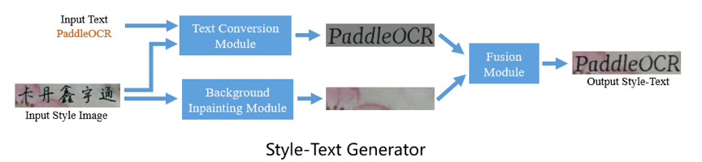
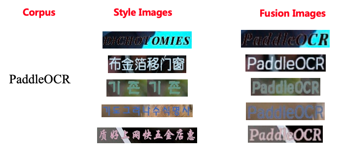
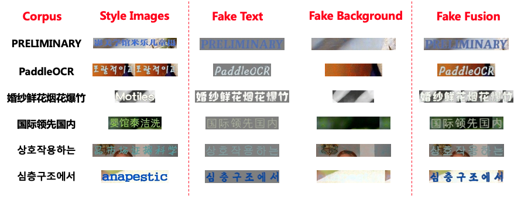
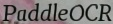
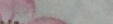
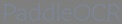
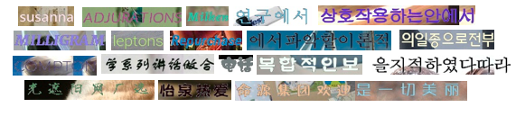
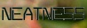
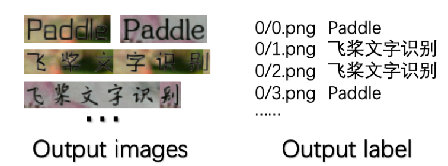
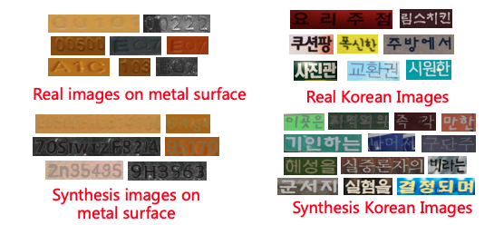

English | [简体中文](README_ch.md)

## Style Text

### Contents
- [1. Introduction](#Introduction)
- [2. Preparation](#Preparation)
- [3. Quick Start](#Quick_Start)
- [4. Applications](#Applications)
- [5. Code Structure](#Code_structure)


<a name="Introduction"></a>
### Introduction

<div align="center">
    
</div>

<div align="center">
    
</div>


The Style-Text data synthesis tool is a tool based on Baidu's self-developed text editing algorithm "Editing Text in the Wild" [https://arxiv.org/abs/1908.03047](https://arxiv.org/abs/1908.03047).

Different from the commonly used GAN-based data synthesis tools, the main framework of Style-Text includes:
* (1) Text foreground style transfer module.
* (2) Background extraction module.
* (3) Fusion module.

After these three steps, you can quickly realize the image text style transfer. The following figure is some results of the data synthesis tool.

<div align="center">
    
</div>


<a name="Preparation"></a>
#### Preparation

1. Please refer the [QUICK INSTALLATION](../doc/doc_en/installation_en.md) to install PaddlePaddle. Python3 environment is strongly recommended.
2. Download the pretrained models and unzip:

```bash
cd StyleText
wget https://paddleocr.bj.bcebos.com/dygraph_v2.0/style_text/style_text_models.zip
unzip style_text_models.zip
```

If you save the model in another location, please modify the address of the model file in `configs/config.yml`, and you need to modify these three configurations at the same time:

```
bg_generator:
  pretrain: style_text_rec/bg_generator
...
text_generator:
  pretrain: style_text_models/text_generator
...
fusion_generator:
  pretrain: style_text_models/fusion_generator
```

<a name="Quick_Start"></a>
### Quick Start

#### Synthesis single image

1. You can run `tools/synth_image` and generate the demo image, which is saved in the current folder.

```python
python3 -m tools.synth_image -c configs/config.yml --style_image examples/style_images/2.jpg --text_corpus PaddleOCR --language en
```

* Note: The language options is correspond to the corpus. Currently, the tool only supports English, Simplified Chinese and Korean.

For example, enter the following image and corpus `PaddleOCR`.

<div align="center">
    
</div>

The result `fake_fusion.jpg` will be generated.

<div align="center">
    
</div>

What's more, the medium result `fake_bg.jpg` will also be saved, which is the background output.

<div align="center">
    
</div>


`fake_text.jpg` * `fake_text.jpg` is the generated image with the same font style as `Style Input`.


<div align="center">
    
</div>


#### Batch synthesis

In actual application scenarios, it is often necessary to synthesize pictures in batches and add them to the training set. StyleText can use a batch of style pictures and corpus to synthesize data in batches. The synthesis process is as follows:

1. The referenced dataset can be specifed in `configs/dataset_config.yml`:

   * `Global`：
     * `output_dir:`：Output synthesis data path.
   * `StyleSampler`：
     * `image_home`：style images' folder.
     * `label_file`：Style images' file list. If label is provided, then it is the label file path.
     * `with_label`：Whether the `label_file` is label file list.
   * `CorpusGenerator`：
     * `method`：Method of CorpusGenerator，supports `FileCorpus` and `EnNumCorpus`. If `EnNumCorpus` is used，No other configuration is needed，otherwise you need to set `corpus_file` and `language`.
     * `language`：Language of the corpus.
     * `corpus_file`: Filepath of the corpus. Corpus file should be a text file which will be split by line-endings（'\n'）. Corpus generator samples one line each time.


Example of corpus file: 
```
PaddleOCR
飞桨文字识别
StyleText
风格文本图像数据合成
```

We provide a general dataset containing Chinese, English and Korean (50,000 images in all) for your trial ([download link](https://paddleocr.bj.bcebos.com/dygraph_v2.0/style_text/chkoen_5w.tar)), some examples are given below :

<div align="center">
     
</div>

2. You can run the following command to start synthesis task:

   ``` bash
   python -m tools.synth_dataset.py -c configs/dataset_config.yml
   ```
We also provide example corpus and images in `example` folder. 
    <div align="center">
        
        
    </div>
If you run the code above directly, you will get example output data in `output_data` folder.
You will get synthesis images and labels as below:
   <div align="center">
       
   </div>
There will be some cache under the `label` folder. If the program exit unexpectedly, you can find cached labels there.
When the program finish normally, you will find all the labels in `label.txt` which give the final results.

<a name="Applications"></a>
### Applications
We take two scenes as examples, which are metal surface English number recognition and general Korean recognition, to illustrate practical cases of using StyleText to synthesize data to improve text recognition. The following figure shows some examples of real scene images and composite images:

<div align="center">
    
</div>


After adding the above synthetic data for training, the accuracy of the recognition model is improved, which is shown in the following table:


| Scenario | Characters | Raw Data | Test Data | Only Use Raw Data</br>Recognition Accuracy | New Synthetic Data | Simultaneous Use of Synthetic Data</br>Recognition Accuracy | Index Improvement |
| -------- | ---------- | -------- | -------- | -------------------------- | ------------ | ---------------------- | -------- |
| Metal surface | English and numbers | 2203     | 650      | 0.5938                     | 20000        | 0.7546                 | 16%      |
| Random background | Korean       | 5631     | 1230     | 0.3012                     | 100000       | 0.5057                 | 20%      |


<a name="Code_structure"></a>
### Code Structure

```
StyleText
|-- arch                        // Network module files.
|   |-- base_module.py
|   |-- decoder.py
|   |-- encoder.py
|   |-- spectral_norm.py
|   `-- style_text_rec.py
|-- configs                     // Config files.
|   |-- config.yml
|   `-- dataset_config.yml
|-- engine                      // Synthesis engines.
|   |-- corpus_generators.py    // Sample corpus from file or generate random corpus.
|   |-- predictors.py           // Predict using network.
|   |-- style_samplers.py       // Sample style images.
|   |-- synthesisers.py         // Manage other engines to synthesis images.
|   |-- text_drawers.py         // Generate standard input text images.
|   `-- writers.py              // Write synthesis images and labels into files.
|-- examples                    // Example files.
|   |-- corpus
|   |   `-- example.txt
|   |-- image_list.txt
|   `-- style_images
|       |-- 1.jpg
|       `-- 2.jpg
|-- fonts                       // Font files.
|   |-- ch_standard.ttf
|   |-- en_standard.ttf
|   `-- ko_standard.ttf
|-- tools                       // Program entrance.
|   |-- __init__.py
|   |-- synth_dataset.py        // Synthesis dataset.
|   `-- synth_image.py          // Synthesis image.
`-- utils                       // Module of basic functions.
    |-- config.py
    |-- load_params.py
    |-- logging.py
    |-- math_functions.py
    `-- sys_funcs.py
```
