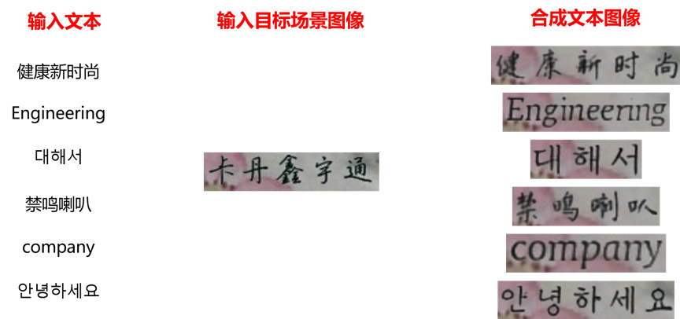
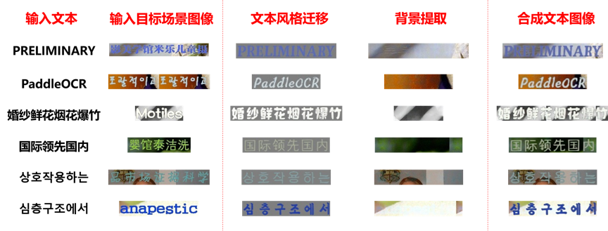
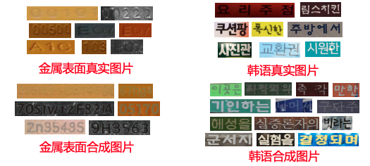

简体中文 | [English](README.md)

## Style Text


### 目录
- [一、工具简介](#工具简介)
- [二、环境配置](#环境配置)
- [三、快速上手](#快速上手)
- [四、应用案例](#应用案例)
- [五、代码结构](#代码结构)

<a name="工具简介"></a>
### 一、工具简介
<div align="center">
    
</div>

<div align="center">
    
</div>


Style-Text数据合成工具是基于百度自研的文本编辑算法《Editing Text in the Wild》https://arxiv.org/abs/1908.03047

不同于常用的基于GAN的数据合成工具，Style-Text主要框架包括：1.文本前景风格迁移模块 2.背景抽取模块 3.融合模块。经过这样三步，就可以迅速实现图像文本风格迁移。下图是一些该数据合成工具效果图。

<div align="center">
    
</div>

<a name="环境配置"></a>
### 二、环境配置

1. 参考[快速安装](../doc/doc_ch/installation.md)，安装PaddleOCR。
2. 进入`StyleText`目录，下载模型，并解压：

```bash
cd StyleText
wget https://paddleocr.bj.bcebos.com/dygraph_v2.0/style_text/style_text_models.zip
unzip style_text_models.zip
```

如果您将模型保存再其他位置，请在`configs/config.yml`中修改模型文件的地址，修改时需要同时修改这三个配置：

```
bg_generator:
  pretrain: style_text_models/bg_generator
...
text_generator:
  pretrain: style_text_models/text_generator
...
fusion_generator:
  pretrain: style_text_models/fusion_generator
```

<a name="快速上手"></a>
### 三、快速上手

#### 合成单张图
输入一张风格图和一段文字语料，运行tools/synth_image，合成单张图片，结果图像保存在当前目录下：

```python
python3 -m tools.synth_image -c configs/config.yml --style_image examples/style_images/2.jpg --text_corpus PaddleOCR --language en
```
* 注意：语言选项和语料相对应，目前该工具只支持英文、简体中文和韩语。

例如，输入如下图片和语料"PaddleOCR":

<div align="center">
    
</div>

生成合成数据`fake_fusion.jpg`：
<div align="center">
    
</div>

除此之外，程序还会生成并保存中间结果`fake_bg.jpg`：为风格参考图去掉文字后的背景；

<div align="center">
    
</div>

`fake_text.jpg`：是用提供的字符串，仿照风格参考图中文字的风格，生成在灰色背景上的文字图片。

<div align="center">
    
</div>

#### 批量合成
在实际应用场景中，经常需要批量合成图片，补充到训练集中。Style-Text可以使用一批风格图片和语料，批量合成数据。合成过程如下：

1. 在`configs/dataset_config.yml`中配置目标场景风格图像和语料的路径，具体如下：

   * `Global`：
     * `output_dir:`：保存合成数据的目录。
   * `StyleSampler`：
     * `image_home`：风格图片目录；
     * `label_file`：风格图片路径列表文件，如果所用数据集有label，则label_file为label文件路径；
     * `with_label`：标志`label_file`是否为label文件。
   * `CorpusGenerator`：
     * `method`：语料生成方法，目前有`FileCorpus`和`EnNumCorpus`可选。如果使用`EnNumCorpus`，则不需要填写其他配置，否则需要修改`corpus_file`和`language`；
     * `language`：语料的语种；
     * `corpus_file`: 语料文件路径。语料文件应使用文本文件。语料生成器首先会将语料按行切分，之后每次随机选取一行。

   语料文件格式示例：
   ```
   PaddleOCR
   飞桨文字识别
   StyleText
   风格文本图像数据合成
   ...
   ```

   Style-Text也提供了一批中英韩5万张通用场景数据用作文本风格图像，便于合成场景丰富的文本图像，下图给出了一些示例。

   中英韩5万张通用场景数据: [下载地址](https://paddleocr.bj.bcebos.com/dygraph_v2.0/style_text/chkoen_5w.tar)

<div align="center">
    
</div>

2. 运行`tools/synth_dataset`合成数据：

   ``` bash
   python3 -m tools.synth_dataset -c configs/dataset_config.yml
   ```

<a name="应用案例"></a>
### 四、应用案例
下面以金属表面英文数字识别和通用韩语识别两个场景为例，说明使用Style-Text合成数据，来提升文本识别效果的实际案例。下图给出了一些真实场景图像和合成图像的示例：

<div align="center">
    
</div>

在添加上述合成数据进行训练后，识别模型的效果提升，如下表所示：

| 场景     | 字符       | 原始数据 | 测试数据 | 只使用原始数据</br>识别准确率 | 新增合成数据 | 同时使用合成数据</br>识别准确率 | 指标提升 |
| -------- | ---------- | -------- | -------- | -------------------------- | ------------ | ---------------------- | -------- |
| 金属表面 | 英文和数字 | 2203     | 650      | 0.5938                     | 20000        | 0.7546                 | 16%      |
| 随机背景 | 韩语       | 5631     | 1230     | 0.3012                     | 100000       | 0.5057                 | 20%      |


<a name="代码结构"></a>
### 五、代码结构

```
StyleText
|-- arch                        // 网络结构定义文件
|   |-- base_module.py
|   |-- decoder.py
|   |-- encoder.py
|   |-- spectral_norm.py
|   `-- style_text_rec.py
|-- configs                     // 配置文件
|   |-- config.yml
|   `-- dataset_config.yml
|-- engine                      // 数据合成引擎
|   |-- corpus_generators.py    // 从文本采样或随机生成语料
|   |-- predictors.py           // 调用网络生成数据
|   |-- style_samplers.py       // 采样风格图片
|   |-- synthesisers.py         // 调度各个模块，合成数据
|   |-- text_drawers.py         // 生成标准文字图片，用作输入
|   `-- writers.py              // 将合成的图片和标签写入本地目录
|-- examples                    // 示例文件
|   |-- corpus
|   |   `-- example.txt
|   |-- image_list.txt
|   `-- style_images
|       |-- 1.jpg
|       `-- 2.jpg
|-- fonts                       // 字体文件
|   |-- ch_standard.ttf
|   |-- en_standard.ttf
|   `-- ko_standard.ttf
|-- tools                       // 程序入口
|   |-- __init__.py
|   |-- synth_dataset.py        // 批量合成数据
|   `-- synth_image.py          // 合成单张图片
`-- utils                       // 其他基础功能模块
    |-- config.py
    |-- load_params.py
    |-- logging.py
    |-- math_functions.py
    `-- sys_funcs.py
```
