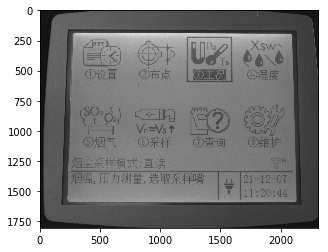
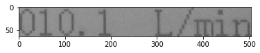

# 基于PP-OCRv3的液晶屏读数识别

- [1. 项目背景及意义](#1-项目背景及意义)
- [2. 项目内容](#2-项目内容)
- [3. 安装环境](#3-安装环境)
- [4. 文字检测](#4-文字检测)
  - [4.1 PP-OCRv3检测算法介绍](#41-PP-OCRv3检测算法介绍)
  - [4.2 数据准备](#42-数据准备)
  - [4.3 模型训练](#43-模型训练)
    - [4.3.1 预训练模型直接评估](#431-预训练模型直接评估)
    - [4.3.2 预训练模型直接finetune](#432-预训练模型直接finetune)
    - [4.3.3 基于预训练模型Finetune_student模型](#433-基于预训练模型Finetune_student模型)
    - [4.3.4 基于预训练模型Finetune_teacher模型](#434-基于预训练模型Finetune_teacher模型)
    - [4.3.5 采用CML蒸馏进一步提升student模型精度](#435-采用CML蒸馏进一步提升student模型精度)
    - [4.3.6 模型导出推理](#436-4.3.6-模型导出推理)
- [5. 文字识别](#5-文字识别)
  - [5.1 PP-OCRv3识别算法介绍](#51-PP-OCRv3识别算法介绍)
  - [5.2 数据准备](#52-数据准备)
  - [5.3 模型训练](#53-模型训练)
  - [5.4 模型导出推理](#54-模型导出推理)
- [6. 系统串联](#6-系统串联)
  - [6.1 后处理](#61-后处理)
- [7. PaddleServing部署](#7-PaddleServing部署)


# 1. 项目背景及意义
目前光学字符识别(OCR)技术在我们的生活当中被广泛使用，但是大多数模型在通用场景下的准确性还有待提高，针对于此我们借助飞桨提供的PaddleOCR套件较容易的实现了在垂类场景下的应用。

该项目以国家质量基础（NQI）为准绳，充分利用大数据、云计算、物联网等高新技术，构建覆盖计量端、实验室端、数据端和硬件端的完整计量解决方案，解决传统计量校准中存在的难题，拓宽计量检测服务体系和服务领域；解决无数传接口或数传接口不统一、不公开的计量设备，以及计量设备所处的环境比较恶劣，不适合人工读取数据。通过OCR技术实现远程计量，引领计量行业向智慧计量转型和发展。

# 2. 项目内容
本项目基于PaddleOCR开源套件，以PP-OCRv3检测和识别模型为基础，针对液晶屏读数识别场景进行优化。

# 3. 安装环境

```python
# 首先git官方的PaddleOCR项目，安装需要的依赖
# 第一次运行打开该注释
# git clone https://gitee.com/PaddlePaddle/PaddleOCR.git
cd PaddleOCR
pip install -r requirements.txt
```

# 4. 文字检测
文本检测的任务是定位出输入图像中的文字区域。近年来学术界关于文本检测的研究非常丰富，一类方法将文本检测视为目标检测中的一个特定场景，基于通用目标检测算法进行改进适配，如TextBoxes[1]基于一阶段目标检测器SSD[2]算法，调整目标框使之适合极端长宽比的文本行，CTPN[3]则是基于Faster RCNN[4]架构改进而来。但是文本检测与目标检测在目标信息以及任务本身上仍存在一些区别，如文本一般长宽比较大，往往呈“条状”，文本行之间可能比较密集，弯曲文本等，因此又衍生了很多专用于文本检测的算法。本项目基于PP-OCRv3算法进行优化。

## 4.1 PP-OCRv3检测算法介绍
PP-OCRv3检测模型是对PP-OCRv2中的CML（Collaborative Mutual Learning) 协同互学习文本检测蒸馏策略进行了升级。如下图所示，CML的核心思想结合了①传统的Teacher指导Student的标准蒸馏与 ②Students网络之间的DML互学习，可以让Students网络互学习的同时，Teacher网络予以指导。PP-OCRv3分别针对教师模型和学生模型进行进一步效果优化。其中，在对教师模型优化时，提出了大感受野的PAN结构LK-PAN和引入了DML（Deep Mutual Learning）蒸馏策略；在对学生模型优化时，提出了残差注意力机制的FPN结构RSE-FPN。


详细优化策略描述请参考[PP-OCRv3优化策略](https://github.com/PaddlePaddle/PaddleOCR/blob/release/2.5/doc/doc_ch/PP-OCRv3_introduction.md#2)

## 4.2 数据准备
[计量设备屏幕字符检测数据集](https://aistudio.baidu.com/aistudio/datasetdetail/127845)数据来源于实际项目中各种计量设备的数显屏，以及在网上搜集的一些其他数显屏，包含训练集755张，测试集355张。

```python
# 在PaddleOCR下创建新的文件夹train_data
mkdir train_data
# 下载数据集并解压到指定路径下
unzip icdar2015.zip  -d train_data
```

```python
# 随机查看文字检测数据集图片
from PIL import Image  
import matplotlib.pyplot as plt
import numpy as np
import os


train = './train_data/icdar2015/text_localization/test'
# 从指定目录中选取一张图片
def get_one_image(train):
    plt.figure()
    files = os.listdir(train)
    n = len(files)
    ind = np.random.randint(0,n)
    img_dir = os.path.join(train,files[ind])  
    image = Image.open(img_dir)  
    plt.imshow(image)
    plt.show()
    image = image.resize([208, 208])  

get_one_image(train)  
```


## 4.3 模型训练

### 4.3.1 预训练模型直接评估
下载我们需要的PP-OCRv3检测预训练模型，更多选择请自行选择其他的[文字检测模型](https://github.com/PaddlePaddle/PaddleOCR/blob/release/2.5/doc/doc_ch/models_list.md#1-%E6%96%87%E6%9C%AC%E6%A3%80%E6%B5%8B%E6%A8%A1%E5%9E%8B)

```python
#使用该指令下载需要的预训练模型
wget -P ./pretrained_models/ https://paddleocr.bj.bcebos.com/PP-OCRv3/chinese/ch_PP-OCRv3_det_distill_train.tar
# 解压预训练模型文件
tar -xf ./pretrained_models/ch_PP-OCRv3_det_distill_train.tar -C pretrained_models
```

在训练之前，我们可以直接使用下面命令来评估预训练模型的效果:

```python
# 评估预训练模型
python tools/eval.py -c configs/det/ch_PP-OCRv3/ch_PP-OCRv3_det_cml.yml -o Global.pretrained_model="./pretrained_models/ch_PP-OCRv3_det_distill_train/best_accuracy"
```

结果如下：

|   | 方案                        |hmeans|
|---|---------------------------|---|
| 0 | PP-OCRv3中英文超轻量检测预训练模型直接预测 |47.5%|

### 4.3.2 预训练模型直接finetune
#### 修改配置文件
我们使用configs/det/ch_PP-OCRv3/ch_PP-OCRv3_det_cml.yml，主要修改训练轮数和学习率参相关参数，设置预训练模型路径，设置数据集路径。 另外，batch_size可根据自己机器显存大小进行调整。 具体修改如下几个地方：
```
epoch:100
save_epoch_step:10
eval_batch_step:[0, 50]
save_model_dir: ./output/ch_PP-OCR_v3_det/
pretrained_model: ./pretrained_models/ch_PP-OCRv3_det_distill_train/best_accuracy
learning_rate: 0.00025
num_workers: 0 # 如果单卡训练，建议将Train和Eval的loader部分的num_workers设置为0，否则会出现`/dev/shm insufficient`的报错
```

#### 开始训练
使用我们上面修改的配置文件configs/det/ch_PP-OCRv3/ch_PP-OCRv3_det_cml.yml，训练命令如下：

```python
# 开始训练模型
python tools/train.py -c configs/det/ch_PP-OCRv3/ch_PP-OCRv3_det_cml.yml -o Global.pretrained_model=./pretrained_models/ch_PP-OCRv3_det_distill_train/best_accuracy
```

评估训练好的模型：

```python
# 评估训练好的模型
python tools/eval.py -c configs/det/ch_PP-OCRv3/ch_PP-OCRv3_det_cml.yml -o Global.pretrained_model="./output/ch_PP-OCR_v3_det/best_accuracy"
```

结果如下：
|   | 方案                        |hmeans|
|---|---------------------------|---|
| 0 | PP-OCRv3中英文超轻量检测预训练模型直接预测 |47.5%|
| 1 | PP-OCRv3中英文超轻量检测预训练模型fintune |65.2%|

### 4.3.3 基于预训练模型Finetune_student模型

我们使用configs/det/ch_PP-OCRv3/ch_PP-OCRv3_det_student.yml，主要修改训练轮数和学习率参相关参数，设置预训练模型路径，设置数据集路径。 另外，batch_size可根据自己机器显存大小进行调整。 具体修改如下几个地方：
```
epoch:100
save_epoch_step:10
eval_batch_step:[0, 50]
save_model_dir: ./output/ch_PP-OCR_v3_det_student/
pretrained_model: ./pretrained_models/ch_PP-OCRv3_det_distill_train/student
learning_rate: 0.00025
num_workers: 0 # 如果单卡训练，建议将Train和Eval的loader部分的num_workers设置为0，否则会出现`/dev/shm insufficient`的报错
```

训练命令如下：

```python
python tools/train.py -c configs/det/ch_PP-OCRv3/ch_PP-OCRv3_det_student.yml -o Global.pretrained_model=./pretrained_models/ch_PP-OCRv3_det_distill_train/student
```

评估训练好的模型：

```python
# 评估训练好的模型
python tools/eval.py -c configs/det/ch_PP-OCRv3/ch_PP-OCRv3_det_student.yml -o Global.pretrained_model="./output/ch_PP-OCR_v3_det_student/best_accuracy"
```

结果如下：
|   | 方案                        |hmeans|
|---|---------------------------|---|
| 0 | PP-OCRv3中英文超轻量检测预训练模型直接预测 |47.5%|
| 1 | PP-OCRv3中英文超轻量检测预训练模型fintune |65.2%|
| 2 | PP-OCRv3中英文超轻量检测预训练模型fintune学生模型 |80.0%|

### 4.3.4 基于预训练模型Finetune_teacher模型

首先需要从提供的预训练模型best_accuracy.pdparams中提取teacher参数，组合成适合dml训练的初始化模型，提取代码如下：

```python
cd ./pretrained_models/
# transform teacher params in best_accuracy.pdparams into teacher_dml.paramers
import paddle

# load pretrained model
all_params = paddle.load("ch_PP-OCRv3_det_distill_train/best_accuracy.pdparams")
# print(all_params.keys())

# keep teacher params
t_params = {key[len("Teacher."):]: all_params[key] for key in all_params if "Teacher." in key}

# print(t_params.keys())

s_params = {"Student." + key: t_params[key] for key in t_params}
s2_params = {"Student2." + key: t_params[key] for key in t_params}
s_params = {**s_params, **s2_params}
# print(s_params.keys())

paddle.save(s_params, "ch_PP-OCRv3_det_distill_train/teacher_dml.pdparams")

```

我们使用configs/det/ch_PP-OCRv3/ch_PP-OCRv3_det_dml.yml，主要修改训练轮数和学习率参相关参数，设置预训练模型路径，设置数据集路径。 另外，batch_size可根据自己机器显存大小进行调整。 具体修改如下几个地方：
```
epoch:100
save_epoch_step:10
eval_batch_step:[0, 50]
save_model_dir: ./output/ch_PP-OCR_v3_det_teacher/
pretrained_model: ./pretrained_models/ch_PP-OCRv3_det_distill_train/teacher_dml
learning_rate: 0.00025
num_workers: 0 # 如果单卡训练，建议将Train和Eval的loader部分的num_workers设置为0，否则会出现`/dev/shm insufficient`的报错
```

训练命令如下：

```python
python tools/train.py -c configs/det/ch_PP-OCRv3/ch_PP-OCRv3_det_dml.yml -o Global.pretrained_model=./pretrained_models/ch_PP-OCRv3_det_distill_train/teacher_dml
```

评估训练好的模型：

```python
# 评估训练好的模型
python tools/eval.py -c configs/det/ch_PP-OCRv3/ch_PP-OCRv3_det_dml.yml -o Global.pretrained_model="./output/ch_PP-OCR_v3_det_teacher/best_accuracy"
```

结果如下：
|   | 方案                        |hmeans|
|---|---------------------------|---|
| 0 | PP-OCRv3中英文超轻量检测预训练模型直接预测 |47.5%|
| 1 | PP-OCRv3中英文超轻量检测预训练模型fintune |65.2%|
| 2 | PP-OCRv3中英文超轻量检测预训练模型fintune学生模型 |80.0%|
| 3 | PP-OCRv3中英文超轻量检测预训练模型fintune教师模型 |84.8%|

### 4.3.5 采用CML蒸馏进一步提升student模型精度

需要从4.3.3和4.3.4训练得到的best_accuracy.pdparams中提取各自代表student和teacher的参数，组合成适合cml训练的初始化模型，提取代码如下：

```python
# transform teacher params and student parameters into cml model
import paddle

all_params = paddle.load("./pretrained_models/ch_PP-OCRv3_det_distill_train/best_accuracy.pdparams")
# print(all_params.keys())

t_params = paddle.load("./output/ch_PP-OCR_v3_det_teacher/best_accuracy.pdparams")
# print(t_params.keys())

s_params = paddle.load("./output/ch_PP-OCR_v3_det_student/best_accuracy.pdparams")
# print(s_params.keys())

for key in all_params:
    # teacher is OK
    if "Teacher." in key:
        new_key = key.replace("Teacher", "Student")
        #print("{} >> {}\n".format(key, new_key))
        assert all_params[key].shape == t_params[new_key].shape
        all_params[key] = t_params[new_key]

    if "Student." in key:
        new_key = key.replace("Student.", "")
        #print("{} >> {}\n".format(key, new_key))
        assert all_params[key].shape == s_params[new_key].shape
        all_params[key] = s_params[new_key]

    if "Student2." in key:
        new_key = key.replace("Student2.", "")
        print("{} >> {}\n".format(key, new_key))
        assert all_params[key].shape == s_params[new_key].shape
        all_params[key] = s_params[new_key]

paddle.save(all_params, "./pretrained_models/ch_PP-OCRv3_det_distill_train/teacher_cml_student.pdparams")
```

训练命令如下：

```python
python tools/train.py -c configs/det/ch_PP-OCRv3/ch_PP-OCRv3_det_cml.yml -o Global.pretrained_model=./pretrained_models/ch_PP-OCRv3_det_distill_train/teacher_cml_student Global.save_model_dir=./output/ch_PP-OCR_v3_det_finetune/
```

评估训练好的模型：

```python
# 评估训练好的模型
python tools/eval.py -c configs/det/ch_PP-OCRv3/ch_PP-OCRv3_det_cml.yml -o Global.pretrained_model="./output/ch_PP-OCR_v3_det_finetune/best_accuracy"
```

结果如下：
|   | 方案                        |hmeans|
|---|---------------------------|---|
| 0 | PP-OCRv3中英文超轻量检测预训练模型直接预测 |47.5%|
| 1 | PP-OCRv3中英文超轻量检测预训练模型fintune |65.2%|
| 2 | PP-OCRv3中英文超轻量检测预训练模型fintune学生模型 |80.0%|
| 3 | PP-OCRv3中英文超轻量检测预训练模型fintune教师模型 |84.8%|
| 4 | 基于2和3训练好的模型fintune |82.7%|

###  4.3.6 模型导出推理
训练完成后，可以将训练模型转换成inference模型。inference 模型会额外保存模型的结构信息，在预测部署、加速推理上性能优越，灵活方便，适合于实际系统集成。
####  4.3.6.1 模型导出
导出命令如下：

```python
# 转化为推理模型
python tools/export_model.py \
-c configs/det/ch_PP-OCRv3/ch_PP-OCRv3_det_cml.yml \
-o Global.pretrained_model=./output/ch_PP-OCR_v3_det_finetune/best_accuracy \
-o Global.save_inference_dir="./inference/det_ppocrv3"

```

####  4.3.6.2 模型推理
导出模型后，可以使用如下命令进行推理预测：

```python
# 推理预测
python tools/infer/predict_det.py --image_dir="train_data/icdar2015/text_localization/test/1.jpg" --det_model_dir="./inference/det_ppocrv3/Student"
```

# 5. 文字识别
文本识别的任务是识别出图像中的文字内容，一般输入来自于文本检测得到的文本框截取出的图像文字区域。文本识别一般可以根据待识别文本形状分为规则文本识别和不规则文本识别两大类。规则文本主要指印刷字体、扫描文本等，文本大致处在水平线位置；不规则文本往往不在水平位置，存在弯曲、遮挡、模糊等问题。不规则文本场景具有很大的挑战性，也是目前文本识别领域的主要研究方向。本项目基于PP-OCRv3算法进行优化。

## 5.1 PP-OCRv3识别算法介绍
PP-OCRv3的识别模块是基于文本识别算法[SVTR](https://arxiv.org/abs/2205.00159)优化。SVTR不再采用RNN结构，通过引入Transformers结构更加有效地挖掘文本行图像的上下文信息，从而提升文本识别能力。如下图所示，PP-OCRv3采用了6个优化策略。


优化策略汇总如下：
* SVTR_LCNet：轻量级文本识别网络
* GTC：Attention指导CTC训练策略
* TextConAug：挖掘文字上下文信息的数据增广策略
* TextRotNet：自监督的预训练模型
* UDML：联合互学习策略
* UIM：无标注数据挖掘方案

详细优化策略描述请参考[PP-OCRv3优化策略](https://github.com/PaddlePaddle/PaddleOCR/blob/release/2.5/doc/doc_ch/PP-OCRv3_introduction.md#3-%E8%AF%86%E5%88%AB%E4%BC%98%E5%8C%96)

## 5.2 数据准备
[计量设备屏幕字符识别数据集](https://aistudio.baidu.com/aistudio/datasetdetail/128714)数据来源于实际项目中各种计量设备的数显屏，以及在网上搜集的一些其他数显屏，包含训练集19912张，测试集4099张。

```python
# 解压下载的数据集到指定路径下
unzip ic15_data.zip -d train_data
```

```python
# 随机查看文字检测数据集图片
from PIL import Image  
import matplotlib.pyplot as plt
import numpy as np
import os

train = './train_data/ic15_data/train'
# 从指定目录中选取一张图片
def get_one_image(train):
    plt.figure()
    files = os.listdir(train)
    n = len(files)
    ind = np.random.randint(0,n)
    img_dir = os.path.join(train,files[ind])  
    image = Image.open(img_dir)  
    plt.imshow(image)
    plt.show()
    image = image.resize([208, 208])  

get_one_image(train)
```



## 5.3 模型训练
###  下载预训练模型
下载我们需要的PP-OCRv3识别预训练模型，更多选择请自行选择其他的[文字识别模型](https://github.com/PaddlePaddle/PaddleOCR/blob/release/2.5/doc/doc_ch/models_list.md#2-%E6%96%87%E6%9C%AC%E8%AF%86%E5%88%AB%E6%A8%A1%E5%9E%8B)

```python
# 使用该指令下载需要的预训练模型
wget -P ./pretrained_models/ https://paddleocr.bj.bcebos.com/PP-OCRv3/chinese/ch_PP-OCRv3_rec_train.tar
# 解压预训练模型文件
tar -xf ./pretrained_models/ch_PP-OCRv3_rec_train.tar -C pretrained_models
```

###  修改配置文件
我们使用configs/rec/PP-OCRv3/ch_PP-OCRv3_rec_distillation.yml，主要修改训练轮数和学习率参相关参数，设置预训练模型路径，设置数据集路径。 另外，batch_size可根据自己机器显存大小进行调整。 具体修改如下几个地方：
```
  epoch_num: 100 # 训练epoch数
  save_model_dir: ./output/ch_PP-OCR_v3_rec
  save_epoch_step: 10
  eval_batch_step: [0, 100] # 评估间隔，每隔100step评估一次
  cal_metric_during_train: true
  pretrained_model: ./pretrained_models/ch_PP-OCRv3_rec_train/best_accuracy  # 预训练模型路径
  character_dict_path: ppocr/utils/ppocr_keys_v1.txt
  use_space_char: true  # 使用空格

  lr:
    name: Cosine # 修改学习率衰减策略为Cosine
    learning_rate: 0.0002 # 修改fine-tune的学习率
    warmup_epoch: 2 # 修改warmup轮数

Train:
  dataset:
    name: SimpleDataSet
    data_dir: ./train_data/ic15_data/ # 训练集图片路径
    ext_op_transform_idx: 1
    label_file_list:
    - ./train_data/ic15_data/rec_gt_train.txt # 训练集标签
    ratio_list:
    - 1.0
  loader:
    shuffle: true
    batch_size_per_card: 64
    drop_last: true
    num_workers: 4
Eval:
  dataset:
    name: SimpleDataSet
    data_dir: ./train_data/ic15_data/ # 测试集图片路径
    label_file_list:
    - ./train_data/ic15_data/rec_gt_test.txt # 测试集标签
    ratio_list:
    - 1.0
  loader:
    shuffle: false
    drop_last: false
    batch_size_per_card: 64
    num_workers: 4
```

在训练之前，我们可以直接使用下面命令来评估预训练模型的效果:

```python
# 评估预训练模型
python tools/eval.py -c configs/rec/PP-OCRv3/ch_PP-OCRv3_rec_distillation.yml -o Global.pretrained_model="./pretrained_models/ch_PP-OCRv3_rec_train/best_accuracy"
```

结果如下：
|   | 方案                        |accuracy|
|---|---------------------------|---|
| 0 | PP-OCRv3中英文超轻量识别预训练模型直接预测 |70.4%|

###  开始训练
我们使用上面修改好的配置文件configs/rec/PP-OCRv3/ch_PP-OCRv3_rec_distillation.yml，预训练模型，数据集路径，学习率，训练轮数等都已经设置完毕后，可以使用下面命令开始训练。

```python
# 开始训练识别模型
python tools/train.py -c configs/rec/PP-OCRv3/ch_PP-OCRv3_rec_distillation.yml
```

训练完成后，可以对训练模型中最好的进行测试，评估命令如下：

```python
# 评估finetune效果
python tools/eval.py -c configs/rec/PP-OCRv3/ch_PP-OCRv3_rec_distillation.yml -o Global.checkpoints="./output/ch_PP-OCR_v3_rec/best_accuracy"
```

结果如下：
|   | 方案                        |accuracy|
|---|---------------------------|---|
| 0 | PP-OCRv3中英文超轻量识别预训练模型直接预测 |70.4%|
| 1 | PP-OCRv3中英文超轻量识别预训练模型finetune |82.2%|

##  5.4 模型导出推理
训练完成后，可以将训练模型转换成inference模型。inference 模型会额外保存模型的结构信息，在预测部署、加速推理上性能优越，灵活方便，适合于实际系统集成。
###  模型导出
导出命令如下：

```python
# 转化为推理模型
python tools/export_model.py -c configs/rec/PP-OCRv3/ch_PP-OCRv3_rec_distillation.yml -o Global.pretrained_model="./output/ch_PP-OCR_v3_rec/best_accuracy" Global.save_inference_dir="./inference/rec_ppocrv3/"
```

### 模型推理
导出模型后，可以使用如下命令进行推理预测

```python
# 推理预测
python tools/infer/predict_rec.py --image_dir="train_data/ic15_data/test/1_crop_0.jpg" --rec_model_dir="./inference/rec_ppocrv3/Student"
```

# 6. 系统串联
我们将上面训练好的检测和识别模型进行系统串联测试，命令如下：

```python
#串联测试
python3 tools/infer/predict_system.py --image_dir="./train_data/icdar2015/text_localization/test/142.jpg" --det_model_dir="./inference/det_ppocrv3/Student"  --rec_model_dir="./inference/rec_ppocrv3/Student"
```

测试结果保存在`./inference_results/`目录下，可以用下面代码进行可视化

```python
%cd /home/aistudio/PaddleOCR
# 显示结果
import matplotlib.pyplot as plt
from PIL import Image
img_path= "./inference_results/142.jpg"
img = Image.open(img_path)
plt.figure("test_img", figsize=(30,30))
plt.imshow(img)
plt.show()
```


## 6.1 后处理
如果需要获取key-value信息，可以基于启发式的规则，将识别结果与关键字库进行匹配；如果匹配上了，则取该字段为key, 后面一个字段为value。

```python
def postprocess(rec_res):
    keys = ["型号", "厂家", "版本号", "检定校准分类", "计量器具编号", "烟尘流量",
            "累积体积", "烟气温度", "动压", "静压", "时间", "试验台编号", "预测流速",
            "全压", "烟温", "流速", "工况流量", "标杆流量", "烟尘直读嘴", "烟尘采样嘴",
            "大气压", "计前温度", "计前压力", "干球温度", "湿球温度", "流量", "含湿量"]
    key_value = []
    if len(rec_res) > 1:
        for i in range(len(rec_res) - 1):
            rec_str, _ = rec_res[i]
            for key in keys:
                if rec_str in key:
                    key_value.append([rec_str, rec_res[i + 1][0]])
                    break
    return key_value
key_value = postprocess(filter_rec_res)
```

# 7. PaddleServing部署
首先需要安装PaddleServing部署相关的环境

```python
python -m pip install paddle-serving-server-gpu
python -m pip install paddle_serving_client
python -m pip install paddle-serving-app
```

##  7.1 转化检测模型

```python
cd deploy/pdserving/
python -m paddle_serving_client.convert --dirname ../../inference/det_ppocrv3/Student/  \
                                         --model_filename inference.pdmodel          \
                                         --params_filename inference.pdiparams       \
                                         --serving_server ./ppocr_det_v3_serving/ \
                                         --serving_client ./ppocr_det_v3_client/
```

## 7.2 转化识别模型

```python
python -m paddle_serving_client.convert --dirname ../../inference/rec_ppocrv3/Student \
                                         --model_filename inference.pdmodel          \
                                         --params_filename inference.pdiparams       \
                                         --serving_server ./ppocr_rec_v3_serving/ \
                                         --serving_client ./ppocr_rec_v3_client/
```


## 7.3 启动服务
首先可以将后处理代码加入到web_service.py中，具体修改如下：
```
# 代码153行后面增加下面代码
def _postprocess(rec_res):
    keys = ["型号", "厂家", "版本号", "检定校准分类", "计量器具编号", "烟尘流量",
            "累积体积", "烟气温度", "动压", "静压", "时间", "试验台编号", "预测流速",
            "全压", "烟温", "流速", "工况流量", "标杆流量", "烟尘直读嘴", "烟尘采样嘴",
            "大气压", "计前温度", "计前压力", "干球温度", "湿球温度", "流量", "含湿量"]
    key_value = []
    if len(rec_res) > 1:
        for i in range(len(rec_res) - 1):
            rec_str, _ = rec_res[i]
            for key in keys:
                if rec_str in key:
                    key_value.append([rec_str, rec_res[i + 1][0]])
                    break
    return key_value
key_value = _postprocess(rec_list)
res = {"result": str(key_value)}
# res = {"result": str(result_list)}
```

启动服务端
```python
python web_service.py 2>&1 >log.txt
```

## 7.4 发送请求
然后再开启一个新的终端，运行下面的客户端代码

```python
python pipeline_http_client.py --image_dir ../../train_data/icdar2015/text_localization/test/142.jpg
```

可以获取到最终的key-value结果：
```
大气压, 100.07kPa
干球温度, 0000℃
计前温度, 0000℃
湿球温度, 0000℃
计前压力, -0000kPa
流量, 00.0L/min
静压, 00000kPa
含湿量, 00.0 %
```
