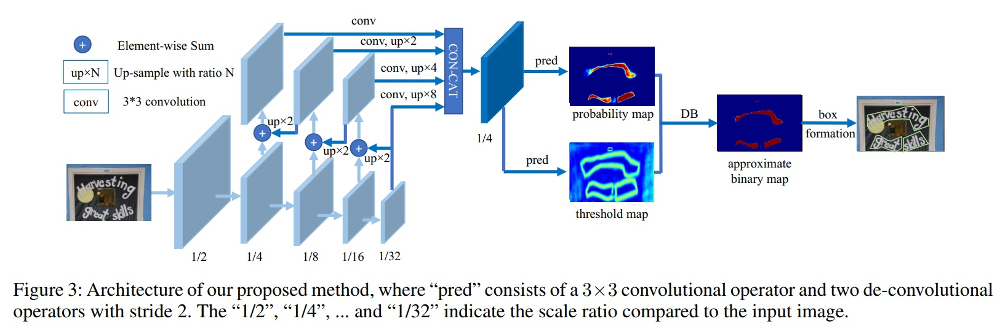

# Real-time Scene Text Detection with Differentiable Binarization

**note**: some code is inherited from [WenmuZhou/DBNet.pytorch](https://github.com/WenmuZhou/DBNet.pytorch)

[中文解读](https://zhuanlan.zhihu.com/p/94677957)



## update 
2020-06-07: 添加灰度图训练，训练灰度图时需要在配置里移除`dataset.args.transforms.Normalize`

## Install Using Conda
```
conda env create -f environment.yml
git clone https://github.com/WenmuZhou/DBNet.paddle.git
cd DBNet.paddle/
```

or
## Install Manually 
```bash
conda create -n dbnet python=3.6
conda activate dbnet

conda install ipython pip

# python dependencies
pip install -r requirement.txt

# clone repo
git clone https://github.com/WenmuZhou/DBNet.paddle.git
cd DBNet.paddle/

```

## Requirements
* paddlepaddle 2.4+

## Download

TBD

## Data Preparation

Training data: prepare a text `train.txt` in the following format, use '\t' as a separator
```
./datasets/train/img/001.jpg	./datasets/train/gt/001.txt
```

Validation data: prepare a text `test.txt` in the following format, use '\t' as a separator
```
./datasets/test/img/001.jpg	./datasets/test/gt/001.txt
```
- Store images in the `img` folder
- Store groundtruth in the `gt` folder

The groundtruth can be `.txt` files, with the following format:
```
x1, y1, x2, y2, x3, y3, x4, y4, annotation
```


## Train
1. config the `dataset['train']['dataset'['data_path']'`,`dataset['validate']['dataset'['data_path']`in [config/icdar2015_resnet18_fpn_DBhead_polyLR.yaml](cconfig/icdar2015_resnet18_fpn_DBhead_polyLR.yaml)
* . single gpu train
```bash
bash singlel_gpu_train.sh
```
* . Multi-gpu training
```bash
bash multi_gpu_train.sh
```
## Test

[eval.py](tools/eval.py) is used to test model on test dataset

1. config `model_path` in [eval.sh](eval.sh)
2. use following script to test
```bash
bash eval.sh
```

## Predict 
[predict.py](tools/predict.py) Can be used to inference on all images in a folder
1. config `model_path`,`input_folder`,`output_folder` in [predict.sh](predict.sh)
2. use following script to predict
```
bash predict.sh
```
You can change the `model_path` in the `predict.sh` file to your model location. 

tips: if result is not good, you can change `thre` in [predict.sh](predict.sh) 
    
## Export Model

[export_model.py](tools/export_model.py) Can be used to inference on all images in a folder

use following script to export inference model
```
python tools/export_model.py --config_file config/icdar2015_resnet50_FPN_DBhead_polyLR.yaml -o trainer.resume_checkpoint=model_best.pth trainer.output_dir=output/infer
```

## Paddle Inference infer

[infer.py](tools/infer.py) Can be used to inference on all images in a folder

use following script to export inference model
```
python tools/infer.py --model-dir=output/infer/ --img-path imgs/paper/db.jpg 
```

<h2 id="Performance">Performance</h2>

### [ICDAR 2015](http://rrc.cvc.uab.es/?ch=4)
only train on ICDAR2015 dataset

| Method                   | image size (short size) |learning rate | Precision (%) | Recall (%) | F-measure (%) | FPS |
|:--------------------------:|:-------:|:--------:|:--------:|:------------:|:---------------:|:-----:|
| ImageNet-resnet50-FPN-DBHead（torch）  |736 |1e-3|90.19 | 78.14 | 83.88 | 27 |
| ImageNet-resnet50-FPN-DBHead（paddle）  |736 |1e-3| 89.47 | 79.03 | 83.92 | 27 |
| ImageNet-resnet50-FPN-DBHead（paddle_amp）  |736 |1e-3| 88.62 | 79.95 | 84.06 | 27 |


### examples
TBD


### reference
1. https://arxiv.org/pdf/1911.08947.pdf
2. https://github.com/WenmuZhou/DBNet.pytorch

**If this repository helps you，please star it. Thanks.**
