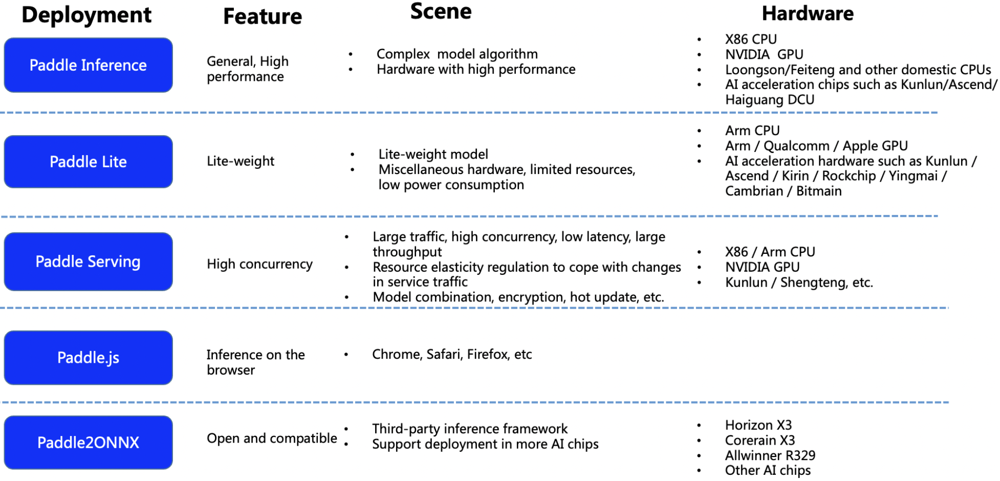

English | [简体中文](README_ch.md)

# PP-OCR Deployment

- [Paddle Deployment Introduction](#1)
- [PP-OCR Deployment](#2)

## Paddle Deployment Introduction

Paddle provides a variety of deployment schemes to meet the deployment requirements of different scenarios. Please choose according to the actual situation: 

    

## PP-OCR Deployment

PP-OCR has supported muti deployment schemes. Click the link to get the specific tutorial.

- [Python Inference](../doc/doc_en/inference_ppocr_en.md)
- [C++ Inference](./cpp_infer/readme.md)
- [Serving](./pdserving/README.md)
- [Paddle-Lite](./lite/readme.md)
- [Paddle.js](./paddlejs/README.md)
- [Paddle2ONNX](./paddle2onnx/readme.md)

If you need the deployment tutorial of academic algorithm models other than PP-OCR, please directly enter the main page of corresponding algorithms, [entrance](../doc/doc_en/algorithm_overview_en.md)。