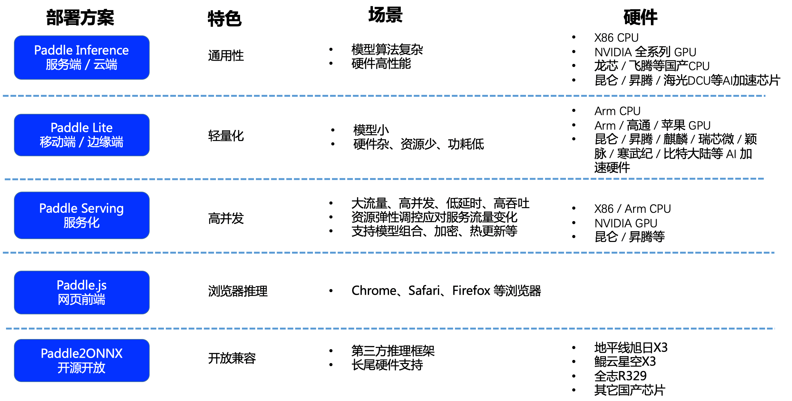

[English](README.md) | 简体中文

# PP-OCR 模型推理部署

- [Paddle 推理部署方式简介](#1)
- [PP-OCR 推理部署](#2)

## Paddle 推理部署方式简介

飞桨提供多种部署方案，以满足不同场景的部署需求，请根据实际情况进行选择：

    

## PP-OCR 推理部署

PP-OCR模型已打通多种场景部署方案，点击链接获取具体的使用教程。

- [Python 推理](../doc/doc_ch/inference_ppocr.md)
- [C++ 推理](./cpp_infer/readme_ch.md)
- [Serving 服务化部署（Python/C++）](./pdserving/README_CN.md)
- [Paddle-Lite 端侧部署（ARM CPU/OpenCL ARM GPU/Metal ARM GPU）](./lite/readme_ch.md)
- [Paddle.js 部署](./paddlejs/README_ch.md)
- [Jetson 推理](https://github.com/PaddlePaddle/PaddleOCR/blob/dygraph/deploy/Jetson/readme_ch.md)
- [Paddle2ONNX 推理](./paddle2onnx/readme_ch.md)

需要PP-OCR以外的学术算法模型的推理部署，请直接进入相应算法主页面，[入口](../doc/doc_ch/algorithm_overview.md)。