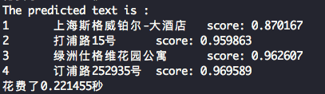

# 服务器端C++预测

本教程将介绍在服务器端部署PaddleOCR超轻量中文检测、识别模型的详细步骤。


## 1. 准备环境

### 运行准备
- Linux环境，推荐使用docker。

### 1.1 编译opencv库

* 首先需要从opencv官网上下载在Linux环境下源码编译的包，以opencv3.4.7为例，下载命令如下。

```
wget https://github.com/opencv/opencv/archive/3.4.7.tar.gz
tar -xf 3.4.7.tar.gz
```

最终可以在当前目录下看到`opencv-3.4.7/`的文件夹。

* 编译opencv，设置opencv源码路径(`root_path`)以及安装路径(`install_path`)。进入opencv源码路径下，按照下面的方式进行编译。

```shell
root_path=/paddle/libs/opencv-3.4.7
install_path=${root_path}/opencv3

rm -rf build
mkdir build
cd build

cmake .. \
    -DCMAKE_INSTALL_PREFIX=${install_path} \
    -DCMAKE_BUILD_TYPE=Release \
    -DBUILD_SHARED_LIBS=OFF \
    -DWITH_IPP=OFF \
    -DBUILD_IPP_IW=OFF \
    -DWITH_LAPACK=OFF \
    -DWITH_EIGEN=OFF \
    -DCMAKE_INSTALL_LIBDIR=lib64 \
    -DWITH_ZLIB=ON \
    -DBUILD_ZLIB=ON \
    -DWITH_JPEG=ON \
    -DBUILD_JPEG=ON \
    -DWITH_PNG=ON \
    -DBUILD_PNG=ON \
    -DWITH_TIFF=ON \
    -DBUILD_TIFF=ON

make -j
make install
```

最终在安装路径下的文件结构如下所示。

```
opencv3/
|-- bin
|-- include
|-- lib
|-- lib64
|-- share
```

### 1.2 编译Paddle预测库

* 可以参考[Paddle预测库官网](https://www.paddlepaddle.org.cn/documentation/docs/zh/advanced_guide/inference_deployment/inference/build_and_install_lib_cn.html)的说明，从github上获取Paddle代码，然后进行编译，生成最新的预测库。使用git获取代码方法如下。

```shell
git clone https://github.com/PaddlePaddle/Paddle.git
```

* 进入Paddle目录后，编译方法如下。

```shell
rm -rf build
mkdir build
cd build

cmake  .. \
    -DWITH_CONTRIB=OFF \
    -DWITH_MKL=ON \
    -DWITH_MKLDNN=OFF  \
    -DWITH_TESTING=OFF \
    -DCMAKE_BUILD_TYPE=Release \
    -DWITH_INFERENCE_API_TEST=OFF \
    -DON_INFER=ON \
    -DWITH_PYTHON=ON
make -j16
make inference_lib_dist
```

更多编译参数选项可以参考Paddle C++预测库官网：[https://www.paddlepaddle.org.cn/documentation/docs/zh/advanced_guide/inference_deployment/inference/build_and_install_lib_cn.html](https://www.paddlepaddle.org.cn/documentation/docs/zh/advanced_guide/inference_deployment/inference/build_and_install_lib_cn.html)。


* 编译完成之后，可以在`build/fluid_inference_install_dir/`文件下看到生成了以下文件及文件夹。

```
build/fluid_inference_install_dir/
|-- CMakeCache.txt
|-- paddle
|-- third_party
|-- version.txt
```

其中`paddle`就是之后进行C++预测时所需的Paddle库，`version.txt`中包含当前预测库的版本信息。


## 2 开始运行

### 2.1 将模型导出为inference model

* 可以参考[模型预测章节](../../doc/doc_ch/inference.md)，导出inference model，用于模型预测。模型导出之后，假设放在`inference`目录下，则目录结构如下。

```
inference/
|-- det_db
|   |--model
|   |--params
|-- rec_rcnn
|   |--model
|   |--params
```


### 2.2 编译PaddleOCR C++预测demo

* 编译命令如下，其中Paddle C++预测库、opencv等其他依赖库的地址需要换成自己机器上的实际地址。


```shell
sh tools/build.sh
```

* 编译完成之后，会在`build`文件夹下生成一个名为`ocr_system`的可执行文件。


### 运行demo
* 执行以下命令，完成对一幅图像的OCR识别与检测，最终输出

```shell
sh tools/run.sh
```

最终屏幕上会输出检测结果如下。

<div align="center">
    
</div>
