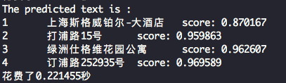

# Server-side C++ Inference

This chapter introduces the C++ deployment steps of the PaddleOCR model. The corresponding Python predictive deployment method refers to [document](../../doc/doc_ch/inference.md).
C++ is better than python in terms of performance. Therefore, in CPU and GPU deployment scenarios, C++ deployment is mostly used.
This section will introduce how to configure the C++ environment and deploy PaddleOCR in Linux (CPU\GPU) environment. For Windows deployment please refer to [Windows](./docs/windows_vs2019_build.md) compilation guidelines.


## 1. Prepare the Environment

### Environment

- Linux, docker is recommended.


### 1.1 Compile OpenCV

* First of all, you need to download the source code compiled package in the Linux environment from the OpenCV official website. Taking OpenCV 3.4.7 as an example, the download command is as follows.

```bash
cd deploy/cpp_infer
wget https://paddleocr.bj.bcebos.com/libs/opencv/opencv-3.4.7.tar.gz
tar -xf opencv-3.4.7.tar.gz
```

Finally, you will see the folder of `opencv-3.4.7/` in the current directory.

* Compile OpenCV, the OpenCV source path (`root_path`) and installation path (`install_path`) should be set by yourself. Enter the OpenCV source code path and compile it in the following way.


```shell
root_path=your_opencv_root_path
install_path=${root_path}/opencv3

rm -rf build
mkdir build
cd build

cmake .. \
    -DCMAKE_INSTALL_PREFIX=${install_path} \
    -DCMAKE_BUILD_TYPE=Release \
    -DBUILD_SHARED_LIBS=OFF \
    -DWITH_IPP=OFF \
    -DBUILD_IPP_IW=OFF \
    -DWITH_LAPACK=OFF \
    -DWITH_EIGEN=OFF \
    -DCMAKE_INSTALL_LIBDIR=lib64 \
    -DWITH_ZLIB=ON \
    -DBUILD_ZLIB=ON \
    -DWITH_JPEG=ON \
    -DBUILD_JPEG=ON \
    -DWITH_PNG=ON \
    -DBUILD_PNG=ON \
    -DWITH_TIFF=ON \
    -DBUILD_TIFF=ON

make -j
make install
```

In the above commands, `root_path` is the downloaded OpenCV source code path, and `install_path` is the installation path of OpenCV. After `make install` is completed, the OpenCV header file and library file will be generated in this folder for later OCR source code compilation.


The final file structure under the OpenCV installation path is as follows.

```
opencv3/
|-- bin
|-- include
|-- lib
|-- lib64
|-- share
```

### 1.2 Compile or Download or the Paddle Inference Library

* There are 2 ways to obtain the Paddle inference library, described in detail below.

#### 1.2.1 Direct download and installation

[Paddle inference library official website](https://paddle-inference.readthedocs.io/en/latest/user_guides/download_lib.html). You can review and select the appropriate version of the inference library on the official website.


* After downloading, use the following command to extract files.

```
tar -xf paddle_inference.tgz
```

Finally you will see the the folder of `paddle_inference/` in the current path.

#### 1.2.2 Compile the inference source code
* If you want to get the latest Paddle inference library features, you can download the latest code from Paddle GitHub repository and compile the inference library from the source code. It is recommended to download the inference library with paddle version greater than or equal to 2.0.1.
* You can refer to [Paddle inference library] (https://www.paddlepaddle.org.cn/documentation/docs/en/advanced_guide/inference_deployment/inference/build_and_install_lib_en.html) to get the Paddle source code from GitHub, and then compile To generate the latest inference library. The method of using git to access the code is as follows.


```shell
git clone https://github.com/PaddlePaddle/Paddle.git
git checkout develop
```

* Enter the Paddle directory and run the following commands to compile the paddle inference library.

```shell
rm -rf build
mkdir build
cd build

cmake  .. \
    -DWITH_CONTRIB=OFF \
    -DWITH_MKL=ON \
    -DWITH_MKLDNN=ON  \
    -DWITH_TESTING=OFF \
    -DCMAKE_BUILD_TYPE=Release \
    -DWITH_INFERENCE_API_TEST=OFF \
    -DON_INFER=ON \
    -DWITH_PYTHON=ON
make -j
make inference_lib_dist
```

For more compilation parameter options, please refer to the [document](https://www.paddlepaddle.org.cn/documentation/docs/zh/2.0/guides/05_inference_deployment/inference/build_and_install_lib_cn.html#congyuanmabianyi).


* After the compilation process, you can see the following files in the folder of `build/paddle_inference_install_dir/`.

```
build/paddle_inference_install_dir/
|-- CMakeCache.txt
|-- paddle
|-- third_party
|-- version.txt
```

`paddle` is the Paddle library required for C++ prediction later, and `version.txt` contains the version information of the current inference library.


## 2. Compile and Run the Demo

### 2.1 Export the inference model

* You can refer to [Model inference](../../doc/doc_ch/inference.md) and export the inference model. After the model is exported, assuming it is placed in the `inference` directory, the directory structure is as follows.

```
inference/
|-- det_db
|   |--inference.pdiparams
|   |--inference.pdmodel
|-- rec_rcnn
|   |--inference.pdiparams
|   |--inference.pdmodel
```


### 2.2 Compile PaddleOCR C++ inference demo


* The compilation commands are as follows. The addresses of Paddle C++ inference library, opencv and other Dependencies need to be replaced with the actual addresses on your own machines.

```shell
sh tools/build.sh
```

Specifically, you should modify the paths in `tools/build.sh`. The related content is as follows.

```shell
OPENCV_DIR=your_opencv_dir
LIB_DIR=your_paddle_inference_dir
CUDA_LIB_DIR=your_cuda_lib_dir
CUDNN_LIB_DIR=your_cudnn_lib_dir
```

`OPENCV_DIR` is the OpenCV installation path; `LIB_DIR` is the download (`paddle_inference` folder)
or the generated Paddle inference library path (`build/paddle_inference_install_dir` folder);
`CUDA_LIB_DIR` is the CUDA library file path, in docker; it is `/usr/local/cuda/lib64`; `CUDNN_LIB_DIR` is the cuDNN library file path, in docker it is `/usr/lib/x86_64-linux-gnu/`.


* After the compilation is completed, an executable file named `ppocr` will be generated in the `build` folder.


### Run the demo
Execute the built executable file:
```shell
./build/ppocr <mode> [--param1] [--param2] [...]
```
`mode` is a required parameter，and the valid values are

mode value | Model used
-----|------
det  | Detection only
rec  | Recognition only
system | End-to-end system

Specifically,

##### 1. run det demo:
```shell
./build/ppocr det \
    --det_model_dir=inference/ch_ppocr_mobile_v2.0_det_infer \
    --image_dir=../../doc/imgs/12.jpg
```
##### 2. run rec demo:
```shell
./build/ppocr rec \
    --rec_model_dir=inference/ch_ppocr_mobile_v2.0_rec_infer \
    --image_dir=../../doc/imgs_words/ch/
```
##### 3. run system demo:
```shell
# without text direction classifier
./build/ppocr system \
    --det_model_dir=inference/ch_ppocr_mobile_v2.0_det_infer \
    --rec_model_dir=inference/ch_ppocr_mobile_v2.0_rec_infer \
    --image_dir=../../doc/imgs/12.jpg
# with text direction classifier
./build/ppocr system \
    --det_model_dir=inference/ch_ppocr_mobile_v2.0_det_infer \
    --use_angle_cls=true \
    --cls_model_dir=inference/ch_ppocr_mobile_v2.0_cls_infer \
    --rec_model_dir=inference/ch_ppocr_mobile_v2.0_rec_infer \
    --image_dir=../../doc/imgs/12.jpg
```

More parameters are as follows,

- Common parameters

|parameter|data type|default|meaning|
| --- | --- | --- | --- |
|use_gpu|bool|false|Whether to use GPU|
|gpu_id|int|0|GPU id when use_gpu is true|
|gpu_mem|int|4000|GPU memory requested|
|cpu_math_library_num_threads|int|10|Number of threads when using CPU inference. When machine cores is enough, the large the value, the faster the inference speed|
|use_mkldnn|bool|true|Whether to use mkdlnn library|

- Detection related parameters

|parameter|data type|default|meaning|
| --- | --- | --- | --- |
|det_model_dir|string|-|Address of detection inference model|
|max_side_len|int|960|Limit the maximum image height and width to 960|
|det_db_thresh|float|0.3|Used to filter the binarized image of DB prediction, setting 0.-0.3 has no obvious effect on the result|
|det_db_box_thresh|float|0.5|DB post-processing filter box threshold, if there is a missing box detected, it can be reduced as appropriate|
|det_db_unclip_ratio|float|1.6|Indicates the compactness of the text box, the smaller the value, the closer the text box to the text|
|use_polygon_score|bool|false|Whether to use polygon box to calculate bbox score, false means to use rectangle box to calculate. Use rectangular box to calculate faster, and polygonal box more accurate for curved text area.|
|visualize|bool|true|Whether to visualize the results，when it is set as true, The prediction result will be save in the image file `./ocr_vis.png`.|

- Classifier related parameters

|parameter|data type|default|meaning|
| --- | --- | --- | --- |
|use_angle_cls|bool|false|Whether to use the direction classifier|
|cls_model_dir|string|-|Address of direction classifier inference model|
|cls_thresh|float|0.9|Score threshold of the  direction classifier|

- Recognition related parameters

|parameter|data type|default|meaning|
| --- | --- | --- | --- |
|rec_model_dir|string|-|Address of recognition inference model|
|char_list_file|string|../../ppocr/utils/ppocr_keys_v1.txt|dictionary file|

* Multi-language inference is also supported in PaddleOCR, you can refer to [recognition tutorial](../../doc/doc_en/recognition_en.md) for more supported languages and models in PaddleOCR. Specifically, if you want to infer using multi-language models, you just need to modify values of `char_list_file` and `rec_model_dir`.


The detection results will be shown on the screen, which is as follows.

<div align="center">
    
</div>


### 2.3 Notes

* Paddle 2.0.0 inference model library is recommended for this tutorial.
