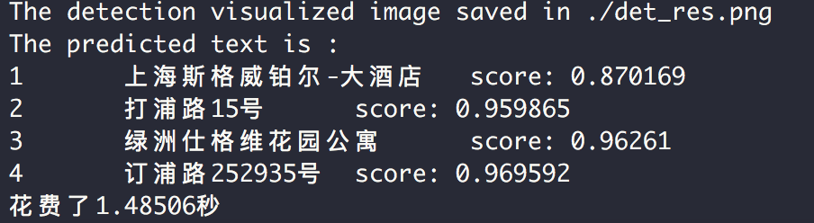

# Server-side C++ inference

This chapter introduces the C++ deployment method of the PaddleOCR model, and the corresponding python predictive deployment method refers to [document](../../doc/doc_ch/inference.md).
C++ is better than python in terms of performance calculation. Therefore, in most CPU and GPU deployment scenarios, C++ deployment is mostly used.
This section will introduce how to configure the C++ environment and complete it in the Linux\Windows (CPU\GPU) environment
PaddleOCR model deployment.


## 1. Prepare the environment

### Environment

- Linux, docker is recommended.


### 1.1 Compile opencv

* First of all, you need to download the source code compiled package in the Linux environment from the opencv official website. Taking opencv3.4.7 as an example, the download command is as follows.

```
wget https://github.com/opencv/opencv/archive/3.4.7.tar.gz
tar -xf 3.4.7.tar.gz
```

Finally, you can see the folder of `opencv-3.4.7/` in the current directory.

* Compile opencv, the opencv source path (`root_path`) and installation path (`install_path`) should be set by yourself. Enter the opencv source code path and compile it in the following way.


```shell
root_path=your_opencv_root_path
install_path=${root_path}/opencv3

rm -rf build
mkdir build
cd build

cmake .. \
    -DCMAKE_INSTALL_PREFIX=${install_path} \
    -DCMAKE_BUILD_TYPE=Release \
    -DBUILD_SHARED_LIBS=OFF \
    -DWITH_IPP=OFF \
    -DBUILD_IPP_IW=OFF \
    -DWITH_LAPACK=OFF \
    -DWITH_EIGEN=OFF \
    -DCMAKE_INSTALL_LIBDIR=lib64 \
    -DWITH_ZLIB=ON \
    -DBUILD_ZLIB=ON \
    -DWITH_JPEG=ON \
    -DBUILD_JPEG=ON \
    -DWITH_PNG=ON \
    -DBUILD_PNG=ON \
    -DWITH_TIFF=ON \
    -DBUILD_TIFF=ON

make -j
make install
```

Among them, `root_path` is the downloaded opencv source code path, and `install_path` is the installation path of opencv. After `make install` is completed, the opencv header file and library file will be generated in this folder for later OCR source code compilation.


The final file structure under the opencv installation path is as follows.

```
opencv3/
|-- bin
|-- include
|-- lib
|-- lib64
|-- share
```

### 1.2 Compile or download or  the Paddle inference library

* There are 2 ways to obtain the Paddle inference library, described in detail below.


#### 1.2.1 Compile from the source code
* If you want to get the latest Paddle inference library features, you can download the latest code from Paddle github repository and compile the inference library from the source code.
* You can refer to [Paddle inference library] (https://www.paddlepaddle.org.cn/documentation/docs/en/advanced_guide/inference_deployment/inference/build_and_install_lib_en.html) to get the Paddle source code from github, and then compile To generate the latest inference library. The method of using git to access the code is as follows.


```shell
git clone https://github.com/PaddlePaddle/Paddle.git
```

* After entering the Paddle directory, the compilation method is as follows.

```shell
rm -rf build
mkdir build
cd build

cmake  .. \
    -DWITH_CONTRIB=OFF \
    -DWITH_MKL=ON \
    -DWITH_MKLDNN=ON  \
    -DWITH_TESTING=OFF \
    -DCMAKE_BUILD_TYPE=Release \
    -DWITH_INFERENCE_API_TEST=OFF \
    -DON_INFER=ON \
    -DWITH_PYTHON=ON
make -j
make inference_lib_dist
```

For more compilation parameter options, please refer to the official website of the Paddle C++ inference library:[https://www.paddlepaddle.org.cn/documentation/docs/en/advanced_guide/inference_deployment/inference/build_and_install_lib_en.html](https://www.paddlepaddle.org.cn/documentation/docs/en/advanced_guide/inference_deployment/inference/build_and_install_lib_en.html).


* After the compilation process, you can see the following files in the folder of `build/paddle_inference_install_dir/`.

```
build/paddle_inference_install_dir/
|-- CMakeCache.txt
|-- paddle
|-- third_party
|-- version.txt
```

Among them, `paddle` is the Paddle library required for C++ prediction later, and `version.txt` contains the version information of the current inference library.


#### 1.2.2 Direct download and installation

* Different cuda versions of the Linux inference library (based on GCC 4.8.2) are provided on the
[Paddle inference library official website](https://www.paddlepaddle.org.cn/documentation/docs/en/advanced_guide/inference_deployment/inference/build_and_install_lib_en.html). You can view and select the appropriate version of the inference library on the official website.


* After downloading, use the following method to uncompress.

```
tar -xf paddle_inference.tgz
```

Finally you can see the following files in the folder of `paddle_inference/`.


## 2. Compile and run the demo

### 2.1 Export the inference model

* You can refer to [Model inference](../../doc/doc_ch/inference.md)，export the inference model. After the model is exported, assuming it is placed in the `inference` directory, the directory structure is as follows.

```
inference/
|-- det_db
|   |--inference.pdparams
|   |--inference.pdimodel
|-- rec_rcnn
|   |--inference.pdparams
|   |--inference.pdparams
```


### 2.2 Compile PaddleOCR C++ inference demo


* The compilation commands are as follows. The addresses of Paddle C++ inference library, opencv and other Dependencies need to be replaced with the actual addresses on your own machines.

```shell
sh tools/build.sh
```

Specifically, the content in `tools/build.sh` is as follows.

```shell
OPENCV_DIR=your_opencv_dir
LIB_DIR=your_paddle_inference_dir
CUDA_LIB_DIR=your_cuda_lib_dir
CUDNN_LIB_DIR=your_cudnn_lib_dir

BUILD_DIR=build
rm -rf ${BUILD_DIR}
mkdir ${BUILD_DIR}
cd ${BUILD_DIR}
cmake .. \
    -DPADDLE_LIB=${LIB_DIR} \
    -DWITH_MKL=ON \
    -DDEMO_NAME=ocr_system \
    -DWITH_GPU=OFF \
    -DWITH_STATIC_LIB=OFF \
    -DUSE_TENSORRT=OFF \
    -DOPENCV_DIR=${OPENCV_DIR} \
    -DCUDNN_LIB=${CUDNN_LIB_DIR} \
    -DCUDA_LIB=${CUDA_LIB_DIR} \

make -j
```

`OPENCV_DIR` is the opencv installation path; `LIB_DIR` is the download (`paddle_inference` folder)
or the generated Paddle inference library path (`build/paddle_inference_install_dir` folder);
`CUDA_LIB_DIR` is the cuda library file path, in docker; it is `/usr/local/cuda/lib64`; `CUDNN_LIB_DIR` is the cudnn library file path, in docker it is `/usr/lib/x86_64-linux-gnu/`.


* After the compilation is completed, an executable file named `ocr_system` will be generated in the `build` folder.


### Run the demo
* Execute the following command to complete the OCR recognition and detection of an image.

```shell
sh tools/run.sh
```

* If you want to orientation classifier to correct the detected boxes, you can set `use_angle_cls` in the file `tools/config.txt` as 1 to enable the function.
* What's more, Parameters and their meanings in `tools/config.txt` are as follows.


```
use_gpu  0 # Whether to use GPU, 0 means not to use, 1 means to use
gpu_id  0 # GPU id when use_gpu is 1
gpu_mem  4000  # GPU memory requested
cpu_math_library_num_threads  10 # Number of threads when using CPU inference. When machine cores is enough, the large the value, the faster the inference speed
use_mkldnn 1 # Whether to use mkdlnn library

max_side_len  960 #  Limit the maximum image height and width to 960
det_db_thresh  0.3 # Used to filter the binarized image of DB prediction, setting 0.-0.3 has no obvious effect on the result
det_db_box_thresh  0.5 # DDB post-processing filter box threshold, if there is a missing box detected, it can be reduced as appropriate
det_db_unclip_ratio  1.6 # Indicates the compactness of the text box, the smaller the value, the closer the text box to the text
det_model_dir  ./inference/det_db # Address of detection inference model

# cls config
use_angle_cls 0 # Whether to use the direction classifier, 0 means not to use, 1 means to use
cls_model_dir ./inference/cls # Address of direction classifier inference model
cls_thresh  0.9 # Score threshold of the  direction classifier

# rec config
rec_model_dir  ./inference/rec_crnn # Address of recognition inference model
char_list_file ../../ppocr/utils/ppocr_keys_v1.txt # dictionary file

# show the detection results
visualize 1 # Whether to visualize the results，when it is set as 1, The prediction result will be save in the image file `./ocr_vis.png`.
```

* Multi-language inference is also supported in PaddleOCR, for more details, please refer to part of multi-language dictionaries and models in [recognition tutorial](../../doc/doc_en/recognition_en.md).


The detection results will be shown on the screen, which is as follows.

<div align="center">
    
</div>


### 2.3 Notes

* Paddle2.0.0-beta0 inference model library is recommended for this toturial.
