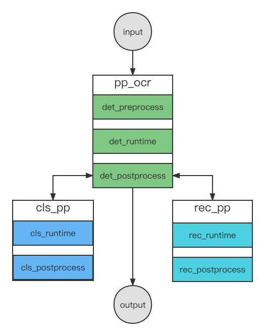

[English](README.md) | 简体中文
# PaddleOCR服务化部署示例

PaddleOCR 服务化部署示例是利用FastDeploy Serving搭建的服务化部署示例。FastDeploy Serving是基于Triton Inference Server框架封装的适用于高并发、高吞吐量请求的服务化部署框架，是一套可用于实际生产的完备且性能卓越的服务化部署框架。如没有高并发，高吞吐场景的需求，只想快速检验模型线上部署的可行性，请参考[simple_serving](../simple_serving/)

## 1. 部署环境准备
在服务化部署前，需确认服务化镜像的软硬件环境要求和镜像拉取命令，请参考[FastDeploy服务化部署](https://github.com/PaddlePaddle/FastDeploy/blob/develop/serving/README_CN.md)

## 2. PP-OCRv3服务化部署介绍
本文介绍了使用FastDeploy搭建PP-OCRv3模型服务的方法.
服务端必须在docker内启动,而客户端不是必须在docker容器内.

**本文所在路径($PWD)下的models里包含模型的配置和代码(服务端会加载模型和代码以启动服务), 需要将其映射到docker中使用.**

PP-OCRv3由det(检测)、cls(分类)和rec(识别)三个模型组成.

服务化部署串联的示意图如下图所示,其中`pp_ocr`串联了`det_preprocess`、`det_runtime`和`det_postprocess`,`cls_pp`串联了`cls_runtime`和`cls_postprocess`,`rec_pp`串联了`rec_runtime`和`rec_postprocess`.

特别的是,在`det_postprocess`中会多次调用`cls_pp`和`rec_pp`服务,来实现对检测结果(多个框)进行分类和识别,,最后返回给用户最终的识别结果。

<p align="center">
    <br>

    <br>
<p>


## 3. 服务端的使用

### 3.1 下载模型并使用服务化Docker
```bash
# 下载仓库代码
# 下载部署示例代码
git clone https://github.com/PaddlePaddle/FastDeploy.git
cd  FastDeploy/examples/vision/ocr/PP-OCR/serving/fastdeploy_serving

# 如果您希望从PaddleOCR下载示例代码，请运行
git clone https://github.com/PaddlePaddle/PaddleOCR.git
# 注意：如果当前分支找不到下面的fastdeploy测试代码，请切换到dygraph分支
git checkout dygraph
cd PaddleOCR/deploy/fastdeploy/serving/fastdeploy_serving

# 下载模型,图片和字典文件
wget https://paddleocr.bj.bcebos.com/PP-OCRv3/chinese/ch_PP-OCRv3_det_infer.tar
tar xvf ch_PP-OCRv3_det_infer.tar && mv ch_PP-OCRv3_det_infer 1
mv 1/inference.pdiparams 1/model.pdiparams && mv 1/inference.pdmodel 1/model.pdmodel
mv 1 models/det_runtime/ && rm -rf ch_PP-OCRv3_det_infer.tar

wget https://paddleocr.bj.bcebos.com/dygraph_v2.0/ch/ch_ppocr_mobile_v2.0_cls_infer.tar
tar xvf ch_ppocr_mobile_v2.0_cls_infer.tar && mv ch_ppocr_mobile_v2.0_cls_infer 1
mv 1/inference.pdiparams 1/model.pdiparams && mv 1/inference.pdmodel 1/model.pdmodel
mv 1 models/cls_runtime/ && rm -rf ch_ppocr_mobile_v2.0_cls_infer.tar

wget https://paddleocr.bj.bcebos.com/PP-OCRv3/chinese/ch_PP-OCRv3_rec_infer.tar
tar xvf ch_PP-OCRv3_rec_infer.tar && mv ch_PP-OCRv3_rec_infer 1
mv 1/inference.pdiparams 1/model.pdiparams && mv 1/inference.pdmodel 1/model.pdmodel
mv 1 models/rec_runtime/ && rm -rf ch_PP-OCRv3_rec_infer.tar

mkdir models/pp_ocr/1 && mkdir models/rec_pp/1 && mkdir models/cls_pp/1

wget https://gitee.com/paddlepaddle/PaddleOCR/raw/release/2.6/ppocr/utils/ppocr_keys_v1.txt
mv ppocr_keys_v1.txt models/rec_postprocess/1/

wget https://gitee.com/paddlepaddle/PaddleOCR/raw/release/2.6/doc/imgs/12.jpg

# x.y.z为镜像版本号，需参照serving文档替换为数字
docker pull registry.baidubce.com/paddlepaddle/fastdeploy:x.y.z-gpu-cuda11.4-trt8.4-21.10
docker run -dit --net=host --name fastdeploy --shm-size="1g" -v $PWD:/ocr_serving registry.baidubce.com/paddlepaddle/fastdeploy:x.y.z-gpu-cuda11.4-trt8.4-21.10 bash
docker exec -it -u root fastdeploy bash
```

### 3.2 安装(在docker内)
```bash
ldconfig
apt-get install libgl1
```

#### 3.3 启动服务端(在docker内)
```bash
fastdeployserver --model-repository=/ocr_serving/models
```

参数:
  - `model-repository`(required): 整套模型streaming_pp_tts存放的路径.
  - `http-port`(optional): HTTP服务的端口号. 默认: `8000`. 本示例中未使用该端口.
  - `grpc-port`(optional): GRPC服务的端口号. 默认: `8001`.
  - `metrics-port`(optional): 服务端指标的端口号. 默认: `8002`. 本示例中未使用该端口.


## 4. 客户端的使用
### 4.1 安装
```bash
pip3 install tritonclient[all]
```

### 4.2 发送请求
```bash
python3 client.py
```

## 5.配置修改
当前默认配置在GPU上运行， 如果要在CPU或其他推理引擎上运行。 需要修改`models/runtime/config.pbtxt`中配置，详情请参考[配置文档](../../../../../serving/docs/zh_CN/model_configuration.md)

## 6. 其他指南

- 使用PP-OCRv2进行服务化部署, 除了自行准备PP-OCRv2模型之外, 只需手动添加一行代码即可.
在[model.py](./models/det_postprocess/1/model.py#L109)文件**109行添加以下代码**：
```
self.rec_preprocessor.cls_image_shape[1] = 32
```

- [使用 VisualDL 进行 Serving 可视化部署](https://github.com/PaddlePaddle/FastDeploy/blob/develop/serving/docs/zh_CN/vdl_management.md)
通过VisualDL的可视化界面对PP-OCRv3进行服务化部署只需要如下三步：
```text
1. 载入模型库：./vision/ocr/PP-OCRv3/serving
2. 下载模型资源文件：点击det_runtime模型，点击版本号1添加预训练模型，选择文字识别模型ch_PP-OCRv3_det进行下载。点击cls_runtime模型，点击版本号1添加预训练模型，选择文字识别模型ch_ppocr_mobile_v2.0_cls进行下载。点击rec_runtime模型，点击版本号1添加预训练模型，选择文字识别模型ch_PP-OCRv3_rec进行下载。点击rec_postprocess模型，点击版本号1添加预训练模型，选择文字识别模型ch_PP-OCRv3_rec进行下载。
3. 启动服务：点击启动服务按钮，输入启动参数。
```
 <p align="center">
  
</p>

## 7. 常见问题
- [如何编写客户端 HTTP/GRPC 请求](https://github.com/PaddlePaddle/FastDeploy/blob/develop/serving/docs/zh_CN/client.md)
- [如何编译服务化部署镜像](https://github.com/PaddlePaddle/FastDeploy/blob/develop/serving/docs/zh_CN/compile.md)
- [服务化部署原理及动态Batch介绍](https://github.com/PaddlePaddle/FastDeploy/blob/develop/serving/docs/zh_CN/demo.md)
- [模型仓库介绍](https://github.com/PaddlePaddle/FastDeploy/blob/develop/serving/docs/zh_CN/model_repository.md)
