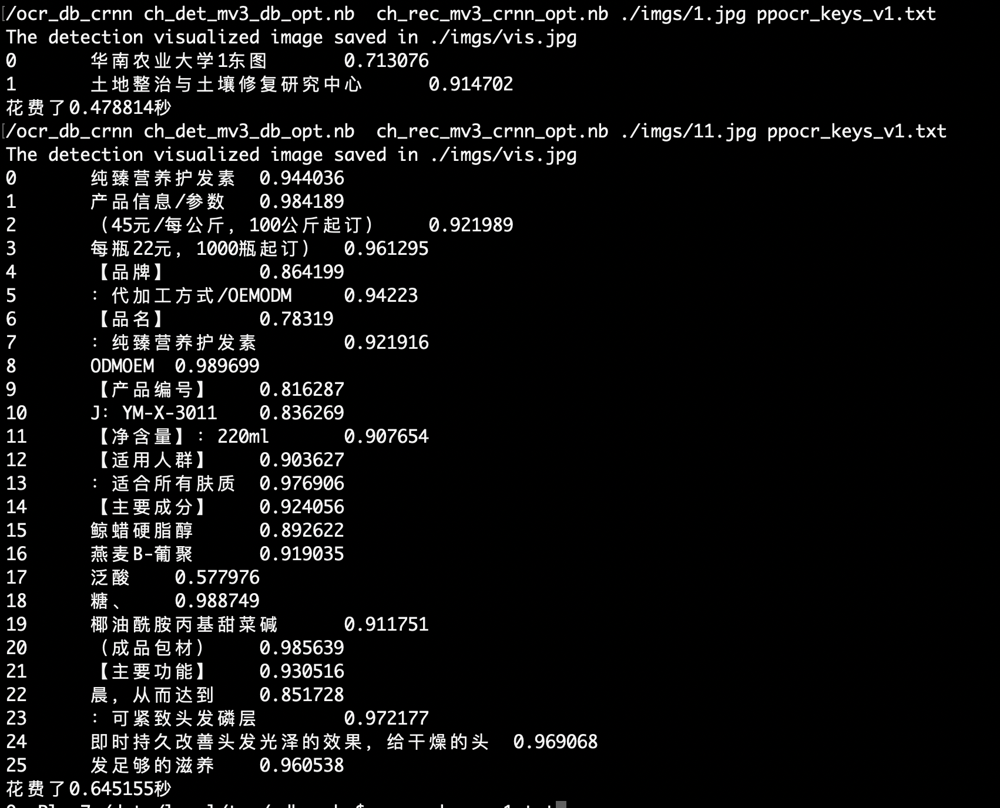

# Tutorial of PaddleOCR Mobile deployment

This tutorial will introduce how to use paddle-lite to deploy paddleOCR ultra-lightweight Chinese and English detection models on mobile phones.

addle Lite is a lightweight inference engine for PaddlePaddle.
It provides efficient inference capabilities for mobile phones and IOTs,
and extensively integrates cross-platform hardware to provide lightweight
deployment solutions for end-side deployment issues.

## 1. Preparation

- Computer (for Compiling Paddle Lite)
- Mobile phone (arm7 or arm8)

## 2. Build ncnn library
[build for Docker](https://paddle-lite.readthedocs.io/zh/latest/user_guides/source_compile.html#docker)
[build for Linux](https://paddle-lite.readthedocs.io/zh/latest/user_guides/source_compile.html#android)
[build for MAC OS](https://paddle-lite.readthedocs.io/zh/latest/user_guides/source_compile.html#id13)
[build for windows](https://paddle-lite.readthedocs.io/zh/latest/demo_guides/x86.html#id4)

## 3. Download prebuild library for android and ios

|Platform|Prebuild library Download Link|
|-|-|
|Android|[arm7](https://paddlelite-data.bj.bcebos.com/Release/2.6.1/Android/inference_lite_lib.android.armv7.gcc.c++_static.with_extra.CV_ON.tar.gz) / [arm8](https://paddlelite-data.bj.bcebos.com/Release/2.6.1/Android/inference_lite_lib.android.armv8.gcc.c++_static.with_extra.CV_ON.tar.gz)|
|IOS|[arm7](https://paddlelite-data.bj.bcebos.com/Release/2.6.1/iOS/inference_lite_lib.ios.armv7.with_extra.CV_ON.tar.gz) / [arm8](https://paddlelite-data.bj.bcebos.com/Release/2.6.1/iOS/inference_lite_lib.ios64.armv8.with_extra.CV_ON.tar.gz)|
|x86(Linux)|[预测库](https://paddlelite-data.bj.bcebos.com/Release/2.6.1/X86/Linux/inference_lite_lib.x86.linux.tar.gz)|


The structure of the prediction library is as follows:

```
inference_lite_lib.android.armv8/
|-- cxx                                        C++ prebuild library
|   |-- include                                C++
|   |   |-- paddle_api.h
|   |   |-- paddle_image_preprocess.h
|   |   |-- paddle_lite_factory_helper.h
|   |   |-- paddle_place.h
|   |   |-- paddle_use_kernels.h
|   |   |-- paddle_use_ops.h
|   |   `-- paddle_use_passes.h
|   `-- lib  
|       |-- libpaddle_api_light_bundled.a             C++ static library
|       `-- libpaddle_light_api_shared.so             C++ dynamic library
|-- java                                     Java predict library
|   |-- jar
|   |   `-- PaddlePredictor.jar
|   |-- so
|   |   `-- libpaddle_lite_jni.so
|   `-- src
|-- demo                                     C++ and java demo
|   |-- cxx  
|   `-- java  
```


## 4. Inference Model Optimization

Paddle Lite provides a variety of strategies to automatically optimize the original training model, including quantization, sub-graph fusion, hybrid scheduling, Kernel optimization and so on. In order to make the optimization process more convenient and easy to use, Paddle Lite provide opt tools to automatically complete the optimization steps and output a lightweight, optimal executable model.

If you use PaddleOCR 8.6M OCR model to deploy, you can directly download the optimized model.


|Introduction|Detection model|Recognition model|Paddle Lite branch |
|-|-|-|-|
|lightweight Chinese OCR optimized model|[Download](https://paddleocr.bj.bcebos.com/deploy/lite/ch_det_mv3_db_opt.nb)|[Download](https://paddleocr.bj.bcebos.com/deploy/lite/ch_rec_mv3_crnn_opt.nb)|develop|

If the model to be deployed is not in the above table, you need to follow the steps below to obtain the optimized model.

```
git clone https://github.com/PaddlePaddle/Paddle-Lite.git
cd Paddle-Lite
git checkout develop
./lite/tools/build.sh build_optimize_tool
```

The `opt` tool can be obtained by compiling Paddle Lite.

After the compilation is complete, the opt file is located under `build.opt/lite/api/`.

The `opt` can optimize the inference model saved by paddle.io.save_inference_model to get the model that the paddlelite API can use.

The usage of opt is as follows：
```
wget  https://paddleocr.bj.bcebos.com/ch_models/ch_det_mv3_db_infer.tar && tar xf ch_det_mv3_db_infer.tar
wget  https://paddleocr.bj.bcebos.com/ch_models/ch_rec_mv3_crnn_infer.tar && tar xf ch_rec_mv3_crnn_infer.tar

./opt --model_file=./ch_det_mv3_db/model --param_file=./ch_det_mv3_db/params --optimize_out_type=naive_buffer --optimize_out=./ch_det_mv3_db_opt --valid_targets=arm
./opt --model_file=./ch_rec_mv3_crnn/model --param_file=./ch_rec_mv3_crnn/params --optimize_out_type=naive_buffer --optimize_out=./ch_rec_mv3_crnn_opt --valid_targets=arm

```

When the above code command is completed, there will be two more files `ch_det_mv3_db_opt.nb`,
`ch_rec_mv3_crnn_opt.nb` in the current directory, which is the converted model file.

## 5. Run optimized model on Phone

1. Prepare an Android phone with arm8. If the compiled prediction library and opt file are armv7, you need an arm7 phone and modify ARM_ABI = arm7 in the Makefile.

2. Make sure the phone is connected to the computer, open the USB debugging option of the phone, and select the file transfer mode.

3. Install the adb tool on the computer.
    3.1 Install ADB for MAC
    ```
    brew cask install android-platform-tools
    ```
    3.2 Install ADB for Linux
    ```
    sudo apt update
    sudo apt install -y wget adb
    ```
    3.3 Install ADB for windows
    [Download Link](https://developer.android.com/studio)

    Verify whether adb is installed successfully
    ```
    $ adb devices

    List of devices attached
    744be294    device
    ```

    If there is `device` output, it means the installation was successful.

4. Prepare optimized models, prediction library files, test images and dictionary files used.

```
 git clone https://github.com/PaddlePaddle/PaddleOCR.git
 cd PaddleOCR/deploy/lite/
 # run prepare.sh
 sh prepare.sh /{lite prediction library path}/inference_lite_lib.android.armv8

 #
 cd /{lite prediction library path}/inference_lite_lib.android.armv8/
 cd demo/cxx/ocr/
 # copy paddle-lite C++ .so file to debug/ directory
 cp ../../../cxx/lib/libpaddle_light_api_shared.so ./debug/

 cd inference_lite_lib.android.armv8/demo/cxx/ocr/
 cp ../../../cxx/lib/libpaddle_light_api_shared.so ./debug/

```

Prepare the test image, taking `PaddleOCR/doc/imgs/11.jpg` as an example, copy the image file to the `demo/cxx/ocr/debug/` folder.
Prepare the model files optimized by the lite opt tool, `ch_det_mv3_db_opt.nb, ch_rec_mv3_crnn_opt.nb`,
and place them under the `demo/cxx/ocr/debug/` folder.


The structure of the OCR demo is as follows after the above command is executed:
```
demo/cxx/ocr/
|-- debug/  
|   |--ch_det_mv3_db_opt.nb             Detection model
|   |--ch_rec_mv3_crnn_opt.nb           Recognition model
|   |--11.jpg                           image for OCR
|   |--ppocr_keys_v1.txt                Dictionary file
|   |--libpaddle_light_api_shared.so    C++ .so file
|   |--config.txt                       Config file
|-- config.txt  
|-- crnn_process.cc  
|-- crnn_process.h
|-- db_post_process.cc  
|-- db_post_process.h
|-- Makefile  
|-- ocr_db_crnn.cc  

```

5. Run Model on phone

```
cd inference_lite_lib.android.armv8/demo/cxx/ocr/
make -j
mv ocr_db_crnn ./debug/
adb push debug /data/local/tmp/
adb shell
cd /data/local/tmp/debug
export LD_LIBRARY_PATH=/data/local/tmp/debug:$LD_LIBRARY_PATH
# run model
./ocr_db_crnn ch_det_mv3_db_opt.nb  ch_rec_mv3_crnn_opt.nb ./11.jpg  ppocr_keys_v1.txt
```

The outputs are as follows:

<div align="center">
    
</div>
