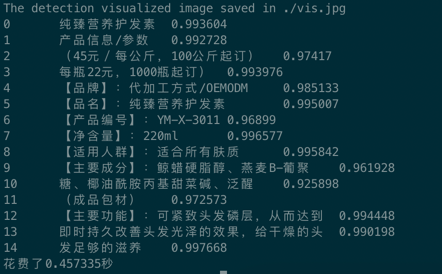

# Tutorial of PaddleOCR Mobile deployment

This tutorial will introduce how to use [Paddle Lite](https://github.com/PaddlePaddle/Paddle-Lite) to deploy paddleOCR ultra-lightweight Chinese and English detection models on mobile phones.

paddle-lite is a lightweight inference engine for PaddlePaddle. It provides efficient inference capabilities for mobile phones and IoTs, and extensively integrates cross-platform hardware to provide lightweight deployment solutions for end-side deployment issues.

## 1. Preparation

### Preparation environment

- Computer (for Compiling Paddle Lite)
- Mobile phone (arm7 or arm8)

### 1.1 Prepare the cross-compilation environment
The cross-compilation environment is used to compile C++ demos of Paddle Lite and PaddleOCR.
Supports multiple development environments.

For the compilation process of different development environments, please refer to the corresponding documents.

1. [Docker](https://paddle-lite.readthedocs.io/zh/latest/source_compile/compile_env.html#docker)
2. [Linux](https://paddle-lite.readthedocs.io/zh/latest/source_compile/compile_env.html#linux)
3. [MAC OS](https://paddle-lite.readthedocs.io/zh/latest/source_compile/compile_env.html#mac-os)

### 1.2 Prepare Paddle-Lite library

There are two ways to obtain the Paddle-Lite library：
- 1. Download directly, the download link of the Paddle-Lite library is as follows：

      | Platform | Paddle-Lite library download link |
      |---|---|
      |Android|[arm7](https://github.com/PaddlePaddle/Paddle-Lite/releases/download/v2.9/inference_lite_lib.android.armv7.gcc.c++_shared.with_extra.with_cv.tar.gz) / [arm8](https://github.com/PaddlePaddle/Paddle-Lite/releases/download/v2.9/inference_lite_lib.android.armv8.gcc.c++_shared.with_extra.with_cv.tar.gz)|
      |IOS|[arm7](https://github.com/PaddlePaddle/Paddle-Lite/releases/download/v2.9/inference_lite_lib.ios.armv7.with_cv.with_extra.with_log.tiny_publish.tar.gz) / [arm8](https://github.com/PaddlePaddle/Paddle-Lite/releases/download/v2.9/inference_lite_lib.ios.armv8.with_cv.with_extra.with_log.tiny_publish.tar.gz)|

      Note: 1. The above Paddle-Lite library is compiled from the Paddle-Lite 2.9 branch. For more information about Paddle-Lite 2.9, please refer to [link](https://github.com/PaddlePaddle/Paddle-Lite/releases/tag/v2.9).

- 2. [Recommended] Compile Paddle-Lite to get the prediction library. The compilation method of Paddle-Lite is as follows：
```
git clone https://github.com/PaddlePaddle/Paddle-Lite.git
cd Paddle-Lite
# Switch to Paddle-Lite release/v2.8 stable branch
git checkout release/v2.8
./lite/tools/build_android.sh  --arch=armv8  --with_cv=ON --with_extra=ON
```

Note: When compiling Paddle-Lite to obtain the Paddle-Lite library, you need to turn on the two options `--with_cv=ON --with_extra=ON`, `--arch` means the `arm` version, here is designated as armv8,

More compilation commands refer to the introduction [link](https://paddle-lite.readthedocs.io/zh/latest/source_compile/compile_andriod.html) 。

After directly downloading the Paddle-Lite library and decompressing it, you can get the `inference_lite_lib.android.armv8/` folder, and the Paddle-Lite library obtained by compiling Paddle-Lite is located
`Paddle-Lite/build.lite.android.armv8.gcc/inference_lite_lib.android.armv8/` folder.

The structure of the prediction library is as follows:
```
inference_lite_lib.android.armv8/
|-- cxx                                        C++ prebuild library
|   |-- include                                C++
|   |   |-- paddle_api.h
|   |   |-- paddle_image_preprocess.h
|   |   |-- paddle_lite_factory_helper.h
|   |   |-- paddle_place.h
|   |   |-- paddle_use_kernels.h
|   |   |-- paddle_use_ops.h
|   |   `-- paddle_use_passes.h
|   `-- lib                                           C++ library
|       |-- libpaddle_api_light_bundled.a             C++ static library
|       `-- libpaddle_light_api_shared.so             C++ dynamic library
|-- java                                     Java library
|   |-- jar
|   |   `-- PaddlePredictor.jar
|   |-- so
|   |   `-- libpaddle_lite_jni.so
|   `-- src
|-- demo                                     C++ and Java demo
|   |-- cxx                                  C++ demo
|   `-- java                                 Java demo
```

## 2 Run

### 2.1 Inference Model Optimization

Paddle Lite provides a variety of strategies to automatically optimize the original training model, including quantization, sub-graph fusion, hybrid scheduling, Kernel optimization and so on. In order to make the optimization process more convenient and easy to use, Paddle Lite provide opt tools to automatically complete the optimization steps and output a lightweight, optimal executable model.

If you have prepared the model file ending in .nb, you can skip this step.

The following table also provides a series of models that can be deployed on mobile phones to recognize Chinese. You can directly download the optimized model.

|Version|Introduction|Model size|Detection model|Text Direction model|Recognition model|Paddle-Lite branch|
|---|---|---|---|---|---|---|
|V2.0|extra-lightweight chinese OCR optimized model|7.8M|[download link](https://paddleocr.bj.bcebos.com/dygraph_v2.0/lite/ch_ppocr_mobile_v2.0_det_opt.nb)|[download link](https://paddleocr.bj.bcebos.com/dygraph_v2.0/lite/ch_ppocr_mobile_v2.0_cls_opt.nb)|[download link](https://paddleocr.bj.bcebos.com/dygraph_v2.0/lite/ch_ppocr_mobile_v2.0_rec_opt.nb)|v2.9|
|V2.0(slim)|extra-lightweight chinese OCR optimized model|3.3M|[download link](https://paddleocr.bj.bcebos.com/dygraph_v2.0/lite/ch_ppocr_mobile_v2.0_det_slim_opt.nb)|[download link](https://paddleocr.bj.bcebos.com/dygraph_v2.0/lite/ch_ppocr_mobile_v2.0_cls_slim_opt.nb)|[download link](https://paddleocr.bj.bcebos.com/dygraph_v2.0/lite/ch_ppocr_mobile_v2.0_rec_slim_opt.nb)|v2.9|

If you directly use the model in the above table for deployment, you can skip the following steps and directly read [Section 2.2](#2.2 Run optimized model on Phone).

If the model to be deployed is not in the above table, you need to follow the steps below to obtain the optimized model.

The `opt` tool can be obtained by compiling Paddle Lite.
```
git clone https://github.com/PaddlePaddle/Paddle-Lite.git
cd Paddle-Lite
git checkout release/v2.9
./lite/tools/build.sh build_optimize_tool
```

After the compilation is complete, the opt file is located under build.opt/lite/api/, You can view the operating options and usage of opt in the following ways:

```
cd build.opt/lite/api/
./opt
```

|Options|Description|
|---|---|
|--model_dir|The path of the PaddlePaddle model to be optimized (non-combined form)|
|--model_file|The network structure file path of the PaddlePaddle model (combined form) to be optimized|
|--param_file|The weight file path of the PaddlePaddle model (combined form) to be optimized|
|--optimize_out_type|Output model type, currently supports two types: protobuf and naive_buffer, among which naive_buffer is a more lightweight serialization/deserialization implementation. If you need to perform model prediction on the mobile side, please set this option to naive_buffer. The default is protobuf|
|--optimize_out|The output path of the optimized model|
|--valid_targets|The executable backend of the model, the default is arm. Currently it supports x86, arm, opencl, npu, xpu, multiple backends can be specified at the same time (separated by spaces), and Model Optimize Tool will automatically select the best method. If you need to support Huawei NPU (DaVinci architecture NPU equipped with Kirin 810/990 Soc), it should be set to npu, arm|
|--record_tailoring_info|When using the function of cutting library files according to the model, set this option to true to record the kernel and OP information contained in the optimized model. The default is false|

`--model_dir` is suitable for the non-combined mode of the model to be optimized, and the inference model of PaddleOCR is the combined mode, that is, the model structure and model parameters are stored in a single file.

The following takes the ultra-lightweight Chinese model of PaddleOCR as an example to introduce the use of the compiled opt file to complete the conversion of the inference model to the Paddle-Lite optimized model

```
# [Recommendation] Download the Chinese and English inference model of PaddleOCR V2.0
wget  https://paddleocr.bj.bcebos.com/dygraph_v2.0/slim/ch_ppocr_mobile_v2.0_det_slim_infer.tar && tar xf  ch_ppocr_mobile_v2.0_det_slim_infer.tar
wget  https://paddleocr.bj.bcebos.com/dygraph_v2.0/slim/ch_ppocr_mobile_v2.0_rec_slim_infer.tar && tar xf  ch_ppocr_mobile_v2.0_rec_slim_infer.tar
wget  https://paddleocr.bj.bcebos.com/dygraph_v2.0/slim/ch_ppocr_mobile_v2.0_cls_slim_infer.tar && tar xf  ch_ppocr_mobile_v2.0_cls_slim_infer.tar
# Convert V2.0 detection model
./opt --model_file=./ch_ppocr_mobile_v2.0_det_slim_infer/inference.pdmodel  --param_file=./ch_ppocr_mobile_v2.0_det_slim_infer/inference.pdiparams  --optimize_out=./ch_ppocr_mobile_v2.0_det_slim_opt --valid_targets=arm  --optimize_out_type=naive_buffer
# Convert V2.0 recognition model
./opt --model_file=./ch_ppocr_mobile_v2.0_rec_slim_infer/inference.pdmodel  --param_file=./ch_ppocr_mobile_v2.0_rec_slim_infer/inference.pdiparams  --optimize_out=./ch_ppocr_mobile_v2.0_rec_slim_opt --valid_targets=arm  --optimize_out_type=naive_buffer
# Convert V2.0 angle classifier model
./opt --model_file=./ch_ppocr_mobile_v2.0_cls_slim_infer/inference.pdmodel  --param_file=./ch_ppocr_mobile_v2.0_cls_slim_infer/inference.pdiparams  --optimize_out=./ch_ppocr_mobile_v2.0_cls_slim_opt --valid_targets=arm  --optimize_out_type=naive_buffer

```

After the conversion is successful, there will be more files ending with `.nb` in the inference model directory, which is the successfully converted model file.

<a name="2.2 Run optimized model on Phone"></a>
### 2.2 Run optimized model on Phone

Some preparatory work is required first.
 1. Prepare an Android phone with arm8. If the compiled prediction library and opt file are armv7, you need an arm7 phone and modify ARM_ABI = arm7 in the Makefile.
 2. Make sure the phone is connected to the computer, open the USB debugging option of the phone, and select the file transfer mode.
 3. Install the adb tool on the computer.

    3.1. Install ADB for MAC:
    ```
    brew cask install android-platform-tools
    ```
    3.2. Install ADB for Linux
    ```
    sudo apt update
    sudo apt install -y wget adb
    ```
    3.3. Install ADB for windows

    To install on win, you need to go to Google's Android platform to download the adb package for installation：[link](https://developer.android.com/studio)

    Verify whether adb is installed successfully
     ```
    adb devices
    ```
    If there is device output, it means the installation is successful。
    ```
       List of devices attached
       744be294    device
    ```

 4. Prepare optimized models, prediction library files, test images and dictionary files used.
 ```
 git clone https://github.com/PaddlePaddle/PaddleOCR.git
 cd PaddleOCR/deploy/lite/
 # run prepare.sh
 sh prepare.sh /{lite prediction library path}/inference_lite_lib.android.armv8

 #
 cd /{lite prediction library path}/inference_lite_lib.android.armv8/
 cd demo/cxx/ocr/
 # copy paddle-lite C++ .so file to debug/ directory
 cp ../../../cxx/lib/libpaddle_light_api_shared.so ./debug/

 cd inference_lite_lib.android.armv8/demo/cxx/ocr/
 cp ../../../cxx/lib/libpaddle_light_api_shared.so ./debug/
 ```

Prepare the test image, taking PaddleOCR/doc/imgs/11.jpg as an example, copy the image file to the demo/cxx/ocr/debug/ folder. Prepare the model files optimized by the lite opt tool, ch_det_mv3_db_opt.nb, ch_rec_mv3_crnn_opt.nb, and place them under the demo/cxx/ocr/debug/ folder.

The structure of the OCR demo is as follows after the above command is executed:

```
demo/cxx/ocr/
|-- debug/  
|   |--ch_ppocr_mobile_v2.0_det_slim_opt.nb           Detection model
|   |--ch_ppocr_mobile_v2.0_rec_slim_opt.nb           Recognition model
|   |--ch_ppocr_mobile_v2.0_cls_slim_opt.nb           Text direction classification model
|   |--11.jpg                           Image for OCR
|   |--ppocr_keys_v1.txt                Dictionary file
|   |--libpaddle_light_api_shared.so    C++ .so file
|   |--config.txt                       Config file
|-- config.txt                  Config file
|-- cls_process.cc              Pre-processing and post-processing files for the angle classifier
|-- cls_process.h
|-- crnn_process.cc             Pre-processing and post-processing files for the CRNN model
|-- crnn_process.h
|-- db_post_process.cc          Pre-processing and post-processing files for the DB model
|-- db_post_process.h
|-- Makefile  
|-- ocr_db_crnn.cc              C++ main code
```

#### 注意：
1. `ppocr_keys_v1.txt` is a Chinese dictionary file. If the nb model is used for English recognition or other language recognition, dictionary file should be replaced with a dictionary of the corresponding language. PaddleOCR provides a variety of dictionaries under ppocr/utils/, including:
```
dict/french_dict.txt     # french
dict/german_dict.txt     # german
ic15_dict.txt       # english
dict/japan_dict.txt      # japan
dict/korean_dict.txt     # korean
ppocr_keys_v1.txt   # chinese
```
For more language model and dictionary file correspondence, please refer to [Document](../../doc/doc_en/multi_languages_en.md#inference)

2.  `config.txt` of the detector and classifier, as shown below:
```
max_side_len  960         #  Limit the maximum image height and width to 960
det_db_thresh  0.3        # Used to filter the binarized image of DB prediction, setting 0.-0.3 has no obvious effect on the result
det_db_box_thresh  0.5    # DDB post-processing filter box threshold, if there is a missing box detected, it can be reduced as appropriate
det_db_unclip_ratio  1.6  # Indicates the compactness of the text box, the smaller the value, the closer the text box to the text
use_direction_classify  0  # Whether to use the direction classifier, 0 means not to use, 1 means to use
```

 5. Run Model on phone

After the above steps are completed, you can use adb to push the file to the phone to run, the steps are as follows:

 ```
 # Execute the compilation and get the executable file ocr_db_crnn.
 # The first execution of this command will download dependent libraries such as opencv. After the download is complete, you need to execute it again
 make -j
 # Move the compiled executable file to the debug folder
 mv ocr_db_crnn ./debug/
 # Push the debug folder to the phone
 adb push debug /data/local/tmp/
 adb shell
 cd /data/local/tmp/debug
 export LD_LIBRARY_PATH=${PWD}:$LD_LIBRARY_PATH
 # The use of ocr_db_crnn is:
 # ./ocr_db_crnn Detection model file Orientation classifier model file Recognition model file Test image path Dictionary file path
 ./ocr_db_crnn ch_ppocr_mobile_v2.0_det_opt.nb  ch_ppocr_mobile_v2.0_rec_opt.nb  ch_ppocr_mobile_v2.0_cls_opt.nb  ./11.jpg  ppocr_keys_v1.txt
 ```

If you modify the code, you need to recompile and push to the phone.

The outputs are as follows:

<div align="center">
    
</div>

## FAQ

Q1: What if I want to change the model, do I need to run it again according to the process?

A1: If you have performed the above steps, you only need to replace the .nb model file to complete the model replacement.

Q2: How to test with another picture?

A2: Replace the .jpg test image under ./debug with the image you want to test, and run adb push to push new image to the phone.

Q3: How to package it into the mobile APP?

A3: This demo aims to provide the core algorithm part that can run OCR on mobile phones. Further, PaddleOCR/deploy/android_demo is an example of encapsulating this demo into a mobile app for reference.
