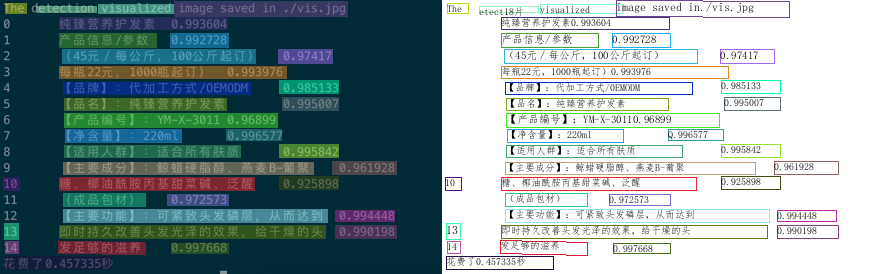

# Paddle2ONNX model transformation and prediction

This chapter describes how the PaddleOCR model is converted into an ONNX model and predicted based on the ONNXRuntime engine.

## 1. Environment preparation

Need to prepare PaddleOCR, Paddle2ONNX model conversion environment, and ONNXRuntime prediction environment

###  PaddleOCR

Clone the PaddleOCR warehouse, use the release/2.6 branch, and install it.

```
git clone  -b release/2.6 https://github.com/PaddlePaddle/PaddleOCR.git
cd PaddleOCR && python3.7 setup.py install
```

###  Paddle2ONNX

Paddle2ONNX supports converting the PaddlePaddle model format to the ONNX model format. The operator currently supports exporting ONNX Opset 9~11 stably, and some Paddle operators support lower ONNX Opset conversion.
For more details, please refer to [Paddle2ONNX](https://github.com/PaddlePaddle/Paddle2ONNX/blob/develop/README_en.md)


- install Paddle2ONNX
```
python3.7 -m pip install paddle2onnx
```

- install ONNXRuntime
```
# 建议安装 1.9.0 版本，可根据环境更换版本号
python3.7 -m pip install onnxruntime==1.9.0
```

## 2. Model conversion


- Paddle model download

There are two ways to obtain the Paddle model: Download the prediction model provided by PaddleOCR in [model_list](../../doc/doc_en/models_list_en.md);
Refer to [Model Export Instructions](../../doc/doc_en/inference_en.md#1-convert-training-model-to-inference-model) to convert the trained weights to inference_model.

Take the PP-OCRv3 detection, recognition, and classification model as an example:

```
wget -nc  -P ./inference https://paddleocr.bj.bcebos.com/PP-OCRv3/chinese/ch_PP-OCRv3_det_infer.tar
cd ./inference && tar xf ch_PP-OCRv3_det_infer.tar && cd ..

wget -nc  -P ./inference https://paddleocr.bj.bcebos.com/PP-OCRv3/chinese/ch_PP-OCRv3_rec_infer.tar
cd ./inference && tar xf ch_PP-OCRv3_rec_infer.tar && cd ..

wget -nc  -P ./inference https://paddleocr.bj.bcebos.com/dygraph_v2.0/ch/ch_ppocr_mobile_v2.0_cls_infer.tar
cd ./inference && tar xf ch_ppocr_mobile_v2.0_cls_infer.tar && cd ..
```

- convert model

Convert Paddle inference model to ONNX model format using Paddle2ONNX:

```
paddle2onnx --model_dir ./inference/ch_PP-OCRv3_det_infer \
--model_filename inference.pdmodel \
--params_filename inference.pdiparams \
--save_file ./inference/det_onnx/model.onnx \
--opset_version 10 \
--input_shape_dict="{'x':[-1,3,-1,-1]}" \
--enable_onnx_checker True

paddle2onnx --model_dir ./inference/ch_PP-OCRv3_rec_infer \
--model_filename inference.pdmodel \
--params_filename inference.pdiparams \
--save_file ./inference/rec_onnx/model.onnx \
--opset_version 10 \
--input_shape_dict="{'x':[-1,3,-1,-1]}" \
--enable_onnx_checker True

paddle2onnx --model_dir ./inference/ch_ppocr_mobile_v2.0_cls_infer \
--model_filename ch_ppocr_mobile_v2.0_cls_infer/inference.pdmodel \
--params_filename ch_ppocr_mobile_v2.0_cls_infer/inference.pdiparams \
--save_file ./inferencecls_onnx/model.onnx \
--opset_version 10 \
--input_shape_dict="{'x':[-1,3,-1,-1]}" \
--enable_onnx_checker True
```
After execution, the ONNX model will be saved in `./inference/det_onnx/`, `./inference/rec_onnx/`, `./inference/cls_onnx/` paths respectively

* Note: For the OCR model, the conversion process must be in the form of dynamic shape, that is, add the option --input_shape_dict="{'x': [-1, 3, -1, -1]}", otherwise the prediction result may be the same as Predicting directly with Paddle is slightly different.
  In addition, the following models do not currently support conversion to ONNX models:
  NRTR, SAR, RARE, SRN

## 3. prediction

Take the Chinese OCR model as an example, use **ONNXRuntime** to predict and execute the following commands:

```
python3.7 tools/infer/predict_system.py --use_gpu=False --use_onnx=True \
--det_model_dir=./inference/det_onnx/model.onnx  \
--rec_model_dir=./inference/rec_onnx/model.onnx  \
--cls_model_dir=./inference/cls_onnx/model.onnx  \
--image_dir=./deploy/lite/imgs/lite_demo.png
```

Taking the Chinese OCR model as an example, use **Paddle Inference** to predict and execute the following commands:

```
python3.7 tools/infer/predict_system.py --use_gpu=False \
--cls_model_dir=./inference/ch_ppocr_mobile_v2.0_cls_infer \
--rec_model_dir=./inference/ch_PP-OCRv3_rec_infer \
--det_model_dir=./inference/ch_PP-OCRv3_det_infer \
--image_dir=./deploy/lite/imgs/lite_demo.png
```


After executing the command, the predicted identification information will be printed out in the terminal, and the visualization results will be saved under `./inference_results/`.

ONNXRuntime result：

<div align="center">
    
</div>

Paddle Inference result：

<div align="center">
    
</div>


Using ONNXRuntime to predict, terminal output:
```
[2022/02/22 17:48:27] root DEBUG: dt_boxes num : 38, elapse : 0.043187856674194336
[2022/02/22 17:48:27] root DEBUG: rec_res num  : 38, elapse : 0.592170000076294
[2022/02/22 17:48:27] root DEBUG: 0  Predict time of ./deploy/lite/imgs/lite_demo.png: 0.642s
[2022/02/22 17:48:27] root DEBUG: The, 0.984
[2022/02/22 17:48:27] root DEBUG: visualized, 0.882
[2022/02/22 17:48:27] root DEBUG: etect18片, 0.720
[2022/02/22 17:48:27] root DEBUG: image saved in./vis.jpg, 0.947
[2022/02/22 17:48:27] root DEBUG: 纯臻营养护发素0.993604, 0.996
[2022/02/22 17:48:27] root DEBUG: 产品信息/参数, 0.922
[2022/02/22 17:48:27] root DEBUG: 0.992728, 0.914
[2022/02/22 17:48:27] root DEBUG: （45元／每公斤，100公斤起订）, 0.926
[2022/02/22 17:48:27] root DEBUG: 0.97417, 0.977
[2022/02/22 17:48:27] root DEBUG: 每瓶22元，1000瓶起订）0.993976, 0.962
[2022/02/22 17:48:27] root DEBUG: 【品牌】：代加工方式/0EMODM, 0.945
[2022/02/22 17:48:27] root DEBUG: 0.985133, 0.980
[2022/02/22 17:48:27] root DEBUG: 【品名】：纯臻营养护发素, 0.921
[2022/02/22 17:48:27] root DEBUG: 0.995007, 0.883
[2022/02/22 17:48:27] root DEBUG: 【产品编号】：YM-X-30110.96899, 0.955
[2022/02/22 17:48:27] root DEBUG: 【净含量】：220ml, 0.943
[2022/02/22 17:48:27] root DEBUG: Q.996577, 0.932
[2022/02/22 17:48:27] root DEBUG: 【适用人群】：适合所有肤质, 0.913
[2022/02/22 17:48:27] root DEBUG: 0.995842, 0.969
[2022/02/22 17:48:27] root DEBUG: 【主要成分】：鲸蜡硬脂醇、燕麦B-葡聚, 0.883
[2022/02/22 17:48:27] root DEBUG: 0.961928, 0.964
[2022/02/22 17:48:27] root DEBUG: 10, 0.812
[2022/02/22 17:48:27] root DEBUG: 糖、椰油酰胺丙基甜菜碱、泛醒, 0.866
[2022/02/22 17:48:27] root DEBUG: 0.925898, 0.943
[2022/02/22 17:48:27] root DEBUG: （成品包材）, 0.974
[2022/02/22 17:48:27] root DEBUG: 0.972573, 0.961
[2022/02/22 17:48:27] root DEBUG: 【主要功能】：可紧致头发磷层，从而达到, 0.936
[2022/02/22 17:48:27] root DEBUG: 0.994448, 0.952
[2022/02/22 17:48:27] root DEBUG: 13, 0.998
[2022/02/22 17:48:27] root DEBUG: 即时持久改善头发光泽的效果，给干燥的头, 0.994
[2022/02/22 17:48:27] root DEBUG: 0.990198, 0.975
[2022/02/22 17:48:27] root DEBUG: 14, 0.977
[2022/02/22 17:48:27] root DEBUG: 发足够的滋养, 0.991
[2022/02/22 17:48:27] root DEBUG: 0.997668, 0.918
[2022/02/22 17:48:27] root DEBUG: 花费了0.457335秒, 0.901
[2022/02/22 17:48:27] root DEBUG: The visualized image saved in ./inference_results/lite_demo.png
[2022/02/22 17:48:27] root INFO: The predict total time is 0.7003889083862305
```

Using Paddle Inference to predict, terminal output:

```
[2022/02/22 17:47:25] root DEBUG: dt_boxes num : 38, elapse : 0.11791276931762695
[2022/02/22 17:47:27] root DEBUG: rec_res num  : 38, elapse : 2.6206860542297363
[2022/02/22 17:47:27] root DEBUG: 0  Predict time of ./deploy/lite/imgs/lite_demo.png: 2.746s
[2022/02/22 17:47:27] root DEBUG: The, 0.984
[2022/02/22 17:47:27] root DEBUG: visualized, 0.882
[2022/02/22 17:47:27] root DEBUG: etect18片, 0.720
[2022/02/22 17:47:27] root DEBUG: image saved in./vis.jpg, 0.947
[2022/02/22 17:47:27] root DEBUG: 纯臻营养护发素0.993604, 0.996
[2022/02/22 17:47:27] root DEBUG: 产品信息/参数, 0.922
[2022/02/22 17:47:27] root DEBUG: 0.992728, 0.914
[2022/02/22 17:47:27] root DEBUG: （45元／每公斤，100公斤起订）, 0.926
[2022/02/22 17:47:27] root DEBUG: 0.97417, 0.977
[2022/02/22 17:47:27] root DEBUG: 每瓶22元，1000瓶起订）0.993976, 0.962
[2022/02/22 17:47:27] root DEBUG: 【品牌】：代加工方式/0EMODM, 0.945
[2022/02/22 17:47:27] root DEBUG: 0.985133, 0.980
[2022/02/22 17:47:27] root DEBUG: 【品名】：纯臻营养护发素, 0.921
[2022/02/22 17:47:27] root DEBUG: 0.995007, 0.883
[2022/02/22 17:47:27] root DEBUG: 【产品编号】：YM-X-30110.96899, 0.955
[2022/02/22 17:47:27] root DEBUG: 【净含量】：220ml, 0.943
[2022/02/22 17:47:27] root DEBUG: Q.996577, 0.932
[2022/02/22 17:47:27] root DEBUG: 【适用人群】：适合所有肤质, 0.913
[2022/02/22 17:47:27] root DEBUG: 0.995842, 0.969
[2022/02/22 17:47:27] root DEBUG: 【主要成分】：鲸蜡硬脂醇、燕麦B-葡聚, 0.883
[2022/02/22 17:47:27] root DEBUG: 0.961928, 0.964
[2022/02/22 17:47:27] root DEBUG: 10, 0.812
[2022/02/22 17:47:27] root DEBUG: 糖、椰油酰胺丙基甜菜碱、泛醒, 0.866
[2022/02/22 17:47:27] root DEBUG: 0.925898, 0.943
[2022/02/22 17:47:27] root DEBUG: （成品包材）, 0.974
[2022/02/22 17:47:27] root DEBUG: 0.972573, 0.961
[2022/02/22 17:47:27] root DEBUG: 【主要功能】：可紧致头发磷层，从而达到, 0.936
[2022/02/22 17:47:27] root DEBUG: 0.994448, 0.952
[2022/02/22 17:47:27] root DEBUG: 13, 0.998
[2022/02/22 17:47:27] root DEBUG: 即时持久改善头发光泽的效果，给干燥的头, 0.994
[2022/02/22 17:47:27] root DEBUG: 0.990198, 0.975
[2022/02/22 17:47:27] root DEBUG: 14, 0.977
[2022/02/22 17:47:27] root DEBUG: 发足够的滋养, 0.991
[2022/02/22 17:47:27] root DEBUG: 0.997668, 0.918
[2022/02/22 17:47:27] root DEBUG: 花费了0.457335秒, 0.901
[2022/02/22 17:47:27] root DEBUG: The visualized image saved in ./inference_results/lite_demo.png
[2022/02/22 17:47:27] root INFO: The predict total time is 2.8338775634765625
```
