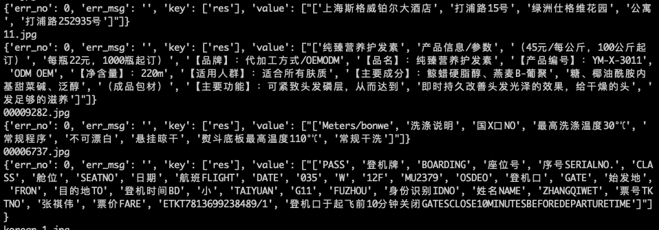

# PPOCR 服务化部署

([English](./README.md)|简体中文)

PaddleOCR提供2种服务部署方式：
- 基于PaddleHub Serving的部署：代码路径为"`./deploy/hubserving`"，使用方法参考[文档](../../deploy/hubserving/readme.md)；
- 基于PaddleServing的部署：代码路径为"`./deploy/pdserving`"，按照本教程使用。

# 基于PaddleServing的服务部署

本文档将介绍如何使用[PaddleServing](https://github.com/PaddlePaddle/Serving/blob/develop/README_CN.md)工具部署PPOCR
动态图模型的pipeline在线服务。

相比较于hubserving部署，PaddleServing具备以下优点：
- 支持客户端和服务端之间高并发和高效通信
- 支持 工业级的服务能力 例如模型管理，在线加载，在线A/B测试等
- 支持 多种编程语言 开发客户端，例如C++, Python和Java

更多有关PaddleServing服务化部署框架介绍和使用教程参考[文档](https://github.com/PaddlePaddle/Serving/blob/develop/README_CN.md)。

## 目录
- [环境准备](#环境准备)
- [模型转换](#模型转换)
- [Paddle Serving pipeline部署](#部署)
- [FAQ](#FAQ)

<a name="环境准备"></a>
## 环境准备

需要准备PaddleOCR的运行环境和Paddle Serving的运行环境。

- 准备PaddleOCR的运行环境参考[链接](../../doc/doc_ch/installation.md)

- 准备PaddleServing的运行环境，步骤如下

1. 安装serving，用于启动服务
    ```
    pip3 install paddle-serving-server==0.5.0 # for CPU
    pip3 install paddle-serving-server-gpu==0.5.0 # for GPU
    # 其他GPU环境需要确认环境再选择执行如下命令
    pip3 install paddle-serving-server-gpu==0.5.0.post9 # GPU with CUDA9.0
    pip3 install paddle-serving-server-gpu==0.5.0.post10 # GPU with CUDA10.0
    pip3 install paddle-serving-server-gpu==0.5.0.post101 # GPU with CUDA10.1 + TensorRT6
    pip3 install paddle-serving-server-gpu==0.5.0.post11 # GPU with CUDA10.1 + TensorRT7
    ```

2. 安装client，用于向服务发送请求
    ```
    pip3 install paddle-serving-client==0.5.0  # for CPU

    pip3 install paddle-serving-client-gpu==0.5.0   # for GPU
    ```

3. 安装serving-app
    ```
    pip3 install paddle-serving-app==0.3.0
    ```
    **note:**  安装0.3.0版本的serving-app后，为了能加载动态图模型，需要修改serving_app的源码，具体为：
    ```
    # 找到paddle_serving_app的安装目录，找到并编辑local_predict.py文件
    vim /usr/local/lib/python3.7/site-packages/paddle_serving_app/local_predict.py
    # 将local_predict.py 的第85行 config = AnalysisConfig(model_path)  替换为：
    if os.path.exists(os.path.join(model_path, "__params__")):
        config = AnalysisConfig(os.path.join(model_path, "__model__"), os.path.join(model_path, "__params__"))
    else:
        config = AnalysisConfig(model_path)
    ```

    **Note:** 如果要安装最新版本的PaddleServing参考[链接](https://github.com/PaddlePaddle/Serving/blob/develop/doc/LATEST_PACKAGES.md)。

<a name="模型转换"></a>
## 模型转换

使用PaddleServing做服务化部署时，需要将保存的inference模型转换为serving易于部署的模型。

首先，下载PPOCR的[inference模型](https://github.com/PaddlePaddle/PaddleOCR#pp-ocr-20-series-model-listupdate-on-dec-15)
```
# 下载并解压 OCR 文本检测模型
wget https://paddleocr.bj.bcebos.com/dygraph_v2.0/ch/ch_ppocr_server_v2.0_det_infer.tar && tar xf ch_ppocr_server_v2.0_det_infer.tar
# 下载并解压 OCR 文本识别模型
wget https://paddleocr.bj.bcebos.com/dygraph_v2.0/ch/ch_ppocr_server_v2.0_rec_infer.tar && tar xf ch_ppocr_server_v2.0_rec_infer.tar
```

接下来，用安装的paddle_serving_client把下载的inference模型转换成易于server部署的模型格式。

```
# 转换检测模型
python3 -m paddle_serving_client.convert --dirname ./ch_ppocr_server_v2.0_det_infer/ \
                                         --model_filename inference.pdmodel          \
                                         --params_filename inference.pdiparams       \
                                         --serving_server ./ppocr_det_server_2.0_serving/ \
                                         --serving_client ./ppocr_det_server_2.0_client/

# 转换识别模型
python3 -m paddle_serving_client.convert --dirname ./ch_ppocr_server_v2.0_rec_infer/ \
                                         --model_filename inference.pdmodel          \
                                         --params_filename inference.pdiparams       \
                                         --serving_server ./ppocr_rec_server_2.0_serving/  \
                                         --serving_client ./ppocr_rec_server_2.0_client/
```

检测模型转换完成后，会在当前文件夹多出`ppocr_det_server_2.0_serving` 和`ppocr_det_server_2.0_client`的文件夹，具备如下格式：
```
|- ppocr_det_server_2.0_serving/
  |- __model__  
  |- __params__
  |- serving_server_conf.prototxt  
  |- serving_server_conf.stream.prototxt

|- ppocr_det_server_2.0_client
  |- serving_client_conf.prototxt  
  |- serving_client_conf.stream.prototxt

```
识别模型同理。

<a name="部署"></a>
## Paddle Serving pipeline部署

1. 下载PaddleOCR代码，若已下载可跳过此步骤
    ```
    git clone https://github.com/PaddlePaddle/PaddleOCR

    # 进入到工作目录
    cd PaddleOCR/deploy/pdserver/
    ```
    pdserver目录包含启动pipeline服务和发送预测请求的代码，包括：
    ```
    __init__.py
    config.yml            # 启动服务的配置文件
    ocr_reader.py         # OCR模型预处理和后处理的代码实现
    pipeline_http_client.py   # 发送pipeline预测请求的脚本
    web_service.py        # 启动pipeline服务端的脚本
    ```

2. 启动服务可运行如下命令：
    ```
    # 启动服务，运行日志保存在log.txt
    python3 web_service.py &>log.txt &
    ```
    成功启动服务后，log.txt中会打印类似如下日志
    

3. 发送服务请求：
    ```
    python3 pipeline_http_client.py
    ```
    成功运行后，模型预测的结果会打印在cmd窗口中，结果示例为：
    


<a name="FAQ"></a>
## FAQ
**Q1**： 发送请求后没有结果返回或者提示输出解码报错

**A1**： 启动服务和发送请求时不要设置代理，可以在启动服务前和发送请求前关闭代理，关闭代理的命令是：
```
unset https_proxy
unset http_proxy
```
