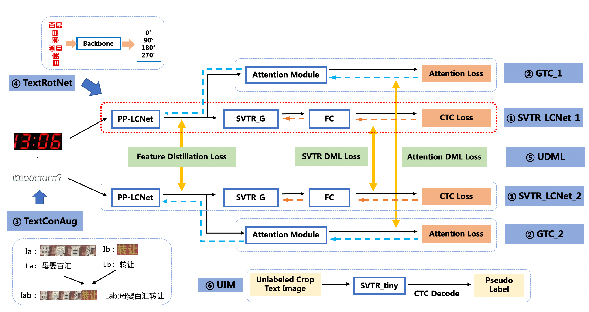
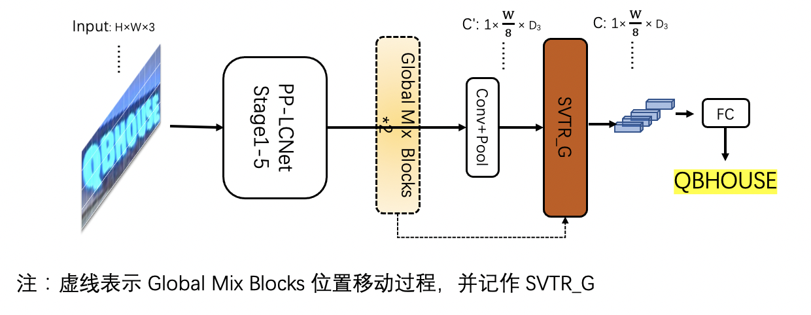

[English](../doc_en/PP-OCRv3_introduction_en.md) | 简体中文

# PP-OCRv3

- [1. 简介](#1)
- [2. 检测优化](#2)
- [3. 识别优化](#3)
- [4. 端到端评估](#4)

## 1. 简介

PP-OCRv3在PP-OCRv2的基础上进一步升级。整体的框架图保持了与PP-OCRv2相同的pipeline，针对检测模型和识别模型进行了优化。其中，检测模块仍基于DB算法优化，而识别模块不再采用CRNN，换成了IJCAI 2022最新收录的文本识别算法[SVTR](https://arxiv.org/abs/2205.00159)，并对其进行产业适配。PP-OCRv3系统框图如下所示（粉色框中为PP-OCRv3新增策略）：

    

从算法改进思路上看，分别针对检测和识别模型，进行了共9个方面的改进：

- 检测模块：
    - LK-PAN：大感受野的PAN结构；
    - DML：教师模型互学习策略；
    - RSE-FPN：残差注意力机制的FPN结构；

- 识别模块：
    - SVTR_LCNet：轻量级文本识别网络；
    - GTC：Attention指导CTC训练策略；
    - TextConAug：挖掘文字上下文信息的数据增广策略；
    - TextRotNet：自监督的预训练模型；
    - UDML：联合互学习策略；
    - UIM：无标注数据挖掘方案。

从效果上看，速度可比情况下，多种场景精度均有大幅提升：
- 中文场景，相对于PP-OCRv2中文模型提升超5%；
- 英文数字场景，相比于PP-OCRv2英文模型提升11%；
- 多语言场景，优化80+语种识别效果，平均准确率提升超5%。

## 2. 检测优化

PP-OCRv3检测模型是对PP-OCRv2中的[CML](https://arxiv.org/pdf/2109.03144.pdf)（Collaborative Mutual Learning) 协同互学习文本检测蒸馏策略进行了升级。如下图所示，CML的核心思想结合了①传统的Teacher指导Student的标准蒸馏与 ②Students网络之间的DML互学习，可以让Students网络互学习的同时，Teacher网络予以指导。PP-OCRv3分别针对教师模型和学生模型进行进一步效果优化。其中，在对教师模型优化时，提出了大感受野的PAN结构LK-PAN和引入了DML（Deep Mutual Learning）蒸馏策略；在对学生模型优化时，提出了残差注意力机制的FPN结构RSE-FPN。

    

消融实验如下：

|序号|策略|模型大小|hmean|速度（cpu + mkldnn)|
|-|-|-|-|-|
|baseline teacher|PP-OCR server|49M|83.2%|171ms|
|teacher1|DB-R50-LK-PAN|124M|85.0%|396ms|
|teacher2|DB-R50-LK-PAN-DML|124M|86.0%|396ms|
|baseline student|PP-OCRv2|3M|83.2%|117ms|
|student0|DB-MV3-RSE-FPN|3.6M|84.5%|124ms|
|student1|DB-MV3-CML（teacher2）|3M|84.3%|117ms|
|student2|DB-MV3-RSE-FPN-CML（teacher2）|3.6M|85.4%|124ms|

测试环境： Intel Gold 6148 CPU，预测时开启MKLDNN加速。

**（1）LK-PAN：大感受野的PAN结构**

LK-PAN (Large Kernel PAN) 是一个具有更大感受野的轻量级[PAN](https://arxiv.org/pdf/1803.01534.pdf)结构，核心是将PAN结构的path augmentation中卷积核从`3*3`改为`9*9`。通过增大卷积核，提升特征图每个位置覆盖的感受野，更容易检测大字体的文字以及极端长宽比的文字。使用LK-PAN结构，可以将教师模型的hmean从83.2%提升到85.0%。

    

**（2）DML：教师模型互学习策略**

[DML](https://arxiv.org/abs/1706.00384) （Deep Mutual Learning）互学习蒸馏方法，如下图所示，通过两个结构相同的模型互相学习，可以有效提升文本检测模型的精度。教师模型采用DML策略，hmean从85%提升到86%。将PP-OCRv2中CML的教师模型更新为上述更高精度的教师模型，学生模型的hmean可以进一步从83.2%提升到84.3%。

    

**（3）RSE-FPN：残差注意力机制的FPN结构**

RSE-FPN（Residual Squeeze-and-Excitation FPN）如下图所示，引入残差结构和通道注意力结构，将FPN中的卷积层更换为通道注意力结构的RSEConv层，进一步提升特征图的表征能力。考虑到PP-OCRv2的检测模型中FPN通道数非常小，仅为96，如果直接用SEblock代替FPN中卷积会导致某些通道的特征被抑制，精度会下降。RSEConv引入残差结构会缓解上述问题，提升文本检测效果。进一步将PP-OCRv2中CML的学生模型的FPN结构更新为RSE-FPN，学生模型的hmean可以进一步从84.3%提升到85.4%。

    

## 3. 识别优化

PP-OCRv3的识别模块是基于文本识别算法[SVTR](https://arxiv.org/abs/2205.00159)优化。SVTR不再采用RNN结构，通过引入Transformers结构更加有效地挖掘文本行图像的上下文信息，从而提升文本识别能力。直接将PP-OCRv2的识别模型，替换成SVTR_Tiny，识别准确率从74.8%提升到80.1%（+5.3%），但是预测速度慢了将近11倍，CPU上预测一条文本行，将近100ms。因此，如下图所示，PP-OCRv3采用如下6个优化策略进行识别模型加速。

    

基于上述策略，PP-OCRv3识别模型相比PP-OCRv2，在速度可比的情况下，精度进一步提升4.6%。 具体消融实验如下所示：

| ID | 策略 |  模型大小 | 精度 | 预测耗时（CPU + MKLDNN)|
|-----|-----|--------|----| --- |
| 01 | PP-OCRv2 | 8M | 74.8% | 8.54ms |
| 02 | SVTR_Tiny | 21M | 80.1% | 97ms |
| 03 | SVTR_LCNet(h32) | 12M | 71.9% | 6.6ms |
| 04 | SVTR_LCNet(h48) | 12M | 73.98% | 7.6ms |
| 05 | + GTC | 12M | 75.8% | 7.6ms |
| 06 | + TextConAug | 12M | 76.3% | 7.6ms |
| 07 | + TextRotNet | 12M | 76.9% | 7.6ms |
| 08 | + UDML | 12M | 78.4% | 7.6ms |
| 09 | + UIM | 12M | 79.4% | 7.6ms |

注： 测试速度时，实验01-03输入图片尺寸均为(3,32,320)，04-08输入图片尺寸均为(3,48,320)。在实际预测时，图像为变长输入，速度会有所变化。测试环境： Intel Gold 6148 CPU，预测时开启MKLDNN加速。

**（1）SVTR_LCNet：轻量级文本识别网络**

SVTR_LCNet是针对文本识别任务，将基于Transformer的[SVTR](https://arxiv.org/abs/2205.00159)网络和轻量级CNN网络[PP-LCNet](https://arxiv.org/abs/2109.15099) 融合的一种轻量级文本识别网络。使用该网络，预测速度优于PP-OCRv2的识别模型20%，但是由于没有采用蒸馏策略，该识别模型效果略差。此外，进一步将输入图片规范化高度从32提升到48，预测速度稍微变慢，但是模型效果大幅提升，识别准确率达到73.98%（+2.08%），接近PP-OCRv2采用蒸馏策略的识别模型效果。

SVTR_Tiny 网络结构如下所示：

    

由于 MKLDNN 加速库支持的模型结构有限，SVTR 在 CPU+MKLDNN 上相比 PP-OCRv2 慢了10倍。PP-OCRv3 期望在提升模型精度的同时，不带来额外的推理耗时。通过分析发现，SVTR_Tiny 结构的主要耗时模块为 Mixing Block，因此我们对 SVTR_Tiny 的结构进行了一系列优化（详细速度数据请参考下方消融实验表格）:

1. 将 SVTR 网络前半部分替换为 PP-LCNet 的前三个stage，保留4个 Global Mixing Block ，精度为76%，加速69%，网络结构如下所示：

    

2. 将4个 Global Mixing Block 减小到2个，精度为72.9%，加速69%，网络结构如下所示：

    

3. 实验发现 Global Mixing Block 的预测速度与输入其特征的shape有关，因此后移 Global Mixing Block 的位置到池化层之后，精度下降为71.9%，速度超越基于CNN结构的PP-OCRv2-baseline 22%，网络结构如下所示：

    

具体消融实验如下所示：

| ID | 策略 |  模型大小 | 精度 | 速度（CPU + MKLDNN)|
|-----|-----|--------|----| --- |
| 01 | PP-OCRv2-baseline | 8M | 69.3%  | 8.54ms |
| 02 | SVTR_Tiny | 21M | 80.1% | 97ms |
| 03 | SVTR_LCNet(G4) | 9.2M | 76% | 30ms |
| 04 | SVTR_LCNet(G2) | 13M | 72.98% | 9.37ms |
| 05 | SVTR_LCNet(h32) | 12M | 71.9% | 6.6ms |
| 06 | SVTR_LCNet(h48)  | 12M | 73.98% | 7.6ms |

注： 测试速度时，01-05输入图片尺寸均为(3,32,320)； PP-OCRv2-baseline 代表没有借助蒸馏方法训练得到的模型

**（2）GTC：Attention指导CTC训练策略**

[GTC](https://arxiv.org/pdf/2002.01276.pdf)（Guided Training of CTC），利用Attention模块CTC训练，融合多种文本特征的表达，是一种有效的提升文本识别的策略。使用该策略，预测时完全去除 Attention 模块，在推理阶段不增加任何耗时，识别模型的准确率进一步提升到75.8%（+1.82%）。训练流程如下所示：

    

**（3）TextConAug：挖掘文字上下文信息的数据增广策略**

TextConAug是一种挖掘文字上下文信息的数据增广策略，主要思想来源于论文[ConCLR](https://www.cse.cuhk.edu.hk/~byu/papers/C139-AAAI2022-ConCLR.pdf)，作者提出ConAug数据增广，在一个batch内对2张不同的图像进行联结，组成新的图像并进行自监督对比学习。PP-OCRv3将此方法应用到有监督的学习任务中，设计了TextConAug数据增强方法，可以丰富训练数据上下文信息，提升训练数据多样性。使用该策略，识别模型的准确率进一步提升到76.3%（+0.5%）。TextConAug示意图如下所示：

    

**（4）TextRotNet：自监督的预训练模型**

TextRotNet是使用大量无标注的文本行数据，通过自监督方式训练的预训练模型，参考于论文[STR-Fewer-Labels](https://github.com/ku21fan/STR-Fewer-Labels)。该模型可以初始化SVTR_LCNet的初始权重，从而帮助文本识别模型收敛到更佳位置。使用该策略，识别模型的准确率进一步提升到76.9%（+0.6%）。TextRotNet训练流程如下图所示：

    

**（5）UDML：联合互学习策略**

UDML（Unified-Deep Mutual Learning）联合互学习是PP-OCRv2中就采用的对于文本识别非常有效的提升模型效果的策略。在PP-OCRv3中，针对两个不同的SVTR_LCNet和Attention结构，对他们之间的PP-LCNet的特征图、SVTR模块的输出和Attention模块的输出同时进行监督训练。使用该策略，识别模型的准确率进一步提升到78.4%（+1.5%）。

**（6）UIM：无标注数据挖掘方案**

UIM（Unlabeled Images Mining）是一种非常简单的无标注数据挖掘方案。核心思想是利用高精度的文本识别大模型对无标注数据进行预测，获取伪标签，并且选择预测置信度高的样本作为训练数据，用于训练小模型。使用该策略，识别模型的准确率进一步提升到79.4%（+1%）。实际操作中，我们使用全量数据集训练高精度SVTR-Tiny模型（acc=82.5%）进行数据挖掘，点击获取[模型下载地址和使用教程](../../applications/高精度中文识别模型.md)。

    

## 4. 端到端评估

经过以上优化，最终PP-OCRv3在速度可比情况下，中文场景端到端Hmean指标相比于PP-OCRv2提升5%，效果大幅提升。具体指标如下表所示：

| Model | Hmean |  Model Size (M) | Time Cost (CPU, ms) | Time Cost (T4 GPU, ms) |
|-----|-----|--------|----| --- |
| PP-OCR mobile | 50.3% | 8.1 | 356  | 116 |
| PP-OCR server | 57.0% | 155.1 | 1056 | 200 |
| PP-OCRv2 | 57.6% | 11.6 | 330 | 111 |
| PP-OCRv3 | 62.9% | 15.6 | 331 | 86.64 |

测试环境：CPU型号为Intel Gold 6148，CPU预测时开启MKLDNN加速。

除了更新中文模型，本次升级也同步优化了英文数字模型，端到端效果提升11%，如下表所示：

| Model | Recall |  Precision | Hmean |
|-----|-----|--------|----|
| PP-OCR_en | 38.99% | 45.91% | 42.17%  |
| PP-OCRv3_en | 50.95% | 55.53% | 53.14% |

同时，也对已支持的80余种语言识别模型进行了升级更新，在有评估集的四种语系识别准确率平均提升5%以上，如下表所示：

| Model | 拉丁语系 |  阿拉伯语系 | 日语 | 韩语 |
|-----|-----|--------|----| --- |
| PP-OCR_mul | 69.6% | 40.5% | 38.5%  | 55.4% |
| PP-OCRv3_mul | 75.2%| 45.37% | 45.8% | 60.1% |
