[English](../doc_en/PP-OCRv3_introduction_en.md) | 简体中文

# PP-OCRv3

- [1. 简介](#1)
- [2. 检测优化](#2)
- [3. 识别优化](#3)
- [4. 端到端评估](#4)

## 1. 简介

PP-OCRv3在PP-OCRv2的基础上进一步升级。检测模型仍然基于DB算法，优化策略采用了带残差注意力机制的FPN结构RSEFPN、增大感受野的PAN结构LKPAN、基于DML训练的更优的教师模型；识别模型将base模型从CRNN替换成了IJCAI 2022论文[SVTR]()，并采用SVTR轻量化、带指导训练CTC、数据增广策略RecConAug、自监督训练的更好的预训练模型、无标签数据的使用进行模型加速和效果提升。更多细节请参考PP-OCRv3[技术报告](./PP-OCRv3_introduction.md)。

PP-OCRv3系统pipeline如下：

    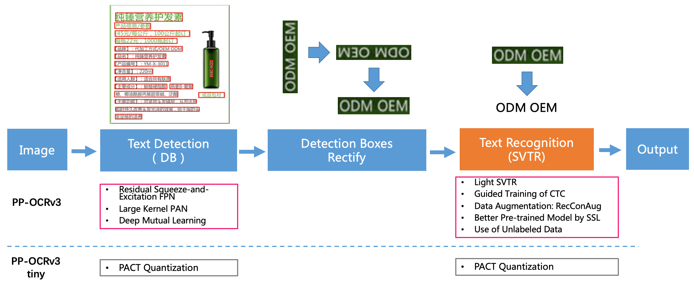

## 2. 检测优化

PP-OCRv3采用PP-OCRv2的[CML](https://arxiv.org/pdf/2109.03144.pdf)蒸馏策略，CML蒸馏包含一个教师模型和两个学生模型，在训练过程中，教师模型不参与训练，学生模型受到来自标签和教师模型的监督，同时两个学生模型互相学习。相比较PP-OCRv2，PP-OCRv3在教师模型、学生模型的精度提升两个方面进一步优化。
PP-OCRv3 CML蒸馏训练框架图如下：

    

- 在教师模型精度提升方面，提出了LK-PAN结构替换PP-OCRv2的FPN结构提升模型的召回，并且使用ResNet50作为Backbone。
另外，使用Deep Mutual Learning([DML](https://arxiv.org/abs/1706.00384))蒸馏策略进一步提升教师模型的精度，DML是一种自蒸馏策略，区别于传统的教师模型监督学生模型的蒸馏方法。DML是多个学生模型以协作的方式互相监督。加上DML自蒸馏后，教师模型Hmean进一步提升到86.0%。

LK-PAN(Large Kernel PAN)是一个具有更大感受野的轻量级[PAN](https://arxiv.org/pdf/1803.01534.pdf)结构。在LK-PAN的path augmentation中，使用卷积核为`9*9`的卷积；更大的卷积核意味着更大的感受野，更容易检测大字体的文字以及极端长宽比的文字。LK-PAN将ppocr_server检测模型的精度hmean从83.2%提升到85.0%。

    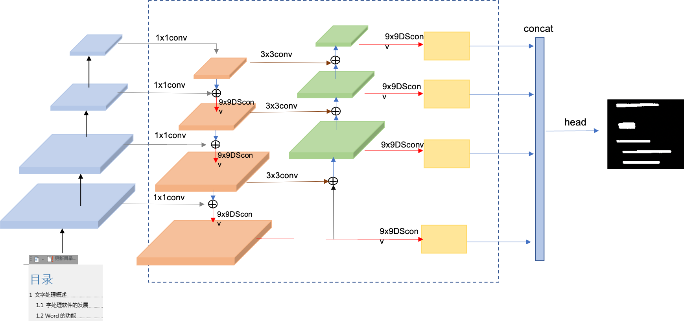

教师模型DML训练的pipeline如下：

    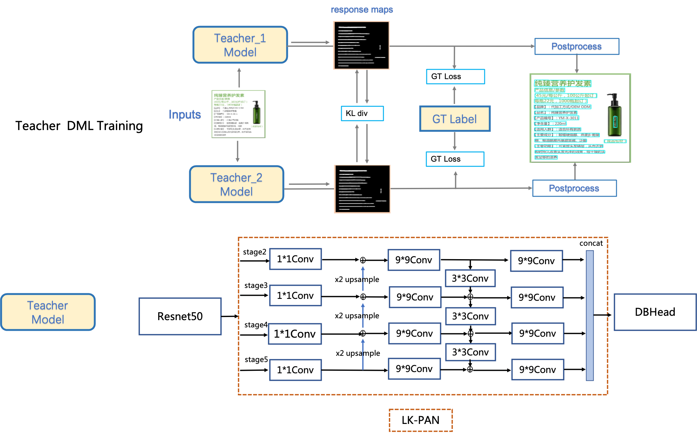

- 在学生模型精度提升方面，使用Hmean指标为86%的模型作为CML的教师模型，精度更高的教师模型可以给学生模型更好的监督信息。相比较PP-OCRv2，使用Hmean指标为86%的模型作为教师模型，Hmean指标从83.2提升到84.3%。另外，提出了基于残差结构的通道注意力模块RSE-FPN（Residual Squeeze-and-Excitation FPN），用于提升学生模型精度和召回。

RSE-FPN的网络结构如下图所示，RSE-FPN在PP-OCRv2的FPN基础上，将FPN中的卷积层更换为了通道注意力结构的RSEConv层。

    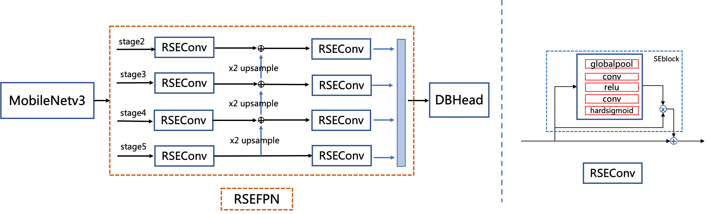

PP-OCRv2的FPN通道数仅为96和24，如果直接用SEblock代替FPN中卷积会导致某些通道的特征被抑制，进而导致精度下降，RSEConv引入残差结构可以防止训练中包含重要特征的通道被抑制，使精度提升。RSE-FPN将PP-OCR检测模型的精度Hmean从81.3%提升到84.5%。模型大小从3M变为3.6M。CPU预测速度从平均117ms/image变为124ms/image。

消融实验如下：
|序号|策略|模型大小|hmean|速度（cpu + mkldnn)|
|-|-|-|-|-|
|0|PP-OCRv2|3M|83.2%|117ms|
|1|PP-OCR server|49M|83.2%|171ms|
|2|teacher1：DB-R50-LK-PAN|124M|85.0%|396ms|
|3|teacher2：DB-R50-LK-PAN-DML|124M|86.0%|396ms|
|4|DB-MV3-RSE-FPN|3.6M|84.5%|124ms|
|5|DB-MV3-CML（teacher2）|3M|84.3%|117ms|
|6|DB-MV3-RSE-FPN-CML（teacher2）|3.6M|85.4%|124ms|

注： CPU速度测试硬件是Intel Gold 6148，paddlepaddle版本是2.2.2，速度耗时为305张图的平均预测时间，预测时开启MKLDNN加速。

## 3. 识别优化

[SVTR](https://arxiv.org/abs/2205.00159) 证明了强大的单视觉模型（无需序列模型）即可高效准确完成文本识别任务，在中英文数据上均有优秀的表现。经过实验验证，SVTR_Tiny在自建的 [中文数据集上](https://arxiv.org/abs/2109.03144) ，识别精度可以提升10.7%，网络结构如下所示：

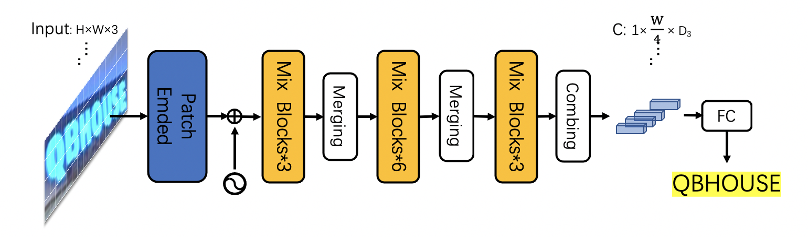

由于 MKLDNN 加速库支持的模型结构有限，SVTR 在CPU+MKLDNN上相比PP-OCRv2慢了10倍。

PP-OCRv3 期望在提升模型精度的同时，不带来额外的推理耗时。通过分析发现，SVTR_Tiny结构的主要耗时模块为Mixing Block，因此我们对 SVTR_Tiny 的结构进行了一系列优化（详细速度数据请参考下方消融实验表格）:

1. 将SVTR网络前半部分替换为PP-LCNet的前三个stage，保留4个 Global Mixing Block ，精度为76%，加速69%，网络结构如下所示：
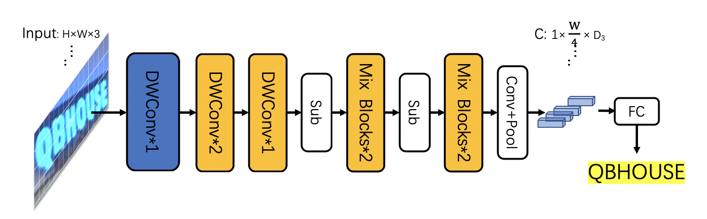
2. 将4个 Global Attenntion Block 减小到2个，精度为72.9%，加速69%，网络结构如下所示：
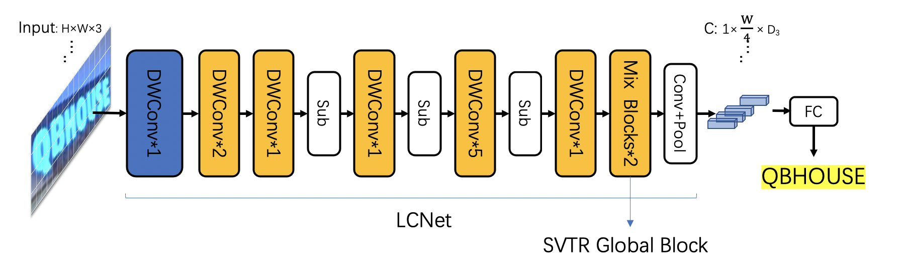
3. 实验发现 Global Attention 的预测速度与输入其特征的shape有关，因此后移Global Mixing Block的位置到池化层之后，精度下降为71.9%，速度超越 CNN-base 的PP-OCRv2 22%，网络结构如下所示：
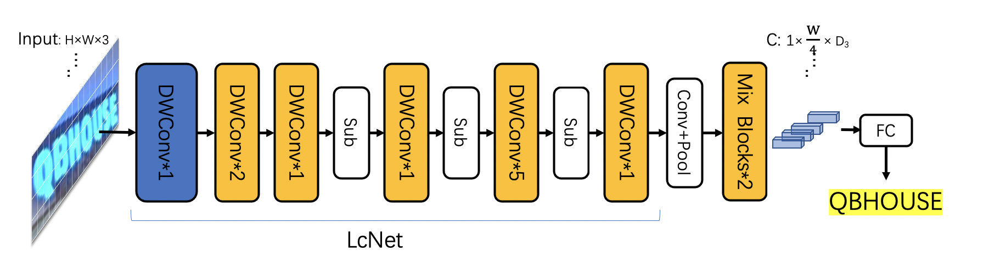

为了提升模型精度同时不引入额外推理成本，PP-OCRv3参考GTC策略，使用Attention监督CTC训练，预测时完全去除Attention模块，在推理阶段不增加任何耗时, 精度提升3.8%，训练流程如下所示：
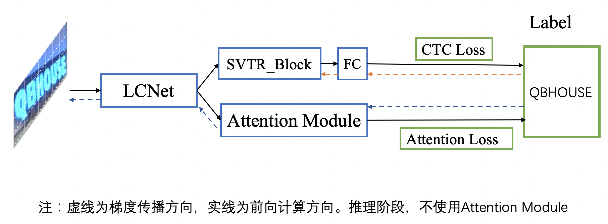

在训练策略方面，PP-OCRv3参考 [SSL](https://github.com/ku21fan/STR-Fewer-Labels) 设计了文本方向任务，训练了适用于文本识别的预训练模型，加速模型收敛过程，精度提升了0.6%; 使用UDML蒸馏策略，进一步提升精度1.5%，训练流程所示：

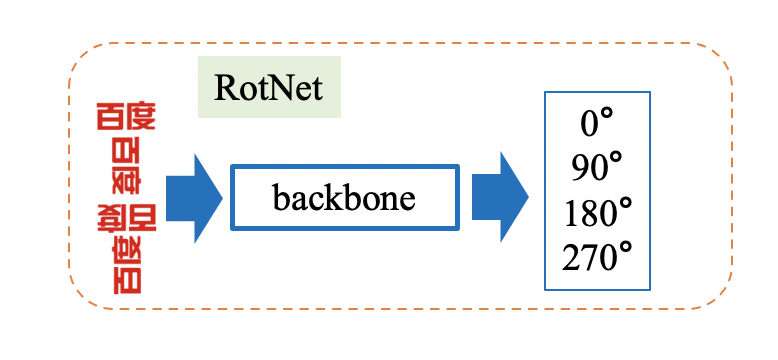 

数据增强方面：

1. 基于 [ConCLR](https://www.cse.cuhk.edu.hk/~byu/papers/C139-AAAI2022-ConCLR.pdf) 中的ConAug方法，设计了 RecConAug 数据增强方法，增强数据多样性，精度提升0.5%，增强可视化效果如下所示：
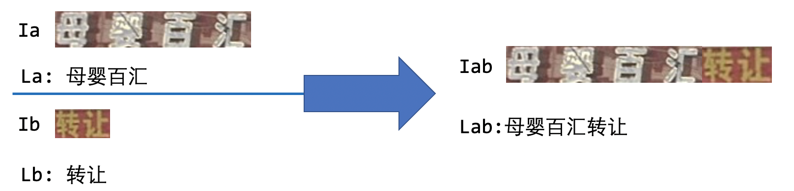

2. 使用训练好的 SVTR_large 预测 120W 的 lsvt 无标注数据，取出其中得分大于0.95的数据，共得到81W识别数据加入到PP-OCRv3的训练数据中，精度提升1%。

总体来讲PP-OCRv3识别从网络结构、训练策略、数据增强三个方向做了进一步优化:

- 网络结构上：考虑[SVTR](https://arxiv.org/abs/2205.00159) 在中英文效果上的优越性，采用SVTR_Tiny作为base，选取Global Mixing Block和卷积组合提取特征，并将Global Mixing Block位置后移进行加速; 参考 [GTC](https://arxiv.org/pdf/2002.01276.pdf) 策略，使用注意力机制模块指导CTC训练，定位和识别字符，提升不规则文本的识别精度。
- 训练策略上：参考 [SSL](https://github.com/ku21fan/STR-Fewer-Labels) 设计了方向分类前序任务，获取更优预训练模型，加速模型收敛过程，提升精度; 使用UDML蒸馏策略、监督attention、ctc两个分支得到更优模型。
- 数据增强上：基于 [ConCLR](https://www.cse.cuhk.edu.hk/~byu/papers/C139-AAAI2022-ConCLR.pdf) 中的ConAug方法，改进得到 RecConAug 数据增广方法，支持随机结合任意多张图片，提升训练数据的上下文信息丰富度，增强模型鲁棒性；使用 SVTR_large 预测无标签数据，向训练集中补充81w高质量真实数据。

基于上述策略，PP-OCRv3识别模型相比PP-OCRv2，在速度可比的情况下，精度进一步提升4.5%。 具体消融实验如下所示：

实验细节：

| id | 策略 |  模型大小 | 精度 | 速度（cpu + mkldnn)|
|-----|-----|--------|----| --- |
| 01 | PP-OCRv2 | 8M | 69.3% | 8.54ms |
| 02 | SVTR_Tiny | 21M | 80.1% | 97ms |
| 03 | LCNet_SVTR_G4 | 9.2M | 76% | 30ms |
| 04 | LCNet_SVTR_G2 | 13M | 72.98% | 9.37ms |
| 05 | PP-OCRv3 | 12M | 71.9% | 6.6ms |
| 06 | + large input_shape | 12M | 73.98% | 7.6ms |
| 06 | + GTC | 12M | 75.8% | 7.6ms |
| 07 | + RecConAug | 12M | 76.3% | 7.6ms |
| 08 | + SSL pretrain | 12M | 76.9% | 7.6ms |
| 09 | + UDML | 12M | 78.4% | 7.6ms |
| 10 | + unlabeled data | 12M | 79.4% | 7.6ms |

注： 测试速度时，实验01-05输入图片尺寸均为(3,32,320)，06-10输入图片尺寸均为(3,48,320)

## 4. 端到端评估
