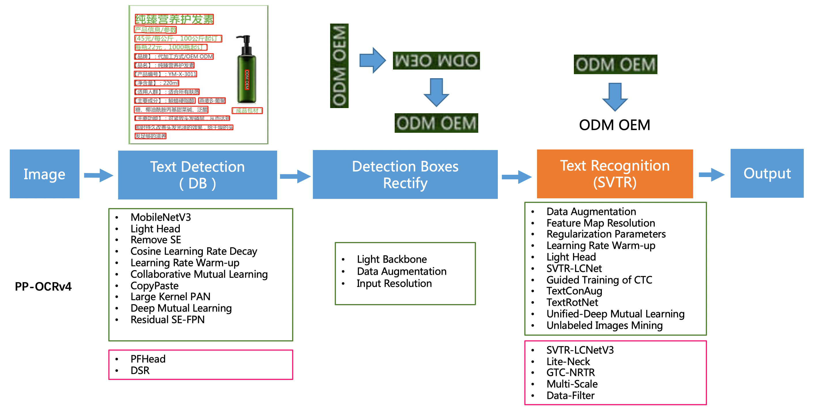
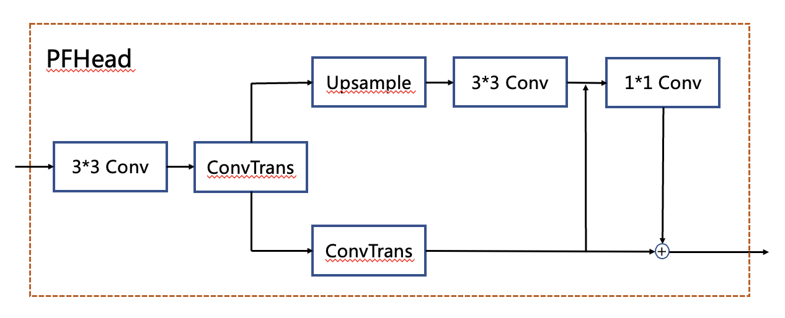
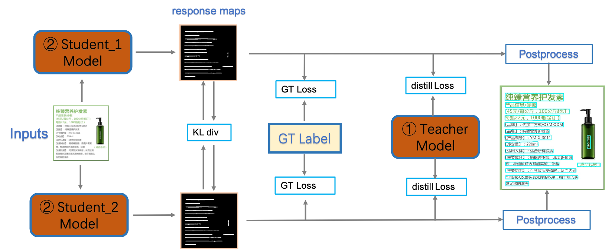
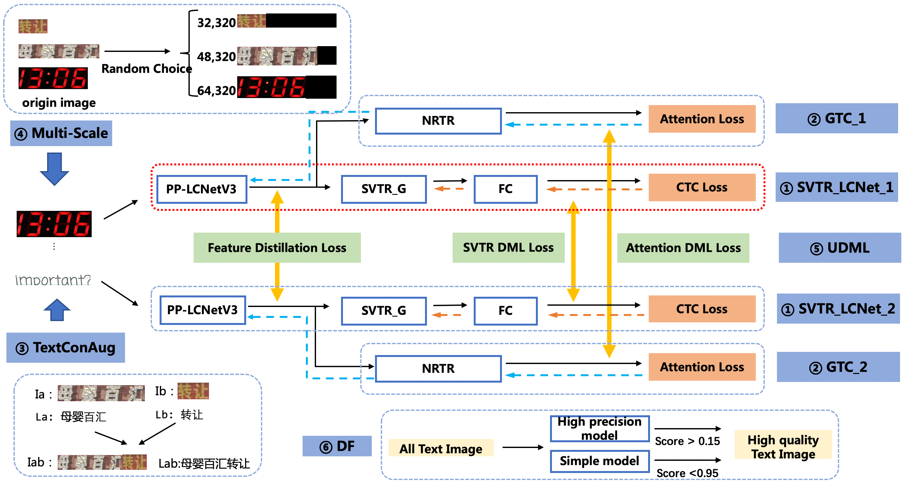
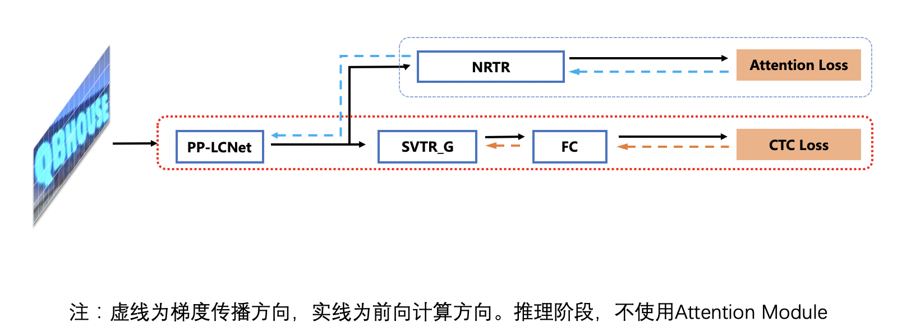
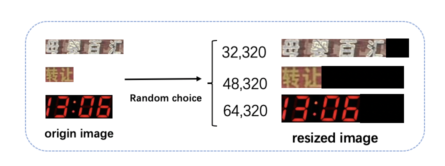

# PP-OCRv4

- [1. 简介](#1)
- [2. 检测优化](#2)
- [3. 识别优化](#3)
- [4. 端到端评估](#4)

## 1. 简介

PP-OCRv4在PP-OCRv3的基础上进一步升级。整体的框架图保持了与PP-OCRv3相同的pipeline，针对检测模型和识别模型进行了数据、网络结构、训练策略等多个模块的优化。 PP-OCRv4系统框图如下所示：

    

从算法改进思路上看，分别针对检测和识别模型，进行了共10个方面的改进：
* 检测模块：
  * LCNetV3：精度更高的骨干网络
  * PFHead：并行head分支融合结构
  * DSR: 训练中动态增加shrink ratio
  * CML：添加Student和Teacher网络输出的KL div loss
* 识别模块：
  * SVTR_LCNetV3：精度更高的骨干网络
  * Lite-Neck：精简的Neck结构
  * GTC-NRTR：稳定的Attention指导分支
  * Multi-Scale：多尺度训练策略
  * DF: 数据挖掘方案
  * DKD ：DKD蒸馏策略

从效果上看，速度可比情况下，多种场景精度均有大幅提升：
* 中文场景，相对于PP-OCRv3中文模型提升超4%；
* 英文数字场景，相比于PP-OCRv3英文模型提升6%；
* 多语言场景，优化80个语种识别效果，平均准确率提升超8%。

## 2. 检测优化

PP-OCRv4检测模型在PP-OCRv3检测模型的基础上，在网络结构，训练策略，蒸馏策略三个方面做了优化。首先，PP-OCRv4检测模型使用PP-LCNetV3替换MobileNetv3，并提出并行分支融合的PFhead结构；其次，训练时动态调整shrink ratio的比例；最后，PP-OCRv4对CML的蒸馏loss进行优化，进一步提升文字检测效果。

消融实验如下：

|序号|策略|模型大小|hmean|速度（cpu + mkldnn)|
|-|-|-|-|-|
|baseline|PP-OCRv3|3.4M|78.84%|69ms|
|baseline student|PP-OCRv3 student|3.4M|76.22%|69ms|
|01|+PFHead|3.6M|76.97%|96ms|
|02|+Dynamic Shrink Ratio|3.6M|78.24%|96ms|
|03|+PP-LCNetv3|4.8M|79.08%|94ms|
|03|+CML|4.8M|79.87%|67ms|

测试环境： Intel Gold 6148 CPU，预测引擎使用openvino。

**（1）PFhead：多分支融合Head结构**

PFhead结构如下图所示，PFHead在经过第一个转置卷积后，分别进行上采样和转置卷积，上采样的输出通过3x3卷积得到输出结果，然后和转置卷积的分支的结果级联并经过1x1卷积层，最后1x1卷积的结果和转置卷积的结果相加得到最后输出的概率图。PP-OCRv4学生检测模型使用PFhead，hmean从76.22%增加到76.97%。

    

**（2）DSR: 收缩比例动态调整策略**

动态shrink ratio(dynamic shrink ratio): 在训练中，shrink ratio由固定值调整为动态变化，随着训练epoch的增加，shrink ratio从0.4线性增加到0.6。该策略在PP-OCRv4学生检测模型上，hmean从76.97%提升到78.24%。

**(3) PP-LCNetV3：精度更高的骨干网络**

PP-LCNetV3系列模型是PP-LCNet系列模型的延续，覆盖了更大的精度范围，能够适应不同下游任务的需要。PP-LCNetV3系列模型从多个方面进行了优化，提出了可学习仿射变换模块，对重参数化策略、激活函数进行了改进，同时调整了网络深度与宽度。最终，PP-LCNetV3系列模型能够在性能与效率之间达到最佳的平衡，在不同精度范围内取得极致的推理速度。使用PP-LCNetV3替换MobileNetv3 backbone，PP-OCRv4学生检测模型hmean从78.24%提升到79.08%。

**（4）CML: 融合KD的互学习策略**

PP-OCRv4检测模型对PP-OCRv3中的CML（Collaborative Mutual Learning) 协同互学习文本检测蒸馏策略进行了优化。如下图所示，在计算Student Model和Teacher Model的distill Loss时，额外添加KL div loss，让两者输出的response maps分布接近，由此进一步提升Student网络的精度，检测Hmean从79.08%增加到79.56%，端到端指标从61.31%增加到61.87%。

    

## 3. 识别优化

PP-OCRv4识别模型在PP-OCRv3的基础上进一步升级。如下图所示，整体的框架图保持了与PP-OCRv3识别模型相同的pipeline，分别进行了数据、网络结构、训练策略等方面的优化。

    

经过如图所示的策略优化，PP-OCRv4识别模型相比PP-OCRv3，在速度可比的情况下，精度进一步提升4%。 具体消融实验如下所示：

| ID | 策略 |  模型大小 | 精度 | 预测耗时（CPU openvino)|
|-----|-----|--------|----| --- |
| 01 | PP-OCRv3 | 12M | 71.50% | 8.54ms |
| 02 | +DF | 12M | 72.70% | 8.54ms |
| 03 | + LiteNeck + GTC | 9.6M | 73.21% | 9.09ms |
| 04 | + PP-LCNetV3 | 11M | 74.18% | 9.8ms |
| 05 | + multi-scale | 11M | 74.20% | 9.8ms |
| 06 | + TextConAug | 11M | 74.72% | 9.8ms |
| 08 | + UDML | 11M | 75.45% | 9.8ms |

注： 测试速度时，输入图片尺寸均为(3,48,320)。在实际预测时，图像为变长输入，速度会有所变化。测试环境： Intel Gold 6148 CPU，预测时使用Openvino预测引擎。

**（1）DF：数据挖掘方案**

DF(Data Filter) 是一种简单有效的数据挖掘方案。核心思想是利用已有模型预测训练数据，通过置信度和预测结果等信息，对全量的训练数据进行筛选。具体的：首先使用少量数据快速训练得到一个低精度模型，使用该低精度模型对千万级的数据进行预测，去除置信度大于0.95的样本，该部分被认为是对提升模型精度无效的冗余样本。其次使用PP-OCRv3作为高精度模型，对剩余数据进行预测，去除置信度小于0.15的样本，该部分被认为是难以识别或质量很差的样本。
使用该策略，千万级别训练数据被精简至百万级，模型训练时间从2周减少到5天，显著提升了训练效率，同时精度提升至72.7%(+1.2%)。

    

**（2）PP-LCNetV3：精度更优的骨干网络**

PP-LCNetV3系列模型是PP-LCNet系列模型的延续，覆盖了更大的精度范围，能够适应不同下游任务的需要。PP-LCNetV3系列模型从多个方面进行了优化，提出了可学习仿射变换模块，对重参数化策略、激活函数进行了改进，同时调整了网络深度与宽度。最终，PP-LCNetV3系列模型能够在性能与效率之间达到最佳的平衡，在不同精度范围内取得极致的推理速度。

**（3）Lite-Neck：精简参数的Neck结构**

Lite-Neck整体结构沿用PP-OCRv3版本的结构，在参数上稍作精简，识别模型整体的模型大小可从12M降低到8.5M，而精度不变；在CTCHead中，将Neck输出特征的维度从64提升到120，此时模型大小从8.5M提升到9.6M。

**（4）GTC-NRTR：Attention指导CTC训练策略**

GTC（Guided Training of CTC），是PP-OCRv3识别模型的最有效的策略之一，融合多种文本特征的表达，有效的提升文本识别精度。在PP-OCRv4中使用训练更稳定的Transformer模型NRTR作为指导分支，相比V3版本中的SAR基于循环神经网络的结构，NRTR基于Transformer实现解码过程泛化能力更强，能有效指导CTC分支学习，解决简单场景下快速过拟合的问题。使用Lite-Neck和GTC-NRTR两个策略，识别精度提升至73.21%(+0.5%)。

    

**（5）Multi-Scale：多尺度训练策略**

动态尺度训练策略，是在训练过程中随机resize输入图片的高度，以增强识别模型在端到端串联使用时的鲁棒性。在训练时，每个iter从（32，48，64）三种高度中随机选择一种高度进行resize。实验证明，使用该策略，尽管在识别测试集上准确率没有提升，但在端到端串联评估时，指标提升0.5%。

    

**（6）DKD：蒸馏策略**

识别模型的蒸馏包含两个部分，NRTRhead蒸馏和CTCHead蒸馏;

对于NRTR head，使用了DKD loss蒸馏，拉近学生模型和教师模型的NRTR head logits。最终NRTR head的loss是学生与教师间的DKD loss和与ground truth的cross entropy loss的加权和，用于监督学生模型的backbone训练。通过实验，我们发现加入DKD loss后，计算与ground truth的cross entropy loss时去除label smoothing可以进一步提高精度，因此我们在这里使用的是不带label smoothing的cross entropy loss。

对于CTCHead，由于CTC的输出中存在Blank位，即使教师模型和学生模型的预测结果一样，二者的输出的logits分布也会存在差异，影响教师模型向学生模型的知识传递。PP-OCRv4识别模型蒸馏策略中，将CTC输出logits沿着文本长度维度计算均值，将多字符识别问题转换为多字符分类问题，用于监督CTC Head的训练。使用该策略融合NRTRhead DKD蒸馏策略，指标从74.72%提升到75.45%。

## 4. 端到端评估

经过以上优化，最终PP-OCRv4在速度可比情况下，中文场景端到端Hmean指标相比于PP-OCRv3提升4.5%，效果大幅提升。具体指标如下表所示：

| Model | Hmean |  Model Size (M) | Time Cost (CPU, ms) |
|-----|-----|--------|----|
| PP-OCRv3 | 57.99% | 15.6 | 78 |
| PP-OCRv4 | 62.24% | 15.8 | 76 |

测试环境：CPU型号为Intel Gold 6148，CPU预测时使用openvino。

除了更新中文模型，本次升级也优化了英文数字模型，在自有评估集上文本识别准确率提升6%，如下表所示：

| Model | ACC |
|-----|-----|
| PP-OCR_en | 54.38% |
| PP-OCRv3_en | 64.04% |
| PP-OCRv4_en | 70.1% |

同时，对已支持的80余种语言识别模型进行了升级更新，在有评估集的四种语系识别准确率平均提升8%以上，如下表所示：

| Model | 拉丁语系 |  阿拉伯语系 | 日语 | 韩语 |
|-----|-----|--------|----| --- |
| PP-OCR_mul | 69.60% | 40.50% | 38.50%  | 55.40% |
| PP-OCRv3_mul | 71.57%| 72.90% | 45.85% | 77.23% |
| PP-OCRv4_mul | 80.00%| 75.48% | 56.50% | 83.25% |
