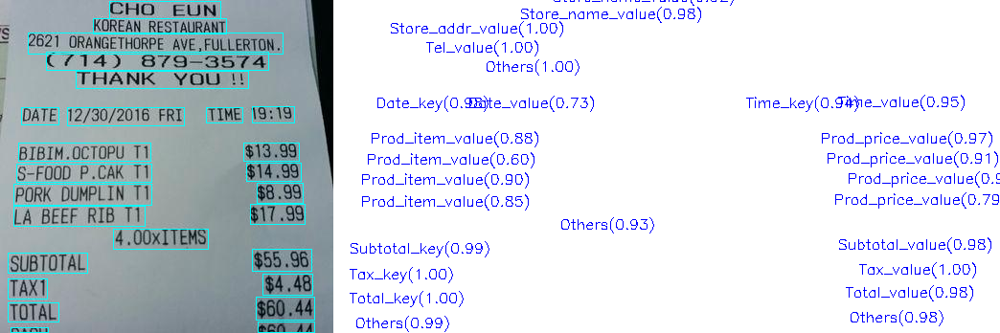

# 关键信息抽取算法-SDMGR

- [1. 算法简介](#1-算法简介)
- [2. 环境配置](#2-环境配置)
- [3. 模型训练、评估、预测](#3-模型训练评估预测)
  - [3.1 模型训练](#31-模型训练)
  - [3.2 模型评估](#32-模型评估)
  - [3.3 模型预测](#33-模型预测)
- [4. 推理部署](#4-推理部署)
  - [4.1 Python推理](#41-python推理)
  - [4.2 C++推理部署](#42-c推理部署)
  - [4.3 Serving服务化部署](#43-serving服务化部署)
  - [4.4 更多推理部署](#44-更多推理部署)
- [5. FAQ](#5-faq)
- [引用](#引用)


<a name="1"></a>

## 1. 算法简介


论文信息：

> [Spatial Dual-Modality Graph Reasoning for Key Information Extraction](https://arxiv.org/abs/2103.14470)
>
> Hongbin Sun and Zhanghui Kuang and Xiaoyu Yue and Chenhao Lin and Wayne Zhang
>
> 2021

在wildreceipt发票公开数据集上，算法复现效果如下：

|模型|骨干网络|配置文件|hmean|下载链接|
| --- | --- | --- | --- | --- |
|SDMGR|VGG6|[configs/kie/sdmgr/kie_unet_sdmgr.yml](../../configs/kie/sdmgr/kie_unet_sdmgr.yml)|86.70%|[训练模型]( https://paddleocr.bj.bcebos.com/dygraph_v2.1/kie/kie_vgg16.tar)/[推理模型(coming soon)]()|


<a name="2"></a>

## 2. 环境配置
请先参考[《运行环境准备》](./environment.md)配置PaddleOCR运行环境，参考[《项目克隆》](./clone.md)克隆项目代码。


<a name="3"></a>

## 3. 模型训练、评估、预测

SDMGR是一个关键信息提取算法，将每个检测到的文本区域分类为预定义的类别，如订单ID、发票号码，金额等。

训练和测试的数据采用wildreceipt数据集，通过如下指令下载数据集：

```bash
wget https://paddleocr.bj.bcebos.com/ppstructure/dataset/wildreceipt.tar && tar xf wildreceipt.tar
```

创建数据集软链到PaddleOCR/train_data目录下：
```
cd PaddleOCR/ && mkdir train_data && cd train_data

ln -s ../../wildreceipt ./
```


### 3.1 模型训练

训练采用的配置文件是`configs/kie/sdmgr/kie_unet_sdmgr.yml`，配置文件中默认训练数据路径是`train_data/wildreceipt`，准备好数据后，可以通过如下指令执行训练：

```
python3 tools/train.py -c configs/kie/sdmgr/kie_unet_sdmgr.yml -o Global.save_model_dir=./output/kie/
```

### 3.2 模型评估

执行下面的命令进行模型评估

```bash
python3 tools/eval.py -c configs/kie/sdmgr/kie_unet_sdmgr.yml -o Global.checkpoints=./output/kie/best_accuracy
```

输出信息示例如下所示。

```py
[2022/08/10 05:22:23] ppocr INFO: metric eval ***************
[2022/08/10 05:22:23] ppocr INFO: hmean:0.8670120239257812
[2022/08/10 05:22:23] ppocr INFO: fps:10.18816520530961
```

### 3.3 模型预测

执行下面的命令进行模型预测，预测的时候需要预先加载存储图片路径以及OCR信息的文本文件，使用`Global.infer_img`进行指定。

```bash
python3 tools/infer_kie.py -c configs/kie/kie_unet_sdmgr.yml -o Global.checkpoints=kie_vgg16/best_accuracy  Global.infer_img=./train_data/wildreceipt/1.txt
```

执行预测后的结果保存在`./output/sdmgr_kie/predicts_kie.txt`文件中，可视化结果保存在`/output/sdmgr_kie/kie_results/`目录下。

可视化结果如下图所示：

<div align="center">
    
</div>

<a name="4"></a>
## 4. 推理部署

<a name="4-1"></a>
### 4.1 Python推理

暂不支持

<a name="4-2"></a>
### 4.2 C++推理部署

暂不支持

<a name="4-3"></a>
### 4.3 Serving服务化部署

暂不支持

<a name="4-4"></a>
### 4.4 更多推理部署

暂不支持

<a name="5"></a>

## 5. FAQ

## 引用


```bibtex
@misc{sun2021spatial,
      title={Spatial Dual-Modality Graph Reasoning for Key Information Extraction},
      author={Hongbin Sun and Zhanghui Kuang and Xiaoyu Yue and Chenhao Lin and Wayne Zhang},
      year={2021},
      eprint={2103.14470},
      archivePrefix={arXiv},
      primaryClass={cs.CV}
}
```
