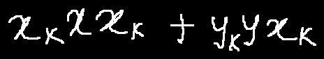

# 手写数学公式识别算法-CAN

- [1. 算法简介](#1)
- [2. 环境配置](#2)
- [3. 模型训练、评估、预测](#3)
    - [3.1 训练](#3-1)
    - [3.2 评估](#3-2)
    - [3.3 预测](#3-3)
- [4. 推理部署](#4)
    - [4.1 Python推理](#4-1)
    - [4.2 C++推理](#4-2)
    - [4.3 Serving服务化部署](#4-3)
    - [4.4 更多推理部署](#4-4)
- [5. FAQ](#5)

<a name="1"></a>
## 1. 算法简介

论文信息：
> [When Counting Meets HMER: Counting-Aware Network for Handwritten Mathematical Expression Recognition](https://arxiv.org/abs/2207.11463)
> Bohan Li, Ye Yuan, Dingkang Liang, Xiao Liu, Zhilong Ji, Jinfeng Bai, Wenyu Liu, Xiang Bai
> ECCV, 2022


<a name="model"></a>
`CAN`使用CROHME手写公式数据集进行训练，在对应测试集上的精度如下：

|模型    |骨干网络|配置文件|ExpRate|下载链接|
| ----- | ----- | ----- | ----- | ----- |
|CAN|DenseNet|[rec_d28_can.yml](../../configs/rec/rec_d28_can.yml)|51.72%|[训练模型](https://paddleocr.bj.bcebos.com/contribution/rec_d28_can_train.tar)|

<a name="2"></a>
## 2. 环境配置
请先参考[《运行环境准备》](./environment.md)配置PaddleOCR运行环境，参考[《项目克隆》](./clone.md)克隆项目代码。


<a name="3"></a>
## 3. 模型训练、评估、预测

<a name="3-1"></a>
### 3.1 模型训练

请参考[文本识别训练教程](./recognition.md)。PaddleOCR对代码进行了模块化，训练`CAN`识别模型时需要**更换配置文件**为`CAN`的[配置文件](../../configs/rec/rec_d28_can.yml)。

#### 启动训练


具体地，在完成数据准备后，便可以启动训练，训练命令如下：
```shell
#单卡训练（训练周期长，不建议）
python3 tools/train.py -c configs/rec/rec_d28_can.yml

#多卡训练，通过--gpus参数指定卡号
python3 -m paddle.distributed.launch --gpus '0,1,2,3'  tools/train.py -c configs/rec/rec_d28_can.yml
```

**注意：**
- 我们提供的数据集，即[`CROHME数据集`](https://paddleocr.bj.bcebos.com/dataset/CROHME.tar)将手写公式存储为黑底白字的格式，若您自行准备的数据集与之相反，即以白底黑字模式存储，请在训练时做出如下修改
```
python3 tools/train.py -c configs/rec/rec_d28_can.yml -o Train.dataset.transforms.GrayImageChannelFormat.inverse=False
```
- 默认每训练1个epoch（1105次iteration）进行1次评估，若您更改训练的batch_size，或更换数据集，请在训练时作出如下修改
```
python3 tools/train.py -c configs/rec/rec_d28_can.yml -o Global.eval_batch_step=[0, {length_of_dataset//batch_size}]
```

#
<a name="3-2"></a>
### 3.2 评估

可下载已训练完成的[模型文件](https://paddleocr.bj.bcebos.com/contribution/rec_d28_can_train.tar)，使用如下命令进行评估：

```shell
# 注意将pretrained_model的路径设置为本地路径。若使用自行训练保存的模型，请注意修改路径和文件名为{path/to/weights}/{model_name}。
python3 -m paddle.distributed.launch --gpus '0' tools/eval.py -c configs/rec/rec_d28_can.yml -o Global.pretrained_model=./rec_d28_can_train/best_accuracy.pdparams
```

<a name="3-3"></a>
### 3.3 预测

使用如下命令进行单张图片预测：
```shell
# 注意将pretrained_model的路径设置为本地路径。
python3 tools/infer_rec.py -c configs/rec/rec_d28_can.yml -o Architecture.Head.attdecoder.is_train=False Global.infer_img='./doc/datasets/crohme_demo/hme_00.jpg' Global.pretrained_model=./rec_d28_can_train/best_accuracy.pdparams

# 预测文件夹下所有图像时，可修改infer_img为文件夹，如 Global.infer_img='./doc/datasets/crohme_demo/'。
```


<a name="4"></a>
## 4. 推理部署

<a name="4-1"></a>
### 4.1 Python推理
首先将训练得到best模型，转换成inference model。这里以训练完成的模型为例（[模型下载地址](https://paddleocr.bj.bcebos.com/contribution/rec_d28_can_train.tar) )，可以使用如下命令进行转换：

```shell
# 注意将pretrained_model的路径设置为本地路径。
python3 tools/export_model.py -c configs/rec/rec_d28_can.yml -o Global.pretrained_model=./rec_d28_can_train/best_accuracy.pdparams Global.save_inference_dir=./inference/rec_d28_can/ Architecture.Head.attdecoder.is_train=False

# 目前的静态图模型默认的输出长度最大为36，如果您需要预测更长的序列，请在导出模型时指定其输出序列为合适的值，例如 Architecture.Head.max_text_length=72
```
**注意：**
- 如果您是在自己的数据集上训练的模型，并且调整了字典文件，请注意修改配置文件中的`character_dict_path`是否是所需要的字典文件。

转换成功后，在目录下有三个文件：
```
/inference/rec_d28_can/
    ├── inference.pdiparams         # 识别inference模型的参数文件
    ├── inference.pdiparams.info    # 识别inference模型的参数信息，可忽略
    └── inference.pdmodel           # 识别inference模型的program文件
```

执行如下命令进行模型推理：

```shell
python3 tools/infer/predict_rec.py --image_dir="./doc/datasets/crohme_demo/hme_00.jpg" --rec_algorithm="CAN" --rec_batch_num=1 --rec_model_dir="./inference/rec_d28_can/" --rec_char_dict_path="./ppocr/utils/dict/latex_symbol_dict.txt"

# 预测文件夹下所有图像时，可修改image_dir为文件夹，如 --image_dir='./doc/datasets/crohme_demo/'。

# 如果您需要在白底黑字的图片上进行预测，请设置 --rec_image_inverse=False
```



执行命令后，上面图像的预测结果（识别的文本）会打印到屏幕上，示例如下：
```shell
Predicts of ./doc/imgs_hme/hme_00.jpg:['x _ { k } x x _ { k } + y _ { k } y x _ { k }', []]
```


**注意**：

- 需要注意预测图像为**黑底白字**，即手写公式部分为白色，背景为黑色的图片。
- 在推理时需要设置参数`rec_char_dict_path`指定字典，如果您修改了字典，请修改该参数为您的字典文件。
- 如果您修改了预处理方法，需修改`tools/infer/predict_rec.py`中CAN的预处理为您的预处理方法。


<a name="4-2"></a>
### 4.2 C++推理部署

由于C++预处理后处理还未支持CAN，所以暂未支持

<a name="4-3"></a>
### 4.3 Serving服务化部署

暂不支持

<a name="4-4"></a>
### 4.4 更多推理部署

暂不支持

<a name="5"></a>
## 5. FAQ

1. CROHME数据集来自于[CAN源repo](https://github.com/LBH1024/CAN) 。

## 引用

```bibtex
@misc{https://doi.org/10.48550/arxiv.2207.11463,
  doi = {10.48550/ARXIV.2207.11463},
  url = {https://arxiv.org/abs/2207.11463},
  author = {Li, Bohan and Yuan, Ye and Liang, Dingkang and Liu, Xiao and Ji, Zhilong and Bai, Jinfeng and Liu, Wenyu and Bai, Xiang},
  keywords = {Computer Vision and Pattern Recognition (cs.CV), Artificial Intelligence (cs.AI), FOS: Computer and information sciences, FOS: Computer and information sciences},
  title = {When Counting Meets HMER: Counting-Aware Network for Handwritten Mathematical Expression Recognition},
  publisher = {arXiv},
  year = {2022},
  copyright = {arXiv.org perpetual, non-exclusive license}
}
```
