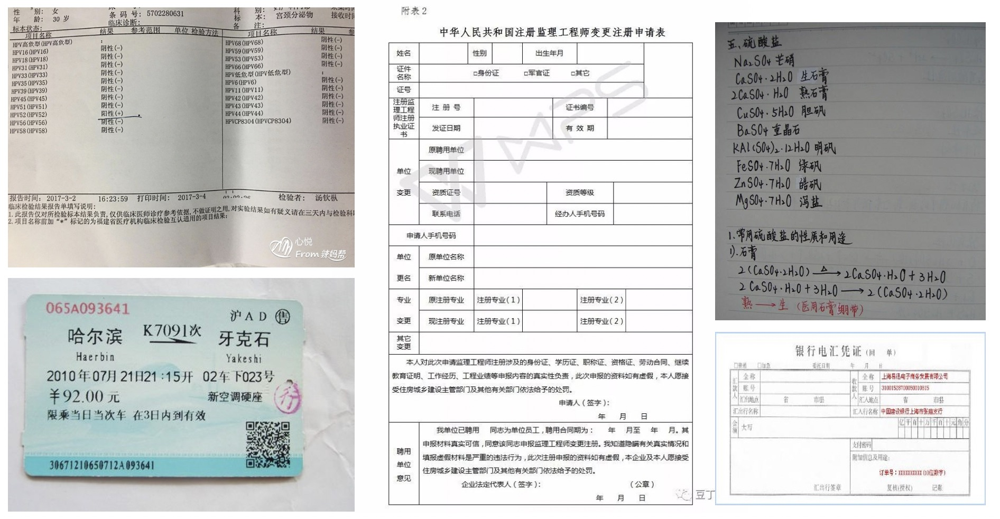

# Benchmark

本文给出了中英文OCR系列模型精度指标和在各平台预测耗时的benchmark。

## 测试数据  
针对OCR实际应用场景，包括合同，车牌，铭牌，火车票，化验单，表格，证书，街景文字，名片，数码显示屏等，收集的300张图像，每张图平均有17个文本框，下图给出了一些图像示例。

## 评估指标  

说明：
- v1.0是未添加优化策略的DB+CRNN模型，v1.1是添加多种优化策略和方向分类器的PP-OCR模型。slim_v1.1是使用裁剪或量化的模型。
- 检测输入图像的的长边尺寸是960。
- 评估耗时阶段为图像输入到结果输出的完整阶段，包括了图像的预处理和后处理。  
- `Intel至强6148`为服务器端CPU型号，测试中使用Intel MKL-DNN 加速。
- `骁龙855`为移动端处理平台型号。  

不同预测模型大小和整体识别精度对比

| 模型名称                     | 整体模型 大小\(M\) | 检测模型 大小\(M\) | 方向分类器 模型大小\(M\) | 识别模型 大小\(M\) | 整体识别 F\-score |
|:-:|:-:|:-:|:-:|:-:|:-:|
| ch\_ppocr\_mobile\_v1\.1 | 8\.1        | 2\.6        | 0\.9           | 4\.6        | 0\.5193      |
| ch\_ppocr\_server\_v1\.1 | 155\.1      | 47\.2       | 0\.9           | 107         | 0\.5414      |
| ch\_ppocr\_mobile\_v1\.0 | 8\.6        | 4\.1        | \-             | 4\.5        | 0\.393       |
| ch\_ppocr\_server\_v1\.0 | 203\.8      | 98\.5       | \-             | 105\.3      | 0\.4436      |

不同预测模型在T4 GPU上预测速度对比，单位ms

| 模型名称                     | 整体  | 检测 | 方向分类器 | 识别  |
|:-:|:-:|:-:|:-:|:-:|
| ch\_ppocr\_mobile\_v1\.1 | 137 | 35 | 24    | 78  |
| ch\_ppocr\_server\_v1\.1 | 204 | 39 | 25    | 140 |
| ch\_ppocr\_mobile\_v1\.0 | 117 | 41 | \-    | 76  |
| ch\_ppocr\_server\_v1\.0 | 199 | 52 | \-    | 147 |

不同预测模型在CPU上预测速度对比，单位ms

| 模型名称                     | 整体   | 检测  | 方向分类器 | 识别  |
|:-:|:-:|:-:|:-:|:-:|
| ch\_ppocr\_mobile\_v1\.1 | 421  | 164 | 51    | 206 |
| ch\_ppocr\_mobile\_v1\.0 | 398  | 219 | \-    | 179 |

裁剪量化模型和原始模型模型大小，整体识别精度和在SD 855上预测速度对比

| 模型名称                           | 整体模型 大小\(M\) | 检测模型 大小\(M\) | 方向分类器 模型大小\(M\) | 识别模型 大小\(M\) | 整体识别 F\-score | SD 855 \(ms\) |
|:-:|:-:|:-:|:-:|:-:|:-:|:-:|
| ch\_ppocr\_mobile\_v1\.1       | 8\.1        | 2\.6        | 0\.9           | 4\.6        | 0\.5193      | 306          |
| ch\_ppocr\_mobile\_slim\_v1\.1 | 3\.5        | 1\.4        | 0\.5           | 1\.6        | 0\.521       | 268          |
