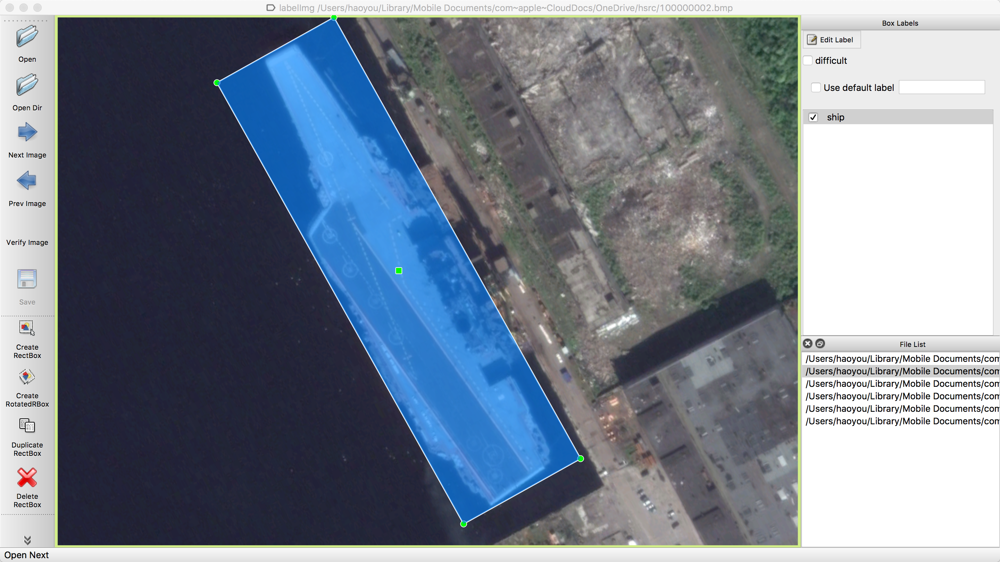
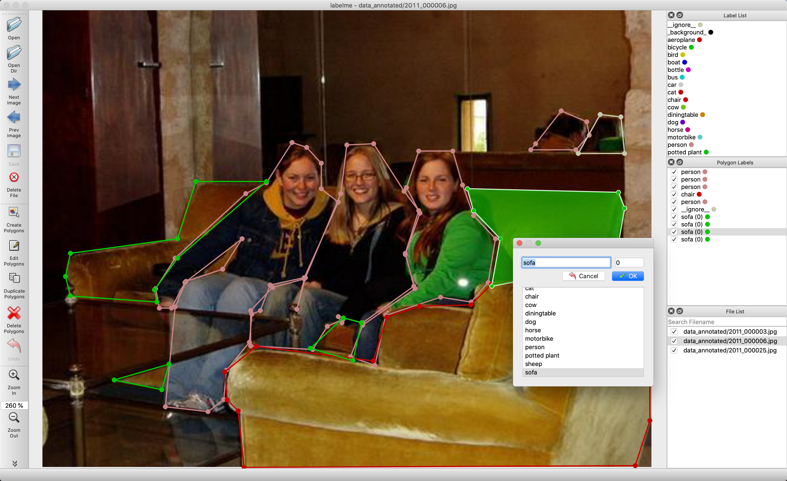

## 数据标注工具
这里整理了常用的数据标注工具，持续更新中，欢迎各位小伙伴贡献工具～

### 1. labelImg
- 工具描述：矩形标注
- 工具地址：https://github.com/tzutalin/labelImg
- 示意图：  
      

### 2. roLabelImg
- 工具描述：基于labelImg重写的标注工具，支持旋转矩形标注
- 工具地址：https://github.com/cgvict/roLabelImg
- 示意图：  
      

### 3. labelme
- 工具描述：支持四点、多边形、圆形等多种标注
- 工具地址：https://github.com/wkentaro/labelme
- 示意图：  
      
