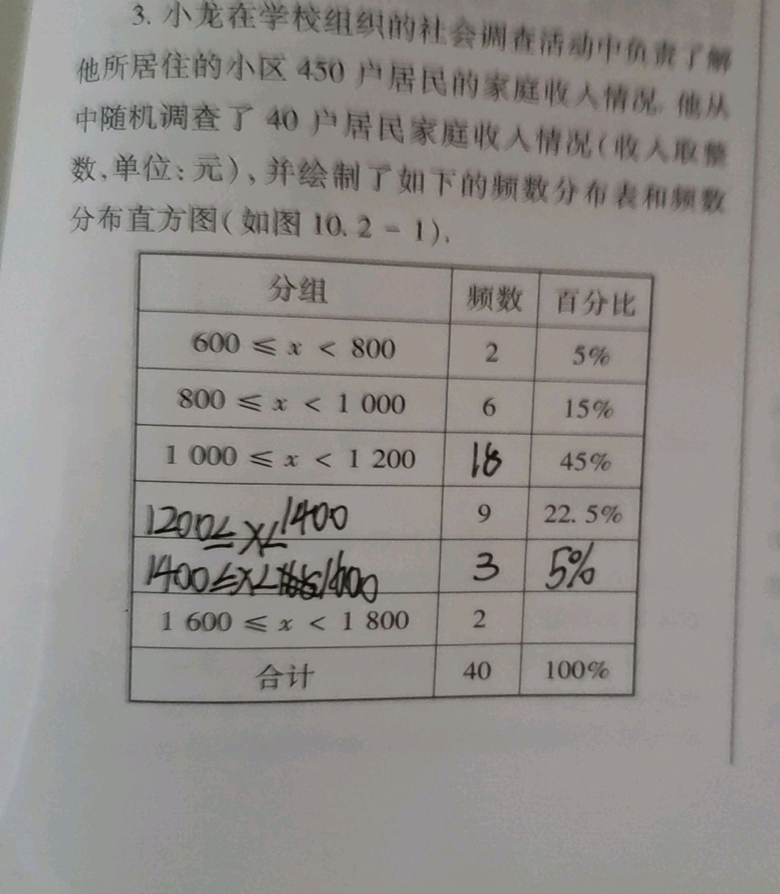

# 表格识别数据集

- [表格识别数据集](#表格识别数据集)
  - [数据集汇总](#数据集汇总)
  - [1. PubTabNet数据集](#1-pubtabnet数据集)
  - [2. 好未来表格识别竞赛数据集](#2-好未来表格识别竞赛数据集)

这里整理了常用表格识别数据集，持续更新中，欢迎各位小伙伴贡献数据集～

## 数据集汇总

| 数据集名称 |图片下载地址| PPOCR标注下载地址 |
|---|---|---|
| PubTabNet |https://github.com/ibm-aur-nlp/PubTabNet| jsonl格式，可直接用[pubtab_dataset.py](../../../ppocr/data/pubtab_dataset.py)加载 |
| 好未来表格识别竞赛数据集 |https://ai.100tal.com/dataset| jsonl格式，可直接用[pubtab_dataset.py](../../../ppocr/data/pubtab_dataset.py)加载 |

## 1. PubTabNet数据集
- **数据简介**：PubTabNet数据集的训练集合中包含50万张图像，验证集合中包含0.9万张图像。部分图像可视化如下所示。

    
    

- **说明**：使用该数据集时，需要遵守[CDLA-Permissive](https://cdla.io/permissive-1-0/)协议。

## 2. 好未来表格识别竞赛数据集
- **数据简介**：好未来表格识别竞赛数据集的训练集合中包含1.6万张图像。验证集未给出可训练的标注。

    
    

