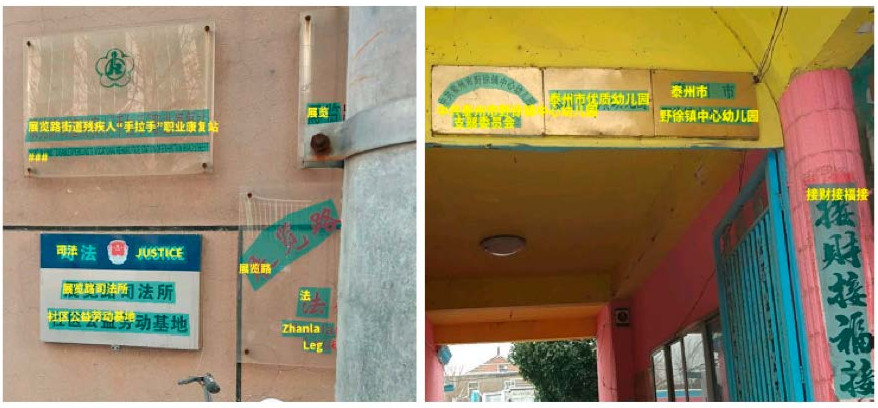
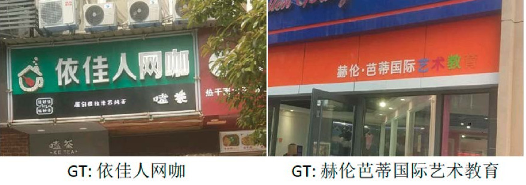
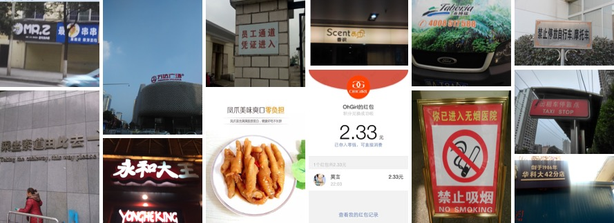
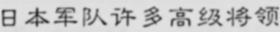

## 数据集
这里整理了常用中文数据集，持续更新中，欢迎各位小伙伴贡献数据集～
- [ICDAR2019-LSVT](#ICDAR2019-LSVT)
- [ICDAR2017-RCTW-17](#ICDAR2017-RCTW-17)
- [中文街景文字识别](#中文街景文字识别)
- [中文文档文字识别](#中文文档文字识别)
- [ICDAR2019-ArT](#ICDAR2019-ArT)

除了开源数据，用户还可使用合成工具自行合成，可参考的合成工具包括[text_renderer](https://github.com/Sanster/text_renderer)、[SynthText](https://github.com/ankush-me/SynthText)、[TextRecognitionDataGenerator](https://github.com/Belval/TextRecognitionDataGenerator)等。

<a name="ICDAR2019-LSVT"></a>
#### 1、ICDAR2019-LSVT
- **数据来源**：https://ai.baidu.com/broad/introduction?dataset=lsvt
- **数据简介**： 共45w中文街景图像，包含5w（2w测试+3w训练）全标注数据（文本坐标+文本内容），40w弱标注数据（仅文本内容），如下图所示：  
      
    (a) 全标注数据  
      
    (b) 弱标注数据  
- **下载地址**：https://ai.baidu.com/broad/download?dataset=lsvt

<a name="ICDAR2017-RCTW-17"></a>
#### 2、ICDAR2017-RCTW-17
- **数据来源**：https://rctw.vlrlab.net/
- **数据简介**：共包含12,000+图像，大部分图片是通过手机摄像头在野外采集的。有些是截图。这些图片展示了各种各样的场景，包括街景、海报、菜单、室内场景和手机应用程序的截图。
    
- **下载地址**：https://rctw.vlrlab.net/dataset/

<a name="中文街景文字识别"></a>
#### 3、中文街景文字识别 
- **数据来源**：https://aistudio.baidu.com/aistudio/competition/detail/8
- **数据简介**：ICDAR2019-LSVT行识别任务，共包括29万张图片，其中21万张图片作为训练集（带标注），8万张作为测试集（无标注）。数据集采自中国街景，并由街景图片中的文字行区域（例如店铺标牌、地标等等）截取出来而形成。所有图像都经过一些预处理，将文字区域利用仿射变化，等比映射为一张高为48像素的图片，如图所示：  
      
    (a) 标注：魅派集成吊顶  
      
    (b) 标注：母婴用品连锁  
- **下载地址**
https://aistudio.baidu.com/aistudio/datasetdetail/8429

<a name="中文文档文字识别"></a>
#### 4、中文文档文字识别
- **数据来源**：https://github.com/YCG09/chinese_ocr  
- **数据简介**：  
    - 共约364万张图片，按照99:1划分成训练集和验证集。
    - 数据利用中文语料库（新闻 + 文言文），通过字体、大小、灰度、模糊、透视、拉伸等变化随机生成
    - 包含汉字、英文字母、数字和标点共5990个字符（字符集合：https://github.com/YCG09/chinese_ocr/blob/master/train/char_std_5990.txt ）
    - 每个样本固定10个字符，字符随机截取自语料库中的句子
    - 图片分辨率统一为280x32  
      
      
      
- **下载地址**：https://pan.baidu.com/s/1QkI7kjah8SPHwOQ40rS1Pw (密码：lu7m)

<a name="ICDAR2019-ArT"></a>
#### 5、ICDAR2019-ArT
- **数据来源**：https://ai.baidu.com/broad/introduction?dataset=art
- **数据简介**：共包含10,166张图像，训练集5603图，测试集4563图。由Total-Text、SCUT-CTW1500、Baidu Curved Scene Text (ICDAR2019-LSVT部分弯曲数据) 三部分组成，包含水平、多方向和弯曲等多种形状的文本。
    
- **下载地址**：https://ai.baidu.com/broad/download?dataset=art

## 参考文献
**ICDAR 2019-LSVT Challenge**
```
@article{sun2019icdar,
  title={ICDAR 2019 Competition on Large-scale Street View Text with Partial Labeling--RRC-LSVT},
  author={Sun, Yipeng and Ni, Zihan and Chng, Chee-Kheng and Liu, Yuliang and Luo, Canjie and Ng, Chun Chet and Han, Junyu and Ding, Errui and Liu, Jingtuo and Karatzas, Dimosthenis and others},
  journal={arXiv preprint arXiv:1909.07741},
  year={2019}
}
```

**ICDAR 2019-ArT Challenge**
```
@article{chng2019icdar2019,
  title={ICDAR2019 Robust Reading Challenge on Arbitrary-Shaped Text (RRC-ArT)},
  author={Chng, Chee-Kheng and Liu, Yuliang and Sun, Yipeng and Ng, Chun Chet and Luo, Canjie and Ni, Zihan and Fang, ChuanMing and Zhang, Shuaitao and Han, Junyu and Ding, Errui and others},
  journal={arXiv preprint arXiv:1909.07145},
  year={2019}
}
```
