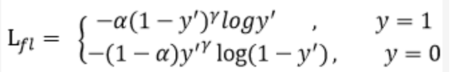
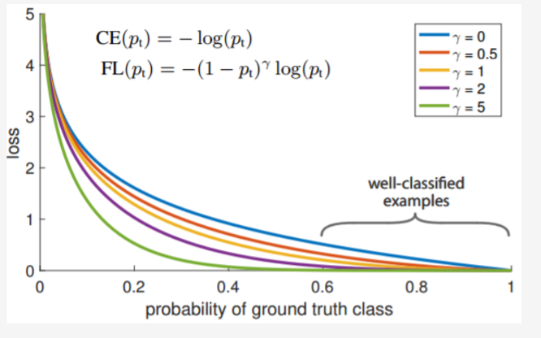
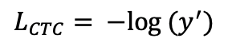
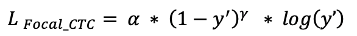
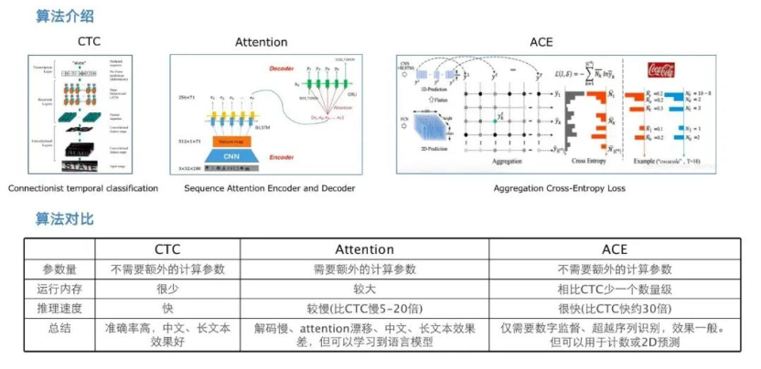
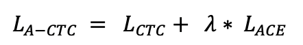
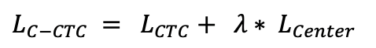

# Enhanced CTC Loss

在OCR识别中， CRNN是一种在工业界广泛使用的文字识别算法。 在训练阶段，其采用CTCLoss来计算网络损失； 在推理阶段，其采用CTCDecode来获得解码结果。虽然CRNN算法在实际业务中被证明能够获得很好的识别效果， 然而用户对识别准确率的要求却是无止境的，如何进一步提升文字识别的准确率呢？ 本文以CTCLoss为切人点，分别从难例挖掘、 多任务学习、 Metric Learning 3个不同的角度探索了CTCLoss的改进融合方案，提出了EnhancedCTCLoss，其包括如下3个组成部分： Focal-CTC Loss，A-CTC Loss， C-CTC Loss。

## 1. Focal-CTC Loss
Focal Loss 出自论文《Focal Loss for Dense Object Detection》, 该loss最先提出的时候主要是为了解决one-stage目标检测中正负样本比例严重失衡的问题。该损失函数降低了大量简单负样本在训练中所占的权重，也可理解为一种困难样本挖掘。
其损失函数形式如下：
<div align="center"> 
 
</div>
 
其中,  y' 是经过激活函数的输出，取值在0-1之间。其在原始的交叉熵损失的基础上加了一个调制系数（1 – y’)^ &gamma;和平衡因子&alpha;。 当&alpha; = 1，y=1时，其损失函数与交叉熵损失的对比如下图所示:   
<div align="center"> 
 
</div>

从上图可以看到, 当&gamma;> 0时，调整系数（1-y’）^&gamma; 赋予易分类样本损失一个更小的权重，使得网络更关注于困难的、错分的样本。 调整因子&gamma;用于调节简单样本权重降低的速率，当&gamma;为0时即为交叉熵损失函数，当&gamma;增加时，调整因子的影响也会随之增大。实验发现&gamma;为2是最优。平衡因子&alpha;用来平衡正负样本本身的比例不均，文中&alpha;取0.25。

对于经典的CTC算法，假设某个特征序列（f<sub>1</sub>, f<sub>2</sub>, ......f<sub>t</sub>), 经过CTC解码之后结果等于label的概率为y’, 则CTC解码结果不为label的概率即为（1-y’)；不难发现, CTCLoss值和y’有如下关系：
<div align="center"> 
 
</div>

结合Focal Loss的思想，赋予困难样本较大的权重，简单样本较小的权重，可以使网络更加聚焦于对困难样本的挖掘，进一步提升识别的准确率，由此我们提出了Focal-CTC Loss； 其定义如下所示：
<div align="center"> 
 
</div>

实验中，&gamma;取值为2, &alpha;= 1, 具体实现见:  [rec_ctc_loss.py](../../ppocr/losses/rec_ctc_loss.py)

## 2. A-CTC Loss
A-CTC Loss是CTC Loss + ACE Loss的简称。 其中ACE Loss出自论文< Aggregation Cross-Entropy for Sequence Recognition>.  ACE Loss相比于CTCLoss，主要有如下两点优势: 
+ ACE Loss能够解决2-D文本的识别问题;  CTCLoss只能够处理1-D文本
+ ACE Loss 在时间复杂度和空间复杂度上优于CTC loss

前人总结的OCR识别算法的优劣如下图所示：
<div align="center">
 
</div>
 
虽然ACELoss确实如上图所说，可以处理2D预测，在内存占用及推理速度方面具备优势，但在实践过程中，我们发现单独使用ACE Loss,  识别效果并不如CTCLoss.  因此，我们尝试将CTCLoss和ACELoss进行结合，同时以CTCLoss为主，将ACELoss 定位为一个辅助监督loss。 这一尝试收到了效果，在我们内部的实验数据集上，相比单独使用CTCLoss，识别准确率可以提升1%左右。
A_CTC Loss定义如下:  
<div align="center">
 
</div>

实验中，λ = 0.1.  ACE loss实现代码见:  [ace_loss.py](../../ppocr/losses/ace_loss.py)

## 3. C-CTC Loss
C-CTC Loss是CTC Loss + Center Loss的简称。 其中Center Loss出自论文 < A Discriminative Feature Learning Approach for Deep Face Recognition>.  最早用于人脸识别任务，用于增大类间距离，减小类内距离,  是Metric Learning领域一种较早的、也比较常用的一种算法。 
在中文OCR识别任务中，通过对badcase分析， 我们发现中文识别的一大难点是相似字符多，容易误识。 由此我们想到是否可以借鉴Metric Learing的想法， 增大相似字符的类间距，从而提高识别准确率。然而，MetricLearning主要用于图像识别领域，训练数据的标签为一个固定的值；而对于OCR识别来说，其本质上是一个序列识别任务，特征和label之间并不具有显式的对齐关系，因此两者如何结合依然是一个值得探索的方向。
通过尝试Arcmargin, Cosmargin等方法， 我们最终发现Centerloss 有助于进一步提升识别的准确率。C_CTC Loss定义如下：
<div align="center">
 
</div>

实验中，我们设置λ=0.25. center_loss实现代码见:  [center_loss.py](../../ppocr/losses/center_loss.py)

值得一提的是， 在C-CTC Loss中，选择随机初始化Center并不能够带来明显的提升. 我们的Center初始化方法如下：
+ 基于原始的CTCLoss， 训练得到一个网络N
+ 挑选出训练集中，识别完全正确的部分, 组成集合G
+ 将G中的每个样本送入网络，进行前向计算， 提取最后一个FC层的输入（即feature）及其经过argmax计算的结果（即index）之间的对应关系
+ 将相同index的feature进行聚合，计算平均值，得到各自字符的初始center. 

以配置文件`configs/rec/ch_PP-OCRv2/ch_PP-OCRv2_rec.yml`为例， center提取命令如下所示:
```
python tools/export_center.py -c configs/rec/ch_PP-OCRv2/ch_PP-OCRv2_rec.yml -o Global.pretrained_model="./output/rec_mobile_pp-OCRv2/best_accuracy"
```
运行完后，会在PaddleOCR主目录下生成`train_center.pkl`.

## 4. 实验
对于上述的三种方案，我们基于百度内部数据集进行了训练、评测，实验情况如下表所示：
|algorithm| Focal_CTC | A_CTC | C-CTC |
|:------| :------| ------: | :------: |
|gain| +0.3% | +0.7% | +1.7% | 

基于上述实验结论，我们在PP-OCRv2中，采用了C-CTC的策略。 值得一提的是，由于PP-OCRv2 处理的是6625个中文字符的识别任务，字符集比较大，形似字较多，所以在该任务上C-CTC 方案带来的提升较大。 但如果换做其他OCR识别任务，结论可能会有所不同。大家可以尝试Focal-CTC，A-CTC, C-CTC以及组合方案EnhancedCTC，相信会带来不同程度的提升效果。
统一的融合方案见如下文件：  [rec_enhanced_ctc_loss.py](../../ppocr/losses/rec_enhanced_ctc_loss.py)
