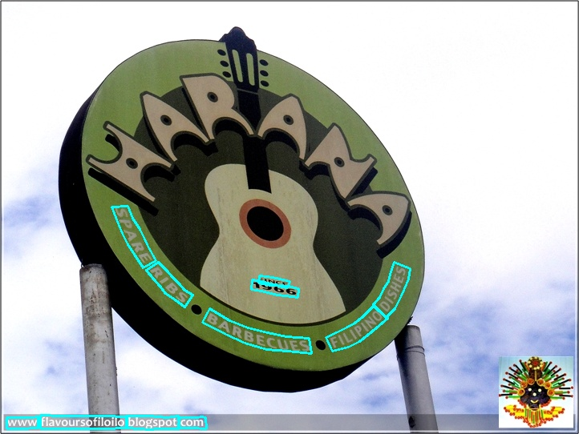

# 基于Python预测引擎的推理

推理模型（通过 paddle.jit.save 保存的模型）一般是模型训练完成后保存的固化模型，多用于部署中的预测。

训练过程中保存的模型是检查点模型，保存的是模型的参数，多用于恢复训练。

与检查点模型相比，推理模型会额外保存模型的结构信息。因此，它更容易部署，因为模型结构和模型参数已经固化在推理模型文件中，适合与实际系统集成。更多细节请参考文档[Classification Framework](https://github.com/PaddlePaddle/PaddleClas/blob/release%2F2.0/docs/zh_CN/extension/paddle_mobile_inference.md).

接下来，我们首先介绍如何将训练好的模型转换为推理模型，然后介绍基于推理模型的文本检测、文本识别、角度分类及其串联。

- [基于Python预测引擎的推理](#基于python预测引擎的推理)
  - [1. 将训练模型转换为推理模型](#1-将训练模型转换为推理模型)
    - [1.1 将检测模型转换为推理模型](#11-将检测模型转换为推理模型)
    - [1.2 将识别模型转换为推理模型](#12-将识别模型转换为推理模型)
    - [1.3 将角度分类模型转换为推理模型](#13-将角度分类模型转换为推理模型)
  - [2. 文本检测模型推理](#2-文本检测模型推理)
    - [2.1 轻量级中文检测模型推理](#21-轻量级中文检测模型推理)
    - [2.2 DB文本检测模型推理](#22-db文本检测模型推理)
    - [2.3 EAST文本检测模型推理](#23-east文本检测模型推理)
    - [2.4 Sast文本检测模型推理](#24-sast文本检测模型推理)
      - [(1). 四边形文本检测模型 (ICDAR2015)](#1-四边形文本检测模型-icdar2015)
      - [(2). 曲线文本检测模型 (Total-Text)](#2-曲线文本检测模型-total-text)
  - [3. 文本识别模型推理](#3-文本识别模型推理)
    - [3.1 轻量级中文文本识别模型推理](#31-轻量级中文文本识别模型推理)
    - [3.2 基于CTC的文本识别模型推理](#32-基于ctc的文本识别模型推理)
    - [3.3 基于SRN的文本识别模型推理](#33-基于srn的文本识别模型推理)
    - [3.4 使用自定义字符字典的文本识别模型推理](#34-使用自定义字符字典的文本识别模型推理)
    - [3.5 多语言模型推理](#35-多语言模型推理)
  - [4. 角度分类模型推理](#4-角度分类模型推理)
  - [5. 文本检测、角度分类与识别推理串联](#5-文本检测角度分类与识别推理串联)
    - [5.1 轻量级中文模型](#51-轻量级中文模型)
    - [5.2 其他模型](#52-其他模型)

<a name="CONVERT"></a>
## 1. 将训练模型转换为推理模型
<a name="Convert_detection_model"></a>

### 1.1 将检测模型转换为推理模型

下载轻量级中文检测模型：
```
wget -P ./ch_lite/ https://paddleocr.bj.bcebos.com/dygraph_v2.0/ch/ch_ppocr_mobile_v2.0_det_train.tar && tar xf ./ch_lite/ch_ppocr_mobile_v2.0_det_train.tar -C ./ch_lite/
```

上述模型是使用 MobileNetV3 作为backbone训练的 DB 算法。要将训练好的模型转换为推理模型，只需运行以下命令：
```
# -c Set the training algorithm yml configuration file
# -o Set optional parameters
# Global.pretrained_model parameter Set the training model address to be converted without adding the file suffix .pdmodel, .pdopt or .pdparams.
# Global.save_inference_dir Set the address where the converted model will be saved.

python3 tools/export_model.py -c configs/det/ch_ppocr_v2.0/ch_det_mv3_db_v2.0.yml -o Global.pretrained_model=./ch_lite/ch_ppocr_mobile_v2.0_det_train/best_accuracy  Global.save_inference_dir=./inference/det_db/
```

在转换为推理模型时，使用的配置文件与训练时使用的配置文件相同。此外，还需要在配置文件中设置 `Global.pretrained_model` 参数。
转换成功后，模型保存目录中会有三个文件：
```
inference/det_db/
    ├── inference.pdiparams         # 检测推理模型的参数文件
    ├── inference.pdiparams.info    # 检测推理模型的参数信息文件，可以忽略
    └── inference.pdmodel           # 检测推理模型的程序文件
```

<a name="Convert_recognition_model"></a>
### 1.2 将识别模型转换为推理模型

下载轻量级中文识别模型：
```
wget -P ./ch_lite/ https://paddleocr.bj.bcebos.com/dygraph_v2.0/ch/ch_ppocr_mobile_v2.0_rec_train.tar && tar xf ./ch_lite/ch_ppocr_mobile_v2.0_rec_train.tar -C ./ch_lite/
```

识别模型的转换方式与检测模型相同，如下所示：
```
# -c 设置训练算法的 yml 配置文件
# -o 设置可选参数
# Global.pretrained_model 参数设置要转换的训练模型地址，不需要添加文件后缀 .pdmodel, .pdopt 或 .pdparams。
# Global.save_inference_dir 设置转换后模型保存的地址。

python3 tools/export_model.py -c configs/rec/ch_ppocr_v2.0/rec_chinese_lite_train_v2.0.yml -o Global.pretrained_model=./ch_lite/ch_ppocr_mobile_v2.0_rec_train/best_accuracy  Global.save_inference_dir=./inference/rec_crnn/
```

如果您使用自己的数据集训练了一个模型，并且使用了不同的字典文件，请确保在配置文件中将 `character_dict_path` 修改为您的字典文件路径。

转换成功后，模型保存目录中会有三个文件：
```
inference/det_db/
    ├── inference.pdiparams         # The parameter file of recognition inference model
    ├── inference.pdiparams.info    # The parameter information of recognition inference model, which can be ignored
    └── inference.pdmodel           # The program file of recognition model
```

<a name="Convert_angle_class_model"></a>
### 1.3 将角度分类模型转换为推理模型

下载角度分类模型：
```
wget -P ./ch_lite/ https://paddleocr.bj.bcebos.com/dygraph_v2.0/ch/ch_ppocr_mobile_v2.0_cls_train.tar && tar xf ./ch_lite/ch_ppocr_mobile_v2.0_cls_train.tar -C ./ch_lite/
```

角度分类模型的转换方式与检测模型相同，如下所示：
```
# -c Set the training algorithm yml configuration file
# -o Set optional parameters
# Global.pretrained_model parameter Set the training model address to be converted without adding the file suffix .pdmodel, .pdopt or .pdparams.
# Global.save_inference_dir Set the address where the converted model will be saved.

python3 tools/export_model.py -c configs/cls/cls_mv3.yml -o Global.pretrained_model=./ch_lite/ch_ppocr_mobile_v2.0_cls_train/best_accuracy  Global.save_inference_dir=./inference/cls/
```

转换成功后，目录中会有两个文件：
```
inference/det_db/
    ├── inference.pdiparams         # The parameter file of angle class inference model
    ├── inference.pdiparams.info    # The parameter information of  angle class inference model, which can be ignored
    └── inference.pdmodel           # The program file of angle class model
```


<a name="DETECTION_MODEL_INFERENCE"></a>
## 2. 文本检测模型推理

以下将介绍轻量级中文检测模型推理、DB文本检测模型推理和EAST文本检测模型推理。默认配置基于DB文本检测模型的推理设置。
由于EAST和DB算法有很大的不同，在推理时，需要**通过传入相应的参数来适配EAST文本检测算法**。

<a name="LIGHTWEIGHT_DETECTION"></a>
### 2.1 轻量级中文检测模型推理

对于轻量级中文检测模型推理，可以执行以下命令：

```
# download DB text detection inference model
wget  https://paddleocr.bj.bcebos.com/dygraph_v2.0/ch/ch_ppocr_mobile_v2.0_det_infer.tar
tar xf ch_ppocr_mobile_v2.0_det_infer.tar
# predict
python3 tools/infer/predict_det.py --image_dir="./doc/imgs/00018069.jpg" --det_model_dir="./inference/det_db/"
```

可视化的文本检测结果默认保存在 `./inference_results` 文件夹中，结果文件的名称以 `det_res` 为前缀。结果示例如下：


可以使用参数 `limit_type` 和 `det_limit_side_len` 来限制输入图像的大小，
`limit_type` 的可选参数是 [`max`, `min`]，
而 `det_limit_side_len` 是一个正整数，通常设置为32的倍数，例如960。

这些参数的默认设置是 `limit_type='max', det_limit_side_len=960`。表示网络输入图像的最长边不能超过960，
如果超过这个值，图像将按相同比例调整尺寸，以确保最长边为 `det_limit_side_len`。
设置为 `limit_type='min', det_limit_side_len=960`，则表示图像的最短边被限制为960。

如果输入图片的分辨率较大，并且希望使用更大的分辨率进行预测，可以将 `det_limit_side_len` 设置为所需的值，例如1216：

```
python3 tools/infer/predict_det.py --image_dir="./doc/imgs/1.jpg" --det_model_dir="./inference/det_db/" --det_limit_type=max --det_limit_side_len=1216
```

如果希望使用CPU进行预测，请执行以下命令：
```
python3 tools/infer/predict_det.py --image_dir="./doc/imgs/1.jpg" --det_model_dir="./inference/det_db/" --use_gpu=False
```

<a name="DB_DETECTION"></a>
### 2.2 DB文本检测模型推理

首先，将DB文本检测训练过程中保存的模型转换为推理模型。以基于Resnet50_vd骨干网络并在ICDAR2015英文数据集上训练的模型为例（[模型下载链接](https://paddleocr.bj.bcebos.com/dygraph_v2.0/en/det_r50_vd_db_v2.0_train.tar)），可以使用以下命令进行转换：

```
python3 tools/export_model.py -c configs/det/det_r50_vd_db.yml -o Global.pretrained_model=./det_r50_vd_db_v2.0_train/best_accuracy  Global.save_inference_dir=./inference/det_db
```

DB文本检测模型推理，可以执行以下命令：

```
python3 tools/infer/predict_det.py --image_dir="./doc/imgs_en/img_10.jpg" --det_model_dir="./inference/det_db/"
```

可视化的文本检测结果默认保存在 `./inference_results` 文件夹中，结果文件的名称以 `det_res` 为前缀。结果示例如下：


**注意**：由于ICDAR2015数据集只有1000张训练图像，主要针对英文场景，上述模型在中文文本图像上的检测结果非常差。

<a name="EAST_DETECTION"></a>

### 2.3 EAST文本检测模型推理

首先，将EAST文本检测训练过程中保存的模型转换为推理模型。以基于Resnet50_vd骨干网络并在ICDAR2015英文数据集上训练的模型为例（[模型下载链接](https://paddleocr.bj.bcebos.com/dygraph_v2.0/en/det_r50_vd_east_v2.0_train.tar)），可以使用以下命令进行转换：

```
python3 tools/export_model.py -c configs/det/det_r50_vd_east.yml -o Global.pretrained_model=./det_r50_vd_east_v2.0_train/best_accuracy  Global.save_inference_dir=./inference/det_east
```
**对于EAST文本检测模型推理，需要设置参数 `--det_algorithm="EAST"`**，运行以下命令：

```
python3 tools/infer/predict_det.py --image_dir="./doc/imgs_en/img_10.jpg" --det_model_dir="./inference/det_east/" --det_algorithm="EAST"
```

可视化的文本检测结果默认保存在 `./inference_results` 文件夹中，结果文件的名称以 `det_res` 为前缀。结果示例如下：


**注意**：EAST后处理的局部感知NMS有两个版本：Python和C++。C++版本的速度明显快于Python版本。由于C++版本NMS的编译版本问题，只有在Python 3.5环境中才会调用C++版本NMS，在其他情况下将调用Python版本NMS。

<a name="SAST_DETECTION"></a>
### 2.4 Sast文本检测模型推理

#### (1). 四边形文本检测模型（ICDAR2015）

首先，将SAST文本检测训练过程中保存的模型转换为推理模型。以基于Resnet50_vd骨干网络并在ICDAR2015英文数据集上训练的模型为例（[模型下载链接](https://paddleocr.bj.bcebos.com/dygraph_v2.0/en/det_r50_vd_sast_icdar15_v2.0_train.tar)），可以使用以下命令进行转换：

```
python3 tools/export_model.py -c configs/det/det_r50_vd_sast_icdar15.yml -o Global.pretrained_model=./det_r50_vd_sast_icdar15_v2.0_train/best_accuracy  Global.save_inference_dir=./inference/det_sast_ic15
```

**对于SAST四边形文本检测模型推理，需要设置参数 `--det_algorithm="SAST"`**，运行以下命令：

```
python3 tools/infer/predict_det.py --det_algorithm="SAST" --image_dir="./doc/imgs_en/img_10.jpg" --det_model_dir="./inference/det_sast_ic15/"
```

可视化的文本检测结果默认保存在 `./inference_results` 文件夹中，结果文件的名称以 `det_res` 为前缀。结果示例如下：


#### (2). 曲线文本检测模型（Total-Text）

首先，将SAST文本检测训练过程中保存的模型转换为推理模型。以基于Resnet50_vd骨干网络并在Total-Text英文数据集上训练的模型为例（[模型下载链接](https://paddleocr.bj.bcebos.com/dygraph_v2.0/en/det_r50_vd_sast_totaltext_v2.0_train.tar)），可以使用以下命令进行转换：

```
python3 tools/export_model.py -c configs/det/det_r50_vd_sast_totaltext.yml -o Global.pretrained_model=./det_r50_vd_sast_totaltext_v2.0_train/best_accuracy  Global.save_inference_dir=./inference/det_sast_tt
```

对于SAST曲线文本检测模型推理，需要设置参数 `--det_algorithm="SAST"` 和 `--det_sast_polygon=True`，运行以下命令：

```
python3 tools/infer/predict_det.py --det_algorithm="SAST" --image_dir="./doc/imgs_en/img623.jpg" --det_model_dir="./inference/det_sast_tt/" --det_sast_polygon=True
```

可视化的文本检测结果默认保存在 `./inference_results` 文件夹中，结果文件的名称以 `det_res` 为前缀。结果示例如下：



**注意**：SAST后处理的局部感知NMS有两个版本：Python和C++。C++版本的速度明显快于Python版本。由于C++版本NMS的编译版本问题，只有在Python 3.5环境中才会调用C++版本NMS，在其他情况下将调用Python版本NMS。

<a name="RECOGNITION_MODEL_INFERENCE"></a>
## 3. 文本识别模型推理

以下将介绍轻量级中文识别模型推理、其他基于CTC和Attention的文本识别模型推理。对于中文文本识别，建议选择基于CTC损失的识别模型。实践中也发现，基于Attention损失的模型效果不如基于CTC损失的模型。此外，如果在训练过程中修改了字符字典，请确保在推理过程中使用相同的字符集。详情请见下文。

<a name="LIGHTWEIGHT_RECOGNITION"></a>
### 3.1 轻量级中文文本识别模型推理

对于轻量级中文识别模型推理，可以执行以下命令：

```
# download CRNN text recognition inference model
wget  https://paddleocr.bj.bcebos.com/dygraph_v2.0/ch/ch_ppocr_mobile_v2.0_rec_infer.tar
tar xf ch_ppocr_mobile_v2.0_rec_infer.tar
python3 tools/infer/predict_rec.py --image_dir="./doc/imgs_words_en/word_10.png" --rec_model_dir="ch_ppocr_mobile_v2.0_rec_infer"
```


执行命令后，上述图像的预测结果（识别的文本和分数）将打印在屏幕上。

```bash
Predicts of ./doc/imgs_words_en/word_10.png:('PAIN', 0.9897658)
```

<a name="CTC-BASED_RECOGNITION"></a>
### 3.2 基于CTC的文本识别模型推理

以CRNN为例，介绍基于CTC损失的识别模型推理。Rosetta和Star-Net的使用方式类似，无需设置识别算法参数 `rec_algorithm`。

首先，将CRNN文本识别训练过程中保存的模型转换为推理模型。以基于Resnet34_vd骨干网络，使用MJSynth和SynthText（两个英文文本识别合成数据集）进行训练的模型为例（[模型下载地址](https://paddleocr.bj.bcebos.com/dygraph_v2.0/en/rec_r34_vd_none_bilstm_ctc_v2.0_train.tar)）。可以按如下方式进行转换：

```
python3 tools/export_model.py -c configs/det/rec_r34_vd_none_bilstm_ctc.yml -o Global.pretrained_model=./rec_r34_vd_none_bilstm_ctc_v2.0_train/best_accuracy  Global.save_inference_dir=./inference/rec_crnn
```

对于CRNN文本识别模型推理，执行以下命令：

```
python3 tools/infer/predict_rec.py --image_dir="./doc/imgs_words_en/word_336.png" --rec_model_dir="./inference/starnet/" --rec_image_shape="3, 32, 100" --rec_char_dict_path="./ppocr/utils/ic15_dict.txt"
```


执行命令后，上述图像的识别结果如下：

```bash
Predicts of ./doc/imgs_words_en/word_336.png:('super', 0.9999073)
```

**注意**：由于上述模型参考了 [DTRB](https://arxiv.org/abs/1904.01906) 文本识别的训练和评估过程，与轻量级中文识别模型的训练在两个方面有所不同：

- **训练时使用的图像分辨率不同**：上述模型训练时使用的图像分辨率为 [3，32，100]，而我们的中文模型训练时，为了确保对长文本的识别效果，使用的图像分辨率为 [3, 32, 320]。推理阶段的默认形状参数是训练阶段使用的图像分辨率，即 [3, 32, 320]。因此，在此处运行上述英文模型的推理时，需要通过参数 `rec_image_shape` 设置识别图像的形状。

- **字符列表**：DTRB 论文中的实验仅针对 26 个小写英文字母和 10 个数字，共 36 个字符。所有大写和小写字符都转换为小写字符，不在上述列表中的字符被忽略并视为空格。因此，这里不使用字符字典文件，而是通过以下命令生成字典。

```
self.character_str = "0123456789abcdefghijklmnopqrstuvwxyz"
dict_character = list(self.character_str)
```

<a name="SRN-BASED_RECOGNITION"></a>
### 3.3 基于SRN的文本识别模型推理

基于SRN的识别模型需要额外设置识别算法参数 `--rec_algorithm="SRN"`。同时，需要确保预测形状与训练一致，例如：`--rec_image_shape="1, 64, 256"`。

```
python3 tools/infer/predict_rec.py --image_dir="./doc/imgs_words_en/word_336.png" \
                                    --rec_model_dir="./inference/srn/" \
                                    --rec_image_shape="1, 64, 256" \
                                    --rec_char_dict_path="./ppocr/utils/ic15_dict.txt" \
                                    --rec_algorithm="SRN"
```

<a name="USING_CUSTOM_CHARACTERS"></a>
### 3.4 使用自定义字符字典的文本识别模型推理

如果在训练过程中修改了文本字典，在使用推理模型进行预测时，需要通过 `--rec_char_dict_path` 指定字典路径。

```
python3 tools/infer/predict_rec.py --image_dir="./doc/imgs_words_en/word_336.png" --rec_model_dir="./your inference model" --rec_image_shape="3, 32, 100"  --rec_char_dict_path="your text dict path"
```

<a name="MULTILINGUAL_MODEL_INFERENCE"></a>

### 3.5 多语言模型推理

如果需要预测其他语言的模型，在使用推理模型进行预测时，需要通过 `--rec_char_dict_path` 指定字典路径。同时，为了获得正确的可视化结果，需要通过 `--vis_font_path` 指定可视化字体路径。在 `doc/fonts` 路径下默认提供了一些小语种字体，例如韩文识别：

```
python3 tools/infer/predict_rec.py --image_dir="./doc/imgs_words/korean/1.jpg" --rec_model_dir="./your inference model"  --rec_char_dict_path="ppocr/utils/dict/korean_dict.txt" --vis_font_path="doc/fonts/korean.ttf"
```


执行命令后，上述图像的预测结果是：

``` text
Predicts of ./doc/imgs_words/korean/1.jpg:('바탕으로', 0.9948904)
```

<a name="ANGLE_CLASSIFICATION_MODEL_INFERENCE"></a>
## 4. 角度分类模型推理

对于角度分类模型推理，可以执行以下命令：

```
python3 tools/infer/predict_cls.py --image_dir="./doc/imgs_words_en/word_10.png" --cls_model_dir="./inference/cls/"
```
```
# download text angle class inference model：
wget  https://paddleocr.bj.bcebos.com/dygraph_v2.0/ch/ch_ppocr_mobile_v2.0_cls_infer.tar
tar xf ch_ppocr_mobile_v2.0_cls_infer.tar
python3 tools/infer/predict_cls.py --image_dir="./doc/imgs_words_en/word_10.png" --cls_model_dir="ch_ppocr_mobile_v2.0_cls_infer"
```


执行命令后，上述图像的预测结果（分类角度和分数）将打印在屏幕上。

```
 Predicts of ./doc/imgs_words_en/word_10.png:['0', 0.9999995]
```
<a name="CONCATENATION"></a>
## 5. 文本检测、角度分类和识别推理串联

<a name="LIGHTWEIGHT_CHINESE_MODEL"></a>
### 5.1 轻量级中文模型

在进行预测时，需要通过参数 `image_dir` 指定单张图像或图像文件夹的路径，参数 `det_model_dir` 指定检测推理模型的路径，参数 `cls_model_dir` 指定角度分类推理模型的路径，参数 `rec_model_dir` 指定识别推理模型的路径。参数 `use_angle_cls` 用于控制是否启用角度分类模型。参数 `use_mp` 指定是否使用多进程推理，`total_process_num` 指定使用多进程时的进程数量（Paddle Inference 不是线程安全的，建议使用多进程）。可视化的识别结果默认保存在 `./inference_results` 文件夹中。

```shell
# use direction classifier
python3 tools/infer/predict_system.py --image_dir="./doc/imgs/00018069.jpg" --det_model_dir="./inference/det_db/" --cls_model_dir="./inference/cls/" --rec_model_dir="./inference/rec_crnn/" --use_angle_cls=true

# not use use direction classifier
python3 tools/infer/predict_system.py --image_dir="./doc/imgs/00018069.jpg" --det_model_dir="./inference/det_db/" --rec_model_dir="./inference/rec_crnn/"

# use multi-process
python3 tools/infer/predict_system.py --image_dir="./doc/imgs/00018069.jpg" --det_model_dir="./inference/det_db/" --rec_model_dir="./inference/rec_crnn/" --use_angle_cls=false --use_mp=True --total_process_num=6
```


执行命令后，识别结果图像如下：


<a name="OTHER_MODELS"></a>
### 5.2 其他模型

如果你想尝试其他检测算法或识别算法，请参考上述文本检测模型推理和文本识别模型推理，更新相应的配置和模型。

**注意：由于检测框旋转逻辑的限制，目前不支持将 SAST 曲线文本检测模型（使用参数 `det_sast_polygon=True`）与其他模型组合使用。**

以下命令使用 EAST 文本检测和 STAR-Net 文本识别的组合：

```
python3 tools/infer/predict_system.py --image_dir="./doc/imgs_en/img_10.jpg" --det_model_dir="./inference/det_east/" --det_algorithm="EAST" --rec_model_dir="./inference/starnet/" --rec_image_shape="3, 32, 100" --rec_char_dict_path="./ppocr/utils/ic15_dict.txt"
```

执行命令后，识别结果图像如下：


