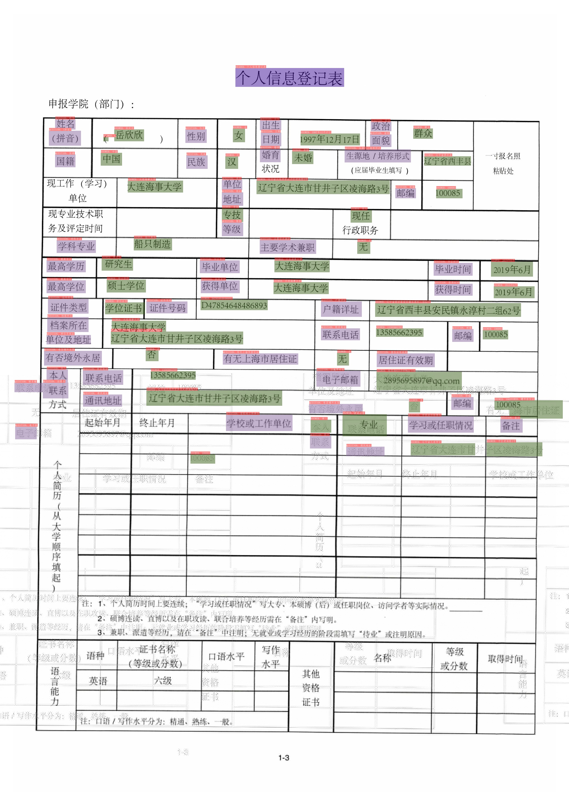
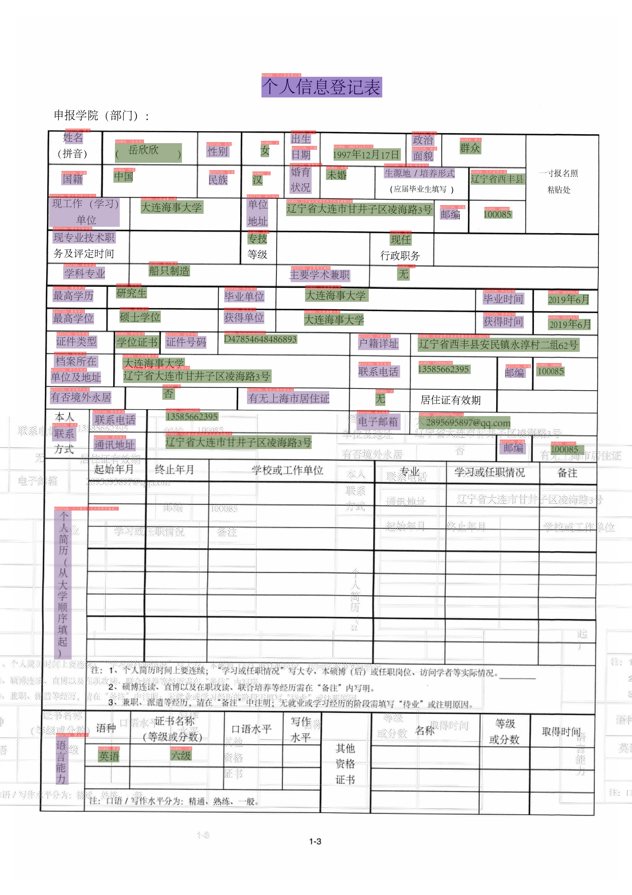
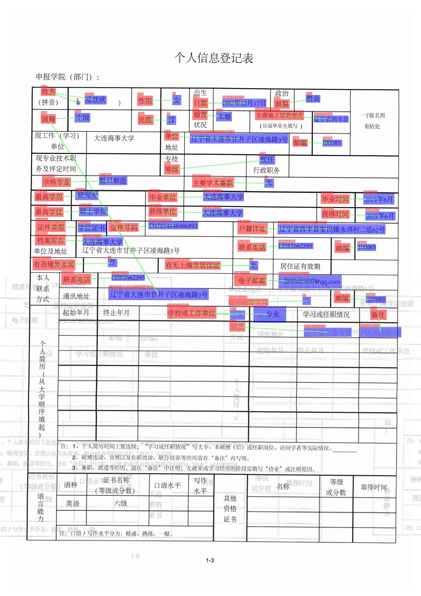
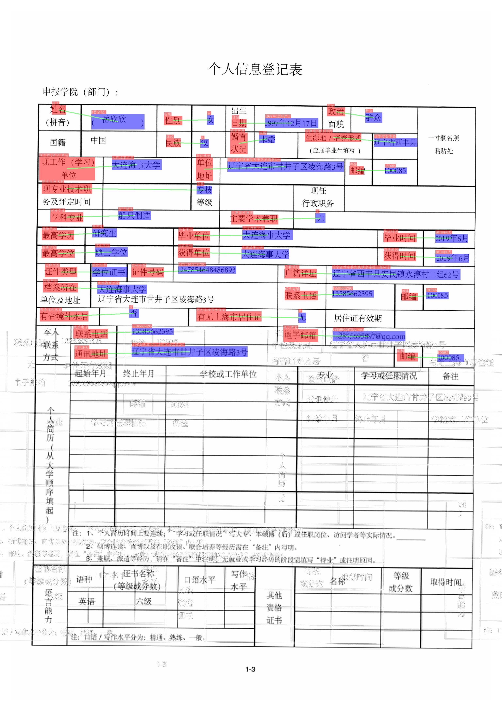

# 关键信息抽取

本文提供了PaddleOCR关键信息抽取的全流程指南，包括语义实体识别 (Semantic Entity Recognition) 以及关系抽取 (Relation Extraction, RE) 任务的数据准备、模型训练、调优、评估、预测，各个阶段的详细说明。

- [1. 数据准备](#1-数据准备)
  - [1.1. 准备数据集](#11-准备数据集)
  - [1.2. 自定义数据集](#12-自定义数据集)
  - [1.3. 数据下载](#13-数据下载)
- [2. 开始训练](#2-开始训练)
  - [2.1. 启动训练](#21-启动训练)
  - [2.2. 断点训练](#22-断点训练)
  - [2.3. 混合精度训练](#24-混合精度训练)
  - [2.4. 分布式训练](#25-分布式训练)
  - [2.5. 知识蒸馏训练](#26-知识蒸馏训练)
  - [2.6. 其他训练环境](#27-其他训练环境)
- [3. 模型评估与预测](#3-模型评估与预测)
  - [3.1. 指标评估](#31-指标评估)
  - [3.2. 测试信息抽取效果](#32-测试识别效果)
- [4. 模型导出与预测](#4-模型导出与预测)
- [5. FAQ](#5-faq)

# 1. 数据准备

## 1.1. 准备数据集

在训练信息抽取相关模型时，PaddleOCR支持以下数据格式。
 - `通用数据` 用于训练以文本文件存储的数据集(SimpleDataSet);

训练数据的默认存储路径是 `PaddleOCR/train_data`,如果您的磁盘上已有数据集，只需创建软链接至数据集目录：

```
# linux and mac os
ln -sf <path/to/dataset> <path/to/paddle_ocr>/train_data/dataset
# windows
mklink /d <path/to/paddle_ocr>/train_data/dataset <path/to/dataset>
```

## 1.2. 自定义数据集

训练过程中一般包含训练集与验证集，二者数据格式相同，下面介绍如何自定义数据集。

**（1）训练集**

建议将训练图片放入同一个文件夹，并用一个文本文件记录图片路径和标签，文本文件里的内容如下:

```py
" 图像文件名                 图像标注信息 "
zh_train_0.jpg   [{"transcription": "汇丰晋信", "label": "other", "points": [[104, 114], [530, 114], [530, 175], [104, 175]], "id": 1, "linking": []}, {"transcription": "受理时间:", "label": "question", "points": [[126, 267], [266, 267], [266, 305], [126, 305]], "id": 7, "linking": [[7, 13]]}, {"transcription": "2020.6.15", "label": "answer", "points": [[321, 239], [537, 239], [537, 285], [321, 285]], "id": 13, "linking": [[7, 13]]}]
zh_train_1.jpg   [{"transcription": "中国人体器官捐献", "label": "other", "points": [[544, 459], [954, 459], [954, 517], [544, 517]], "id": 1, "linking": []}, {"transcription": ">编号:MC545715483585", "label": "other", "points": [[1462, 470], [2054, 470], [2054, 543], [1462, 543]], "id": 10, "linking": []}, {"transcription": "CHINAORGANDONATION", "label": "other", "points": [[543, 516], [958, 516], [958, 551], [543, 551]], "id": 14, "linking": []}, {"transcription": "中国人体器官捐献志愿登记表", "label": "header", "points": [[635, 793], [1892, 793], [1892, 904], [635, 904]], "id": 18, "linking": []}]
...
```

**注意：** 文本文件中默认请将图片路径和图片标签用 `\t` 分割，如用其他方式分割将造成训练报错。

其中图像标注信息字符串经过json解析之后可以得到一个列表信息，列表中每个元素是一个字典，存储了每个文本行的需要信息，各个字段的含义如下。

- transcription: 存储了文本行的文字内容
- label: 该文本行内容所属的类别
- points: 存储文本行的四点位置信息
- id: 存储文本行的id信息，用于RE任务的训练
- linking: 存储文本行的之间的连接信息，用于RE任务的训练

**（2）验证集**

验证集构建方式与训练集相同。

**（3）字典文件**

训练集与验证集中的文本行包含标签信息，所有标签的列表存在字典文件中（如`class_list.txt`），字典文件中的每一行表示为一个类别名称。

以XFUND_zh数据为例，共包含4个类别，字典文件内容如下所示。

```
OTHER
QUESTION
ANSWER
HEADER
```

在标注文件中，每个标注的文本行内容的`label`字段标注信息需要属于字典内容。

最终数据集应有如下文件结构：

```
|-train_data
  |-data_name
    |- train.json
    |- train
        |- zh_train_0.png
        |- zh_train_1.jpg
        | ...
    |- val.json
    |- val
        |- zh_val_0.png
        |- zh_val_1.jpg
        | ...
```

**注：**

- 标注文件中的类别信息不区分大小写，如`HEADER`与`header`会被解析为相同的类别id，因此在标注的时候，不能使用小写处理后相同的字符串表示不同的类别。
- 在整理标注文件的时候，建议将other这个类别（其他，无需关注的文本行可以标注为other）放在第一行，在解析的时候，会将`other`类别的类别id解析为0，后续不会对该类进行可视化。

## 1.3. 数据下载

如果你没有本地数据集，可以从[XFUND](https://github.com/doc-analysis/XFUND)或者[FUNSD](https://guillaumejaume.github.io/FUNSD/)官网下载数据，然后使用XFUND与FUNSD的处理脚本([XFUND](../../ppstructure/kie/tools/trans_xfun_data.py), [FUNSD](../../ppstructure/kie/tools/trans_funsd_label.py))，生成用于PaddleOCR训练的数据格式，并使用公开数据集快速体验关键信息抽取的流程。

更多关于公开数据集的介绍，请参考[关键信息抽取数据集说明文档](./dataset/kie_datasets.md)。

PaddleOCR也支持了关键信息抽取模型的标注，具体使用方法请参考：[PPOCRLabel使用文档](../../PPOCRLabel/README_ch.md)。


# 2. 开始训练

PaddleOCR提供了训练脚本、评估脚本和预测脚本，本节将以 VI-LayoutXLM 多模态预训练模型为例进行讲解。

> 如果希望使用基于SDMGR的关键信息抽取算法，请参考：[SDMGR使用](./algorithm_kie_sdmgr.md)。

## 2.1. 启动训练

如果你没有使用自定义数据集，可以使用PaddleOCR中已经处理好的XFUND_zh数据集进行快速体验。

```bash
mkdir train_data
cd train_data
wget https://paddleocr.bj.bcebos.com/ppstructure/dataset/XFUND.tar && tar -xf XFUND.tar
cd ..
```

如果不希望训练，直接体验后面的模型评估、预测、动转静、推理的流程，可以下载PaddleOCR中提供的预训练模型，并跳过2.1部分。

使用下面的方法，下载基于XFUND数据的SER与RE任务预训练模型。

```bash
mkdir pretrained_model
cd pretrained_model
# 下载并解压SER预训练模型
wget https://paddleocr.bj.bcebos.com/ppstructure/models/vi_layoutxlm/ser_vi_layoutxlm_xfund_pretrained.tar & tar -xf ser_vi_layoutxlm_xfund_pretrained.tar

# 下载并解压RE预训练模型
wget https://paddleocr.bj.bcebos.com/ppstructure/models/vi_layoutxlm/re_vi_layoutxlm_xfund_pretrained.tar & tar -xf re_vi_layoutxlm_xfund_pretrained.tar
```

开始训练:

- 如果您安装的是cpu版本，请将配置文件中的 `use_gpu` 字段修改为false
- PaddleOCR在训练时，会默认下载VI-LayoutXLM预训练模型，这里无需预先下载。

```bash
# GPU训练 支持单卡，多卡训练
# 训练日志会自动保存到 配置文件中"{Global.save_model_dir}" 下的train.log文件中

# SER单卡训练
python3 tools/train.py -c configs/kie/vi_layoutxlm/ser_vi_layoutxlm_xfund_zh.yml

# SER多卡训练，通过--gpus参数指定卡号
python3 -m paddle.distributed.launch --gpus '0,1,2,3'  tools/train.py -c configs/kie/vi_layoutxlm/ser_vi_layoutxlm_xfund_zh.yml

# RE任务单卡训练
python3 tools/train.py -c configs/kie/vi_layoutxlm/re_vi_layoutxlm_xfund_zh.yml
```

以SER任务为例，正常启动训练后，会看到以下log输出：

```
[2022/08/08 16:28:28] ppocr INFO: epoch: [1/200], global_step: 10, lr: 0.000006, loss: 1.871535, avg_reader_cost: 0.28200 s, avg_batch_cost: 0.82318 s, avg_samples: 8.0, ips: 9.71838 samples/s, eta: 0:51:59
[2022/08/08 16:28:33] ppocr INFO: epoch: [1/200], global_step: 19, lr: 0.000018, loss: 1.461939, avg_reader_cost: 0.00042 s, avg_batch_cost: 0.32037 s, avg_samples: 6.9, ips: 21.53773 samples/s, eta: 0:37:55
[2022/08/08 16:28:39] ppocr INFO: cur metric, precision: 0.11526348939743859, recall: 0.19776657060518732, hmean: 0.14564265817747712, fps: 34.008392345050055
[2022/08/08 16:28:45] ppocr INFO: save best model is to ./output/ser_vi_layoutxlm_xfund_zh/best_accuracy
[2022/08/08 16:28:45] ppocr INFO: best metric, hmean: 0.14564265817747712, precision: 0.11526348939743859, recall: 0.19776657060518732, fps: 34.008392345050055, best_epoch: 1
[2022/08/08 16:28:51] ppocr INFO: save model in ./output/ser_vi_layoutxlm_xfund_zh/latest
```

log 中自动打印如下信息：

|  字段   |   含义   |  
| :----: | :------: |
|  epoch | 当前迭代轮次 |
|  iter  | 当前迭代次数 |
|  lr    | 当前学习率 |
|  loss  | 当前损失函数 |
|  reader_cost | 当前 batch 数据处理耗时 |
|  batch_cost | 当前 batch 总耗时 |
|  samples  | 当前 batch 内的样本数 |
|  ips  | 每秒处理图片的数量 |


PaddleOCR支持训练和评估交替进行, 可以在 `configs/kie/vi_layoutxlm/ser_vi_layoutxlm_xfund_zh.yml` 中修改 `eval_batch_step` 设置评估频率，默认每19个iter评估一次。评估过程中默认将最佳hmean模型，保存为 `output/ser_vi_layoutxlm_xfund_zh/best_accuracy/` 。

如果验证集很大，测试将会比较耗时，建议减少评估次数，或训练完再进行评估。

**提示：** 可通过 -c 参数选择 `configs/kie/` 路径下的多种模型配置进行训练，PaddleOCR支持的信息抽取算法可以参考[前沿算法列表](./algorithm_overview.md)。


如果你希望训练自己的数据集，需要修改配置文件中的数据配置、字典文件以及类别数。


以 `configs/kie/vi_layoutxlm/ser_vi_layoutxlm_xfund_zh.yml` 为例，修改的内容如下所示。

```yaml

Architecture:
  # ...
  Backbone:
    name: LayoutXLMForSer
    pretrained: True
    mode: vi
    # 假设字典中包含n个字段（包含other），由于采用BIO标注，则类别数为2n-1
    num_classes: &num_classes 7

PostProcess:
  name: kieSerTokenLayoutLMPostProcess
  # 修改字典文件的路径为你自定义的数据集的字典路径
  class_path: &class_path train_data/XFUND/class_list_xfun.txt

Train:
  dataset:
    name: SimpleDataSet
    # 修改为你自己的训练数据目录
    data_dir: train_data/XFUND/zh_train/image
    # 修改为你自己的训练数据标签文件
    label_file_list:
      - train_data/XFUND/zh_train/train.json
    ...
  loader:
    # 训练时的单卡batch_size
    batch_size_per_card: 8
    ...

Eval:
  dataset:
    name: SimpleDataSet
    # 修改为你自己的验证数据目录
    data_dir: train_data/XFUND/zh_val/image
    # 修改为你自己的验证数据标签文件
    label_file_list:
      - train_data/XFUND/zh_val/val.json
    ...
  loader:
    # 验证时的单卡batch_size
    batch_size_per_card: 8
```

**注意，预测/评估时的配置文件请务必与训练一致。**

## 2.2. 断点训练

如果训练程序中断，如果希望加载训练中断的模型从而恢复训练，可以通过指定` Architecture.Backbone.checkpoints`指定要加载的模型路径：

```bash
python3 tools/train.py -c configs/kie/vi_layoutxlm/ser_vi_layoutxlm_xfund_zh.yml -o Architecture.Backbone.checkpoints=./output/ser_vi_layoutxlm_xfund_zh/best_accuracy
```

**注意**：

- `Architecture.Backbone.checkpoints`的优先级高于`Architecture.Backbone.pretrained`，需要加载之前训练好的训练模型进行模型微调、恢复训练、模型评估时，需要使用`Architecture.Backbone.checkpoints`指定模型参数路径；如果需要使用默认提供的通用预训练模型进行训练，则需要指定`Architecture.Backbone.pretrained`为`True`，同时指定`Architecture.Backbone.checkpoints`为空（`null`）。
- LayoutXLM系列模型均是调用了PaddleNLP中的预训练模型，模型加载与保存的逻辑与PaddleNLP基本一致，因此在这里不需要指定`Global.pretrained_model`或者`Global.checkpoints`参数；此外，LayoutXLM系列模型的蒸馏训练目前不支持断点训练。


## 2.3. 混合精度训练

coming soon!

## 2.4. 分布式训练

多机多卡训练时，通过 `--ips` 参数设置使用的机器IP地址，通过 `--gpus` 参数设置使用的GPU ID：

```bash
python3 -m paddle.distributed.launch --ips="xx.xx.xx.xx,xx.xx.xx.xx" --gpus '0,1,2,3' tools/train.py -c configs/kie/vi_layoutxlm/ser_vi_layoutxlm_xfund_zh.yml
```

**注意:** （1）采用多机多卡训练时，需要替换上面命令中的ips值为您机器的地址，机器之间需要能够相互ping通；（2）训练时需要在多个机器上分别启动命令。查看机器ip地址的命令为`ifconfig`；（3）更多关于分布式训练的性能优势等信息，请参考：[分布式训练教程](./distributed_training.md)。

## 2.5. 知识蒸馏训练

PaddleOCR支持了基于U-DML知识蒸馏的关键信息抽取模型训练过程，配置文件请参考：[ser_vi_layoutxlm_xfund_zh_udml.yml](../../configs/kie/vi_layoutxlm/ser_vi_layoutxlm_xfund_zh_udml.yml)，更多关于知识蒸馏的说明文档请参考：[知识蒸馏说明文档](./knowledge_distillation.md)。

**注意**： PaddleOCR中LayoutXLM系列关键信息抽取模型的保存与加载逻辑与PaddleNLP保持一致，因此在蒸馏的过程中仅保存了学生模型的参数，如果希望使用保存的模型进行评估，需要使用学生模型的配置（上面的蒸馏文件对应的学生模型为[ser_vi_layoutxlm_xfund_zh.yml](../../configs/kie/vi_layoutxlm/ser_vi_layoutxlm_xfund_zh.yml)）


## 2.6. 其他训练环境

- Windows GPU/CPU
在Windows平台上与Linux平台略有不同:
Windows平台只支持`单卡`的训练与预测，指定GPU进行训练`set CUDA_VISIBLE_DEVICES=0`
在Windows平台，DataLoader只支持单进程模式，因此需要设置 `num_workers` 为0;

- macOS
不支持GPU模式，需要在配置文件中设置`use_gpu`为False，其余训练评估预测命令与Linux GPU完全相同。

- Linux DCU
DCU设备上运行需要设置环境变量 `export HIP_VISIBLE_DEVICES=0,1,2,3`，其余训练评估预测命令与Linux GPU完全相同。


# 3. 模型评估与预测

## 3.1. 指标评估

训练中模型参数默认保存在`Global.save_model_dir`目录下。在评估指标时，需要设置`Architecture.Backbone.checkpoints`指向保存的参数文件。评估数据集可以通过 `configs/kie/vi_layoutxlm/ser_vi_layoutxlm_xfund_zh.yml`  修改Eval中的 `label_file_path` 设置。

```bash
# GPU 评估， Global.checkpoints 为待测权重
python3 tools/eval.py -c configs/kie/vi_layoutxlm/ser_vi_layoutxlm_xfund_zh.yml -o Architecture.Backbone.checkpoints=./output/ser_vi_layoutxlm_xfund_zh/best_accuracy
```

会输出以下信息，打印出precision、recall、hmean等信息。

```py
[2022/08/09 07:59:28] ppocr INFO: metric eval ***************
[2022/08/09 07:59:28] ppocr INFO: precision:0.697476609016161
[2022/08/09 07:59:28] ppocr INFO: recall:0.8861671469740634
[2022/08/09 07:59:28] ppocr INFO: hmean:0.7805806758686339
[2022/08/09 07:59:28] ppocr INFO: fps:17.367364606899105
```


## 3.2. 测试信息抽取结果

使用 PaddleOCR 训练好的模型，可以通过以下脚本进行快速预测。

默认预测的图片存储在 `infer_img` 里，通过 `-o Architecture.Backbone.checkpoints` 加载训练好的参数文件：

根据配置文件中设置的 `save_model_dir` 和 `save_epoch_step` 字段，会有以下几种参数被保存下来：

```
output/ser_vi_layoutxlm_xfund_zh/
├── best_accuracy
       ├── metric.states
       ├── model_config.json
       ├── model_state.pdparams
├── best_accuracy.pdopt
├── config.yml
├── train.log
├── latest
       ├── metric.states
       ├── model_config.json
       ├── model_state.pdparams
├── latest.pdopt
```

其中 best_accuracy.* 是评估集上的最优模型；latest.* 是最新保存的一个模型。


预测使用的配置文件必须与训练一致，如您通过 `python3 tools/train.py -c configs/kie/vi_layoutxlm/ser_vi_layoutxlm_xfund_zh.yml` 完成了模型的训练过程。

您可以使用如下命令进行中文模型预测。


```bash
python3 tools/infer_kie_token_ser.py -c configs/kie/vi_layoutxlm/ser_vi_layoutxlm_xfund_zh.yml -o Architecture.Backbone.checkpoints=./output/ser_vi_layoutxlm_xfund_zh/best_accuracy Global.infer_img=./ppstructure/docs/kie/input/zh_val_42.jpg
```

预测图片如下所示，图片会存储在`Global.save_res_path`路径中。

<div align="center">
    
</div>

预测过程中，默认会加载PP-OCRv3的检测识别模型，用于OCR的信息抽取，如果希望加载预先获取的OCR结果，可以使用下面的方式进行预测，指定`Global.infer_img`为标注文件，其中包含图片路径以及OCR信息，同时指定`Global.infer_mode`为False，表示此时不使用OCR预测引擎。

```bash
python3 tools/infer_kie_token_ser.py -c configs/kie/vi_layoutxlm/ser_vi_layoutxlm_xfund_zh.yml -o Architecture.Backbone.checkpoints=./output/ser_vi_layoutxlm_xfund_zh/best_accuracy Global.infer_img=./train_data/XFUND/zh_val/val.json Global.infer_mode=False
```

对于上述图片，如果使用标注的OCR结果进行信息抽取，预测结果如下。

<div align="center">
    
</div>

可以看出，部分检测框信息更加准确，但是整体信息抽取识别结果基本一致。


在RE任务模型预测时，需要先给出模型SER结果，因此需要同时加载SER的配置文件与模型权重，示例如下。


```bash
python3 ./tools/infer_kie_token_ser_re.py \
  -c configs/kie/vi_layoutxlm/re_vi_layoutxlm_xfund_zh.yml \
  -o Architecture.Backbone.checkpoints=./pretrain_models/re_vi_layoutxlm_udml_xfund_zh/best_accuracy/ \
  Global.infer_img=./train_data/XFUND/zh_val/image/ \
  -c_ser configs/kie/vi_layoutxlm/ser_vi_layoutxlm_xfund_zh.yml \
  -o_ser Architecture.Backbone.checkpoints=pretrain_models/ \
  ser_vi_layoutxlm_udml_xfund_zh/best_accuracy/
```

预测结果如下所示。

<div align="center">
    
</div>


如果希望使用标注或者预先获取的OCR信息进行关键信息抽取，同上，可以指定`Global.infer_mode`为False，指定`Global.infer_img`为标注文件。

```bash
python3 ./tools/infer_kie_token_ser_re.py -c configs/kie/vi_layoutxlm/re_vi_layoutxlm_xfund_zh.yml -o Architecture.Backbone.checkpoints=./pretrain_models/re_vi_layoutxlm_udml_xfund_zh/re_layoutxlm_xfund_zh_v4_udml/best_accuracy/ Global.infer_img=./train_data/XFUND/zh_val/val.json Global.infer_mode=False -c_ser configs/kie/vi_layoutxlm/ser_vi_layoutxlm_xfund_zh.yml -o_ser Architecture.Backbone.checkpoints=pretrain_models/ser_vi_layoutxlm_udml_xfund_zh/best_accuracy/
```

其中`c_ser`表示SER的配置文件，`o_ser` 后面需要加上待修改的SER模型与配置文件，如预训练权重等。


预测结果如下所示。

<div align="center">
    
</div>

可以看出，直接使用标注的OCR结果的RE预测结果要更加准确一些。

# 4. 模型导出与预测


## 4.1 模型导出

inference 模型（`paddle.jit.save`保存的模型）
一般是模型训练，把模型结构和模型参数保存在文件中的固化模型，多用于预测部署场景。
训练过程中保存的模型是checkpoints模型，保存的只有模型的参数，多用于恢复训练等。
与checkpoints模型相比，inference 模型会额外保存模型的结构信息，在预测部署、加速推理上性能优越，灵活方便，适合于实际系统集成。

信息抽取模型中的SER任务转inference模型步骤如下：

```bash
# -c 后面设置训练算法的yml配置文件
# -o 配置可选参数
# Architecture.Backbone.checkpoints 参数设置待转换的训练模型地址
# Global.save_inference_dir 参数设置转换的模型将保存的地址

python3 tools/export_model.py -c configs/kie/vi_layoutxlm/ser_vi_layoutxlm_xfund_zh.yml -o Architecture.Backbone.checkpoints=./output/ser_vi_layoutxlm_xfund_zh/best_accuracy Global.save_inference_dir=./inference/ser_vi_layoutxlm
```

转换成功后，在目录下有三个文件：

```
inference/ser_vi_layoutxlm/
    ├── inference.pdiparams         # inference模型的参数文件
    ├── inference.pdiparams.info    # inference模型的参数信息，可忽略
    └── inference.pdmodel           # inference模型的模型结构文件
```

RE任务的动转静过程适配中，敬请期待。

## 4.2 模型推理

VI-LayoutXLM模型基于SER任务进行推理，可以执行如下命令：

```bash
cd ppstructure
python3 kie/predict_kie_token_ser.py \
  --kie_algorithm=LayoutXLM \
  --ser_model_dir=../inference/ser_vi_layoutxlm \
  --image_dir=./docs/kie/input/zh_val_42.jpg \
  --ser_dict_path=../train_data/XFUND/class_list_xfun.txt \
  --vis_font_path=../doc/fonts/simfang.ttf \
  --ocr_order_method="tb-yx"
```

可视化SER结果结果默认保存到`./output`文件夹里面。结果示例如下：

<div align="center">
    
</div>


# 5. FAQ

Q1: 训练模型转inference 模型之后预测效果不一致？

**A**：该问题多是trained model预测时候的预处理、后处理参数和inference model预测的时候的预处理、后处理参数不一致导致的。可以对比训练使用的配置文件中的预处理、后处理和预测时是否存在差异。
