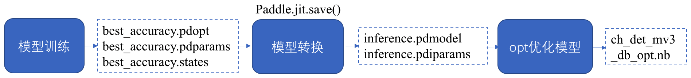

## OCR模型列表（V2.0，2021年1月20日更新）

> **说明**
> 1. 2.0版模型和[1.1版模型](https://github.com/PaddlePaddle/PaddleOCR/blob/develop/doc/doc_ch/models_list.md)的主要区别在于动态图训练vs.静态图训练，模型性能上无明显差距。
> 2. 本文档提供的是PPOCR自研模型列表，更多基于公开数据集的算法介绍与预训练模型可以参考：[算法概览文档](./algorithm_overview.md)。


- [一、文本检测模型](#文本检测模型)
- [二、文本识别模型](#文本识别模型)
    - [1. 中文识别模型](#中文识别模型)
    - [2. 英文识别模型](#英文识别模型)
    - [3. 多语言识别模型](#多语言识别模型)
- [三、文本方向分类模型](#文本方向分类模型)

PaddleOCR提供的可下载模型包括`推理模型`、`训练模型`、`预训练模型`、`slim模型`，模型区别说明如下：

|模型类型|模型格式|简介|
|--- | --- | --- |
|推理模型|inference.pdmodel、inference.pdiparams|用于预测引擎推理，[详情](./inference.md)|
|训练模型、预训练模型|\*.pdparams、\*.pdopt、\*.states |训练过程中保存的模型的参数、优化器状态和训练中间信息，多用于模型指标评估和恢复训练|
|slim模型|\*.nb|经过飞桨模型压缩工具PaddleSlim压缩后的模型，适用于移动端/IoT端等端侧部署场景（需使用飞桨Paddle Lite部署）。|


各个模型的关系如下面的示意图所示。




<a name="文本检测模型"></a>
### 一、文本检测模型

|模型名称|模型简介|配置文件|推理模型大小|下载地址|
| --- | --- | --- | --- | --- |
|ch_ppocr_mobile_slim_v2.0_det|slim裁剪版超轻量模型，支持中英文、多语种文本检测|[ch_det_mv3_db_v2.0.yml](../../configs/det/ch_ppocr_v2.0/ch_det_mv3_db_v2.0.yml)| |推理模型 (coming soon) / 训练模型 (coming soon)|
|ch_ppocr_mobile_v2.0_det|原始超轻量模型，支持中英文、多语种文本检测|[ch_det_mv3_db_v2.0.yml](../../configs/det/ch_ppocr_v2.0/ch_det_mv3_db_v2.0.yml)|3M|[推理模型](https://paddleocr.bj.bcebos.com/dygraph_v2.0/ch/ch_ppocr_mobile_v2.0_det_infer.tar) / [训练模型](https://paddleocr.bj.bcebos.com/dygraph_v2.0/ch/ch_ppocr_mobile_v2.0_det_train.tar)|
|ch_ppocr_server_v2.0_det|通用模型，支持中英文、多语种文本检测，比超轻量模型更大，但效果更好|[ch_det_res18_db_v2.0.yml](../../configs/det/ch_ppocr_v2.0/ch_det_res18_db_v2.0.yml)|47M|[推理模型](https://paddleocr.bj.bcebos.com/dygraph_v2.0/ch/ch_ppocr_server_v2.0_det_infer.tar) / [训练模型](https://paddleocr.bj.bcebos.com/dygraph_v2.0/ch/ch_ppocr_server_v2.0_det_train.tar)|


<a name="文本识别模型"></a>
### 二、文本识别模型

<a name="中文识别模型"></a>
#### 1. 中文识别模型

|模型名称|模型简介|配置文件|推理模型大小|下载地址|
| --- | --- | --- | --- | --- |
|ch_ppocr_mobile_slim_v2.0_rec|slim裁剪量化版超轻量模型，支持中英文、数字识别|[rec_chinese_lite_train_v2.0.yml](../../configs/rec/ch_ppocr_v2.0/rec_chinese_lite_train_v2.0.yml)| |[推理模型](https://paddleocr.bj.bcebos.com/dygraph_v2.0/ch/ch_ppocr_mobile_v2.0_rec_slim_infer.tar) / [训练模型](https://paddleocr.bj.bcebos.com/dygraph_v2.0/ch/ch_ppocr_mobile_v2.0_rec_slim_train.tar) |
|ch_ppocr_mobile_v2.0_rec|原始超轻量模型，支持中英文、数字识别|[rec_chinese_lite_train_v2.0.yml](../../configs/rec/ch_ppocr_v2.0/rec_chinese_lite_train_v2.0.yml)|3.71M|[推理模型](https://paddleocr.bj.bcebos.com/dygraph_v2.0/ch/ch_ppocr_mobile_v2.0_rec_infer.tar) / [训练模型](https://paddleocr.bj.bcebos.com/dygraph_v2.0/ch/ch_ppocr_mobile_v2.0_rec_train.tar) / [预训练模型](https://paddleocr.bj.bcebos.com/dygraph_v2.0/ch/ch_ppocr_mobile_v2.0_rec_pre.tar) |
|ch_ppocr_server_v2.0_rec|通用模型，支持中英文、数字识别|[rec_chinese_common_train_v2.0.yml](../../configs/rec/ch_ppocr_v2.0/rec_chinese_common_train_v2.0.yml)|94.8M|[推理模型](https://paddleocr.bj.bcebos.com/dygraph_v2.0/ch/ch_ppocr_server_v2.0_rec_infer.tar) / [训练模型](https://paddleocr.bj.bcebos.com/dygraph_v2.0/ch/ch_ppocr_server_v2.0_rec_train.tar) / [预训练模型](https://paddleocr.bj.bcebos.com/dygraph_v2.0/ch/ch_ppocr_server_v2.0_rec_pre.tar) |

**说明：** `训练模型`是基于预训练模型在真实数据与竖排合成文本数据上finetune得到的模型，在真实应用场景中有着更好的表现，`预训练模型`则是直接基于全量真实数据与合成数据训练得到，更适合用于在自己的数据集上finetune。

<a name="英文识别模型"></a>
#### 2. 英文识别模型

|模型名称|模型简介|配置文件|推理模型大小|下载地址|
| --- | --- | --- | --- | --- |
|en_number_mobile_slim_v2.0_rec|slim裁剪量化版超轻量模型，支持英文、数字识别|[rec_en_number_lite_train.yml](../../configs/rec/multi_language/rec_en_number_lite_train.yml)| | [推理模型](https://paddleocr.bj.bcebos.com/dygraph_v2.0/en/en_number_mobile_v2.0_rec_slim_infer.tar) / [训练模型](https://paddleocr.bj.bcebos.com/dygraph_v2.0/en/en_number_mobile_v2.0_rec_slim_train.tar) |
|en_number_mobile_v2.0_rec|原始超轻量模型，支持英文、数字识别|[rec_en_number_lite_train.yml](../../configs/rec/multi_language/rec_en_number_lite_train.yml)|2.56M|[推理模型](https://paddleocr.bj.bcebos.com/dygraph_v2.0/multilingual/en_number_mobile_v2.0_rec_infer.tar) / [训练模型](https://paddleocr.bj.bcebos.com/dygraph_v2.0/multilingual/en_number_mobile_v2.0_rec_train.tar) |

<a name="多语言识别模型"></a>
#### 3. 多语言识别模型（更多语言持续更新中...）

**说明：** 新增的多语言模型的配置文件通过代码方式生成，您可以通过`--help`参数查看当前PaddleOCR支持生成哪些多语言的配置文件：
```bash
# 该代码需要在指定目录运行
cd {your/path/}PaddleOCR/configs/rec/multi_language/
python3 generate_multi_language_configs.py --help
```
下面以生成意大利语配置文件为例：
##### 1. 生成意大利语配置文件测试现有模型

如果您仅仅想用配置文件测试PaddleOCR提供的多语言模型可以通过下面命令生成默认的配置文件，使用PaddleOCR提供的小语种字典进行预测。
```bash
# 该代码需要在指定目录运行
cd {your/path/}PaddleOCR/configs/rec/multi_language/
# 通过-l或者--language参数设置需要生成的语种的配置文件，该命令会将默认参数写入配置文件
python3 generate_multi_language_configs.py -l it
```
##### 2. 生成意大利语配置文件训练自己的数据
如果您想训练自己的小语种模型，可以准备好训练集文件、验证集文件、字典文件和训练数据路径，这里假设准备的意大利语的训练集、验证集、字典和训练数据路径为：
- 训练集:{your/path/}PaddleOCR/train_data/train_list.txt
- 验证集:{your/path/}PaddleOCR/train_data/val_list.txt
- 使用PaddleOCR提供的默认字典：{your/path/}PaddleOCR/ppocr/utils/dict/it_dict.txt
- 训练数据路径:{your/path/}PaddleOCR/train_data

使用以下命令生成配置文件：
```bash
# 该代码需要在指定目录运行
cd {your/path/}PaddleOCR/configs/rec/multi_language/
# -l或者--language字段是必须的
# --train修改训练集，--val修改验证集，--data_dir修改数据集目录，-o修改对应默认参数
# --dict命令改变字典路径，示例使用默认字典路径则该参数可不填
python3 generate_multi_language_configs.py -l it \
--train train_data/train_list.txt \
--val train_data/val_list.txt \
--data_dir train_data \
-o Global.use_gpu=False
```

|模型名称|模型简介|配置文件|推理模型大小|下载地址|
| --- | --- | --- | --- | --- |
| french_mobile_v2.0_rec |法文识别|[rec_french_lite_train.yml](../../configs/rec/multi_language/rec_french_lite_train.yml)|2.65M|[推理模型](https://paddleocr.bj.bcebos.com/dygraph_v2.0/multilingual/french_mobile_v2.0_rec_infer.tar) / [训练模型](https://paddleocr.bj.bcebos.com/dygraph_v2.0/multilingual/french_mobile_v2.0_rec_train.tar) |
| german_mobile_v2.0_rec |德文识别|[rec_german_lite_train.yml](../../configs/rec/multi_language/rec_german_lite_train.yml)|2.65M|[推理模型](https://paddleocr.bj.bcebos.com/dygraph_v2.0/multilingual/german_mobile_v2.0_rec_infer.tar) / [训练模型](https://paddleocr.bj.bcebos.com/dygraph_v2.0/multilingual/german_mobile_v2.0_rec_train.tar) |
| korean_mobile_v2.0_rec |韩文识别|[rec_korean_lite_train.yml](../../configs/rec/multi_language/rec_korean_lite_train.yml)|3.9M|[推理模型](https://paddleocr.bj.bcebos.com/dygraph_v2.0/multilingual/korean_mobile_v2.0_rec_infer.tar) / [训练模型](https://paddleocr.bj.bcebos.com/dygraph_v2.0/multilingual/korean_mobile_v2.0_rec_train.tar) |
| japan_mobile_v2.0_rec |日文识别|[rec_japan_lite_train.yml](../../configs/rec/multi_language/rec_japan_lite_train.yml)|4.23M|[推理模型](https://paddleocr.bj.bcebos.com/dygraph_v2.0/multilingual/japan_mobile_v2.0_rec_infer.tar) / [训练模型](https://paddleocr.bj.bcebos.com/dygraph_v2.0/multilingual/japan_mobile_v2.0_rec_train.tar) |
| chinese_cht_mobile_v2.0_rec |中文繁体识别|rec_chinese_cht_lite_train.yml|5.63M|[推理模型](https://paddleocr.bj.bcebos.com/dygraph_v2.0/multilingual/chinese_cht_mobile_v2.0_rec_infer.tar) / [训练模型](https://paddleocr.bj.bcebos.com/dygraph_v2.0/multilingual/chinese_cht_mobile_v2.0_rec_train.tar) |
| te_mobile_v2.0_rec |泰卢固文识别|rec_te_lite_train.yml|2.63M|[推理模型](https://paddleocr.bj.bcebos.com/dygraph_v2.0/multilingual/te_mobile_v2.0_rec_infer.tar) / [训练模型](https://paddleocr.bj.bcebos.com/dygraph_v2.0/multilingual/te_mobile_v2.0_rec_train.tar) |
| ka_mobile_v2.0_rec |卡纳达文识别|rec_ka_lite_train.yml|2.63M|[推理模型](https://paddleocr.bj.bcebos.com/dygraph_v2.0/multilingual/ka_mobile_v2.0_rec_infer.tar) / [训练模型](https://paddleocr.bj.bcebos.com/dygraph_v2.0/multilingual/ka_mobile_v2.0_rec_train.tar) |
| ta_mobile_v2.0_rec |泰米尔文识别|rec_ta_lite_train.yml|2.63M|[推理模型](https://paddleocr.bj.bcebos.com/dygraph_v2.0/multilingual/ta_mobile_v2.0_rec_infer.tar) / [训练模型](https://paddleocr.bj.bcebos.com/dygraph_v2.0/multilingual/ta_mobile_v2.0_rec_train.tar) |
| latin_mobile_v2.0_rec |  拉丁文识别 |  [rec_latin_lite_train.yml](../../configs/rec/multi_language/rec_latin_lite_train.yml) |2.6M|[推理模型](https://paddleocr.bj.bcebos.com/dygraph_v2.0/multilingual/latin_ppocr_mobile_v2.0_rec_infer.tar) / [训练模型](https://paddleocr.bj.bcebos.com/dygraph_v2.0/multilingual/latin_ppocr_mobile_v2.0_rec_train.tar) |
| arabic_mobile_v2.0_rec |  阿拉伯字母 | [rec_arabic_lite_train.yml](../../configs/rec/multi_language/rec_arabic_lite_train.yml) |2.6M|[推理模型](https://paddleocr.bj.bcebos.com/dygraph_v2.0/multilingual/arabic_ppocr_mobile_v2.0_rec_infer.tar) / [训练模型](https://paddleocr.bj.bcebos.com/dygraph_v2.0/multilingual/arabic_ppocr_mobile_v2.0_rec_train.tar) |
| cyrillic_mobile_v2.0_rec | 斯拉夫字母 | [rec_cyrillic_lite_train.yml](../../configs/rec/multi_language/rec_cyrillic_lite_train.yml) |2.6M|[推理模型](https://paddleocr.bj.bcebos.com/dygraph_v2.0/multilingual/cyrillic_ppocr_mobile_v2.0_rec_infer.tar) / [训练模型](https://paddleocr.bj.bcebos.com/dygraph_v2.0/multilingual/cyrillic_ppocr_mobile_v2.0_rec_train.tar) |
| devanagari_mobile_v2.0_rec | 梵文字母 | [rec_devanagari_lite_train.yml](../../configs/rec/multi_language/rec_devanagari_lite_train.yml) |2.6M|[推理模型](https://paddleocr.bj.bcebos.com/dygraph_v2.0/multilingual/devanagari_ppocr_mobile_v2.0_rec_infer.tar) / [训练模型](https://paddleocr.bj.bcebos.com/dygraph_v2.0/multilingual/devanagari_ppocr_mobile_v2.0_rec_train.tar) |

更多支持语种请参考: [多语言模型](https://github.com/PaddlePaddle/PaddleOCR/blob/release/2.1/doc/doc_ch/multi_languages.md#%E8%AF%AD%E7%A7%8D%E7%BC%A9%E5%86%99)


<a name="文本方向分类模型"></a>
### 三、文本方向分类模型

|模型名称|模型简介|配置文件|推理模型大小|下载地址|
| --- | --- | --- | --- | --- |
|ch_ppocr_mobile_slim_v2.0_cls|slim量化版模型|[cls_mv3.yml](../../configs/cls/cls_mv3.yml)| |[推理模型](https://paddleocr.bj.bcebos.com/dygraph_v2.0/ch/ch_ppocr_mobile_v2.0_cls_slim_infer.tar) / [训练模型](https://paddleocr.bj.bcebos.com/dygraph_v2.0/ch/ch_ppocr_mobile_v2.0_rec_slim_infer.tar) |
|ch_ppocr_mobile_v2.0_cls|原始模型|[cls_mv3.yml](../../configs/cls/cls_mv3.yml)|1.38M|[推理模型](https://paddleocr.bj.bcebos.com/dygraph_v2.0/ch/ch_ppocr_mobile_v2.0_cls_infer.tar) / [训练模型](https://paddleocr.bj.bcebos.com/dygraph_v2.0/ch/ch_ppocr_mobile_v2.0_cls_train.tar) |
