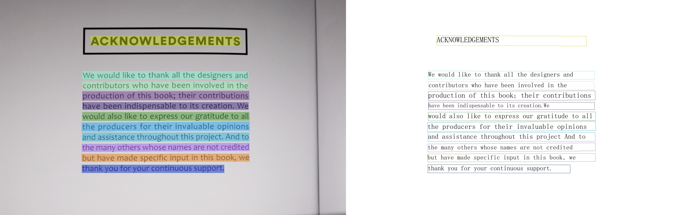
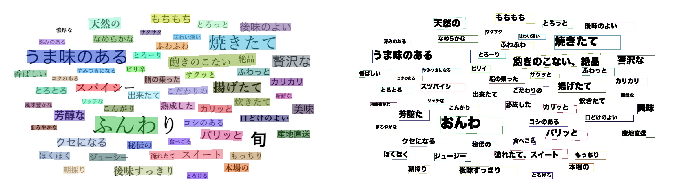
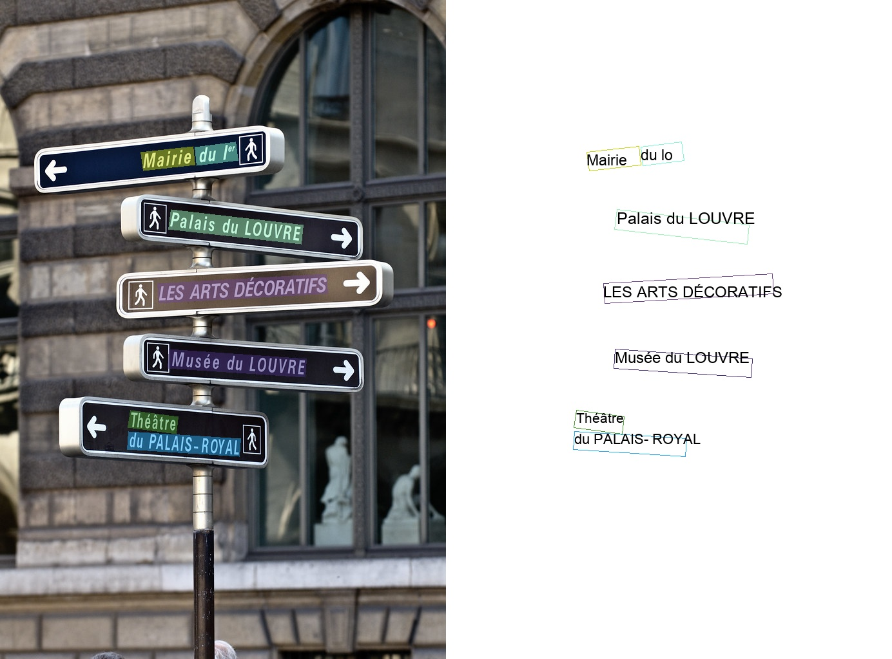

# 多语言模型

**近期更新**

- 2021.4.9 支持**80种**语言的检测和识别
- 2021.4.9 支持**轻量高精度**英文模型检测识别

PaddleOCR 旨在打造一套丰富、领先、且实用的OCR工具库，不仅提供了通用场景下的中英文模型，也提供了专门在英文场景下训练的模型，
和覆盖[80个语言](#语种缩写)的小语种模型。

其中英文模型支持，大小写字母和常见标点的检测识别，并优化了空格字符的识别：

<div align="center">
    
</div>

小语种模型覆盖了拉丁语系、阿拉伯语系、中文繁体、韩语、日语等等：

<div align="center">
    
    
    
    
</div>


本文档将简要介绍小语种模型的使用方法。

- [1 安装](#安装)
    - [1.1 paddle 安装](#paddle安装)
    - [1.2 paddleocr package 安装](#paddleocr_package_安装)  

- [2 快速使用](#快速使用)
    - [2.1 命令行运行](#命令行运行)
    - [2.2 python 脚本运行](#python_脚本运行)
- [3 自定义训练](#自定义训练)
- [4 预测部署](#预测部署)
- [4 支持语种及缩写](#语种缩写)

<a name="安装"></a>
## 1 安装

<a name="paddle安装"></a>
### 1.1 paddle 安装
```
# cpu
pip install paddlepaddle

# gpu
pip insatll paddlepaddle-gpu
```

<a name="paddleocr_package_安装"></a>
### 1.2 paddleocr package 安装


pip 安装
```
pip install "paddleocr>=2.0.6" # 推荐使用2.0.6版本
```
本地构建并安装
```
python3 setup.py bdist_wheel
pip3 install dist/paddleocr-x.x.x-py3-none-any.whl # x.x.x是paddleocr的版本号
```

<a name="快速使用"></a>
## 2 快速使用

<a name="命令行运行"></a>
### 2.1 命令行运行

查看帮助信息

```
paddleocr -h
```

* 整图预测（检测+识别）

Paddleocr目前支持80个语种，可以通过修改--lang参数进行切换，具体支持的[语种](#语种缩写)可查看表格。

``` bash

paddleocr --image_dir doc/imgs/japan_2.jpg --lang=japan
```

<div align="center">
    
</div>


结果是一个list，每个item包含了文本框，文字和识别置信度
```text
[[[671.0, 60.0], [847.0, 63.0], [847.0, 104.0], [671.0, 102.0]], ('もちもち', 0.9993342)]
[[[394.0, 82.0], [536.0, 77.0], [538.0, 127.0], [396.0, 132.0]], ('天然の', 0.9919842)]
[[[880.0, 89.0], [1014.0, 93.0], [1013.0, 127.0], [879.0, 124.0]], ('とろっと', 0.9976762)]
[[[1067.0, 101.0], [1294.0, 101.0], [1294.0, 138.0], [1067.0, 138.0]], ('後味のよい', 0.9988712)]
......
```

* 识别预测

```bash
paddleocr --image_dir doc/imgs_words/japan/1.jpg   --det false --lang=japan
```

结果是一个tuple，返回识别结果和识别置信度

```text
('したがって', 0.99965394)
```

* 检测预测

```
paddleocr --image_dir PaddleOCR/doc/imgs/11.jpg --rec false
```

结果是一个list，每个item只包含文本框

```
[[26.0, 457.0], [137.0, 457.0], [137.0, 477.0], [26.0, 477.0]]
[[25.0, 425.0], [372.0, 425.0], [372.0, 448.0], [25.0, 448.0]]
[[128.0, 397.0], [273.0, 397.0], [273.0, 414.0], [128.0, 414.0]]
......
```

<a name="python_脚本运行"></a>
### 2.2 python 脚本运行

ppocr 也支持在python脚本中运行，便于嵌入到您自己的代码中 ：

* 整图预测（检测+识别）

```
from paddleocr import PaddleOCR, draw_ocr

# 同样也是通过修改 lang 参数切换语种
ocr = PaddleOCR(lang="korean") # 首次执行会自动下载模型文件
img_path = 'doc/imgs/korean_1.jpg '
result = ocr.ocr(img_path)
# 可通过参数控制单独执行识别、检测
# result = ocr.ocr(img_path, det=False) 只执行识别
# result = ocr.ocr(img_path, rec=False) 只执行检测
# 打印检测框和识别结果
for line in result:
    print(line)

# 可视化
from PIL import Image
image = Image.open(img_path).convert('RGB')
boxes = [line[0] for line in result]
txts = [line[1][0] for line in result]
scores = [line[1][1] for line in result]
im_show = draw_ocr(image, boxes, txts, scores, font_path='/path/to/PaddleOCR/doc/fonts/korean.ttf')
im_show = Image.fromarray(im_show)
im_show.save('result.jpg')
```

结果可视化:

<div align="center">
    
</div>

ppocr 还支持方向分类， 更多使用方式请参考：[whl包使用说明](https://github.com/PaddlePaddle/PaddleOCR/blob/release/2.0/doc/doc_ch/whl.md)

<a name="自定义训练"></a>
## 3 自定义训练

ppocr 支持使用自己的数据进行自定义训练或finetune, 其中识别模型可以参考 [法语配置文件](../../configs/rec/multi_language/rec_french_lite_train.yml)
修改训练数据路径、字典等参数。

具体数据准备、训练过程可参考：[文本检测](../doc_ch/detection.md)、[文本识别](../doc_ch/recognition.md)，更多功能如预测部署、
数据标注等功能可以阅读完整的[文档教程](../../README_ch.md)。

<a name="预测部署"></a>
## 4 预测部署

除了安装whl包进行快速预测，ppocr 也提供了多种预测部署方式，如有需求可阅读相关文档：
- [基于Python脚本预测引擎推理](./inference.md)
- [基于C++预测引擎推理](../../deploy/cpp_infer/readme.md)
- [服务化部署](../../deploy/hubserving/readme.md)
- [端侧部署](https://github.com/PaddlePaddle/PaddleOCR/blob/develop/deploy/lite/readme.md)
- [Benchmark](./benchmark.md)


<a name="语种缩写"></a>
## 5 支持语种及缩写

| 语种 | 描述 | 缩写 | | 语种 | 描述 | 缩写 |
| --- | --- | --- | ---|--- | --- | --- |
|中文|chinese and english|ch| |保加利亚文|Bulgarian |bg|
|英文|english|en| |乌克兰文|Ukranian|uk|
|法文|french|fr| |白俄罗斯文|Belarusian|be|
|德文|german|german| |泰卢固文|Telugu |te|
|日文|japan|japan| | |阿巴扎文|Abaza |abq|
|韩文|korean|korean| |泰米尔文|Tamil |ta|
|中文繁体|chinese traditional |ch_tra| |南非荷兰文 |Afrikaans |af|
|意大利文| Italian |it| |阿塞拜疆文 |Azerbaijani    |az|
|西班牙文|Spanish |es| |波斯尼亚文|Bosnian|bs|
|葡萄牙文| Portuguese|pt| |捷克文|Czech|cs|
|俄罗斯文|Russia|ru| |威尔士文 |Welsh |cy|
|阿拉伯文|Arabic|ar| |丹麦文 |Danish|da|
|印地文|Hindi|hi| |爱沙尼亚文 |Estonian |et|
|维吾尔|Uyghur|ug| |爱尔兰文 |Irish |ga|
|波斯文|Persian|fa| |克罗地亚文|Croatian |hr|
|乌尔都文|Urdu|ur| |匈牙利文|Hungarian |hu|
|塞尔维亚文（latin)| Serbian(latin) |rs_latin| |印尼文|Indonesian|id|
|欧西坦文|Occitan |oc| |冰岛文 |Icelandic|is|
|马拉地文|Marathi|mr| |库尔德文 |Kurdish|ku|
|尼泊尔文|Nepali|ne| |立陶宛文|Lithuanian |lt|
|塞尔维亚文（cyrillic)|Serbian(cyrillic)|rs_cyrillic| |拉脱维亚文 |Latvian |lv|
|毛利文|Maori|mi| | 达尔瓦文|Dargwa |dar|
|马来文 |Malay|ms| | 因古什文|Ingush |inh|
|马耳他文 |Maltese |mt| | 拉克文|Lak |lbe|
|荷兰文 |Dutch |nl| | 莱兹甘文|Lezghian |lez|
|挪威文 |Norwegian |no| |塔巴萨兰文 |Tabassaran |tab|
|波兰文|Polish |pl| | 比尔哈文|Bihari |bh|
| 罗马尼亚文|Romanian |ro| | 迈蒂利文|Maithili |mai|
| 斯洛伐克文|Slovak |sk| | 昂加文|Angika |ang|
| 斯洛文尼亚文|Slovenian |sl| | 孟加拉文|Bhojpuri |bho|
| 阿尔巴尼亚文|Albanian |sq| | 摩揭陀文 |Magahi |mah|
| 瑞典文|Swedish |sv| | 那格浦尔文|Nagpur |sck|
| 西瓦希里文|Swahili |sw| | 尼瓦尔文|Newari |new|
| 塔加洛文|Tagalog |tl| | 保加利亚文 |Goan Konkani|gom|
| 土耳其文|Turkish |tr| | 沙特阿拉伯文|Saudi Arabia|sa|
| 乌兹别克文|Uzbek |uz| | 阿瓦尔文|Avar |ava|
| 越南文|Vietnamese |vi| | 阿瓦尔文|Avar |ava|
| 蒙古文|Mongolian |mn| | 阿迪赫文|Adyghe |ady|
