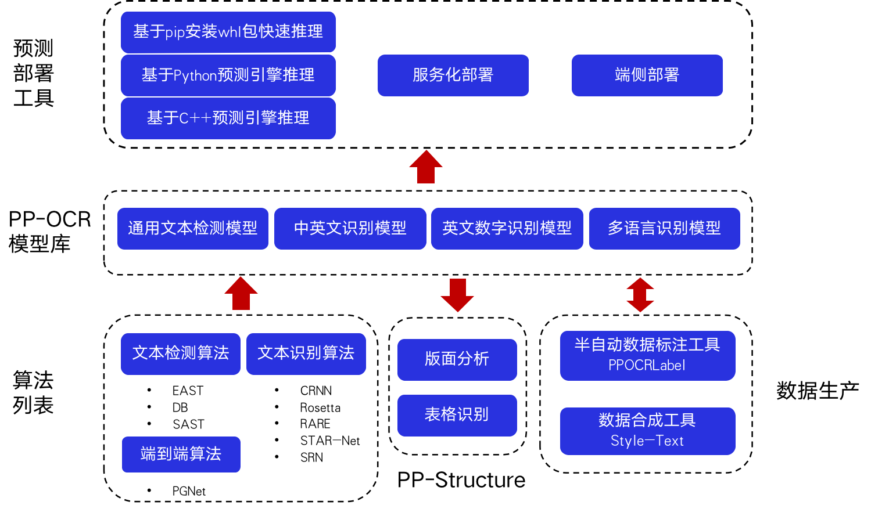

# PaddleOCR全景图与项目克隆

## 1. PaddleOCR全景图

PaddleOCR包含丰富的文本检测、文本识别以及端到端算法。结合实际测试与产业经验，PaddleOCR选择DB和CRNN作为基础的检测和识别模型，经过一系列优化策略提出面向产业应用的PP-OCR模型。PP-OCR模型针对通用场景，根据不同语种形成了PP-OCR模型库。基于PP-OCR的能力，PaddleOCR针对文档场景任务发布PP-Structure工具库，包含版面分析和表格识别两大任务。为了打通产业落地的全流程，PaddleOCR提供了规模化的数据生产工具和多种预测部署工具，助力开发者快速落地。

<div align="center">
    
</div>

## 2. 项目克隆

### **2.1 克隆PaddleOCR repo代码**

```
【推荐】git clone https://github.com/PaddlePaddle/PaddleOCR
```

如果因为网络问题无法pull成功，也可选择使用码云上的托管：

```
git clone https://gitee.com/paddlepaddle/PaddleOCR
```

注：码云托管代码可能无法实时同步本github项目更新，存在3~5天延时，请优先使用推荐方式。

### **2.2 安装第三方库**

```
cd PaddleOCR
pip3 install -r requirements.txt
```

