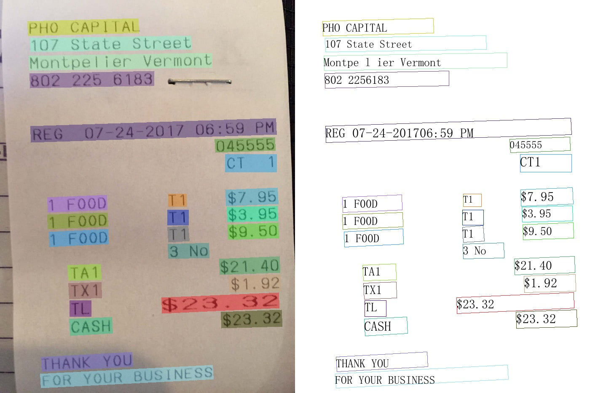

# PaddleOCR快速开始
- [PaddleOCR快速开始](#paddleocr)
  + [1. 安装PaddleOCR whl包](#1)
  * [2. 便捷使用](#2)
    + [2.1 命令行使用](#21)
      - [2.1.1 中英文模型](#211)
      - [2.1.2 多语言模型](#212)
      - [2.1.3 版面分析](#213)
    + [2.2 Python脚本使用](#22)
      - [2.2.1 中英文与多语言使用](#221)
      - [2.2.2 版面分析使用](#222)

<a name="1"></a>

## 1. 安装PaddleOCR whl包

```bash
pip install "paddleocr>=2.0.1" # 推荐使用2.0.1+版本
```

- 对于Windows环境用户：

  直接通过pip安装的shapely库可能出现`[winRrror 126] 找不到指定模块的问题`。建议从[这里](https://www.lfd.uci.edu/~gohlke/pythonlibs/#shapely)下载shapely安装包完成安装，

- 使用**版面分析**功能时，运行以下命令**安装 Layout-Parser**

  ```bash
  pip3 install -U https://paddleocr.bj.bcebos.com/whl/layoutparser-0.0.0-py3-none-any.whl
  ```


<a name="2"></a>
## 2. 便捷使用
<a name="21"></a>
### 2.1 命令行使用

PaddleOCR提供了一系列测试图片，点击xx下载，然后在终端中切换到相应目录

```
cd /path/to/ppocr_img
```

如果不使用提供的测试图片，可以将下方`--image_dir`参数替换为相应的测试图片路径
<a name="211"></a>
#### 2.1.1 中英文模型

* 检测+方向分类器+识别全流程：设置方向分类器参数`--use_angle_cls true`后可对竖排文本进行识别。

  ```bash
  paddleocr --image_dir ./imgs/11.jpg --use_angle_cls true
  ```

  结果是一个list，每个item包含了文本框，文字和识别置信度

  ```bash
  [[[24.0, 36.0], [304.0, 34.0], [304.0, 72.0], [24.0, 74.0]], ['纯臻营养护发素', 0.964739]]
  [[[24.0, 80.0], [172.0, 80.0], [172.0, 104.0], [24.0, 104.0]], ['产品信息/参数', 0.98069626]]
  [[[24.0, 109.0], [333.0, 109.0], [333.0, 136.0], [24.0, 136.0]], ['（45元/每公斤，100公斤起订）', 0.9676722]]
  ......
  ```

- 单独使用检测：设置`--rec`为`false`

  ```bash
  paddleocr --image_dir ./imgs/11.jpg --rec false
  ```

  结果是一个list，每个item只包含文本框

  ```bash
  [[26.0, 457.0], [137.0, 457.0], [137.0, 477.0], [26.0, 477.0]]
  [[25.0, 425.0], [372.0, 425.0], [372.0, 448.0], [25.0, 448.0]]
  [[128.0, 397.0], [273.0, 397.0], [273.0, 414.0], [128.0, 414.0]]
  ......
  ```

- 单独使用识别：设置`--det`为`false`

  ```bash
  paddleocr --image_dir ./imgs_words/ch/word_1.jpg --det false
  ```

  结果是一个list，每个item只包含识别结果和识别置信度

  ```bash
  ['韩国小馆', 0.9907421]
  ```


更多whl包使用包括， whl包参数说明


<a name="212"></a>
#### 2.1.2 多语言模型

Paddleocr目前支持80个语种，可以通过修改`--lang`参数进行切换，对于英文模型，指定`--lang=en`。

``` bash
paddleocr --image_dir ./imgs_en/254.jpg --lang=en
```

<div align="center">
    
    
</div>

结果是一个list，每个item包含了文本框，文字和识别置信度

```text
[('PHO CAPITAL', 0.95723116), [[66.0, 50.0], [327.0, 44.0], [327.0, 76.0], [67.0, 82.0]]]
[('107 State Street', 0.96311164), [[72.0, 90.0], [451.0, 84.0], [452.0, 116.0], [73.0, 121.0]]]
[('Montpelier Vermont', 0.97389287), [[69.0, 132.0], [501.0, 126.0], [501.0, 158.0], [70.0, 164.0]]]
[('8022256183', 0.99810505), [[71.0, 175.0], [363.0, 170.0], [364.0, 202.0], [72.0, 207.0]]]
[('REG 07-24-201706:59 PM', 0.93537045), [[73.0, 299.0], [653.0, 281.0], [654.0, 318.0], [74.0, 336.0]]]
[('045555', 0.99346405), [[509.0, 331.0], [651.0, 325.0], [652.0, 356.0], [511.0, 362.0]]]
[('CT1', 0.9988654), [[535.0, 367.0], [654.0, 367.0], [654.0, 406.0], [535.0, 406.0]]]
......
```

常用的多语言简写包括

| 语种     | 缩写        |      | 语种     | 缩写   |      | 语种     | 缩写   |
| -------- | ----------- | ---- | -------- | ------ | ---- | -------- | ------ |
| 中文     | ch          |      | 法文     | fr     |      | 日文     | japan  |
| 英文     | en          |      | 德文     | german |      | 韩文     | korean |
| 繁体中文 | chinese_cht |      | 意大利文 | it     |      | 俄罗斯文 | ru     |

全部语种及其对应的缩写列表可查看[多语言模型教程](./multi_languages.md)
<a name="213"></a>
#### 2.1.3 版面分析

使用PaddleOCR的版面分析功能，需要指定`--type=structure`

```bash
paddleocr --image_dir=./table/1.png --type=structure
```

- **返回结果说明**

  PP-Structure的返回结果为一个dict组成的list，示例如下

  ```shell
  [{   'type': 'Text',
        'bbox': [34, 432, 345, 462],
        'res': ([[36.0, 437.0, 341.0, 437.0, 341.0, 446.0, 36.0, 447.0], [41.0, 454.0, 125.0, 453.0, 125.0, 459.0, 41.0, 460.0]],
                  [('Tigure-6. The performance of CNN and IPT models using difforen', 0.90060663), ('Tent  ', 0.465441)])
    }
  ]
  ```

  其中各个字段说明如下

  | 字段 | 说明                                                         |
  | ---- | ------------------------------------------------------------ |
  | type | 图片区域的类型                                               |
  | bbox | 图片区域的在原图的坐标，分别[左上角x，左上角y，右下角x，右下角y] |
  | res  | 图片区域的OCR或表格识别结果。<br>表格: 表格的HTML字符串; <br>OCR: 一个包含各个单行文字的检测坐标和识别结果的元组 |

  运行完成后，每张图片会在`output`字段指定的目录下有一个同名目录，图片里的每个表格会存储为一个excel，图片区域会被裁剪之后保存下来，excel文件和图片名为表格在图片里的坐标。

  ```
  /output/table/1/
    └─ res.txt										
    └─ [454, 360, 824, 658].xlsx  表格识别结果
    └─ [16, 2, 828, 305].jpg			被裁剪出的图片区域
    └─ [17, 361, 404, 711].xlsx		表格识别结果
  ```

- **参数说明**

  | 字段            | 说明                                     | 默认值                                       |
  | --------------- | ---------------------------------------- | -------------------------------------------- |
  | output          | excel和识别结果保存的地址                | ./output/table                               |
  | table_max_len   | 表格结构模型预测时，图像的长边resize尺度 | 488                                          |
  | table_model_dir | 表格结构模型 inference 模型地址          | None                                         |
  | table_char_type | 表格结构模型所用字典地址                 | ../ppocr/utils/dict/table_structure_dict.txt |

  大部分参数和paddleocr whl包保持一致，见 [whl包文档](../doc/doc_ch/whl.md)

  

<a name="22"></a>
### 2.2 Python脚本使用
<a name="221"></a>
#### 2.2.1 中英文与多语言使用

通过脚本使用PaddleOCR whl包。whl包会自动下载ppocr轻量级模型作为默认模型，

* 检测+方向分类器+识别全流程

```python
from paddleocr import PaddleOCR, draw_ocr

# Paddleocr目前支持的多语言语种可以通过修改lang参数进行切换
# 例如`ch`, `en`, `fr`, `german`, `korean`, `japan`
ocr = PaddleOCR(use_angle_cls=True, lang="ch")  # need to run only once to download and load model into memory
img_path = './imgs/11.jpg'
result = ocr.ocr(img_path, cls=True)
for line in result:
    print(line)

# 显示结果
from PIL import Image

image = Image.open(img_path).convert('RGB')
boxes = [line[0] for line in result]
txts = [line[1][0] for line in result]
scores = [line[1][1] for line in result]
im_show = draw_ocr(image, boxes, txts, scores, font_path='./fonts/simfang.ttf')
im_show = Image.fromarray(im_show)
im_show.save('result.jpg')
```

结果是一个list，每个item包含了文本框，文字和识别置信度

```bash
[[[24.0, 36.0], [304.0, 34.0], [304.0, 72.0], [24.0, 74.0]], ['纯臻营养护发素', 0.964739]]
[[[24.0, 80.0], [172.0, 80.0], [172.0, 104.0], [24.0, 104.0]], ['产品信息/参数', 0.98069626]]
[[[24.0, 109.0], [333.0, 109.0], [333.0, 136.0], [24.0, 136.0]], ['（45元/每公斤，100公斤起订）', 0.9676722]]
......
```

结果可视化

<div align="center">
    
</div>
<a name="222"></a>
#### 2.2.2 版面分析使用

```python
import os
import cv2
from paddleocr import PPStructure,draw_structure_result,save_structure_res

table_engine = PPStructure(show_log=True)

save_folder = './output/table'
img_path = './table/paper-image.jpg'
img = cv2.imread(img_path)
result = table_engine(img)
save_structure_res(result, save_folder,os.path.basename(img_path).split('.')[0])

for line in result:
    line.pop('img')
    print(line)

from PIL import Image

font_path = './fonts/simfang.ttf' # PaddleOCR下提供字体包
image = Image.open(img_path).convert('RGB')
im_show = draw_structure_result(image, result,font_path=font_path)
im_show = Image.fromarray(im_show)
im_show.save('result.jpg')
```
