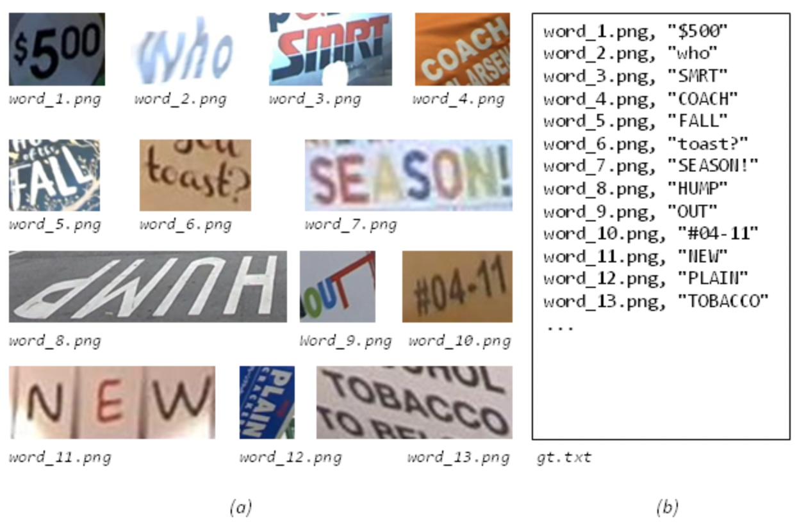

# 文字识别

本文提供了PaddleOCR文本识别任务的全流程指南，包括数据准备、模型训练、调优、评估、预测，各个阶段的详细说明：

- [文字识别](#文字识别)
  - [1. 数据准备](#1-数据准备)
    - [1.1 自定义数据集](#11-自定义数据集)
    - [1.2 数据下载](#12-数据下载)
    - [1.3 字典](#13-字典)
    - [1.4 添加空格类别](#14-添加空格类别)
  - [2. 启动训练](#2-启动训练)
    - [2.1 数据增强](#21-数据增强)
    - [2.2 通用模型训练](#22-通用模型训练)
    - [2.3 多语言模型训练](#23-多语言模型训练)
    - [2.4 知识蒸馏训练](#24-知识蒸馏训练)
  - [3 评估](#3-评估)
  - [4 预测](#4-预测)
  - [5. 转Inference模型测试](#5-转inference模型测试)


<a name="数据准备"></a>
## 1. 数据准备


PaddleOCR 支持两种数据格式:
 - `lmdb` 用于训练以lmdb格式存储的数据集(LMDBDataSet);
 - `通用数据` 用于训练以文本文件存储的数据集(SimpleDataSet);

训练数据的默认存储路径是 `PaddleOCR/train_data`,如果您的磁盘上已有数据集，只需创建软链接至数据集目录：

```
# linux and mac os
ln -sf <path/to/dataset> <path/to/paddle_ocr>/train_data/dataset
# windows
mklink /d <path/to/paddle_ocr>/train_data/dataset <path/to/dataset>
```

<a name="准备数据集"></a>
### 1.1 自定义数据集
下面以通用数据集为例， 介绍如何准备数据集：

* 训练集

建议将训练图片放入同一个文件夹，并用一个txt文件（rec_gt_train.txt）记录图片路径和标签，txt文件里的内容如下:

**注意：** txt文件中默认请将图片路径和图片标签用 \t 分割，如用其他方式分割将造成训练报错。

```
" 图像文件名                 图像标注信息 "

train_data/rec/train/word_001.jpg   简单可依赖
train_data/rec/train/word_002.jpg   用科技让复杂的世界更简单
...
```

最终训练集应有如下文件结构：
```
|-train_data
  |-rec
    |- rec_gt_train.txt
    |- train
        |- word_001.png
        |- word_002.jpg
        |- word_003.jpg
        | ...
```

除上述单张图像为一行格式之外，PaddleOCR也支持对离线增广后的数据进行训练，为了防止相同样本在同一个batch中被多次采样，我们可以将相同标签对应的图片路径写在一行中，以列表的形式给出，在训练中，PaddleOCR会随机选择列表中的一张图片进行训练。对应地，标注文件的格式如下。

```
["11.jpg", "12.jpg"]   简单可依赖
["21.jpg", "22.jpg", "23.jpg"]   用科技让复杂的世界更简单
3.jpg   ocr
```

上述示例标注文件中，"11.jpg"和"12.jpg"的标签相同，都是`简单可依赖`，在训练的时候，对于该行标注，会随机选择其中的一张图片进行训练。


- 验证集

同训练集类似，验证集也需要提供一个包含所有图片的文件夹（test）和一个rec_gt_test.txt，验证集的结构如下所示：

```
|-train_data
  |-rec
    |- rec_gt_test.txt
    |- test
        |- word_001.jpg
        |- word_002.jpg
        |- word_003.jpg
        | ...
```

<a name="数据下载"></a>

### 1.2 数据下载

- ICDAR2015

若您本地没有数据集，可以在官网下载 [ICDAR2015](http://rrc.cvc.uab.es/?ch=4&com=downloads) 数据，用于快速验证。也可以参考[DTRB](https://github.com/clovaai/deep-text-recognition-benchmark#download-lmdb-dataset-for-traininig-and-evaluation-from-here) ，下载 benchmark 所需的lmdb格式数据集。

如果希望复现SAR的论文指标，需要下载[SynthAdd](https://pan.baidu.com/share/init?surl=uV0LtoNmcxbO-0YA7Ch4dg), 提取码：627x。此外，真实数据集icdar2013, icdar2015, cocotext, IIIT5也作为训练数据的一部分。具体数据细节可以参考论文SAR。

如果你使用的是icdar2015的公开数据集，PaddleOCR 提供了一份用于训练 ICDAR2015 数据集的标签文件，通过以下方式下载：

```
# 训练集标签
wget -P ./train_data/ic15_data  https://paddleocr.bj.bcebos.com/dataset/rec_gt_train.txt
# 测试集标签
wget -P ./train_data/ic15_data  https://paddleocr.bj.bcebos.com/dataset/rec_gt_test.txt
```

PaddleOCR 也提供了数据格式转换脚本，可以将ICDAR官网 label 转换为PaddleOCR支持的数据格式。 数据转换工具在 `ppocr/utils/gen_label.py`, 这里以训练集为例：

```
# 将官网下载的标签文件转换为 rec_gt_label.txt
python gen_label.py --mode="rec" --input_path="{path/of/origin/label}" --output_label="rec_gt_label.txt"
```

数据样式格式如下，(a)为原始图片,(b)为每张图片对应的 Ground Truth 文本文件：


- 多语言数据集

多语言模型的训练数据集均为100w的合成数据，使用了开源合成工具 [text_renderer](https://github.com/Sanster/text_renderer) ，少量的字体可以通过下面两种方式下载。
* [百度网盘](https://pan.baidu.com/s/1bS_u207Rm7YbY33wOECKDA) 提取码：frgi
* [google drive](https://drive.google.com/file/d/18cSWX7wXSy4G0tbKJ0d9PuIaiwRLHpjA/view)


<a name="字典"></a>
### 1.3 字典

最后需要提供一个字典（{word_dict_name}.txt），使模型在训练时，可以将所有出现的字符映射为字典的索引。

因此字典需要包含所有希望被正确识别的字符，{word_dict_name}.txt需要写成如下格式，并以 `utf-8` 编码格式保存：

```
l
d
a
d
r
n
```

word_dict.txt 每行有一个单字，将字符与数字索引映射在一起，“and” 将被映射成 [2 5 1]

* 内置字典

PaddleOCR内置了一部分字典，可以按需使用。

`ppocr/utils/ppocr_keys_v1.txt` 是一个包含6623个字符的中文字典

`ppocr/utils/ic15_dict.txt` 是一个包含36个字符的英文字典

`ppocr/utils/dict/french_dict.txt` 是一个包含118个字符的法文字典

`ppocr/utils/dict/japan_dict.txt` 是一个包含4399个字符的日文字典

`ppocr/utils/dict/korean_dict.txt` 是一个包含3636个字符的韩文字典

`ppocr/utils/dict/german_dict.txt` 是一个包含131个字符的德文字典

`ppocr/utils/en_dict.txt` 是一个包含96个字符的英文字典


目前的多语言模型仍处在demo阶段，会持续优化模型并补充语种，**非常欢迎您为我们提供其他语言的字典和字体**，
如您愿意可将字典文件提交至 [dict](../../ppocr/utils/dict)，我们会在Repo中感谢您。

- 自定义字典

如需自定义dic文件，请在 `configs/rec/rec_icdar15_train.yml` 中添加 `character_dict_path` 字段, 指向您的字典路径。

<a name="支持空格"></a>
### 1.4 添加空格类别

如果希望支持识别"空格"类别, 请将yml文件中的 `use_space_char` 字段设置为 `True`。


<a name="启动训练"></a>
## 2. 启动训练

<a name="数据增强"></a>
### 2.1 数据增强

PaddleOCR提供了多种数据增强方式，默认配置文件中已经添加了数据增广。

默认的扰动方式有：颜色空间转换(cvtColor)、模糊(blur)、抖动(jitter)、噪声(Gasuss noise)、随机切割(random crop)、透视(perspective)、颜色反转(reverse)、TIA数据增广。

训练过程中每种扰动方式以40%的概率被选择，具体代码实现请参考：[rec_img_aug.py](../../ppocr/data/imaug/rec_img_aug.py)

*由于OpenCV的兼容性问题，扰动操作暂时只支持Linux*

<a name="通用模型训练"></a>
### 2.2 通用模型训练

PaddleOCR提供了训练脚本、评估脚本和预测脚本，本节将以 CRNN 识别模型为例：

首先下载pretrain model，您可以下载训练好的模型在 icdar2015 数据上进行finetune

```
cd PaddleOCR/
# 下载MobileNetV3的预训练模型
wget -P ./pretrain_models/ https://paddleocr.bj.bcebos.com/dygraph_v2.0/en/rec_mv3_none_bilstm_ctc_v2.0_train.tar
# 解压模型参数
cd pretrain_models
tar -xf rec_mv3_none_bilstm_ctc_v2.0_train.tar && rm -rf rec_mv3_none_bilstm_ctc_v2.0_train.tar
```

开始训练:

*如果您安装的是cpu版本，请将配置文件中的 `use_gpu` 字段修改为false*

```
# GPU训练 支持单卡，多卡训练
# 训练icdar15英文数据 训练日志会自动保存为 "{save_model_dir}" 下的train.log

#单卡训练（训练周期长，不建议）
python3 tools/train.py -c configs/rec/rec_icdar15_train.yml

#多卡训练，通过--gpus参数指定卡号
python3 -m paddle.distributed.launch --gpus '0,1,2,3'  tools/train.py -c configs/rec/rec_icdar15_train.yml
```


PaddleOCR支持训练和评估交替进行, 可以在 `configs/rec/rec_icdar15_train.yml` 中修改 `eval_batch_step` 设置评估频率，默认每500个iter评估一次。评估过程中默认将最佳acc模型，保存为 `output/rec_CRNN/best_accuracy` 。

如果验证集很大，测试将会比较耗时，建议减少评估次数，或训练完再进行评估。

**提示：** 可通过 -c 参数选择 `configs/rec/` 路径下的多种模型配置进行训练，PaddleOCR支持的识别算法有：


| 配置文件 |  算法名称 |   backbone |   trans   |   seq      |     pred     |
| :--------: |  :-------:   | :-------:  |   :-------:   |   :-----:   |  :-----:   |
| [rec_chinese_lite_train_v2.0.yml](../../configs/rec/ch_ppocr_v2.0/rec_chinese_lite_train_v2.0.yml) |  CRNN |   Mobilenet_v3 small 0.5 |  None   |  BiLSTM |  ctc  |
| [rec_chinese_common_train_v2.0.yml](../../configs/rec/ch_ppocr_v2.0/rec_chinese_common_train_v2.0.yml) |  CRNN | ResNet34_vd |  None   |  BiLSTM |  ctc  |
| rec_icdar15_train.yml |  CRNN |   Mobilenet_v3 large 0.5 |  None   |  BiLSTM |  ctc  |
| rec_mv3_none_bilstm_ctc.yml |  CRNN |   Mobilenet_v3 large 0.5 |  None   |  BiLSTM |  ctc  |
| rec_mv3_none_none_ctc.yml |  Rosetta |   Mobilenet_v3 large 0.5 |  None   |  None |  ctc  |
| rec_r34_vd_none_bilstm_ctc.yml |  CRNN |   Resnet34_vd |  None   |  BiLSTM |  ctc  |
| rec_r34_vd_none_none_ctc.yml |  Rosetta |   Resnet34_vd |  None   |  None |  ctc  |
| rec_mv3_tps_bilstm_att.yml |  CRNN |   Mobilenet_v3 |  TPS   |  BiLSTM |  att  |
| rec_r34_vd_tps_bilstm_att.yml |  CRNN |   Resnet34_vd |  TPS   |  BiLSTM |  att  |
| rec_r50fpn_vd_none_srn.yml    | SRN | Resnet50_fpn_vd    | None    | rnn | srn |
| rec_mtb_nrtr.yml    | NRTR | nrtr_mtb    | None    | transformer encoder | transformer decoder |
| rec_r31_sar.yml               | SAR | ResNet31 | None | LSTM encoder | LSTM decoder |
| rec_resnet_stn_bilstm_att.yml | SEED | Aster_Resnet | STN | BiLSTM | att |

*其中SEED模型需要额外加载FastText训练好的[语言模型](https://dl.fbaipublicfiles.com/fasttext/vectors-crawl/cc.en.300.bin.gz) ,并且安装 fasttext 依赖：
```
python3.7 -m pip install fasttext==0.9.1
```

训练中文数据，推荐使用[rec_chinese_lite_train_v2.0.yml](../../configs/rec/ch_ppocr_v2.0/rec_chinese_lite_train_v2.0.yml)，如您希望尝试其他算法在中文数据集上的效果，请参考下列说明修改配置文件：

以 `rec_chinese_lite_train_v2.0.yml` 为例：
```
Global:
  ...
  # 添加自定义字典，如修改字典请将路径指向新字典
  character_dict_path: ppocr/utils/ppocr_keys_v1.txt
  ...
  # 识别空格
  use_space_char: True


Optimizer:
  ...
  # 添加学习率衰减策略
  lr:
    name: Cosine
    learning_rate: 0.001
  ...

...

Train:
  dataset:
    # 数据集格式，支持LMDBDataSet以及SimpleDataSet
    name: SimpleDataSet
    # 数据集路径
    data_dir: ./train_data/
    # 训练集标签文件
    label_file_list: ["./train_data/train_list.txt"]
    transforms:
      ...
      - RecResizeImg:
          # 修改 image_shape 以适应长文本
          image_shape: [3, 32, 320]
      ...
  loader:
    ...
    # 单卡训练的batch_size
    batch_size_per_card: 256
    ...

Eval:
  dataset:
    # 数据集格式，支持LMDBDataSet以及SimpleDataSet
    name: SimpleDataSet
    # 数据集路径
    data_dir: ./train_data
    # 验证集标签文件
    label_file_list: ["./train_data/val_list.txt"]
    transforms:
      ...
      - RecResizeImg:
          # 修改 image_shape 以适应长文本
          image_shape: [3, 32, 320]
      ...
  loader:
    # 单卡验证的batch_size
    batch_size_per_card: 256
    ...
```
**注意，预测/评估时的配置文件请务必与训练一致。**

<a name="多语言模型训练"></a>
### 2.3 多语言模型训练

PaddleOCR目前已支持80种（除中文外）语种识别，`configs/rec/multi_languages` 路径下提供了一个多语言的配置文件模版: [rec_multi_language_lite_train.yml](../../configs/rec/multi_language/rec_multi_language_lite_train.yml)。

按语系划分，目前PaddleOCR支持的语种有：

| 配置文件 |  算法名称 |   backbone |   trans   |   seq      |     pred     |  language |
| :--------: |  :-------:   | :-------:  |   :-------:   |   :-----:   |  :-----:   | :-----:  |
| rec_chinese_cht_lite_train.yml |  CRNN |   Mobilenet_v3 small 0.5 |  None   |  BiLSTM |  ctc  | 中文繁体  |
| rec_en_lite_train.yml |  CRNN |   Mobilenet_v3 small 0.5 |  None   |  BiLSTM |  ctc  | 英语（区分大小写）   |
| rec_french_lite_train.yml |  CRNN |   Mobilenet_v3 small 0.5 |  None   |  BiLSTM |  ctc  | 法语 |  
| rec_ger_lite_train.yml |  CRNN |   Mobilenet_v3 small 0.5 |  None   |  BiLSTM |  ctc  | 德语   |
| rec_japan_lite_train.yml |  CRNN |   Mobilenet_v3 small 0.5 |  None   |  BiLSTM |  ctc  | 日语  |
| rec_korean_lite_train.yml |  CRNN |   Mobilenet_v3 small 0.5 |  None   |  BiLSTM |  ctc  | 韩语  |
| rec_latin_lite_train.yml |  CRNN |   Mobilenet_v3 small 0.5 |  None   |  BiLSTM |  ctc  | 拉丁字母  |
| rec_arabic_lite_train.yml |  CRNN |   Mobilenet_v3 small 0.5 |  None   |  BiLSTM |  ctc  | 阿拉伯字母 |
| rec_cyrillic_lite_train.yml |  CRNN |   Mobilenet_v3 small 0.5 |  None   |  BiLSTM |  ctc  | 斯拉夫字母  |
| rec_devanagari_lite_train.yml |  CRNN |   Mobilenet_v3 small 0.5 |  None   |  BiLSTM |  ctc  | 梵文字母  |

更多支持语种请参考: [多语言模型](https://github.com/PaddlePaddle/PaddleOCR/blob/release/2.1/doc/doc_ch/multi_languages.md#%E8%AF%AD%E7%A7%8D%E7%BC%A9%E5%86%99)

如您希望在现有模型效果的基础上调优，请参考下列说明修改配置文件：

以 `rec_french_lite_train` 为例：
```
Global:
  ...
  # 添加自定义字典，如修改字典请将路径指向新字典
  character_dict_path: ./ppocr/utils/dict/french_dict.txt
  ...
  # 识别空格
  use_space_char: True

...

Train:
  dataset:
    # 数据集格式，支持LMDBDataSet以及SimpleDataSet
    name: SimpleDataSet
    # 数据集路径
    data_dir: ./train_data/
    # 训练集标签文件
    label_file_list: ["./train_data/french_train.txt"]
    ...

Eval:
  dataset:
    # 数据集格式，支持LMDBDataSet以及SimpleDataSet
    name: SimpleDataSet
    # 数据集路径
    data_dir: ./train_data
    # 验证集标签文件
    label_file_list: ["./train_data/french_val.txt"]
    ...
```

<a name="知识蒸馏训练"></a>

### 2.4 知识蒸馏训练

PaddleOCR支持了基于知识蒸馏的文本识别模型训练过程，更多内容可以参考[知识蒸馏说明文档](./knowledge_distillation.md)。

<a name="评估"></a>
## 3 评估

评估数据集可以通过 `configs/rec/rec_icdar15_train.yml`  修改Eval中的 `label_file_path` 设置。

```
# GPU 评估， Global.checkpoints 为待测权重
python3 -m paddle.distributed.launch --gpus '0' tools/eval.py -c configs/rec/rec_icdar15_train.yml -o Global.checkpoints={path/to/weights}/best_accuracy
```

<a name="预测"></a>
## 4 预测

使用 PaddleOCR 训练好的模型，可以通过以下脚本进行快速预测。

默认预测图片存储在 `infer_img` 里，通过 `-o Global.checkpoints` 加载训练好的参数文件：

根据配置文件中设置的的 `save_model_dir` 和 `save_epoch_step` 字段，会有以下几种参数被保存下来：

```
output/rec/
├── best_accuracy.pdopt  
├── best_accuracy.pdparams  
├── best_accuracy.states  
├── config.yml  
├── iter_epoch_3.pdopt  
├── iter_epoch_3.pdparams  
├── iter_epoch_3.states  
├── latest.pdopt  
├── latest.pdparams  
├── latest.states  
└── train.log
```
其中 best_accuracy.* 是评估集上的最优模型；iter_epoch_x.* 是以 `save_epoch_step` 为间隔保存下来的模型；latest.* 是最后一个epoch的模型。

```
# 预测英文结果
python3 tools/infer_rec.py -c configs/rec/rec_icdar15_train.yml -o Global.pretrained_model={path/to/weights}/best_accuracy Global.load_static_weights=false Global.infer_img=doc/imgs_words/en/word_1.png
```

预测图片：


得到输入图像的预测结果：

```
infer_img: doc/imgs_words/en/word_1.png
        result: ('joint', 0.9998967)
```

预测使用的配置文件必须与训练一致，如您通过 `python3 tools/train.py -c configs/rec/ch_ppocr_v2.0/rec_chinese_lite_train_v2.0.yml` 完成了中文模型的训练，
您可以使用如下命令进行中文模型预测。

```
# 预测中文结果
python3 tools/infer_rec.py -c configs/rec/ch_ppocr_v2.0/rec_chinese_lite_train_v2.0.yml -o Global.pretrained_model={path/to/weights}/best_accuracy Global.load_static_weights=false Global.infer_img=doc/imgs_words/ch/word_1.jpg
```

预测图片：


得到输入图像的预测结果：

```
infer_img: doc/imgs_words/ch/word_1.jpg
        result: ('韩国小馆', 0.997218)
```

<a name="Inference"></a>

## 5. 转Inference模型测试

识别模型转inference模型与检测的方式相同，如下：

```
# -c 后面设置训练算法的yml配置文件
# -o 配置可选参数
# Global.pretrained_model 参数设置待转换的训练模型地址，不用添加文件后缀 .pdmodel，.pdopt或.pdparams。
# Global.save_inference_dir参数设置转换的模型将保存的地址。

python3 tools/export_model.py -c configs/rec/ch_ppocr_v2.0/rec_chinese_lite_train_v2.0.yml -o Global.pretrained_model=./ch_lite/ch_ppocr_mobile_v2.0_rec_train/best_accuracy  Global.save_inference_dir=./inference/rec_crnn/
```

**注意：**如果您是在自己的数据集上训练的模型，并且调整了中文字符的字典文件，请注意修改配置文件中的`character_dict_path`是否是所需要的字典文件。

转换成功后，在目录下有三个文件：

```
/inference/rec_crnn/
    ├── inference.pdiparams         # 识别inference模型的参数文件
    ├── inference.pdiparams.info    # 识别inference模型的参数信息，可忽略
    └── inference.pdmodel           # 识别inference模型的program文件
```

- 自定义模型推理

  如果训练时修改了文本的字典，在使用inference模型预测时，需要通过`--rec_char_dict_path`指定使用的字典路径

  ```
  python3 tools/infer/predict_rec.py --image_dir="./doc/imgs_words_en/word_336.png" --rec_model_dir="./your inference model" --rec_image_shape="3, 32, 100" --rec_char_dict_path="your text dict path"
  ```
