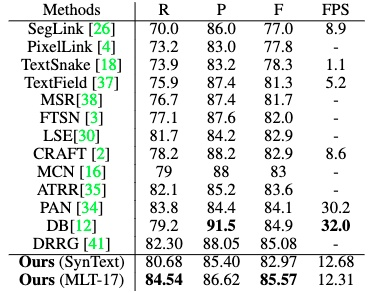
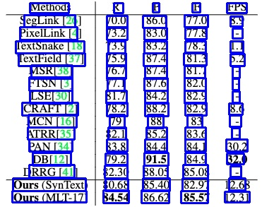

# 表格识别

本文提供了PaddleOCR表格识别模型的全流程指南，包括数据准备、模型训练、调优、评估、预测，各个阶段的详细说明：

- [1. 数据准备](#1-数据准备)
  - [1.1. 数据集格式](#11-数据集格式)
  - [1.2. 数据下载](#12-数据下载)
  - [1.3. 数据集生成](#13-数据集生成)
- [2. 开始训练](#2-开始训练)
  - [2.1. 启动训练](#21-启动训练)
  - [2.2. 断点训练](#22-断点训练)
  - [2.3. 更换Backbone 训练](#23-更换backbone-训练)
  - [2.4. 混合精度训练](#24-混合精度训练)
  - [2.5. 分布式训练](#25-分布式训练)
  - [2.6. 其他训练环境](#26-其他训练环境)
  - [2.7. 模型微调](#27-模型微调)
    - [2.7.1 数据选择](#271-数据选择)
    - [2.7.2 模型选择](#272-模型选择)
    - [2.7.3 训练超参选择](#273-训练超参选择)
- [3. 模型评估与预测](#3-模型评估与预测)
  - [3.1. 指标评估](#31-指标评估)
  - [3.2. 测试表格结构识别效果](#32-测试表格结构识别效果)
- [4. 模型导出与预测](#4-模型导出与预测)
  - [4.1 模型导出](#41-模型导出)
  - [4.2 模型预测](#42-模型预测)
- [5. FAQ](#5-faq)

# 1. 数据准备

## 1.1. 数据集格式

PaddleOCR 表格识别模型数据集格式如下:
```txt
img_label # 每张图片标注经过json.dumps()之后的字符串
...
img_label
```

每一行的json格式为:
```txt
{
   'filename': PMC5755158_010_01.png,							# 图像名
   'split': ’train‘, 									# 图像属于训练集还是验证集
   'imgid': 0,								 		# 图像的index
   'html': {
     'structure': {'tokens': ['<thead>', '<tr>', '<td>', ...]}, 			# 表格的HTML字符串
     'cells': [
       {
         'tokens': ['P', 'a', 'd', 'd', 'l', 'e', 'P', 'a', 'd', 'd', 'l', 'e'], 	# 表格中的单个文本
         'bbox': [x0, y0, x1, y1]  							# 表格中的单个文本的坐标
       }
     ]
   }
}
```

训练数据的默认存储路径是 `PaddleOCR/train_data`,如果您的磁盘上已有数据集，只需创建软链接至数据集目录：

```
# linux and mac os
ln -sf <path/to/dataset> <path/to/paddle_ocr>/train_data/dataset
# windows
mklink /d <path/to/paddle_ocr>/train_data/dataset <path/to/dataset>
```

## 1.2. 数据下载

公开数据集下载可参考 [table_datasets](dataset/table_datasets.md)。

## 1.3. 数据集生成

使用[TableGeneration](https://github.com/WenmuZhou/TableGeneration)可进行扫描表格图像的生成。

TableGeneration是一个开源表格数据集生成工具，其通过浏览器渲染的方式对html字符串进行渲染后获得表格图像。部分样张如下：

|类型|样例|
|---|---|
|简单表格||
|彩色表格||

# 2. 开始训练

PaddleOCR提供了训练脚本、评估脚本和预测脚本，本节将以 [SLANet](../../configs/table/SLANet.yml) 模型训练PubTabNet英文数据集为例：

## 2.1. 启动训练

*如果您安装的是cpu版本，请将配置文件中的 `use_gpu` 字段修改为false*

```
# GPU训练 支持单卡，多卡训练
# 训练日志会自动保存为 "{save_model_dir}" 下的train.log

#单卡训练（训练周期长，不建议）
python3 tools/train.py -c configs/table/SLANet.yml

#多卡训练，通过--gpus参数指定卡号
python3 -m paddle.distributed.launch --gpus '0,1,2,3'  tools/train.py -c configs/table/SLANet.yml
```

正常启动训练后，会看到以下log输出：

```
[2022/08/16 03:07:33] ppocr INFO: epoch: [1/400], global_step: 20, lr: 0.000100, acc: 0.000000, loss: 3.915012, structure_loss: 3.229450, loc_loss: 0.670590, avg_reader_cost: 2.63382 s, avg_batch_cost: 6.32390 s, avg_samples: 48.0, ips: 7.59025 samples/s, eta: 9 days, 2:29:27
[2022/08/16 03:08:41] ppocr INFO: epoch: [1/400], global_step: 40, lr: 0.000100, acc: 0.000000, loss: 1.750859, structure_loss: 1.082116, loc_loss: 0.652822, avg_reader_cost: 0.02533 s, avg_batch_cost: 3.37251 s, avg_samples: 48.0, ips: 14.23271 samples/s, eta: 6 days, 23:28:43
[2022/08/16 03:09:46] ppocr INFO: epoch: [1/400], global_step: 60, lr: 0.000100, acc: 0.000000, loss: 1.395154, structure_loss: 0.776803, loc_loss: 0.625030, avg_reader_cost: 0.02550 s, avg_batch_cost: 3.26261 s, avg_samples: 48.0, ips: 14.71214 samples/s, eta: 6 days, 5:11:48
```

log 中自动打印如下信息：

|  字段   |   含义   |  
| :----: | :------: |
|  epoch | 当前迭代轮次 |
|  global_step  | 当前迭代次数 |
|  lr    | 当前学习率 |
|  acc   | 当前batch的准确率 |
|  loss  | 当前损失函数 |
|  structure_loss | 表格结构损失值 |
|  loc_loss | 单元格坐标损失值 |
|  avg_reader_cost | 当前 batch 数据处理耗时 |
|  avg_batch_cost | 当前 batch 总耗时 |
|  avg_samples  | 当前 batch 内的样本数 |
|  ips  | 每秒处理图片的数量 |


PaddleOCR支持训练和评估交替进行, 可以在 `configs/table/SLANet.yml` 中修改 `eval_batch_step` 设置评估频率，默认每1000个iter评估一次。评估过程中默认将最佳acc模型，保存为 `output/SLANet/best_accuracy` 。

如果验证集很大，测试将会比较耗时，建议减少评估次数，或训练完再进行评估。

**提示：** 可通过 -c 参数选择 `configs/table/` 路径下的多种模型配置进行训练，PaddleOCR支持的表格识别算法可以参考[前沿算法列表](https://github.com/PaddlePaddle/PaddleOCR/blob/dygraph/doc/doc_ch/algorithm_overview.md#3-%E8%A1%A8%E6%A0%BC%E8%AF%86%E5%88%AB%E7%AE%97%E6%B3%95)：

**注意，预测/评估时的配置文件请务必与训练一致。**

## 2.2. 断点训练

如果训练程序中断，如果希望加载训练中断的模型从而恢复训练，可以通过指定Global.checkpoints指定要加载的模型路径：
```shell
python3 tools/train.py -c configs/table/SLANet.yml -o Global.checkpoints=./your/trained/model
```

**注意**：`Global.checkpoints`的优先级高于`Global.pretrained_model`的优先级，即同时指定两个参数时，优先加载`Global.checkpoints`指定的模型，如果`Global.checkpoints`指定的模型路径有误，会加载`Global.pretrained_model`指定的模型。

## 2.3. 更换Backbone 训练

PaddleOCR将网络划分为四部分，分别在[ppocr/modeling](../../ppocr/modeling)下。 进入网络的数据将按照顺序(transforms->backbones->necks->heads)依次通过这四个部分。

```bash
├── architectures # 网络的组网代码
├── transforms    # 网络的图像变换模块
├── backbones     # 网络的特征提取模块
├── necks         # 网络的特征增强模块
└── heads         # 网络的输出模块
```
如果要更换的Backbone 在PaddleOCR中有对应实现，直接修改配置yml文件中`Backbone`部分的参数即可。

如果要使用新的Backbone，更换backbones的例子如下:

1. 在 [ppocr/modeling/backbones](../../ppocr/modeling/backbones) 文件夹下新建文件，如my_backbone.py。
2. 在 my_backbone.py 文件内添加相关代码，示例代码如下:

```python
import paddle
import paddle.nn as nn
import paddle.nn.functional as F


class MyBackbone(nn.Layer):
    def __init__(self, *args, **kwargs):
        super(MyBackbone, self).__init__()
        # your init code
        self.conv = nn.xxxx

    def forward(self, inputs):
        # your network forward
        y = self.conv(inputs)
        return y
```

3. 在 [ppocr/modeling/backbones/\__init\__.py](../../ppocr/modeling/backbones/__init__.py)文件内导入添加的`MyBackbone`模块，然后修改配置文件中Backbone进行配置即可使用，格式如下:

```yaml
Backbone:
name: MyBackbone
args1: args1
```

**注意**：如果要更换网络的其他模块，可以参考[文档](./add_new_algorithm.md)。

## 2.4. 混合精度训练

如果您想进一步加快训练速度，可以使用[自动混合精度训练](https://www.paddlepaddle.org.cn/documentation/docs/zh/guides/01_paddle2.0_introduction/basic_concept/amp_cn.html)， 以单机单卡为例，命令如下：

```shell
python3 tools/train.py -c configs/table/SLANet.yml \
     -o Global.pretrained_model=./pretrain_models/SLANet/best_accuracy \
     Global.use_amp=True Global.scale_loss=1024.0 Global.use_dynamic_loss_scaling=True
 ```

## 2.5. 分布式训练

多机多卡训练时，通过 `--ips` 参数设置使用的机器IP地址，通过 `--gpus` 参数设置使用的GPU ID：

```bash
python3 -m paddle.distributed.launch --ips="xx.xx.xx.xx,xx.xx.xx.xx" --gpus '0,1,2,3' tools/train.py -c configs/table/SLANet.yml \
     -o Global.pretrained_model=./pretrain_models/SLANet/best_accuracy
```

**注意:** （1）采用多机多卡训练时，需要替换上面命令中的ips值为您机器的地址，机器之间需要能够相互ping通；（2）训练时需要在多个机器上分别启动命令。查看机器ip地址的命令为`ifconfig`；（3）更多关于分布式训练的性能优势等信息，请参考：[分布式训练教程](./distributed_training.md)。


## 2.6. 其他训练环境

- Windows GPU/CPU
在Windows平台上与Linux平台略有不同:
Windows平台只支持`单卡`的训练与预测，指定GPU进行训练`set CUDA_VISIBLE_DEVICES=0`
在Windows平台，DataLoader只支持单进程模式，因此需要设置 `num_workers` 为0;

- macOS
不支持GPU模式，需要在配置文件中设置`use_gpu`为False，其余训练评估预测命令与Linux GPU完全相同。

- Linux DCU
DCU设备上运行需要设置环境变量 `export HIP_VISIBLE_DEVICES=0,1,2,3`，其余训练评估预测命令与Linux GPU完全相同。

## 2.7. 模型微调

### 2.7.1 数据选择

数据量：建议至少准备2000张的表格识别数据集用于模型微调。

### 2.7.2 模型选择

建议选择SLANet模型（配置文件：[SLANet_ch.yml](../../configs/table/SLANet_ch.yml)，预训练模型：[ch_ppstructure_mobile_v2.0_SLANet_train.tar](https://paddleocr.bj.bcebos.com/ppstructure/models/slanet/ch_ppstructure_mobile_v2.0_SLANet_train.tar)）进行微调，其精度与泛化性能是目前提供的最优中文表格预训练模型。

更多表格识别模型，请参考[PP-Structure 系列模型库](../../ppstructure/docs/models_list.md)。

### 2.7.3 训练超参选择

在模型微调的时候，最重要的超参就是预训练模型路径`pretrained_model`, 学习率`learning_rate`，部分配置文件如下所示。

```yaml
Global:
  pretrained_model: ./ch_ppstructure_mobile_v2.0_SLANet_train/best_accuracy.pdparams # 预训练模型路径
Optimizer:
  lr:
    name: Cosine
    learning_rate: 0.001 #
    warmup_epoch: 0
  regularizer:
    name: 'L2'
    factor: 0
```

上述配置文件中，首先需要将`pretrained_model`字段指定为`best_accuracy.pdparams`文件路径。

PaddleOCR提供的配置文件是在4卡训练（相当于总的batch size是`4*48=192`）、且没有加载预训练模型情况下的配置文件，因此您的场景中，学习率与总的batch size需要对应线性调整，例如

* 如果您的场景中是单卡训练，单卡batch_size=48，则总的batch_size=48，建议将学习率调整为`0.00025`左右。
* 如果您的场景中是单卡训练，由于显存限制，只能设置单卡batch_size=32，则总的batch_size=32，建议将学习率调整为`0.00017`左右。


# 3. 模型评估与预测

## 3.1. 指标评估

训练中模型参数默认保存在`Global.save_model_dir`目录下。在评估指标时，需要设置`Global.checkpoints`指向保存的参数文件。评估数据集可以通过 `configs/table/SLANet.yml`  修改Eval中的 `label_file_list` 设置。


```
# GPU 评估， Global.checkpoints 为待测权重
python3 -m paddle.distributed.launch --gpus '0' tools/eval.py -c configs/table/SLANet.yml -o Global.checkpoints={path/to/weights}/best_accuracy
```

运行完成后，会输出模型的acc指标，如对英文表格识别模型进行评估，会见到如下输出。
```bash
[2022/08/16 07:59:55] ppocr INFO: acc:0.7622245132160782
[2022/08/16 07:59:55] ppocr INFO: fps:30.991640622573044
```

## 3.2. 测试表格结构识别效果

使用 PaddleOCR 训练好的模型，可以通过以下脚本进行快速预测。

默认预测图片存储在 `infer_img` 里，通过 `-o Global.checkpoints` 加载训练好的参数文件：

根据配置文件中设置的 `save_model_dir` 和 `save_epoch_step` 字段，会有以下几种参数被保存下来：

```
output/SLANet/
├── best_accuracy.pdopt  
├── best_accuracy.pdparams  
├── best_accuracy.states  
├── config.yml  
├── latest.pdopt  
├── latest.pdparams  
├── latest.states  
└── train.log
```
其中 best_accuracy.* 是评估集上的最优模型；latest.* 是最后一个epoch的模型。

```
# 预测表格图像
python3 tools/infer_table.py -c configs/table/SLANet.yml -o Global.pretrained_model={path/to/weights}/best_accuracy  Global.infer_img=ppstructure/docs/table/table.jpg
```

预测图片：



得到输入图像的预测结果：

```
['<html>', '<body>', '<table>', '<thead>', '<tr>', '<td></td>', '<td></td>', '<td></td>', '<td></td>', '<td></td>', '</tr>', '</thead>', '<tbody>', '<tr>', '<td></td>', '<td></td>', '<td></td>', '<td></td>', '<td></td>', '</tr>', '<tr>', '<td></td>', '<td></td>', '<td></td>', '<td></td>', '<td></td>', '</tr>', '<tr>', '<td></td>', '<td></td>', '<td></td>', '<td></td>', '<td></td>', '</tr>', '<tr>', '<td></td>', '<td></td>', '<td></td>', '<td></td>', '<td></td>', '</tr>', '<tr>', '<td></td>', '<td></td>', '<td></td>', '<td></td>', '<td></td>', '</tr>', '<tr>', '<td></td>', '<td></td>', '<td></td>', '<td></td>', '<td></td>', '</tr>', '<tr>', '<td></td>', '<td></td>', '<td></td>', '<td></td>', '<td></td>', '</tr>', '<tr>', '<td></td>', '<td></td>', '<td></td>', '<td></td>', '<td></td>', '</tr>', '<tr>', '<td></td>', '<td></td>', '<td></td>', '<td></td>', '<td></td>', '</tr>', '<tr>', '<td></td>', '<td></td>', '<td></td>', '<td></td>', '<td></td>', '</tr>', '<tr>', '<td></td>', '<td></td>', '<td></td>', '<td></td>', '<td></td>', '</tr>', '<tr>', '<td></td>', '<td></td>', '<td></td>', '<td></td>', '<td></td>', '</tr>', '<tr>', '<td></td>', '<td></td>', '<td></td>', '<td></td>', '<td></td>', '</tr>', '<tr>', '<td></td>', '<td></td>', '<td></td>', '<td></td>', '<td></td>', '</tr>', '<tr>', '<td></td>', '<td></td>', '<td></td>', '<td></td>', '<td></td>', '</tr>', '</tbody>', '</table>', '</body>', '</html>'],[[320.0562438964844, 197.83375549316406, 350.0928955078125, 214.4309539794922], ... , [318.959228515625, 271.0166931152344, 353.7394104003906, 286.4538269042969]]
```

单元格坐标可视化结果为



# 4. 模型导出与预测

## 4.1 模型导出

inference 模型（`paddle.jit.save`保存的模型）
一般是模型训练，把模型结构和模型参数保存在文件中的固化模型，多用于预测部署场景。
训练过程中保存的模型是checkpoints模型，保存的只有模型的参数，多用于恢复训练等。
与checkpoints模型相比，inference 模型会额外保存模型的结构信息，在预测部署、加速推理上性能优越，灵活方便，适合于实际系统集成。

表格识别模型转inference模型与文字检测识别的方式相同，如下：

```
# -c 后面设置训练算法的yml配置文件
# -o 配置可选参数
# Global.pretrained_model 参数设置待转换的训练模型地址，不用添加文件后缀 .pdmodel，.pdopt或.pdparams。
# Global.save_inference_dir参数设置转换的模型将保存的地址。

python3 tools/export_model.py -c configs/table/SLANet.yml -o Global.pretrained_model=./pretrain_models/SLANet/best_accuracy  Global.save_inference_dir=./inference/SLANet/
```

转换成功后，在目录下有三个文件：

```
inference/SLANet/
    ├── inference.pdiparams         # inference模型的参数文件
    ├── inference.pdiparams.info    # inference模型的参数信息，可忽略
    └── inference.pdmodel           # inference模型的program文件
```

## 4.2 模型预测

模型导出后，使用如下命令即可完成inference模型的预测

```python
python3.7 table/predict_structure.py \
    --table_model_dir={path/to/inference model} \
    --table_char_dict_path=../ppocr/utils/dict/table_structure_dict_ch.txt \
    --image_dir=docs/table/table.jpg \
    --output=../output/table
```

预测图片：


得到输入图像的预测结果：

```
['<html>', '<body>', '<table>', '<thead>', '<tr>', '<td></td>', '<td></td>', '<td></td>', '<td></td>', '<td></td>', '</tr>', '</thead>', '<tbody>', '<tr>', '<td></td>', '<td></td>', '<td></td>', '<td></td>', '<td></td>', '</tr>', '<tr>', '<td></td>', '<td></td>', '<td></td>', '<td></td>', '<td></td>', '</tr>', '<tr>', '<td></td>', '<td></td>', '<td></td>', '<td></td>', '<td></td>', '</tr>', '<tr>', '<td></td>', '<td></td>', '<td></td>', '<td></td>', '<td></td>', '</tr>', '<tr>', '<td></td>', '<td></td>', '<td></td>', '<td></td>', '<td></td>', '</tr>', '<tr>', '<td></td>', '<td></td>', '<td></td>', '<td></td>', '<td></td>', '</tr>', '<tr>', '<td></td>', '<td></td>', '<td></td>', '<td></td>', '<td></td>', '</tr>', '<tr>', '<td></td>', '<td></td>', '<td></td>', '<td></td>', '<td></td>', '</tr>', '<tr>', '<td></td>', '<td></td>', '<td></td>', '<td></td>', '<td></td>', '</tr>', '<tr>', '<td></td>', '<td></td>', '<td></td>', '<td></td>', '<td></td>', '</tr>', '<tr>', '<td></td>', '<td></td>', '<td></td>', '<td></td>', '<td></td>', '</tr>', '<tr>', '<td></td>', '<td></td>', '<td></td>', '<td></td>', '<td></td>', '</tr>', '<tr>', '<td></td>', '<td></td>', '<td></td>', '<td></td>', '<td></td>', '</tr>', '<tr>', '<td></td>', '<td></td>', '<td></td>', '<td></td>', '<td></td>', '</tr>', '<tr>', '<td></td>', '<td></td>', '<td></td>', '<td></td>', '<td></td>', '</tr>', '</tbody>', '</table>', '</body>', '</html>'],[[320.0562438964844, 197.83375549316406, 350.0928955078125, 214.4309539794922], ... , [318.959228515625, 271.0166931152344, 353.7394104003906, 286.4538269042969]]
```

单元格坐标可视化结果为


# 5. FAQ

Q1: 训练模型转inference 模型之后预测效果不一致？

**A**：此类问题出现较多，问题多是trained model预测时候的预处理、后处理参数和inference model预测的时候的预处理、后处理参数不一致导致的。可以对比训练使用的配置文件中的预处理、后处理和预测时是否存在差异。
