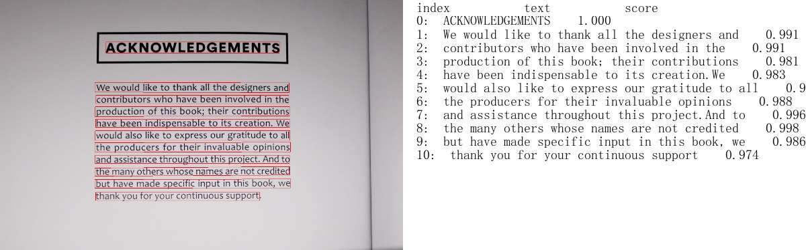

## 中文OCR训练预测技巧
这里整理了一些中文OCR训练预测技巧，持续更新中，欢迎各位小伙伴贡献OCR炼丹秘籍～
- [更换骨干网络](#更换骨干网络)
- [中文长文本识别](#中文长文本识别)
- [空格识别](#空格识别)

<a name="更换骨干网络"></a>
#### 1、更换骨干网络
- **问题描述**

  目前PaddleOCR中使用的骨干网络有ResNet_vd系列和MobileNetV3系列，更换骨干网络是否有助于效果提升？更换时需要注意什么？

- **炼丹建议**

  - 无论是文字检测，还是文字识别，骨干网络的选择是预测效果和预测效率的权衡。一般，选择更大规模的骨干网络，例如ResNet101_vd，则检测或识别更准确，但预测耗时相应也会增加。而选择更小规模的骨干网络，例如MobileNetV3_small_x0_35，则预测更快，但检测或识别的准确率会大打折扣。幸运的是不同骨干网络的检测或识别效果与在ImageNet数据集图像1000分类任务效果正相关。[**飞桨图像分类套件PaddleClas**](https://github.com/PaddlePaddle/PaddleClas)汇总了ResNet_vd、Res2Net、HRNet、MobileNetV3、GhostNet等23种系列的分类网络结构，在上述图像分类任务的top1识别准确率，GPU(V100和T4)和CPU(骁龙855)的预测耗时以及相应的[**117个预训练模型下载地址**](https://paddleclas.readthedocs.io/zh_CN/latest/models/models_intro.html)。
  - 文字检测骨干网络的替换，主要是确定类似与ResNet的4个stages，以方便集成后续的类似FPN的检测头。此外，对于文字检测问题，使用ImageNet训练的分类预训练模型，可以加速收敛和效果提升。
  - 文字识别的骨干网络的替换，需要注意网络宽高stride的下降位置。由于文本识别一般宽高比例很大，因此高度下降频率少一些，宽度下降频率多一些。可以参考PaddleOCR中[MobileNetV3骨干网络](https://github.com/PaddlePaddle/PaddleOCR/blob/develop/ppocr/modeling/backbones/rec_mobilenet_v3.py)的改动。

<a name="中文长文本识别"></a>
#### 2、中文长文本识别
- **问题描述**
  
  中文识别模型训练时分辨率最大是[3,32,320]，如果待识别的文本图像太长，如下图所示，该如何适配？
  
  <div align="center">
    
  </div>
  
- **炼丹建议**
    
  在中文识别模型训练时，并不是采用直接将训练样本缩放到[3,32,320]进行训练，而是先等比例缩放图像，保证图像高度为32，宽度不足320的部分补0，宽高比大于10的样本直接丢弃。预测时，如果是单张图像预测，则按上述操作直接对图像缩放，不做宽度320的限制。如果是多张图预测，则采用batch方式预测，每个batch的宽度动态变换，采用这个batch中最长宽度。[参考代码如下](https://github.com/PaddlePaddle/PaddleOCR/blob/develop/tools/infer/predict_rec.py)：
  
  ```
    def resize_norm_img(self, img, max_wh_ratio):
        imgC, imgH, imgW = self.rec_image_shape
        assert imgC == img.shape[2]
        if self.character_type == "ch":
            imgW = int((32 * max_wh_ratio))
        h, w = img.shape[:2]
        ratio = w / float(h)
        if math.ceil(imgH * ratio) > imgW:
            resized_w = imgW
        else:
            resized_w = int(math.ceil(imgH * ratio))
        resized_image = cv2.resize(img, (resized_w, imgH))
        resized_image = resized_image.astype('float32')
        resized_image = resized_image.transpose((2, 0, 1)) / 255
        resized_image -= 0.5
        resized_image /= 0.5
        padding_im = np.zeros((imgC, imgH, imgW), dtype=np.float32)
        padding_im[:, :, 0:resized_w] = resized_image
        return padding_im  
  ```

<a name="空格识别"></a>
#### 3、空格识别
- **问题描述**

   如下图所示，对于中英文混合场景，为了便于阅读和使用识别结果，往往需要将单词之间的空格识别出来，这种情况如何适配？
   
  <div align="center">
    
  </div>
  
- **炼丹建议**
  
   空格识别可以考虑以下两种方案:(1)优化文本检测算法。检测结果在空格处将文本断开。这种方案在检测数据标注时，需要将含有空格的文本行分成好多段。(2)优化文本识别算法。在识别字典里面引入空格字符，然后在识别的训练数据中，如果用空行，进行标注。此外，合成数据时，通过拼接训练数据，生成含有空格的文本。PaddleOCR目前采用的是第二种方案。
   