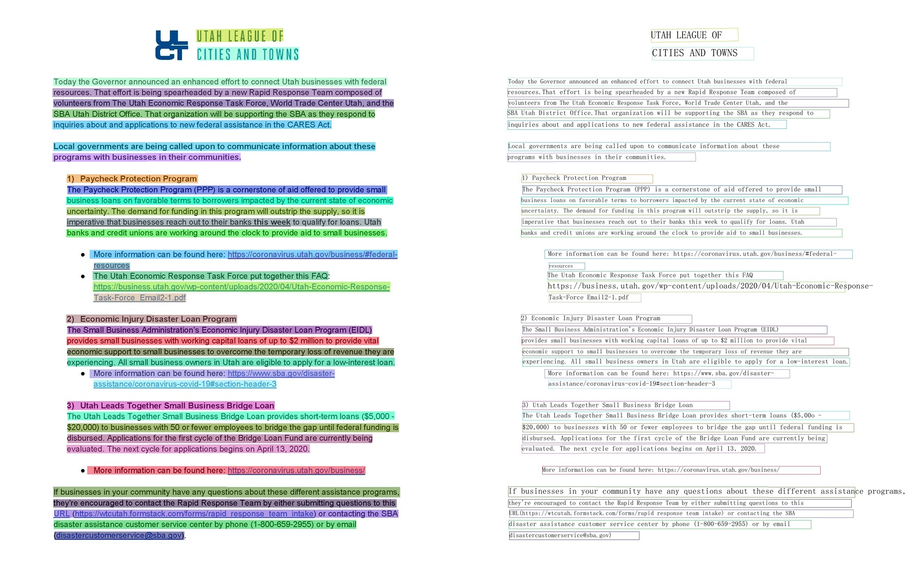
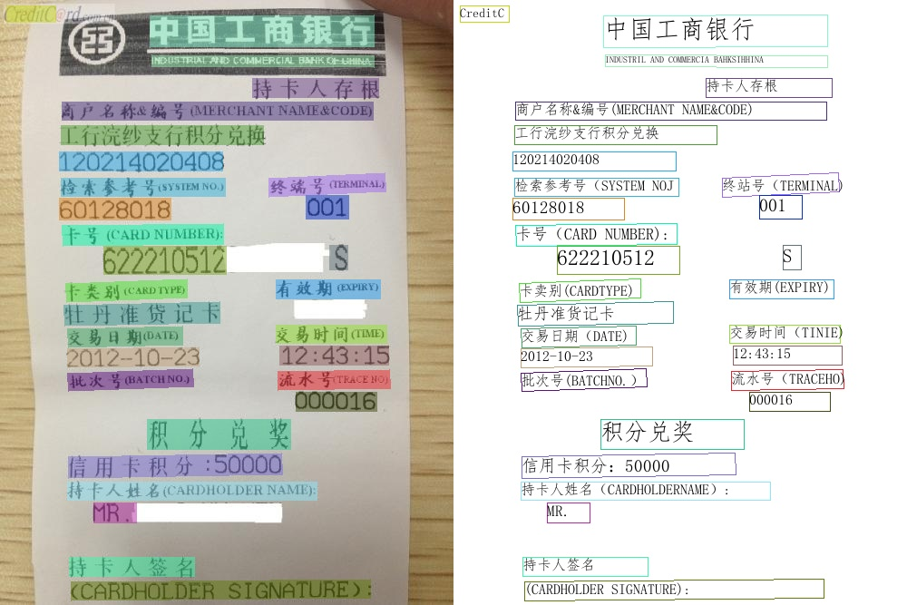

# 效果展示

## 超轻量PP-OCRv3效果展示

### PP-OCRv3中文模型

    
    
    

### PP-OCRv3英文数字模型

    
    
    

### PP-OCRv3多语言模型

    
    

## 超轻量PP-OCRv2效果展示
   
   
   

## 通用PP-OCR server 效果展示

    
    
    

## 英文识别模型效果展示

    

## 多语言识别模型效果展示

    
    

